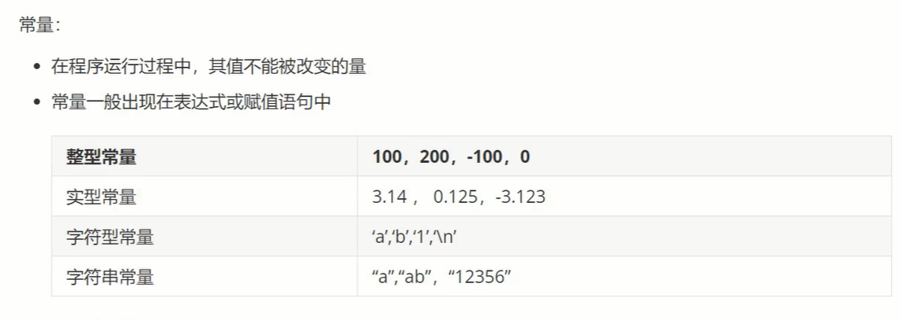
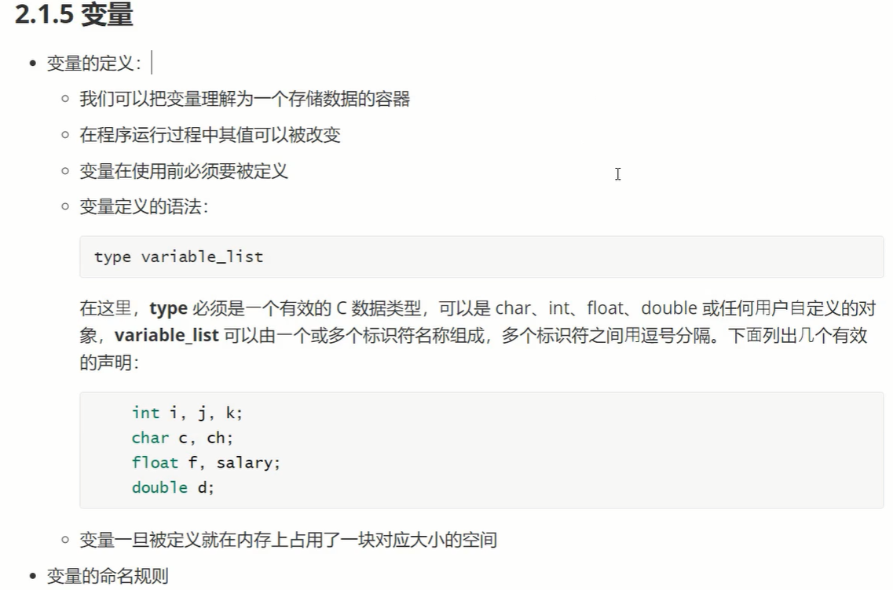
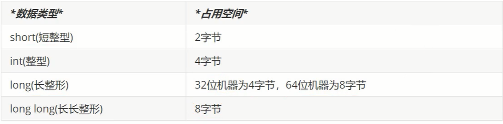
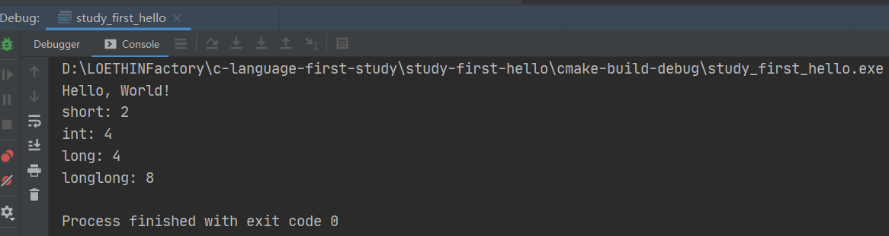

# C语言编程入门


## 开篇


### 第一个C程序

```c
#include <stdio.h> // 告诉编译器在编译之前要包含stdio.h这个问文件

//C程序的主函数从主函数的第一条语句开始，然后按照从上往下的顺序执行到最后一条语句
int main() {

    printf("Hello, World!\n");
    return 0;

}
```

 


## 数据类型


### 关键字

 


### 常量和变量

** **

**一级指针、二级指针、三级指针**


#### 常量

- 在程序运行的过程中值不能被改变
- 常量一般出现在表达式或赋值语句中

 

#### 变量

 

 


### 整型

 


```c
int main() {
    printf("Hello, World!\n");
    printf("short: %d\n", sizeof(short));
    printf("int: %d\n", sizeof(int));
    printf("long: %d\n", sizeof(long));
    printf("longlong: %d\n", sizeof(long long));
    return 0;
}
```

 

long 类型是4  是因为我们的编译器是32位的。首先前提必须是64位的，如果是32位的，就算编译器是64位的，也是占4个字节（但是64位编译器在32位操作系统是不能运行的，只是举个例子）。


字节（Byte）和比特（bit）

bit位，即0或者1，0101010110

Byte字节，8位作为一个字节，字节是处理数据的基本单位

1Byte=8bits

1KB = 1024Bytes

1MB = 1024KB

1GB = 1024MB

注意：B和b的区别


