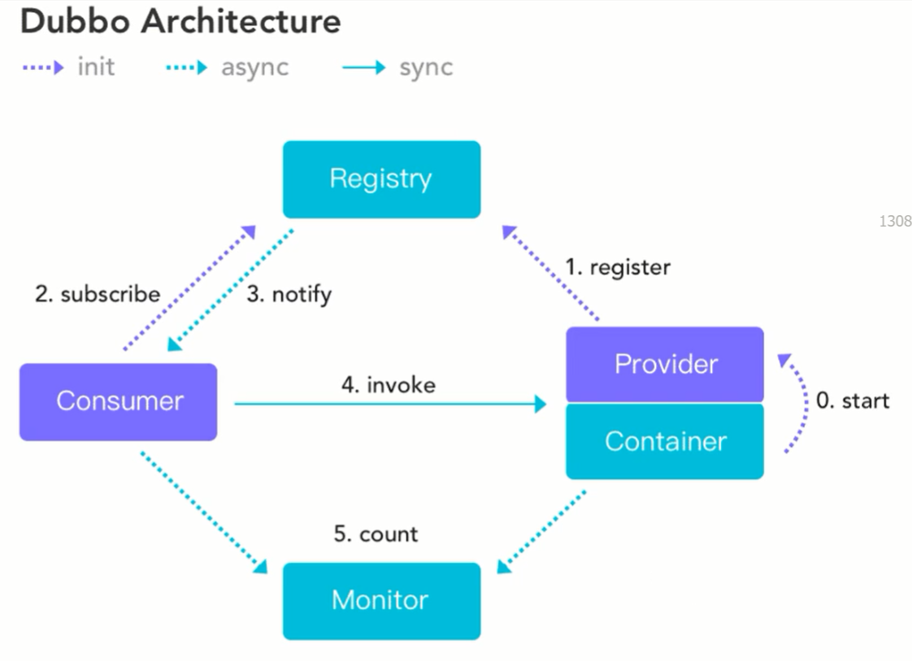
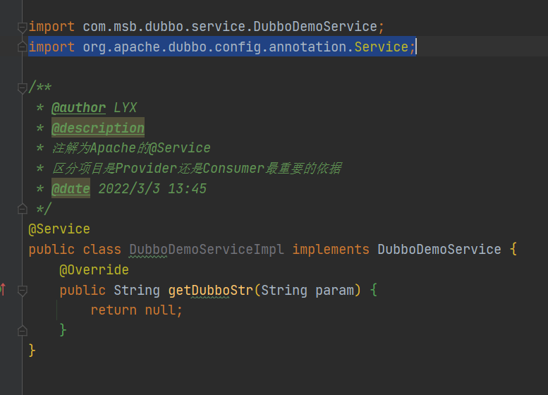
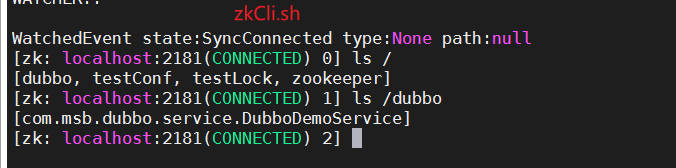
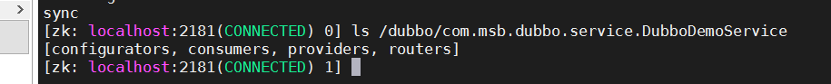
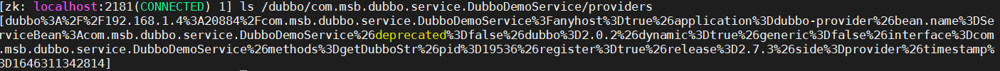
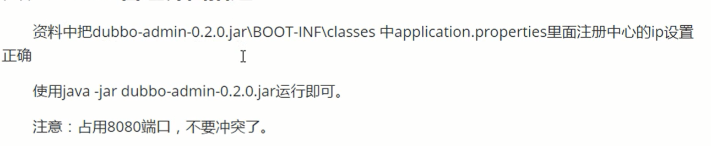
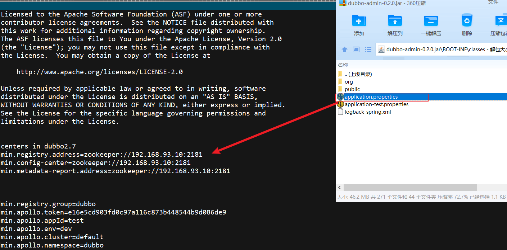
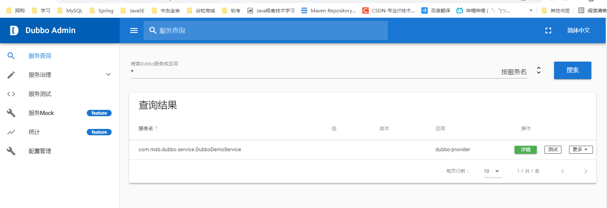
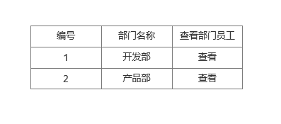
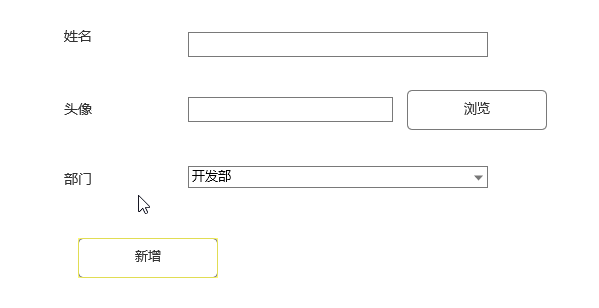

# Dubbo

**Apache Dubbo 是一个高可用的，基于Java的开源RPC(远程服务调用)框架**

**Dubbo框架不仅仅是具备RPC的访问功能，还包含了服务治理功能**

**课程统一使用Apache 2.7.3版本的Dubbo**

```xml
<!-- https://mvnrepository.com/artifact/org.apache.dubbo/dubbo -->
<dependency>
    <groupId>org.apache.dubbo</groupId>
    <artifactId>dubbo</artifactId>
    <version>2.7.3</version>
</dependency>
```

## Dubbo架构图讲解

虚线表示异步，实现表示同步。异步不阻塞线程性能高，同步阻塞线程必须等待响应结果才能继续执行，相对性能低。

- Provider提供者
- Container容器
- Registry注册中心
- Consumer消费者
- Monitor监控中心


为什么4是同步的？

Consumer去调用Provider方法的时候肯定会去获取一个返回值，这个返回值如果没有拿到的话这个线程是没办法继续往下运行的阻塞在这里了，什么时候返回值回来才能继续往下运行(会耗费性能)

**Dubbo核心思想**

首先启动Spring容器的时候会把Provider启动，Provider注册到注册中心，Consumer消费者去订阅注册中心中的方法功能，注册中心发布给Consumer，Consumer拿到发布的Ip端口后去Invoke调用Provider的方法。


## Dubbo支持的协议

### NIO

优点：采用NIO复用单一长连接，并使用线程池并发处理请求，减少握手和加大并发效率，性能较好

缺点：大文件上传的时候，可能出现问题(不推荐使用Dubbo文件上传)

### RMI

优点：JDK自带的能力

缺点：偶尔连接失败

### Hessian

优点：可与原生Hessian互相操作，基于HTTP协议

缺点：需要hessian.jar支持，http短连接的开销大


## Dubbo支持的注册中心

### Zookeeper(官方推荐)

优点：支持分布式，很多周边产品

缺点：受限于Zookeeper软件的稳定性

### Multicast

优点：去中心化，不需要单独安装软件

缺点：不可跨机房

### Redis

。。。。。。


### 代码实现


在Provider中的实现类，加的@Service要加上Dubbo的@Service

 

Consumer的@Service要用Spring注入

可以看到我们的实例注册到了Zookeeper中

 





## Dubbo的Admin界面搭建



使用解压缩文件修改jar包中的端口号



java -jar jar包启动



## Dubbo负载均衡效果


### Dubbo内置了四个负载均衡策略

#### Random

随机访问集群中的节点。访问概率和权重有关。

#### RoundRobin

轮循。访问频率和权重有关

权重(weight):占有比例。集群中每个项目部署的服务器的性能可能是不同，性能好的服务器权重应该高一些

#### LeastActive

活跃数相同的随机，不同的活跃数高的放前面。

#### ConsistentHash

一致性Hash，相同参数请求总是发到一个提供者。


#### 3.设置负载均衡

##### 3.1@Reference

​	调用的服务采用的负载均衡

**要全部都是小写 roundrobin**

```
@Reference(loadbalance = "roundrobin")
private DemoDubboService demoDubboService;
```

##### 3.2 @Service

​	当前服务采用的负载均衡算法

```
@Service(loadbalance = "random")
public class DemoDubboServiceImpl implements DemoDubboService {
```

​	设置权重 数越大越多

```
provider
@Service(weight = 4)
```

##### 3.3配置文件

​			全局设置所有provider和consumer的负载均衡效果。

```
dubbo:
  application:
    name: dubbo-provider
  registry:
    address: zookeeper://192.168.32.128:2181
  protocol:
    port: 20884
  provider:
    loadbalance: random
  consumer:
    loadbalance: random
```


## 完整Dubbo项目演示

#### 1.原型

##### 1.1部门显示

​	显示全部部门信息




##### 1.2员工新增



##### 1.3查看部门员工


#### 2.按照分布式架构进行设计项目

​		设定员工管理和部门管理不在同一个模块中，需要有一个员工管理项目和一个部门管理项目。

​	为了方便，不去每个项目使用一个窗口，而是使用聚合项目。      


#### 3.创建数据库表

```
create table dept(
id int(11) primary key auto_increment,
name varchar(20)
);

insert into dept values(default,'开发部');
insert into dept values(default,'产品部');

create table emp(
id int(11) primary key auto_increment,
name varchar(20),
photo varchar(200),
did int(11),
CONSTRAINT fk_emp_dept FOREIGN key (did) REFERENCES dept(id)
);
```


