# Maven

**Maven中的每个项目都相当于是一个对象，各个之间的关系包含了：依赖、继承、聚合**

**创建.m2文件夹**

  mvn help:system

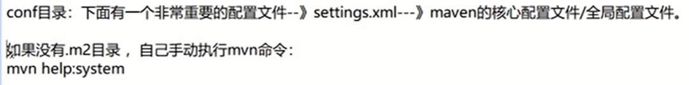

## Maven仓库之远程仓库

阿里云镜像：粘到mirrors标签中

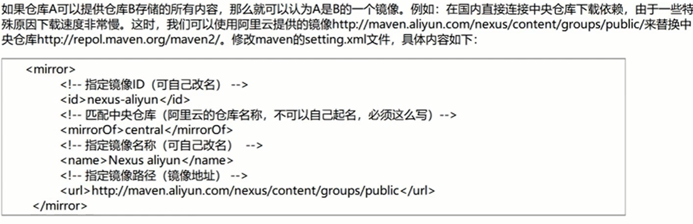

### 下载优先级别

先本地->到配置文件中指定的仓库中

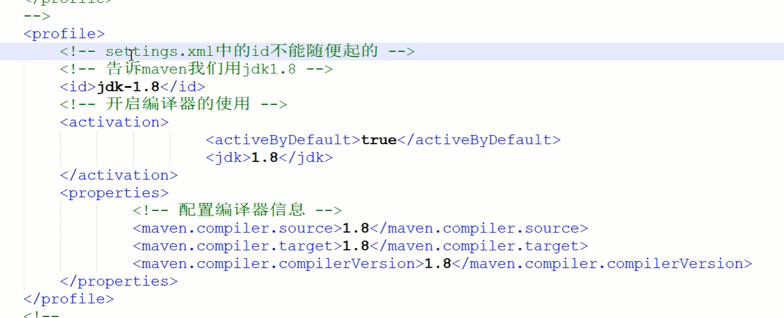

## Maven工程类型

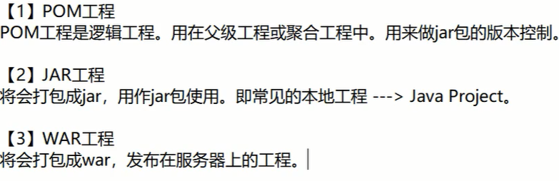

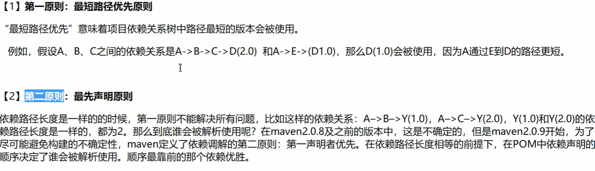

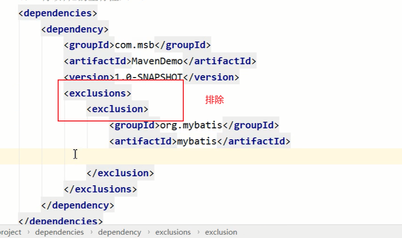

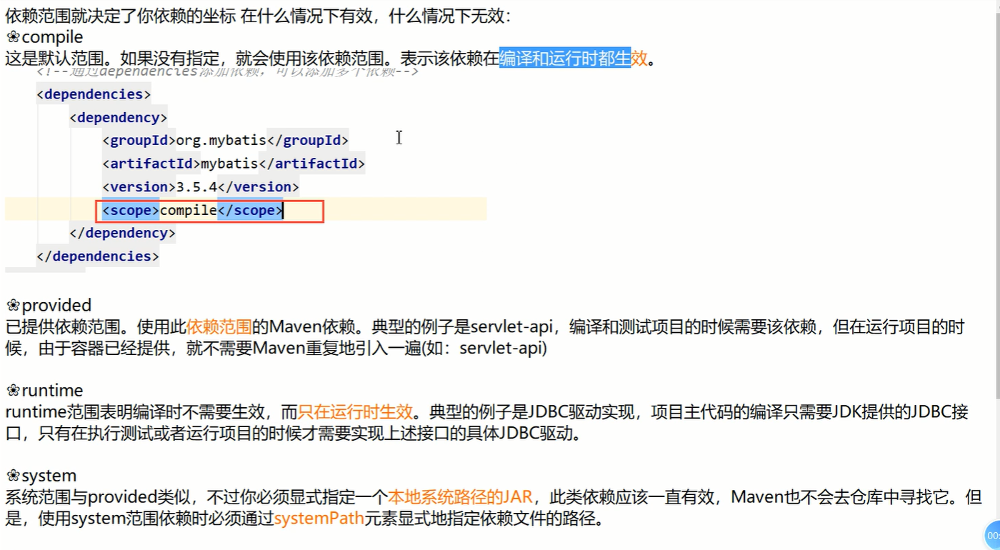

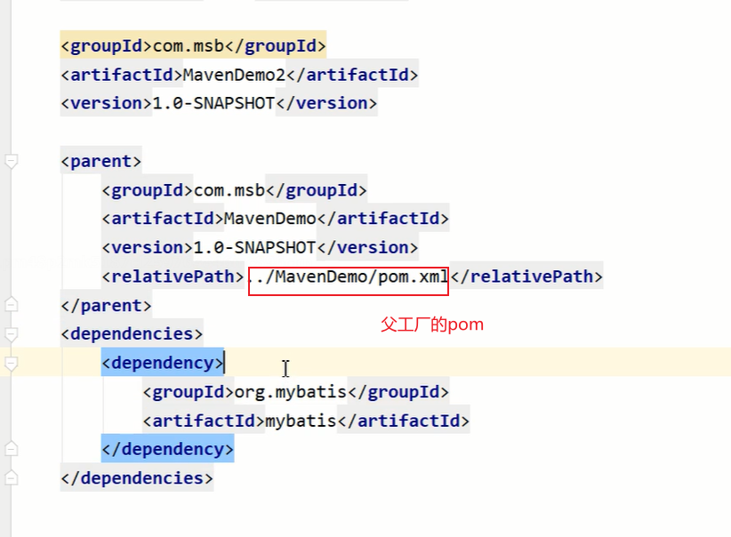

如果父工程中加入了**<scope>import</scope>**相当于强制的指定了版本号

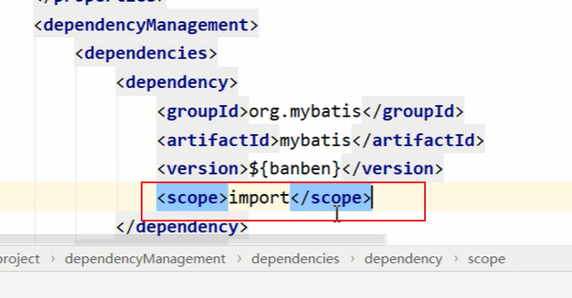

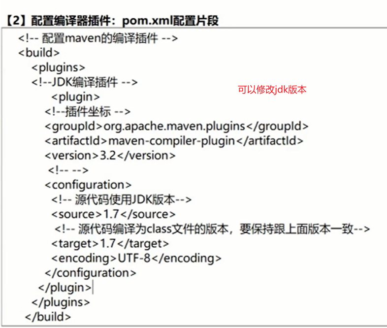

**maven打包，设置好配置之后配置文件就会被打包到classes目录下**

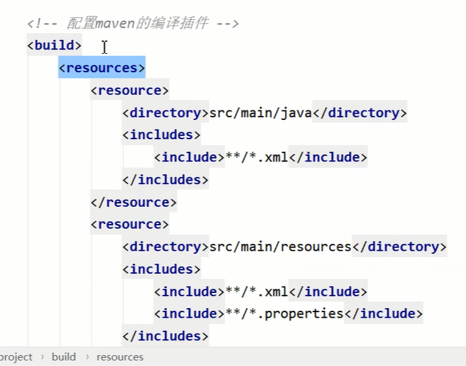

## 常见插件Tomcat插件

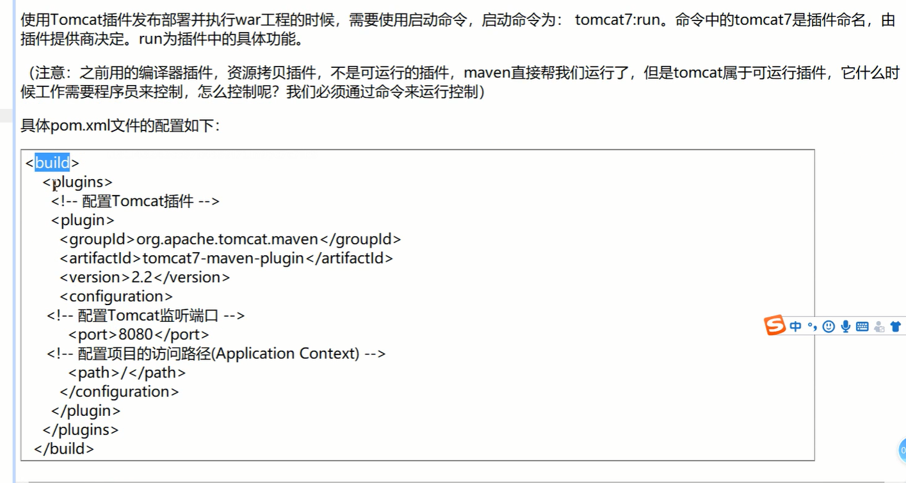

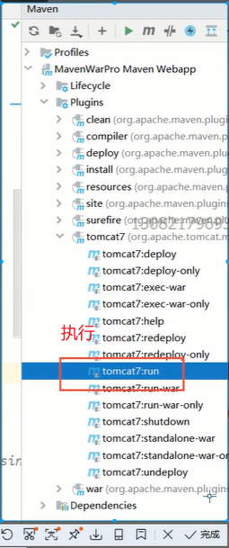 

显示Tomcat启动成功

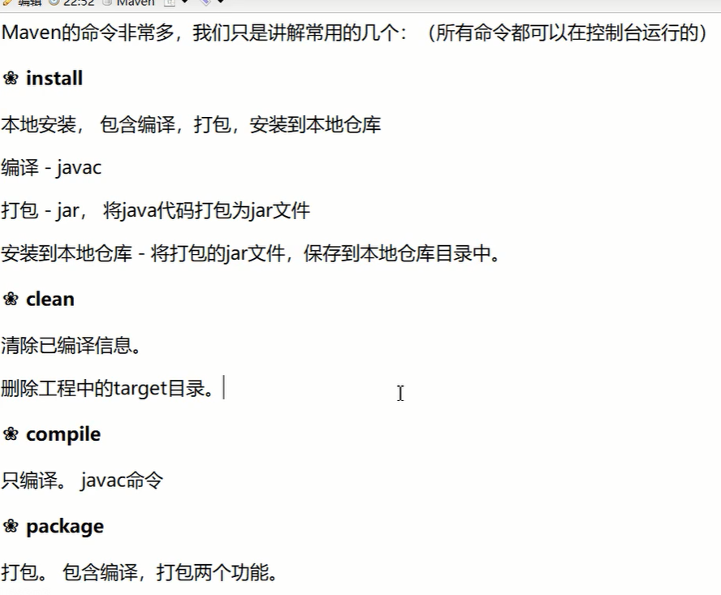

