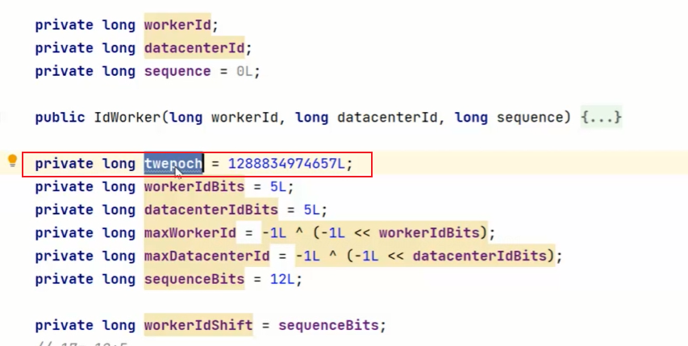

# 雪花算法

服务器扩缩容，发现两台服务器产生了相同的uuid

前置条件：单机，及其中心：31机器号码

workId：可认为是机器特征号码，一般由两部分组成：数据中心+机器号，各占用5位。

也就是最大值2^5*2^5=2^10=1024

配置时间戳的时候要配置一个项目开始的启动时间

 

全局唯一性：不能出现重复的ID号，既然是唯一标识，这是最基本的需求

趋势递增：在Mysql InnoDB引擎中使用的是聚集索引，由于多数RDBMS使用B-tree的数据结构来存储索引数据，在主键的选择上面，我们应该尽量使用有序的主键来保证写入的性能。

单调递增：保证下一个ID一定大于上一个ID，例如事务版本号，IM增量消息、排序等特殊需求。

信息安全：如果ID是连续的，恶意用户的扒取工作就非常容易做了，直接按照顺序下载指定URL即可；如果是订单号就更危险了，对方可以直接指导我们一天的单量，所以一些应用场景下，会需要ID无规则，不规则

机器号配得没错，除了时钟回拨的问题，还有哪些问题？

**比如：第一次去取号段，恰巧取到了第1000个号，而第二次取的时候有可能会取到其他机器的号，可能他没有升到1000，他升到12位的时候就要小，所以说很有可能在集群环境下没有做特殊处理，雪花算法是有问题的。**

时钟回拨如何解决？

可以使用zk维护一个workerid

