# Kafka实战-周志垒

**前言**

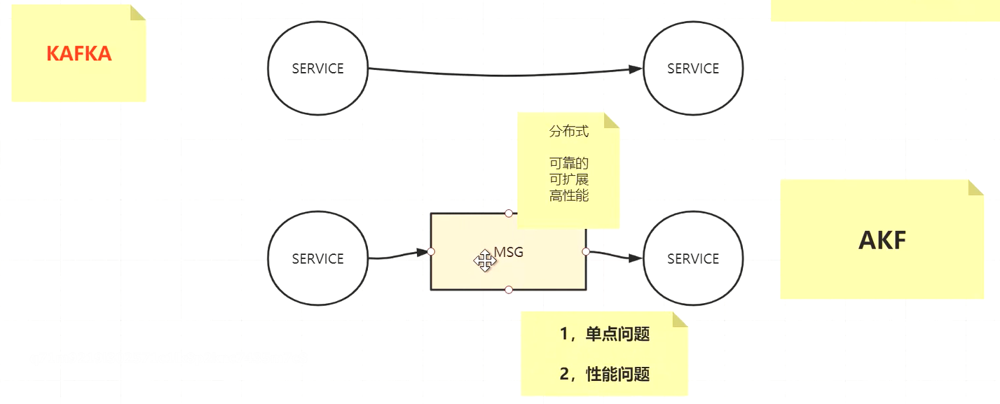 


Kafka副本leader选举


## AKF详解

**无关数据就分散到不同的分区里面，以追求并发并行处理。有关联的数据，一定要按原有顺序发送到同一个分区里。**

kafka高性能的磁盘IO

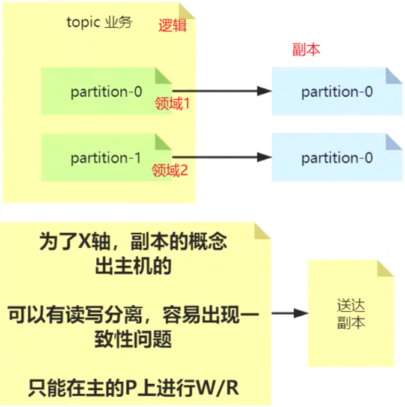 


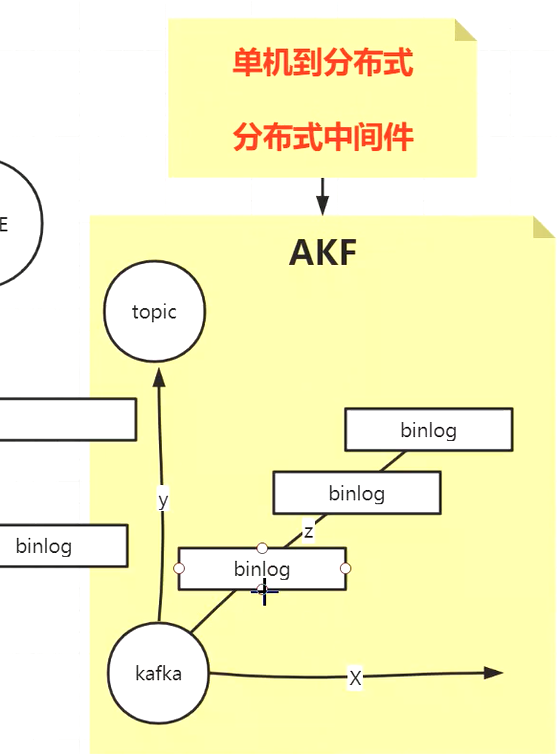 

我们知道分区内部是有序的，但是分区外部是无序的


## kafka名词介绍及整合zookeeper

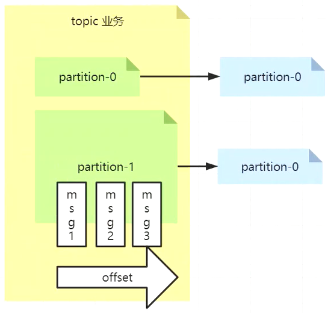 

**单机管理是主从集群管理中成本最低的**

**分布式协调：zookeeper**


**broker是kafka中自有的一个角色，相当于是一个JVM是一个进程**

 broker是一个物理的概念，而topic则相当于是一个虚的(相当于是一个业务上的划分)，P0可能归borker-1来管理，P1可能归broker-2管理。

broker是有角色的，controller，在很多个broker在决策选一个controller主的时候会用到zookeeper，所有的broker会注册到zookeeper里面去，大家都在里面抢锁，谁抢到了就选谁为主。


在1.0版本之后，kafka就不再从zookeeper去拿有多少个broker了


broker有controller之后就慢慢的把一些元数据从zookeeper上切出来了，比如说：当controller接管之后，会制造关于集群新的metadata(元数据)，里头包含了broker，topic，partition等等跟客户端无关，但是跟集群内部相关的消息。

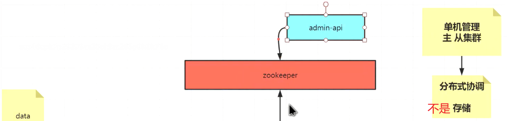 

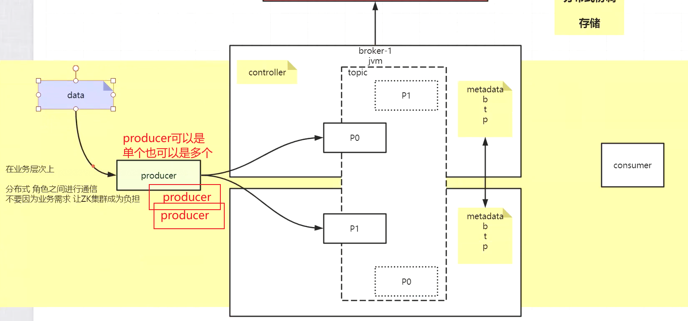 


## kafka的broker和partition介绍

kafka的推送这件事有没有放到事务中，保证锁的生命周期是既完成了，又完成了kafka的业务同步。

producer推送到kafka这件事情是写到锁外头还是锁里头是有讲究的，如果数据无关其实是无所谓的。

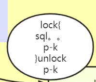 


在并发下，一定要注意一致性的问题


如果多个consumer的话，分区和consumer的关系就可以是一比一或者N比1的关系

partition:consumer       

1             ：         1

N              :           1

1		      :           N     是绝对不行的，因为这样会破坏有序性


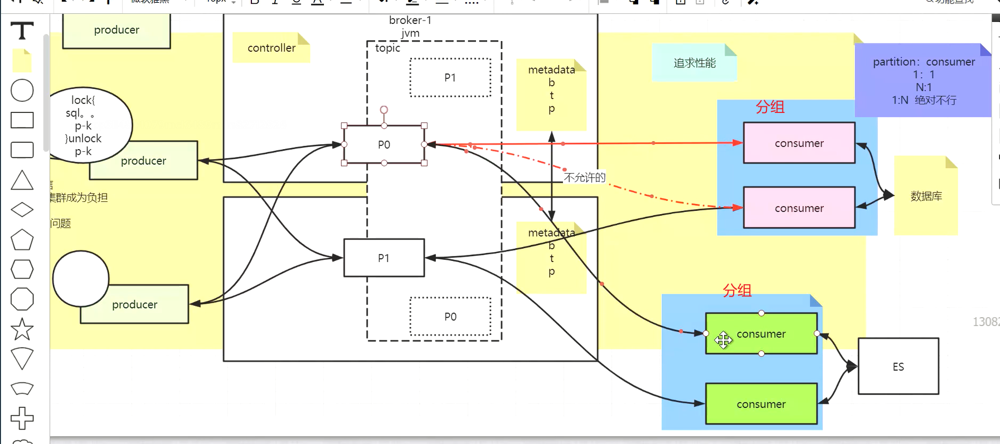 


**kafka  的 broker中的partition保存了producer发送来的数据， 重点是"数据"**

**数据去向可以重复使用，可以直接存到数据库同时也可以放到ES中**

**在单一的使用场景下，先要保证，即便追求性能(使用多个consumer)，应该注意，不能一个分区由多个consumer消费。**

数据的重复利用是站在Group上的，但是组内要保障上述描述(Group之间是隔离的)


## 幂等重复消费

在consumer消费的过程中可能出现的问题：

1、正在消费的数据还没入库就挂了，数据的丢失

2、在消费了一个数据之后，offset偏移量还没有来得及更行，consumer又去消费了一次，数据的重复

这些问题围绕的是offset   也就是消费的进度

在原始场景中还没用人为干预的生活，consumer只是一个线程，他在runtime(内存中)的时候，在内存里维护了自己的offset偏移量的进度。在内存中，所以offset需要持久化。

老版本中：这个offset都是维护到zookeeper中


**kafka在升级之后，在broker中子集弄了一个topic用来维护offset**

其实也可以存到第三方，Redis或者mysql(该时期的kafka把offset持久化到zookeeper了，所以当kafka升级  将offset维护到子集的topic的时候就不需要第三方来存储偏移量了)，但是其实存在kafka比较好


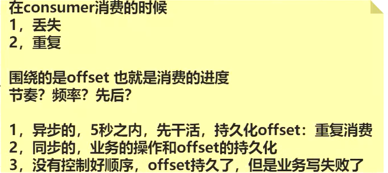 

可以用幂等解决重复消费，但是没办法解决丢失


## kafka与磁盘和网卡的技术点


相应的所有的broker他们是有一个存活的状态。kafka是通过zookeeper来保证自己进入了可用的状态。

他会在进程级别维护一个全局的metadata元数据


topic维护offset，在runtime的时候内存里面要维护offset更新的，然后持久化到自己的存储引擎中。

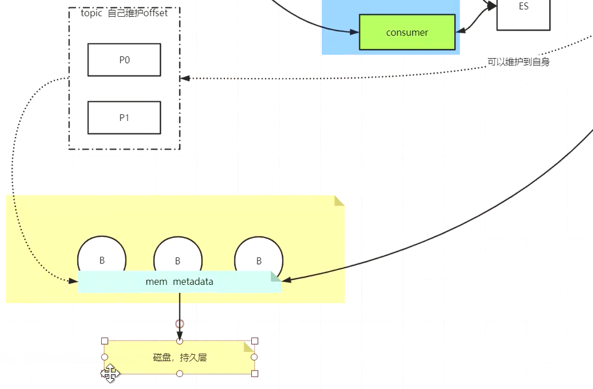 


**kafka与磁盘和网卡的技术点**

* 

 


## kafka的安装和使用


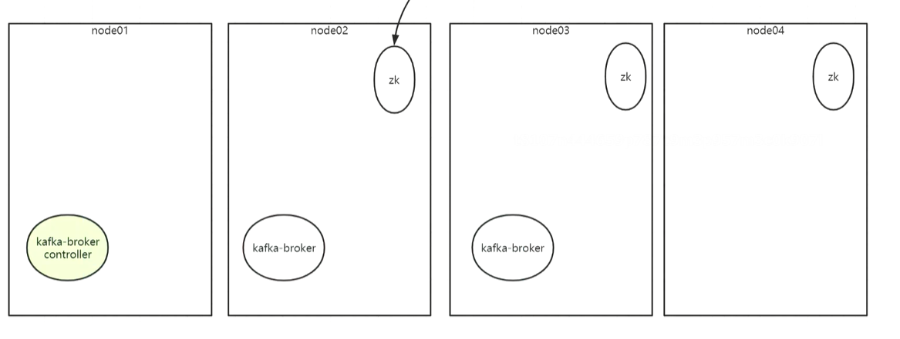 

 

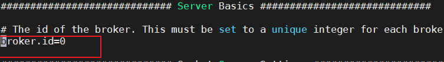 

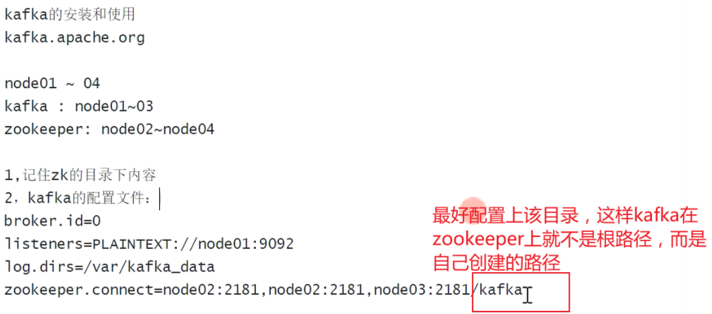

3、常规操作，设置profile设置kafka的bin路径

4、节点同步

5、启动 :  kafka-server-start.sh  ./server.properties


先创建topic

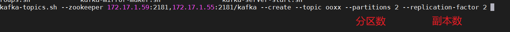 

分区怎么加都是横向扩展的，只能增加自己的可靠性。

```shell
#创建topic
kafka-topics.sh --zookeeper 172.17.1.59:2181,172.17.1.55:2181/kafka --create --topic ooxx --partitions 2 --replication-factor 2
##错误:Replication factor: 2 larger than available brokers: 1.
 (kafka.admin.TopicCommand$)
 
kafka-topics.sh --zookeeper 172.17.1.59:2181,172.17.1.55:2181/kafka --create --topic ooxx --partitions 2 --replication-factor 1

##查看topic数据
[root@node3 ~]# kafka-topics.sh --zookeeper 172.17.1.59:2181,172.17.1.55:2181/kafka --list
ooxx

#查看指定描述消息  
[root@node3 ~]# kafka-topics.sh --zookeeper 172.17.1.59:2181,172.17.1.55:2181/kafka --describe --topic ooxx
Topic:ooxx      PartitionCount:2        ReplicationFactor:1     Configs:
        Topic: ooxx     Partition: 0    Leader: 0       Replicas: 0     Isr: 0
        Topic: ooxx     Partition: 1    Leader: 0       Replicas: 0     Isr: 0

```


```shell
##启动客户端
kafka-console-consumer.sh
##现在有一个消费者订阅量 ooxx 的topic， 从属于msb这个组
kafka-console-consumer.sh --bootstrap-server 172.17.1.51:9092,172.17.1.59:9092 --topic ooxx --group msb
##订阅一个生产者
kafka-console-producer.sh --broker-list 172.17.1.55:9092 --topic ooxx
```

 

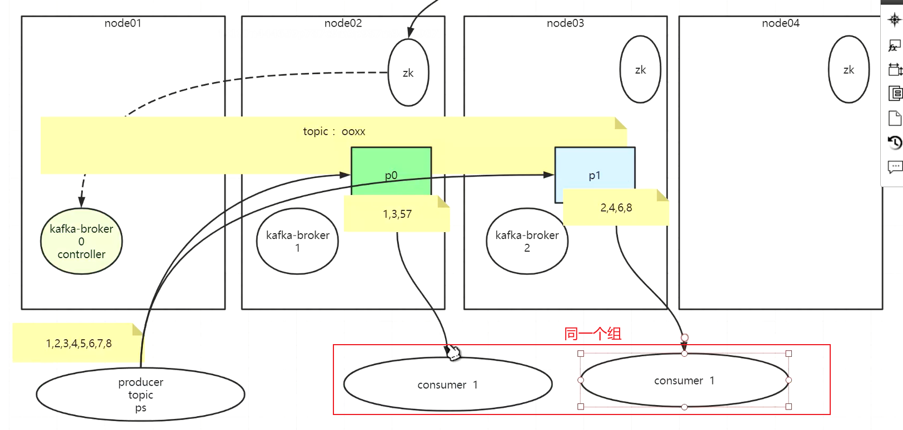


**如果只有一个consumer的话那么他就可能会消费到两个分区的数据，如果是两个consumer，并且他们是在同一个组的时候就是各自消费各自的数据。注：一个分区是不会分给两个consumer的，但是两个分区可以分给一个consumer**

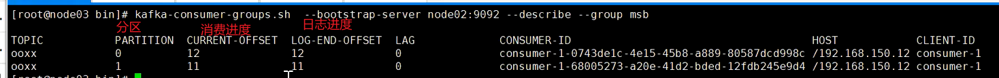

```shell
##
kafka-consumer-groups.sh
[root@bogon ~]# kafka-consumer-groups.sh --bootstrap-server 172.17.1.59:9092 --list
msb

[root@bogon ~]# kafka-consumer-groups.sh --bootstrap-server 172.17.1.59:9092 --describe --group msb
Consumer group 'msb' has no active members.

TOPIC           PARTITION  CURRENT-OFFSET  LOG-END-OFFSET  LAG             CONSUMER-ID     HOST            CLIENT-ID
ooxx            0          0               0               0               -               -               -
```


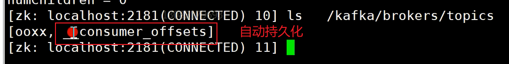

```shell
#zookeeper
[zk: localhost:2181(CONNECTED) 7] ls /kafka/brokers/topics
[__consumer_offsets, ooxx]

#总共有50个分区
[zk: localhost:2181(CONNECTED) 8] get /kafka/brokers/topics/__consumer_offsets
{"version":1,"partitions":{"45":[1],"34":[1],"12":[1],"8":[1],"19":[1],"23":[1],"4":[1],"40":[1],"15":[1],"11":[1],"9":[1],"44":[1],"33":[1],"22":[1],"26":[1],"37":[1],"13":[1],"46":[1],"24":[1],"35":[1],"16":[1],"5":[1],"10":[1],"48":[1],"21":[1],"43":[1],"32":[1],"49":[1],"6":[1],"36":[1],"1":[1],"39":[1],"17":[1],"25":[1],"14":[1],"47":[1],"31":[1],"42":[1],"0":[1],"20":[1],"27":[1],"2":[1],"38":[1],"18":[1],"30":[1],"7":[1],"29":[1],"41":[1],"3":[1],"28":[1]}}
[zk: localhost:2181(CONNECTED) 9]
```


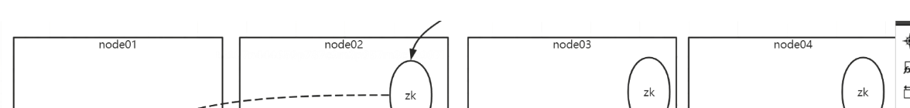 

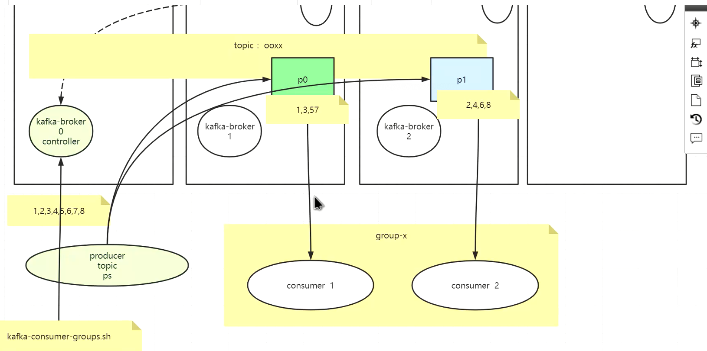


##  分区概念

**分区：桶**

**如果没有顺序上的约束的话：水平扩展**

**一旦消息(消息很多，但是消息种类一定多)，而且需要同一类消息的有序性**

消息是K,V，相同的key一定会去到一个分区里

kafka的broker会保证producer推送的消息的顺序

一个分区可能会有不同的key，且不同的key是交叉的。相同的key在一个分区里没有排列在一起

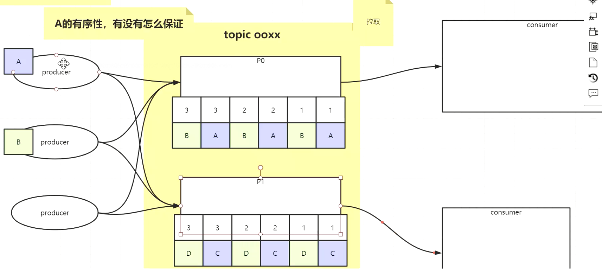  


**根据发送数据的特征来保证他的内部有序性**

**拉取和推送的差异**

**1、推送说的是server ，主动的去推，消费太慢会造成网卡打满，**

**2、拉取，consumer，自主，按需，去订阅拉取server的数据**

​	**2.2、拉取粒度，是一个一个拉，还是一批一批拉。一般来说批次比较好**


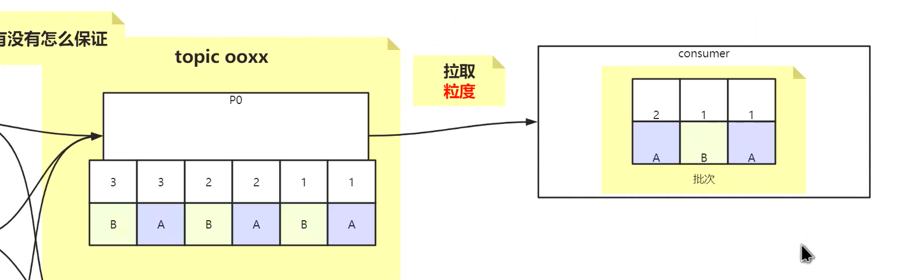 


## consumer选择单线程和多线程对比

**consumer拿到批次之后，是单线程处理还是多线程处理？应该如何处理？**


### offset维护&持久化

OOXX:P0:3?

kafka 的consumer以什么粒度更新&持久化offset。

#### 单线程：

**1、一条一条处理数据， 按顺序处理的时候，可以更精确的来更新offset。不丢失不重复消费**

**缺点：速度比较慢，硬件资源浪费**

#### **1-1、多线程，offset维护？按条？还是按批？**

如果是多线程的话  A1、A2失败了，B1成功了，如果是分批拉取的话，那么A1、A2重新拉取的生活B1也在这一批里面，那么B1就重复了；反之如果A1、A2成功，B1失败，那么就会把A1给弄丢掉(A1失败了，B1成功了，提交了B1的offset，那么A1就会丢失)

A1，2放入一个线程的一个事务里，这个offset的决策其实很简单，要么是成功线程的offset，要么是失败线程的offset

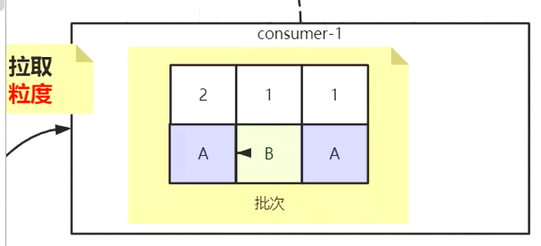 

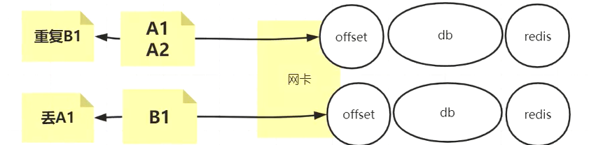 

**主要是追求多线程的性能，并且减少事务，减少对数据库的压力**

**什么情况下多线程的优势能够发挥到极致？   具备隔离性**

**多线程的情况下又要加入，记录级的判定顺序，决策更新谁的offset**


### 使用多线程如何解决A1A1、B1的问题？

**流式计算、充分利用线程**

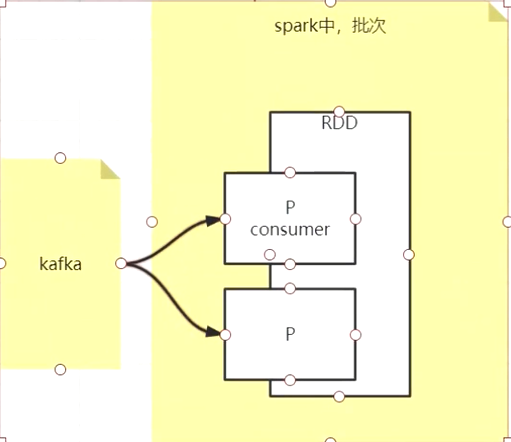 

**响应式编程**

分析：consumer收到了类似下图的数据

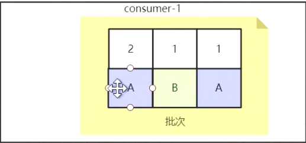 

**批次的头或尾的绝对更新，依赖了事务的反馈**

**不会有重复消费，丢失数据的问题**

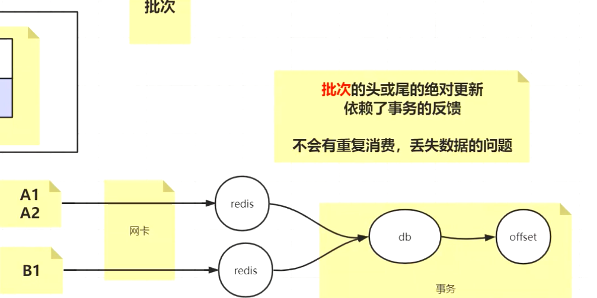

批次为大事务，要么最终更新到开始，要么整体失败，要么整体通过

1、单线程按顺序单条处理，offset就是递增的。这个情况下无论对db、offset的更新频率上成本非常高，无论CPU或者网卡都会出现阻塞或者等待的情况出现。造成硬件的资源浪费。(单线程的进度控制和粒度控制比较好)

2、流式的多线程，能多线程的步骤就多线程，但是将整个批次的事务环节交给一个线程，做到这个批次，要么成功要么失败，这样就能够减少DB的压力和offset更新频率的压力，更多的去利用CPU和网卡的硬件资源。(粒度比较粗)

通过Redis获取数据，完善每一条记录的内容。


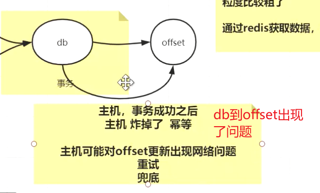 


## kafka生产者api演示

创建topic


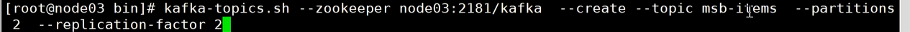 

```shell
kafka-topics.sh --zookeeper node03:2181/kafka --create --topic msb-items --partitions 2 --replication-factor 2
```


```
package com.msb.kafka;

import org.apache.kafka.clients.producer.KafkaProducer;
import org.apache.kafka.clients.producer.ProducerConfig;
import org.apache.kafka.clients.producer.ProducerRecord;
import org.apache.kafka.clients.producer.RecordMetadata;
import org.apache.kafka.common.serialization.StringSerializer;
import org.junit.Test;

import java.util.Properties;
import java.util.concurrent.ExecutionException;
import java.util.concurrent.Future;

/**
 * @author LYX
 * @description
 * @date 2022/5/21 15:48
 */
public class Lesson01 {

    /**
     * 创建TOPIC  kafka-topic.sh --zookeeper
     * kafka-topics.sh --zookeeper 192.168.1.11:2181/kafka --create
     * --topic msb-items --partitions 2 --replication-factor 2
     */
    @Test
    public void producer() throws ExecutionException, InterruptedException {

        String topic = "msb-items";
        Properties properties = new Properties();
        properties.setProperty(ProducerConfig.BOOTSTRAP_SERVERS_CONFIG, "192.168.1.16:9092,192.168.1.12:9092,192.168.1.11:9092");
        //kafka是一个能够持久化消息的MQ  数据其实是以byte形式交给对方的，consumer和producer拿到的数据都是以这种形式
        //其实kafka不会对数据进行干预，所以双方要约定编解码一直的问题
        //kafka是一个application，使用零拷贝  sendfile  系统调用实现快速数据消费
        properties.setProperty(ProducerConfig.KEY_SERIALIZER_CLASS_CONFIG, StringSerializer.class.getName());
        properties.setProperty(ProducerConfig.VALUE_SERIALIZER_CLASS_CONFIG, StringSerializer.class.getName());

        // 现在的producer其实就是一个提供者，面向的其实是broker，虽然在使用的时候，我们期望的是把数据打入topic
        KafkaProducer<String, String> producer = new KafkaProducer<>(properties);

        /*
         * msb-items
         * 2partition
         * 三种商品，每种商品有线性的3个id
         * 相同的商品，最好是去到一个分区里
         * */

        for (int i = 0; i < 3; i++) {
            for (int j = 0; j < 3; j++) {
                ProducerRecord<String, String> record = new ProducerRecord<>(topic, "item" + j, "value" + i);
                Future<RecordMetadata> recordMetadataFuture = producer.send(record);
                RecordMetadata rm = recordMetadataFuture.get();
                int partition = rm.partition();
                long offset = rm.offset();

                System.out.println("key:" + record.key() + "\nvalue:" + record.value() + "\npartition:" + partition + "\noffset:" + offset);
            }
        }


    }

}

```

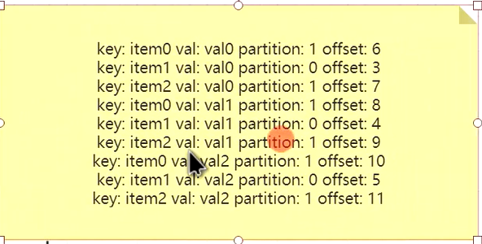 


初始化使用消费者consumer

第一次启动consumer没有offset

```shell

[root@node03 ~]# kafka-consumer-groups.sh --bootstrap-server node02:9092 --list
OOXX

[root@node03 ~]# kafka-consumer-groups.sh --bootstrap-server node02:9092 --describe --group OOXX

TOPIC           PARTITION  CURRENT-OFFSET  LOG-END-OFFSET  LAG             CONSUMER-ID                                     HOST            CLIENT-ID
msb-items       0          2889            2889            0               consumer-1-e8a5c585-9d28-4f4b-b82b-43abed3ed1ae /192.168.1.6    consumer-1

```

关闭了自动提交，如果重跑的话，会重复消费掉，因为offset没有持久化

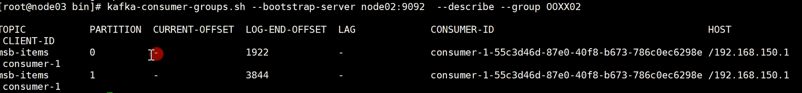


```java
package com.msb.kafka;

import org.apache.kafka.clients.consumer.*;
import org.apache.kafka.clients.producer.KafkaProducer;
import org.apache.kafka.clients.producer.ProducerConfig;
import org.apache.kafka.clients.producer.ProducerRecord;
import org.apache.kafka.clients.producer.RecordMetadata;
import org.apache.kafka.common.TopicPartition;
import org.apache.kafka.common.serialization.StringDeserializer;
import org.apache.kafka.common.serialization.StringSerializer;
import org.junit.Test;

import java.time.Duration;
import java.util.Arrays;
import java.util.Collection;
import java.util.Iterator;
import java.util.Properties;
import java.util.concurrent.ExecutionException;
import java.util.concurrent.Future;

/**
 * @author LYX
 * @description
 * @date 2022/5/21 15:48
 */
public class Lesson01 {

    /**
     * 创建TOPIC  kafka-topic.sh --zookeeper
     * kafka-topics.sh --zookeeper 192.168.1.11:2181/kafka --create
     * --topic msb-items --partitions 2 --replication-factor 2
     */
    @Test
    public void producer() throws ExecutionException, InterruptedException {

        String topic = "msb-items1";
        Properties properties = new Properties();
        properties.setProperty(ProducerConfig.BOOTSTRAP_SERVERS_CONFIG, "192.168.1.16:9092,192.168.1.12:9092,192.168.1.11:9092");
        //kafka是一个能够持久化消息的MQ  数据其实是以byte形式交给对方的，consumer和producer拿到的数据都是以这种形式
        //其实kafka不会对数据进行干预，所以双方要约定编解码一直的问题
        //kafka是一个application，使用零拷贝  sendfile  系统调用实现快速数据消费
        properties.setProperty(ProducerConfig.KEY_SERIALIZER_CLASS_CONFIG, StringSerializer.class.getName());
        properties.setProperty(ProducerConfig.VALUE_SERIALIZER_CLASS_CONFIG, StringSerializer.class.getName());

        // 现在的producer其实就是一个提供者，面向的其实是broker，虽然在使用的时候，我们期望的是把数据打入topic
        KafkaProducer<String, String> producer = new KafkaProducer<>(properties);

        /*
         * msb-items
         * 2partition
         * 三种商品，每种商品有线性的3个id
         * 相同的商品，最好是去到一个分区里
         * */
        while (true) {
            for (int i = 0; i < 3; i++) {
                for (int j = 0; j < 3; j++) {
                    ProducerRecord<String, String> record = new ProducerRecord<>(topic, "item" + j, "value" + i);
                    Future<RecordMetadata> recordMetadataFuture = producer.send(record);
                    RecordMetadata rm = recordMetadataFuture.get();
                    int partition = rm.partition();
                    long offset = rm.offset();

                    System.out.println("key:" + record.key() + "\nvalue:" + record.value() + "\npartition:" + partition + "\noffset:" + offset);
                }
            }
        }

    }


    @Test
    public void consumer() {

        //基础配置
        Properties properties = new Properties();
        properties.setProperty(ConsumerConfig.BOOTSTRAP_SERVERS_CONFIG, "192.168.1.16:9092,192.168.1.12:9092,192.168.1.11:9092");
        //反序列化
        properties.setProperty(ConsumerConfig.KEY_DESERIALIZER_CLASS_CONFIG, StringDeserializer.class.getName());
        properties.setProperty(ConsumerConfig.VALUE_DESERIALIZER_CLASS_CONFIG, StringDeserializer.class.getName());

        //消费的细节
        properties.setProperty(ConsumerConfig.GROUP_ID_CONFIG, "OOXX");
        //kafka是一个mq 也是一个storage
        //properties.setProperty(ConsumerConfig.AUTO_OFFSET_RESET_CONFIG, "latest");
        properties.setProperty(ConsumerConfig.AUTO_OFFSET_RESET_CONFIG, "earliest");
        //    public static final String AUTO_OFFSET_RESET_DOC =
        //     没有在持久化里面找到对应的offset  或者第一次的时候没有当前进程的offset
        //    "What to do when there is no initial offset in Kafka or if the current offset does not exist any more on the server
        //    (e.g. because that data has been deleted):
        //      去分区最早的地方取
        //      自动重置偏移量到最早偏移量
        //    <ul><li>earliest: automatically reset the offset to the earliest offset
        //      默认值是latest
        //    <li>latest: automatically reset the offset to the latest offset
        //      没有找到offset会抛出异常，或者是从头或尾开始
        //    </li><li>none: throw exception to the consumer if no previous offset is found for the consumer's group</li>
        //    <li>anything else: throw exception to the consumer.</li></ul>";
        //刚刚启动的时候kafka是没有offset的
        //自动提交会
        properties.setProperty(ConsumerConfig.ENABLE_AUTO_COMMIT_CONFIG, "true");//自动提交是异步提交,但是这种方式很容易造成丢数据或者重复数据的

        //一个运行的程序consumer，那么自己会维护自己的消费进度
        //一旦你自动提交但是是异步的
        //1、还没有到时间，kafka挂了，没有提交上去，这时候重启一个consumer，参照offset的时候会重复消费
        //2、一个批次的数据还没有写入数据库 没有成功，但是这个批次的offset被异步提交了，这个时候kafka挂了，这时候重启一个consumer，会丢失消息

        properties.setProperty(ConsumerConfig.AUTO_COMMIT_INTERVAL_MS_CONFIG,"15000");//异步提交延时：default:5ms
        //properties.setProperty(ConsumerConfig.MAX_POLL_RECORDS_CONFIG,"");//kafka是pool形式的通过发布订阅拉取数据，弹性的，按需的，拉取多少？

        KafkaConsumer<String, String> consumer = new KafkaConsumer<>(properties);

        //先去订阅topic
        //kafka的consumer会自动的负载均衡
        consumer.subscribe(Arrays.asList("msb-items1"), new ConsumerRebalanceListener() {
            @Override
            public void onPartitionsRevoked(Collection<TopicPartition> collection) {
                System.out.println("--onPartitionsRevoked---");
                Iterator<TopicPartition> iterator = collection.iterator();
                while (iterator.hasNext()) {
                    System.out.println(iterator.next().partition());
                }
            }

            @Override
            public void onPartitionsAssigned(Collection<TopicPartition> collection) {
                System.out.println("===onPartitionsAssigned===");
                Iterator<TopicPartition> iterator = collection.iterator();
                while (iterator.hasNext()) {
                    System.out.println(iterator.next().partition());
                }
            }
        });

        while (true) {
            //微批的感觉
            ConsumerRecords<String, String> records = consumer.poll(Duration.ofMillis(0)); //0~N
            if (!records.isEmpty()) {
                System.out.println("--------" + records.count() + "------------");
                //以下代码的优化很重要
                Iterator<ConsumerRecord<String, String>> iter = records.iterator();
                while (iter.hasNext()) {
                    //因为一个consumer可以消费多个分区，但是一个分区只能给一个组里的一个consumer消费
                    ConsumerRecord<String, String> record = iter.next();
                    int partition = record.partition();
                    long offset = record.offset();
                    String key = record.key();
                    String value = record.value();

                    System.out.println("key: " + record.key() + "==" + "value: " + record.value() + "partition: " + partition + "===" + "offset:" + offset);
                }
            }
        }

    }

}

```


## 持久化操作

相同的key不可能出现在别的分区中，只会出现在一个分区中

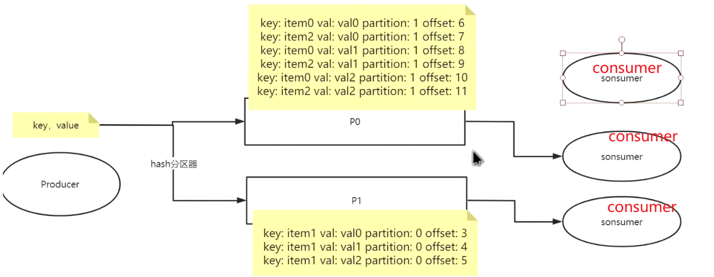

**一个consumer到底是怎么去消费多分区的？以什么样的形式去各个分区取数据的？**

**kafka中offset是按什么去更新维护的？**

以分区的粒度来维护offset的

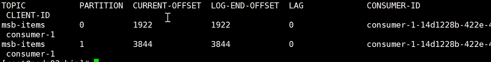 

所以一个consumer如果对接多个分区，即便是consumer使用了多线程，并且P0成功了，P1失败了，这个consumer再重启之后P0也会消费成功，并且P1也不会丢失数据。

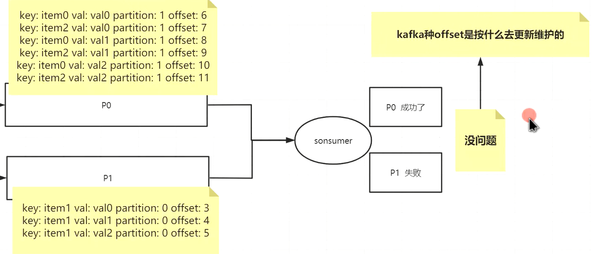


```java
package com.msb.kafka;

import org.apache.kafka.clients.consumer.*;
import org.apache.kafka.clients.producer.KafkaProducer;
import org.apache.kafka.clients.producer.ProducerConfig;
import org.apache.kafka.clients.producer.ProducerRecord;
import org.apache.kafka.clients.producer.RecordMetadata;
import org.apache.kafka.common.TopicPartition;
import org.apache.kafka.common.serialization.StringDeserializer;
import org.apache.kafka.common.serialization.StringSerializer;
import org.junit.Test;

import java.time.Duration;
import java.util.*;
import java.util.concurrent.ExecutionException;
import java.util.concurrent.Future;

/**
 * @author LYX
 * @description
 * @date 2022/5/21 15:48
 */
public class Lesson01 {

    /**
     * 创建TOPIC  kafka-topic.sh --zookeeper
     * kafka-topics.sh --zookeeper 192.168.1.11:2181/kafka --create
     * --topic msb-items --partitions 2 --replication-factor 2
     */
    @Test
    public void producer() throws ExecutionException, InterruptedException {

        String topic = "msb-items1";
        Properties properties = new Properties();
        properties.setProperty(ProducerConfig.BOOTSTRAP_SERVERS_CONFIG, "192.168.1.16:9092,192.168.1.12:9092,192.168.1.11:9092");
        //kafka是一个能够持久化消息的MQ  数据其实是以byte形式交给对方的，consumer和producer拿到的数据都是以这种形式
        //其实kafka不会对数据进行干预，所以双方要约定编解码一致的问题
        //kafka是一个application，使用零拷贝  sendfile  系统调用实现快速数据消费
        properties.setProperty(ProducerConfig.KEY_SERIALIZER_CLASS_CONFIG, StringSerializer.class.getName());
        properties.setProperty(ProducerConfig.VALUE_SERIALIZER_CLASS_CONFIG, StringSerializer.class.getName());

        // 现在的producer其实就是一个提供者，面向的其实是broker，虽然在使用的时候，我们期望的是把数据打入topic
        KafkaProducer<String, String> producer = new KafkaProducer<>(properties);

        /*
         * msb-items
         * 2partition
         * 三种商品，每种商品有线性的3个id
         * 相同的商品，最好是去到一个分区里
         * */
        while (true) {
            for (int i = 0; i < 3; i++) {
                for (int j = 0; j < 3; j++) {
                    ProducerRecord<String, String> record = new ProducerRecord<>(topic, "item" + j, "value" + i);
                    Future<RecordMetadata> recordMetadataFuture = producer.send(record);
                    RecordMetadata rm = recordMetadataFuture.get();
                    int partition = rm.partition();
                    long offset = rm.offset();

                    System.out.println("key:" + record.key() + "\nvalue:" + record.value() + "\npartition:" + partition + "\noffset:" + offset);
                }
            }
        }

    }


    @Test
    public void consumer() {

        //基础配置
        Properties properties = new Properties();
        properties.setProperty(ConsumerConfig.BOOTSTRAP_SERVERS_CONFIG, "192.168.1.16:9092,192.168.1.12:9092,192.168.1.11:9092");
        //反序列化
        properties.setProperty(ConsumerConfig.KEY_DESERIALIZER_CLASS_CONFIG, StringDeserializer.class.getName());
        properties.setProperty(ConsumerConfig.VALUE_DESERIALIZER_CLASS_CONFIG, StringDeserializer.class.getName());

        //消费的细节
        properties.setProperty(ConsumerConfig.GROUP_ID_CONFIG, "OOXX04");
        //kafka是一个mq 也是一个storage
        //properties.setProperty(ConsumerConfig.AUTO_OFFSET_RESET_CONFIG, "latest");
        properties.setProperty(ConsumerConfig.AUTO_OFFSET_RESET_CONFIG, "earliest");
        //    public static final String AUTO_OFFSET_RESET_DOC =
        //     没有在持久化里面找到对应的offset  或者第一次的时候没有当前进程的offset
        //    "What to do when there is no initial offset in Kafka or if the current offset does not exist any more on the server
        //    (e.g. because that data has been deleted):
        //      去分区最早的地方取
        //      自动重置偏移量到最早偏移量
        //    <ul><li>earliest: automatically reset the offset to the earliest offset
        //      默认值是latest
        //    <li>latest: automatically reset the offset to the latest offset
        //      没有找到offset会抛出异常，或者是从头或尾开始
        //    </li><li>none: throw exception to the consumer if no previous offset is found for the consumer's group</li>
        //    <li>anything else: throw exception to the consumer.</li></ul>";
        //刚刚启动的时候kafka是没有offset的
        //自动提交会
        properties.setProperty(ConsumerConfig.ENABLE_AUTO_COMMIT_CONFIG, "true");//自动提交是异步提交,但是这种方式很容易造成丢数据或者重复数据的

        //一个运行的程序consumer，那么自己会维护自己的消费进度
        //一旦你自动提交但是是异步的
        //1、还没有到时间，kafka挂了，没有提交上去，这时候重启一个consumer，参照offset的时候会重复消费
        //2、一个批次的数据还没有写入数据库 没有成功，但是这个批次的offset被异步提交了，这个时候kafka挂了，这时候重启一个consumer，会丢失消息

        //properties.setProperty(ConsumerConfig.AUTO_COMMIT_INTERVAL_MS_CONFIG,"15000");//异步提交延时：default:5ms
        //properties.setProperty(ConsumerConfig.MAX_POLL_RECORDS_CONFIG,"");//kafka是pool形式的通过发布订阅拉取数据，弹性的，按需的，拉取多少？

        KafkaConsumer<String, String> consumer = new KafkaConsumer<>(properties);

        //先去订阅topic
        //kafka的consumer会自动的负载均衡
        consumer.subscribe(Arrays.asList("msb-items1"), new ConsumerRebalanceListener() {
            @Override
            public void onPartitionsRevoked(Collection<TopicPartition> collection) {
                System.out.println("--onPartitionsRevoked---");
                Iterator<TopicPartition> iterator = collection.iterator();
                while (iterator.hasNext()) {
                    System.out.println(iterator.next().partition());
                }
            }

            @Override
            public void onPartitionsAssigned(Collection<TopicPartition> collection) {
                System.out.println("===onPartitionsAssigned===");
                Iterator<TopicPartition> iterator = collection.iterator();
                while (iterator.hasNext()) {
                    System.out.println(iterator.next().partition());
                }
            }
        });

        while (true) {

            /**
             * 常识：如果想多线程处理多分区
             * 每poll一次，用一个语义：一个job启动了，这个job可以多线程并行处理分区
             * 一次job用多线程并行处理分区，且job应该被控制是串行的
             * 因为在一个job里面他并行处理的分区数据的业务逻辑没有结束，offset没有更新。如果主线程没有阻塞多线程的等待结果的poll话，
             * 等于是重复消费了
             *  以上知识点其实如果学过大数据都是这种概念。
             */
            //微批的感觉
            ConsumerRecords<String, String> records = consumer.poll(Duration.ofMillis(0)); //0~N
            if (!records.isEmpty()) {
                System.out.println("--------" + records.count() + "------------");

                //每次poll的时候是取多个分区的数据的
                Set<TopicPartition> partitions = records.partitions();
                //且每个分区内的数据是有序的
                /**
                 * 如果手动提交offset的话
                 * 1、按照每条消息记录进度同步提交
                 * 2、按分区粒度提交，处理完一个分区提交处理完一个分区提交
                 * 3、按当前poll的批次同步提交
                 *
                 * 思考：如果在多个线程的情况
                 * 1、以上1、3的方式不用多线程
                 * 2、以上2的方式是最容易想到多线程方式处理的
                 * 3、
                 */
                for (TopicPartition topicPartition : partitions) {
                    //把批次里面的数据隔离开来查看
                    List<ConsumerRecord<String, String>> pRecords = records.records(topicPartition);
                    //思路：
                    //在一个微批里面，按分区获取poll回来的数据
                    //线性的按分区处理，还可以并行的按分区处理用多线程的方式
                    Iterator<ConsumerRecord<String, String>> consumerRecordIterator = pRecords.iterator();
                    while (consumerRecordIterator.hasNext()) {

                        ConsumerRecord<String, String> record = consumerRecordIterator.next();
                        int partition = record.partition();
                        long offset = record.offset();
                        String key = record.key();
                        String value = record.value();

                        System.out.println("key: " + record.key() + "==" + "value: " + record.value() + "partition: " + partition + "===" + "offset:" + offset);
                    }

                }

                ////以下代码的优化很重要
                //Iterator<ConsumerRecord<String, String>> iter = records.iterator();
                //while (iter.hasNext()) {
                //    //因为一个consumer可以消费多个分区，但是一个分区只能给一个组里的一个consumer消费
                //    ConsumerRecord<String, String> record = iter.next();
                //    int partition = record.partition();
                //    long offset = record.offset();
                //    String key = record.key();
                //    String value = record.value();
                //
                //    System.out.println("key: " + record.key() + "==" + "value: " + record.value() + "partition: " + partition + "===" + "offset:" + offset);
                //}

            }
        }

    }

}

```


一个topic可以有多个分区，消费者消费每个分区时是以消费者组为单位记录offset的。例如：Group A消费了topicA的第一个分区，那么Group A中消费这个分区有个offset，GroupB消费同样的offset时，也会根据消费者组维护一个offset。


## 多线程下手动提交offset方式


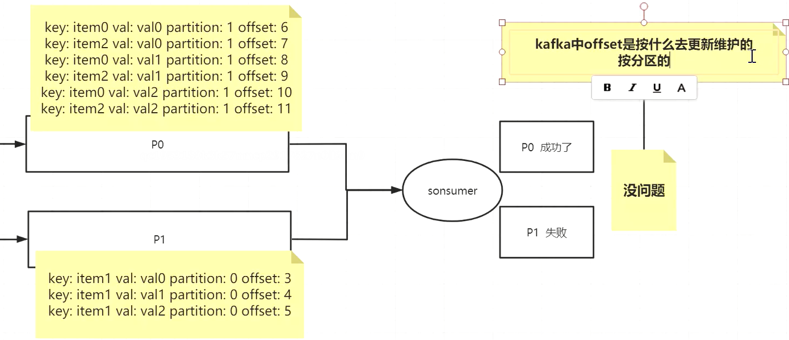 


## 同步


zookeeper是分布式协调者，所以他里面会有一些关于kafka的元数据，这个元数据是围绕topic来存储的，如果当前的controller角色下线了，那么未来重新选择的controller还是可以重新拿到这个数据。

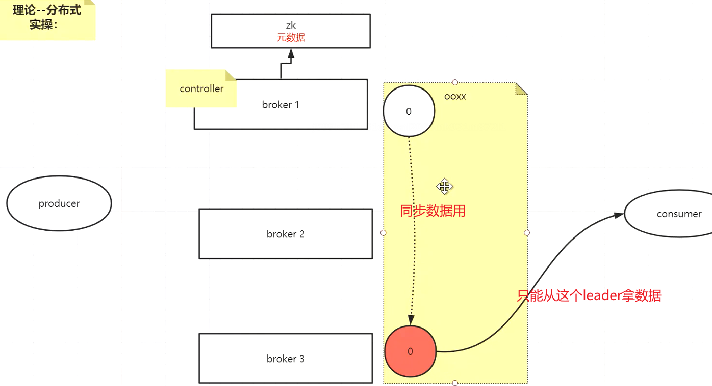 

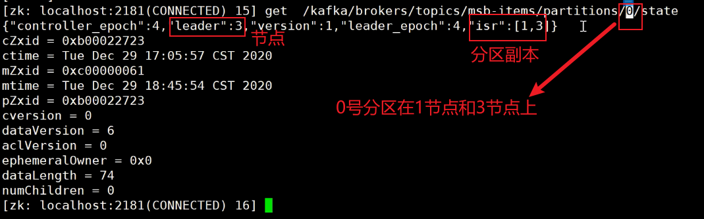 


## 单机


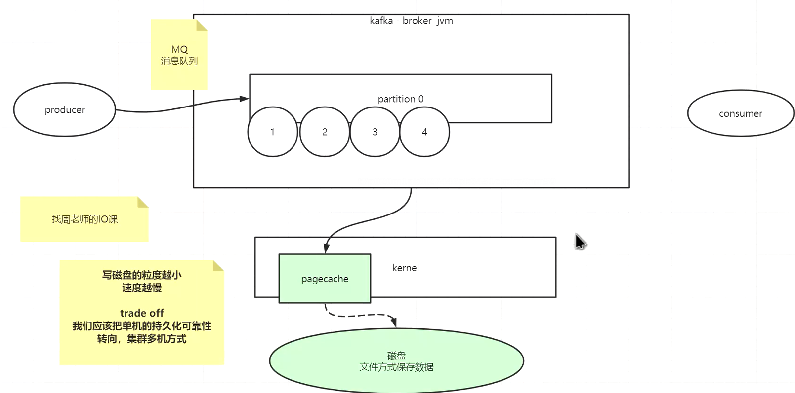 

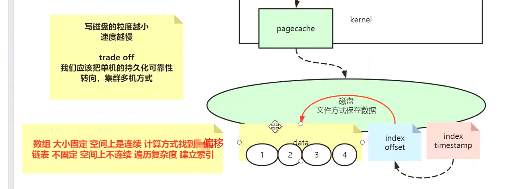 


### 时间戳

记录数据的时候也记录这条数据的时间戳，那么可以支持consumer来查找三天前或者具体某个时间段产生的数据。


**kafka对数据只是发送**

**没有加工的过程**

**所以可以直接通过**

**零拷贝来发送数据**

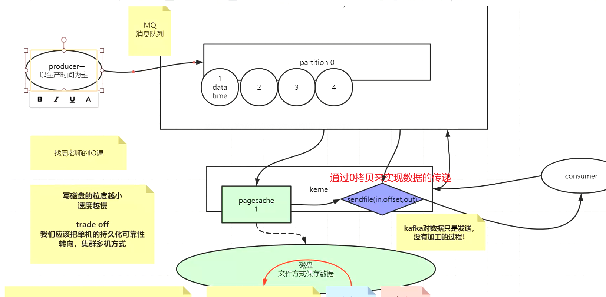 


### 性能

MQ相当于是一个消息队列，他能做异步或者削峰填谷，解耦，对数据的可靠性有不同的要求


## 分区可靠性和一致性

**一致性：**

1、强一致性，必须要保证所有节点必须全部存活(会破坏可用性)

2-1、最终一致性，**过半通过**的机制。最常用的分布式一致性的解决方案


ISR(in-sync replicas) 集合，取决于连通性和活跃性来决定要等多少的ACK。

OSR(out of-sync replicas)，超过阈值时间没有“心跳”

AR(assigned replicas)面向分区的副本集合，创建topic的时候你给出了分区的副本数，那么controller在创建的时候就已经分配了broker和分区的对应关系，并得到了该分区的broker集合。

AR=ISR+OSR

最终是和ack因素来挂钩的，要学明白ack的-1机制


### 当ACK为-1时

**最严苛的形式，所有副本都要同步，一致**

ISR一开始总共有3台，ACK为-1 的时候，当有一条数据到leader时，另外两台都要在规定时间内拉取，如果第三台没有按照规定时间拉取，那么就把他踢掉变为OSR，如果第二台也没有按照规定时间同步数据，那么第二台也踢掉，第一台自己做ACK确认这件事。

**可以自己规定过了哪个量之后ack就可以通过，你可以是5台，两个同步成功之后akc就确认通过等等**

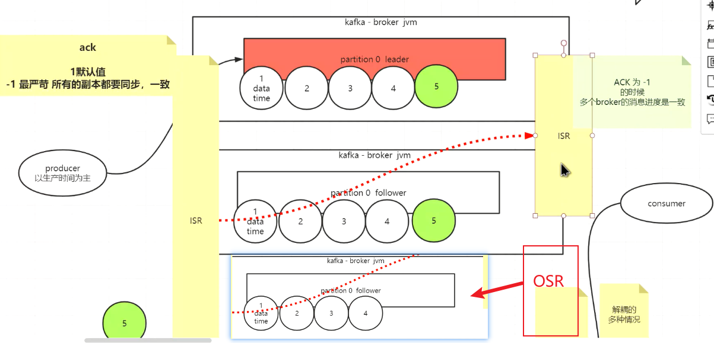 


### 当ACK为1时

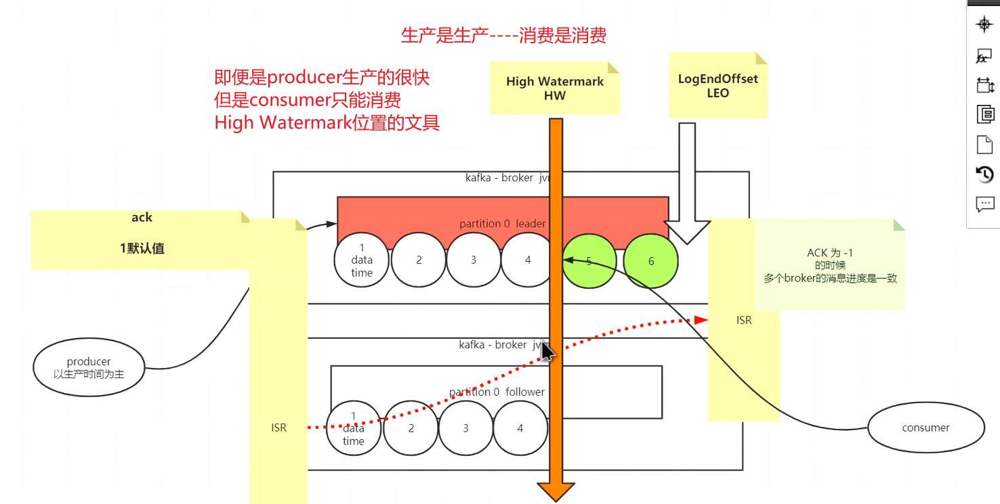 

**0、另外一个trade off 不要强调磁盘的可靠性，转向异地，多机的同步**

**1、如果拿磁盘做持久化，在做trade off，优先page cache或者绝对磁盘**

**2、 在多机集群分布式的时候，trade off,强一致，最终一致性(过半、ISR)**

**结论：所以在redis中，宁可用HA，不用可以追求AOF的准确性。像kafka我们就追求-1，不要太依靠磁盘的可靠性**


### redis

还有trade off，就是在HA场景下，如果有实例异常退出，是否要立刻尝试重启。


### KAFKA

还可以作为一个存储层(全量历史)，弹性

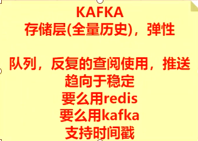 

kafka会裁剪数据


## 索引


 

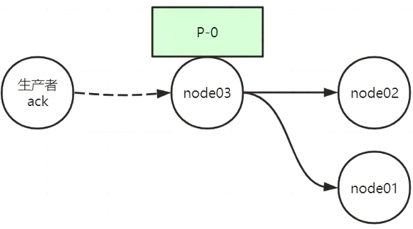 


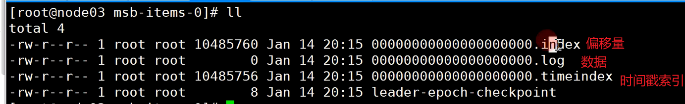

```
lsof -Pnp [port]
```

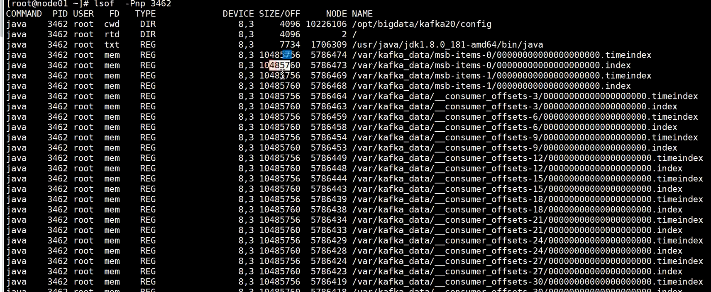 

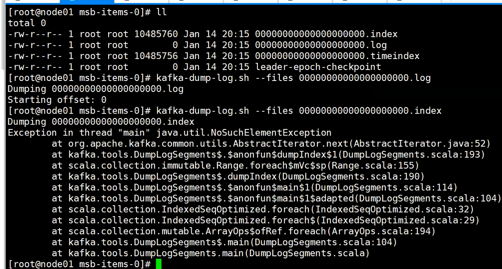 

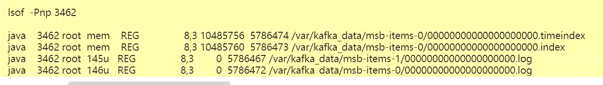 


**为什么.log文件不用mmap?**

mmap或者普通IO的形式，但是log使用了普通io的形式，目的是通用性。数据存入磁盘的可靠性级别。

如果只是用了普通io，那么就只是在app层级调用了io的write，但是这个时候只到达了内核，只到达了pagecache页缓存中，没有到达磁盘，所以这个时候性能快，但是丢失数据。

只有NIO的filechannel，你调用了write() +force() 这个时候才真的写到磁盘中了，这个时候性能是极低的

1、每条都force一下

2、只是write基于内核的刷写机制，靠脏页

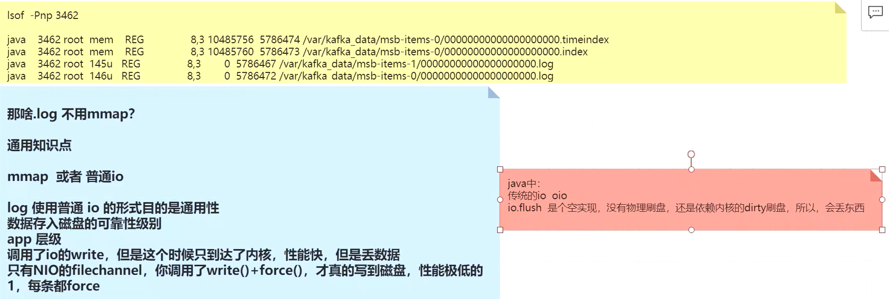 


**下图的定位不是绝对定位**

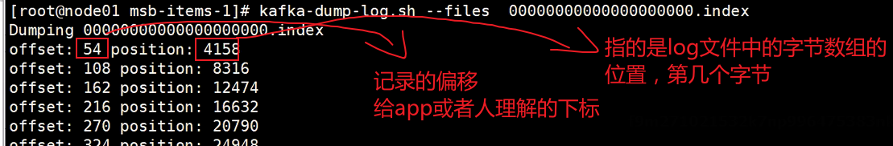 


最终取数据的时候，其实只能通过offset去log文件中取数据，取到offset的时候必须seek，告诉程序从index中拿seek完的offset，然后找到position，才能把数据拿出来	

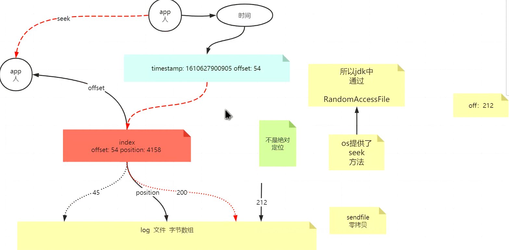 


## 消费者数据可靠性


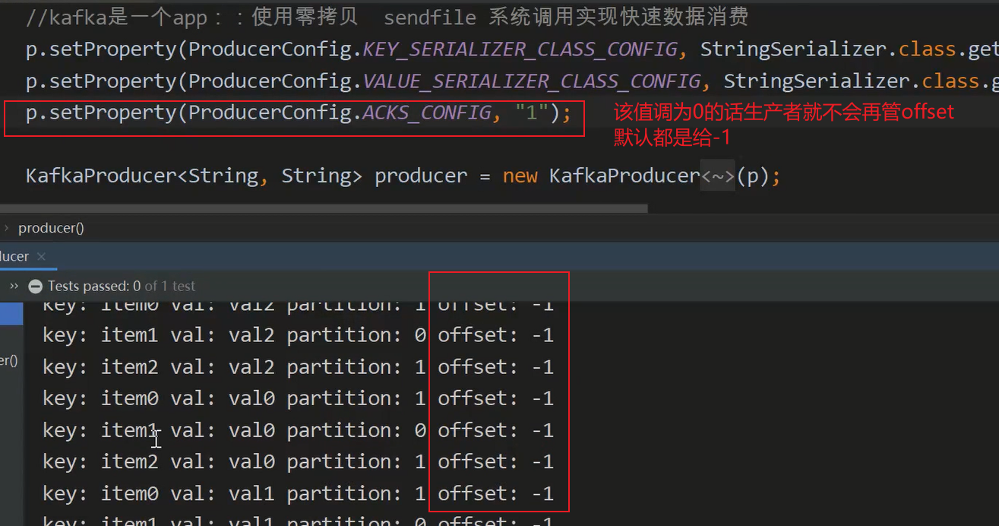


```
#将ip数据指定发送到另一个ip中
route add -host [ip] gw 127.0.0.1

route del -host [ip]
```

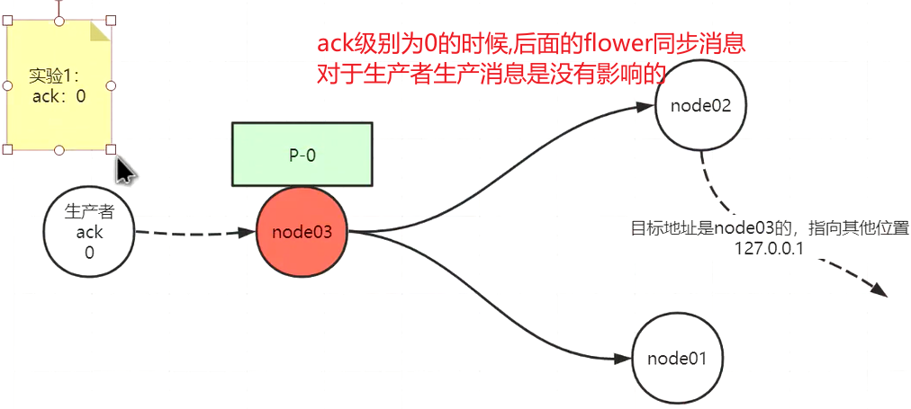

当ACKS_CONFIG为1的时候也不会对生产者生产消息有影响

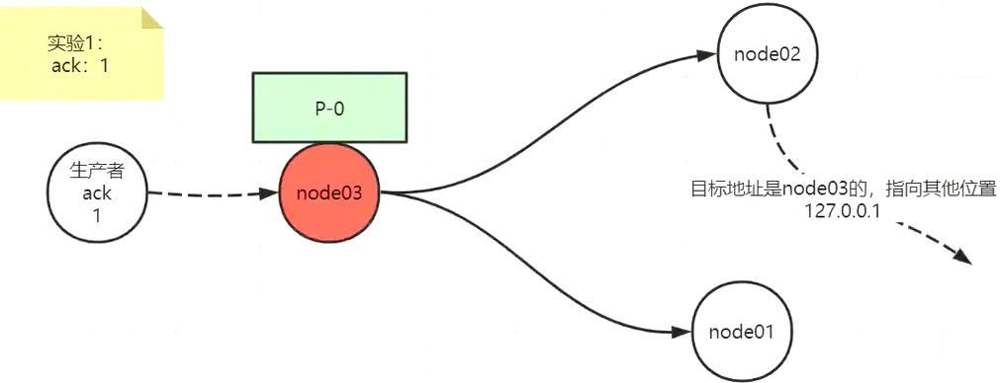 

但是当ACKS_CONFIG设置为-1的时候，当node02节点阻塞没有返回确认消费给node03的时候，生产者生产消息会稍微停顿一下，把node02踢出ISR节点之后就会继续恢复生产消息

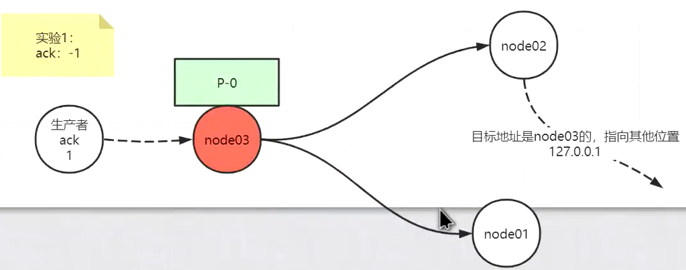


为什么partition1中的2没有踢出出isr集合？


因为实验中只是让node02  到 node03不能ping通，但是没有禁止node02 ping 通node01，所以当leader为1的时候，2跟leader还是能够建立通信的，所以不会踢出


也可以直接杀死node2的进程


## 时间戳之自定义消费数据


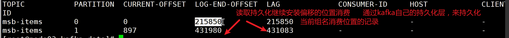 


通过时间戳取数据

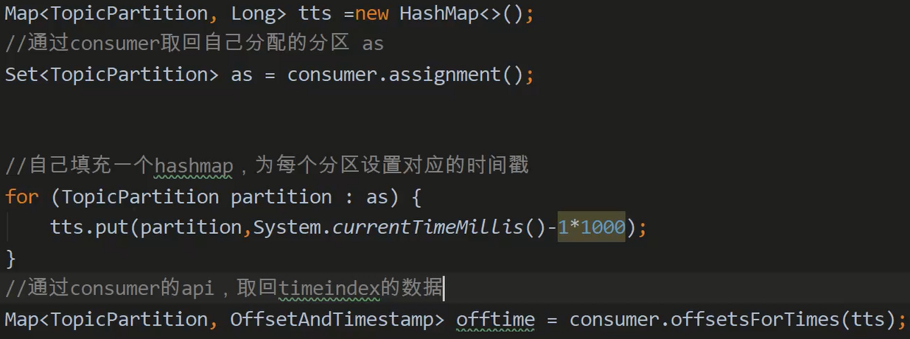 


不去执行poll方法的时候他是不会去建立连接的

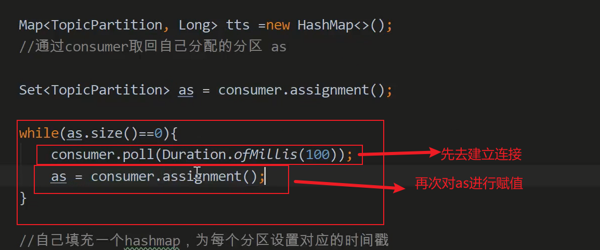 

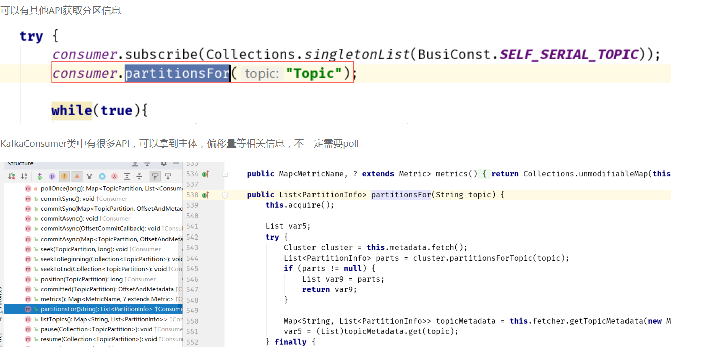


通过下面的代码指定当前时间点1秒前的数据其实是拿不到的，生产者没有推送数据，所以会空指针异常


所以需要指定分区数据中已有的时间戳，才能得到偏移量

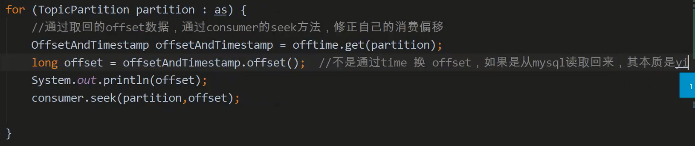 


```java
/**
         * 以下代码是你再未来开发的时候，向通过自定时间点的方式，自定义消费数据位置
         *
         * 其实本质，核心知识是seek方法
         *
         * 举一反三：
         * 1，通过时间换算出offset，再通过seek来自定义偏移
         * 2，如果你自己维护offset持久化~！！！通过seek完成
         *
         */

        Map<TopicPartition, Long> tts =new HashMap<>();
        //通过consumer取回自己分配的分区 as

        Set<TopicPartition> as = consumer.assignment();

        while(as.size()==0){
            consumer.poll(Duration.ofMillis(100));
            as = consumer.assignment();
        }

        //自己填充一个hashmap，为每个分区设置对应的时间戳
        for (TopicPartition partition : as) {
//            tts.put(partition,System.currentTimeMillis()-1*1000);
            tts.put(partition,1610629127300L);
        }
        //通过consumer的api，取回timeindex的数据
        Map<TopicPartition, OffsetAndTimestamp> offtime = consumer.offsetsForTimes(tts);


        for (TopicPartition partition : as) {
            //通过取回的offset数据，通过consumer的seek方法，修正自己的消费偏移
            OffsetAndTimestamp offsetAndTimestamp = offtime.get(partition);
            long offset = offsetAndTimestamp.offset();  //不是通过time 换 offset，如果是从mysql读取回来，其本质是一样的
            System.out.println(offset);
            consumer.seek(partition,offset);

        }
```


上面的代码是在开发的时候，通过自定义时间点的方式，自定义消费数据位置

**其实本质还是要通过seek()方法来实现的**

1、通过时间换算出offset，再通过seek来自定义偏移

2、如果你自己维护offset持久化，通过seek完成


## 生产者的基本架构

**kafka是按照批次推送数据的吗？一次是推一批还是若干批？他的log是一条一条存的吗？**

主要是在配置上下功夫，一个是在代码上不能出现逻辑错误


kafka首先会判断他的key有没有，没有的话就轮询打散到各个分区里面（因为没有key的话数据没有什么关联性）

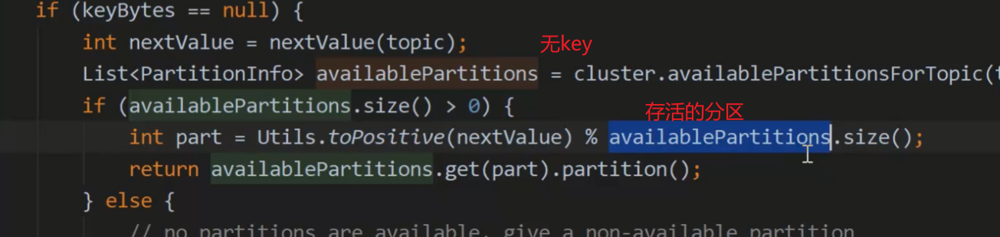 

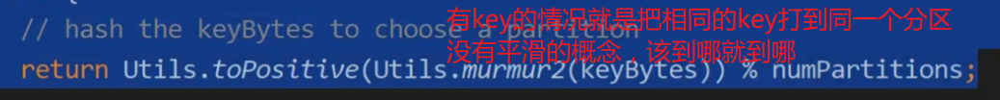 


kafka是否是一条一条推送数据还是一批次的呢

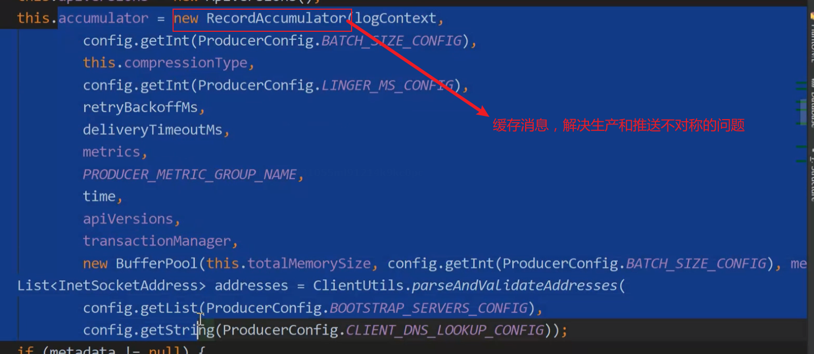 


记录的累加器RecordAccumulator，kafka作为生产者可以每条消息向kafka集群去存，存一条之后再存第二条，但是这样的话推送过程会很慢（其实也可以使用ack，牺牲他的可靠性，要他的吞吐量）。所以你可以通过这个累加器向kafka进行一个积压，积压完的数据按照一个批次给推送出去。

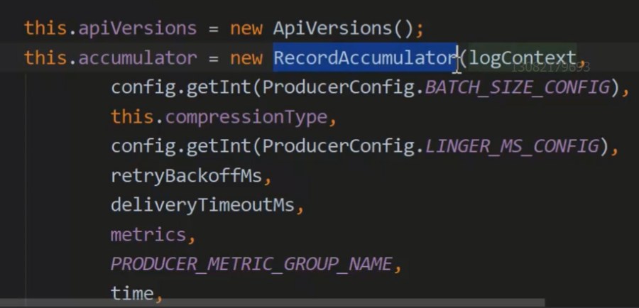 


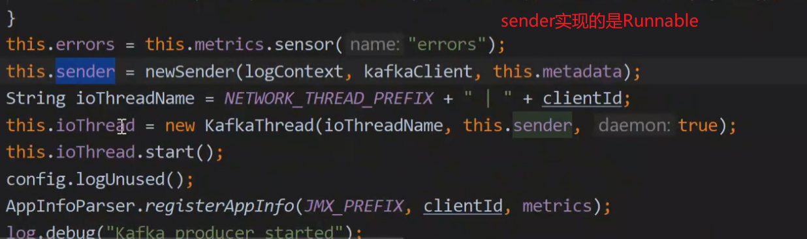 

ioThread.start() 将sender里面的run方法跑起来


一个Producer是可以作用在多个线程的，所以未必单个Producer就一定是有序的。KafkaProducer是一个线程安全的，他可以被多个线程去引用

未来可以有很多的线程来持有KafkaProducer这个对象

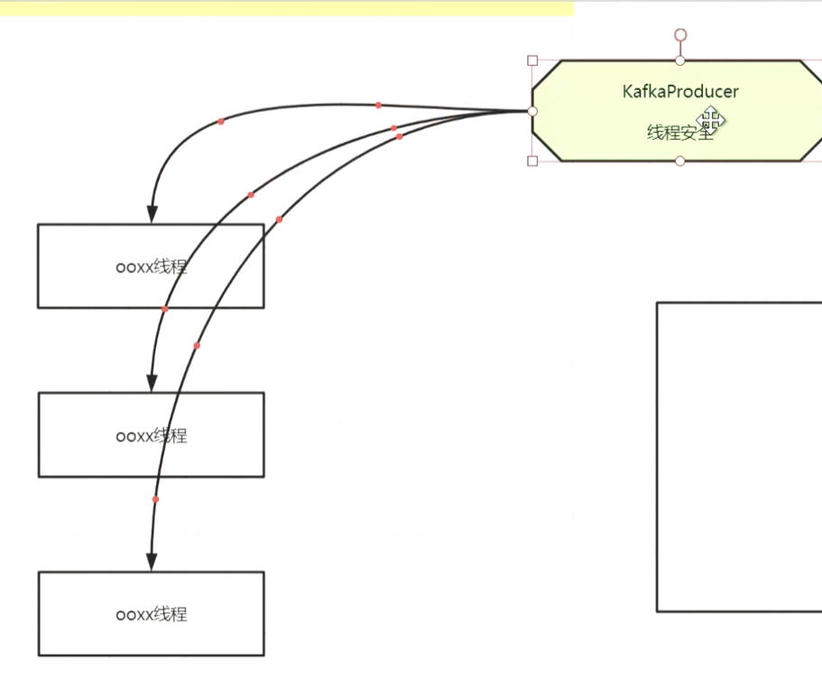 

**KafkaProducer和IOThread自始至终都是一个一比一的关系，但是最终往外面推送数据的时候只有一个Iothread：Sender线程的**


分区内的消息数据是有序的，但是不要太乐观，因为你代码稍加不小心，这个有序跟我们业务的有序是一毛钱关系都没有的

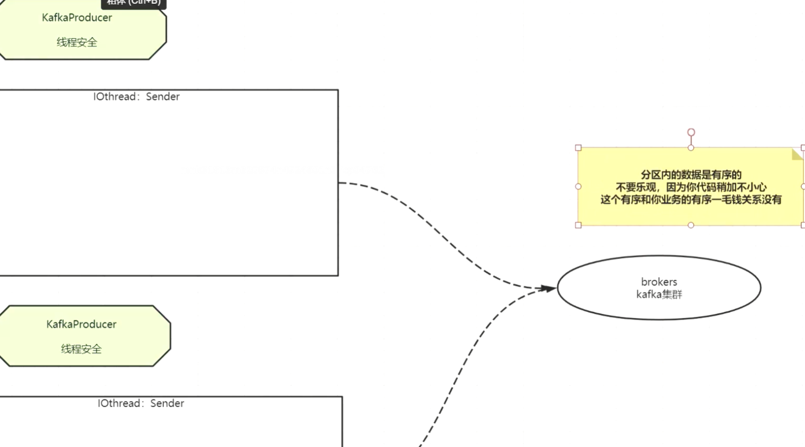 

**Sender**


要保证有序的话一定要做数据的隔离以及后续各种各样的规划


## 阻塞和非阻塞


send方法源码：

先通过拦截器处理我们的记录

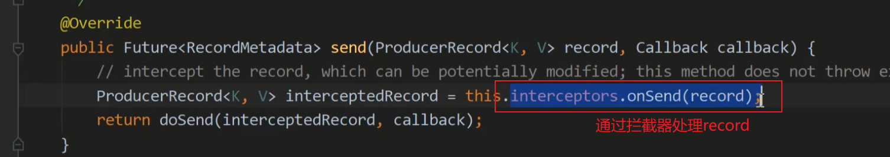 

得到interceptedRecord再进行序列化


send的时候是优先向累加器去append

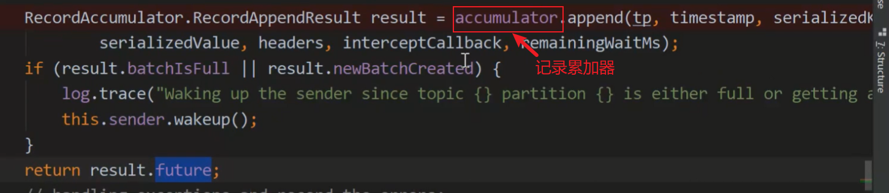 


**RecordAccumulator**

在一个topic下会为每一个partition维护一个双端队列

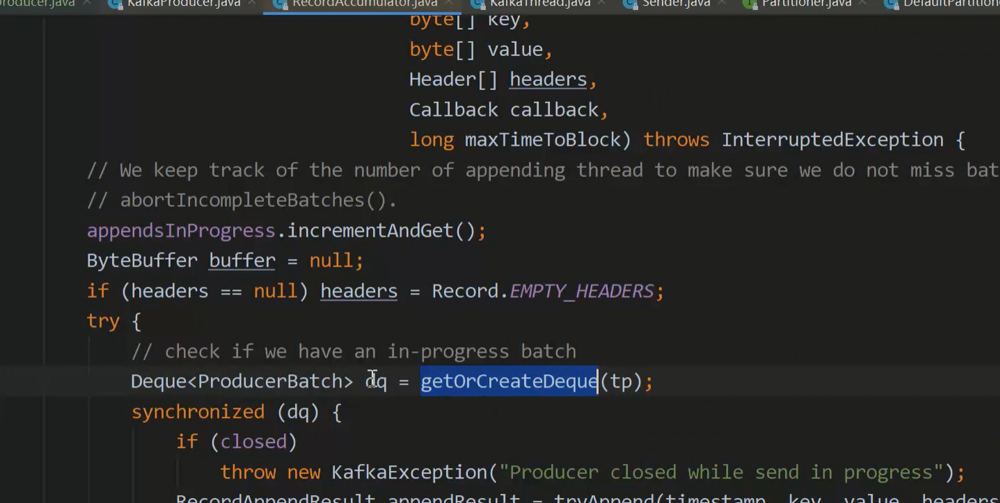


如果多个线程都想向一个topic的一个分区里面打数据的话，他们这些线程虽然都可以拿到send方法，但是send方法栈下到这里一定会有一把锁，所以他们之间是安全的，是排着队写数据的

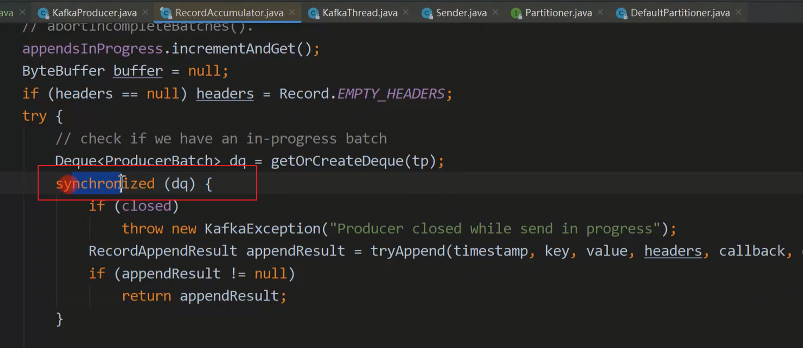


从队列中拿出最后一个ProducerBatch批次

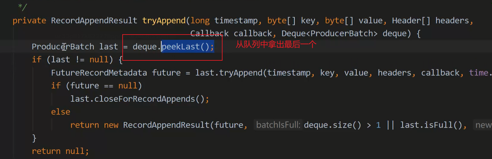 

每一批次里面会有很多的Record


当msg>batch设置的大小时候，他会以msg自己实际大小的批次追加上去成为一个batch(需要申请重新分配)，但是这个大小的批次使用完之后就会被回收掉。

  

BUFFER MEMORY CONFIG默认大小是32M，如果满了的话是不能够再往里面推送数据的。会阻塞

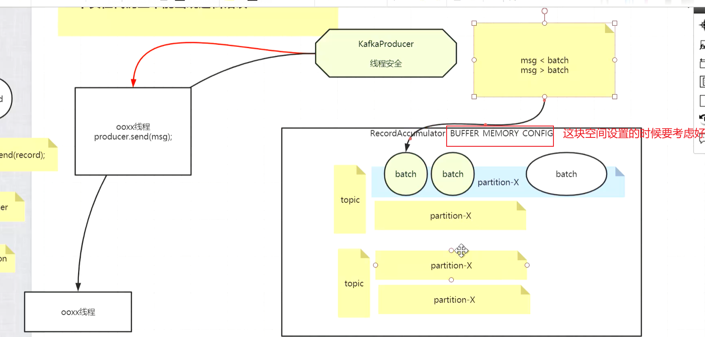 


如果msg大于batch 的话他就会追加一个这个msg实际大小的批次，并且会把这个消息扔到后面去处理

像正常大小的batch（16k）这个批次是放到池里面去管理的，不需要频繁的去申请，像比常规batch大的用完之后就会回收掉了。


**当我们设置批次的时候要尽量保证batch能够兜住数据，要多使用系统所管理的池，而少用系统生成的新的空间。**

**要把自己想成一个msg，走一遍这个流程，看看体积是多大**

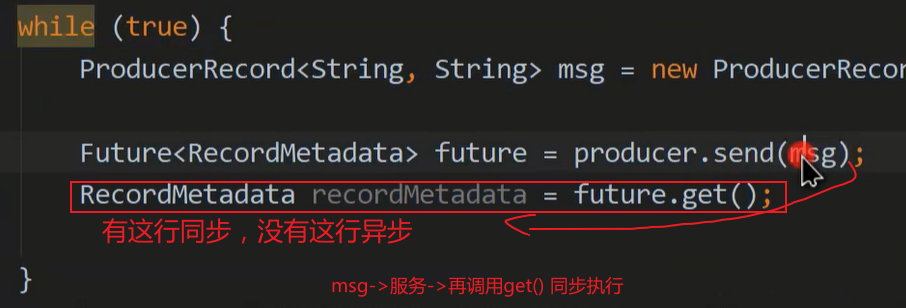 


LINGER MS CONFIG

 

当我们使用send去推送消息的时候会分为两种情况

1、阻塞

LINGER MS CONFIG 0：不需要去计时等什么东西，IOSender拿过来之后就直接发出去了

​	**所有优势的东西出现不了，一条一条的**

2、非阻塞

LINGER MS CONFIG 30：需要在30ms这个时间间隔到达之后才会发出去

​	**会牵扯到生产和IO速度不对称的时候**


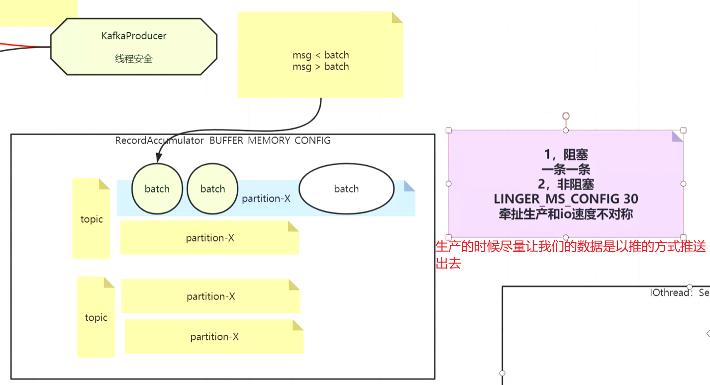 


## producer的参数调整 


```java
BATCH_SIZE_CONFIG //默认16k要调整，分析我们的msg的大小，尽量分批次触发，减少内存碎片和系统调用的复杂度
MAX_BLOCK_MS_CONFIG //60秒  阻塞
```

 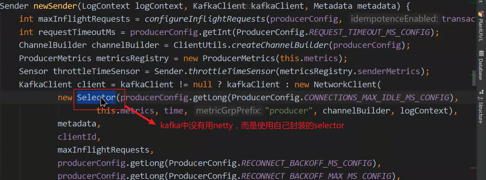

**kafka自己封装了Selector实现，没有去实现netty**


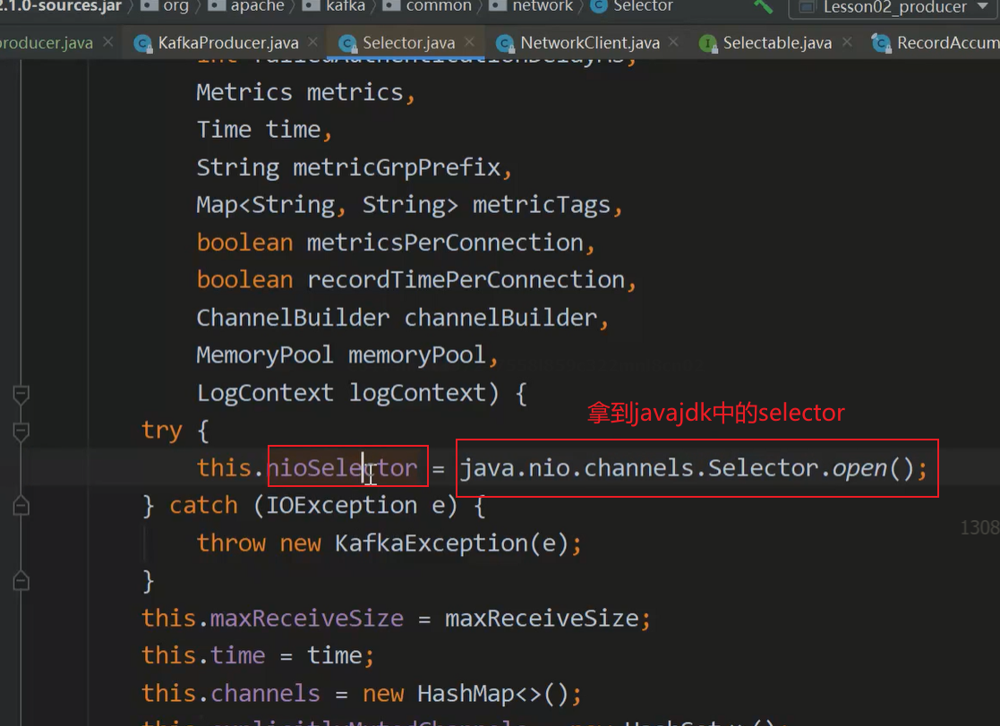 


一个主题topic下的分区其实都是归属于某一个node节点去维护的，所以现在期望的就是把数据发送给broker的进程去处理的

通过分区去拿节点


这个包的大小默认是1M   MAX_REQUEST_SIZE_CONFIG，去拿到关于一个分区尽量多的batch数据

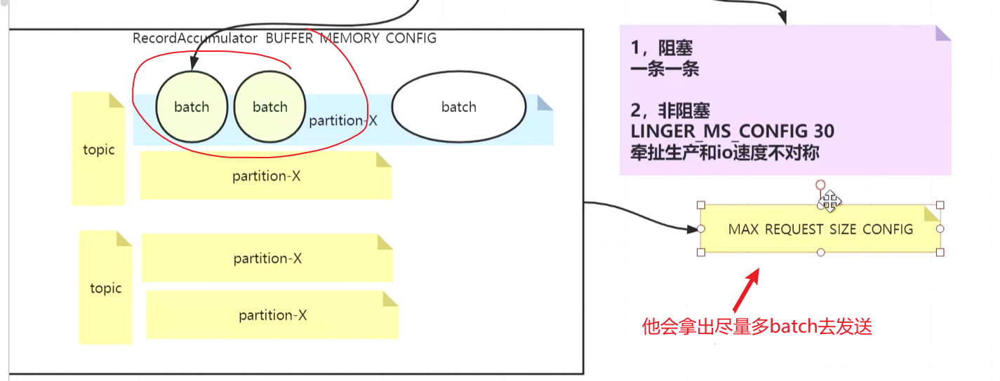

打包的过程


一开始send方法是往里面扔数据，另外一个异步的sender里面会有一个run方法，run方法里面要干的第一件事就是打包。


```java
inFlightRequests

MAX_IN_FLIGHT_REQUEST_PER_CONNECTION  5
//上面的参数是在producer发了5次，但是kafka还没有返回，那么第六个就不能发了
```

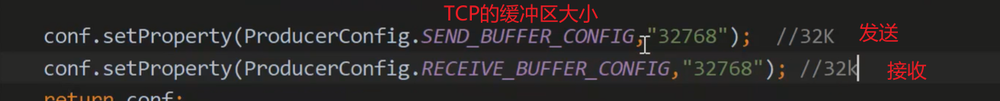 

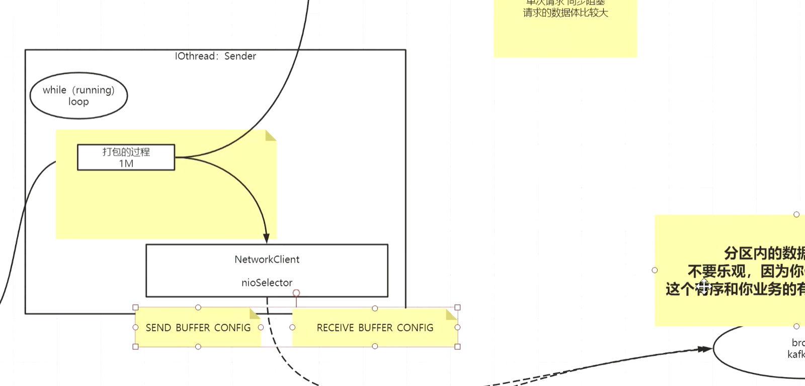 

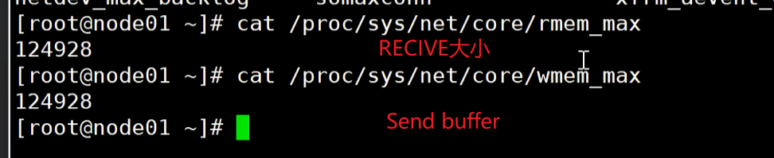

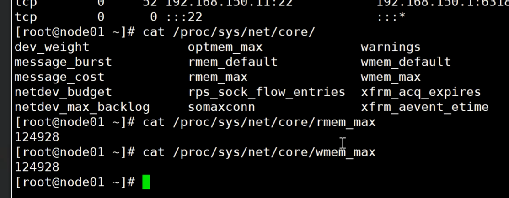 


## 源码剖析 =====33节课 没看


## IO前置知识介绍

**先宽后深**

当代码发送数据之前要先完成元数据的更新的，所以要先进入下面的方法

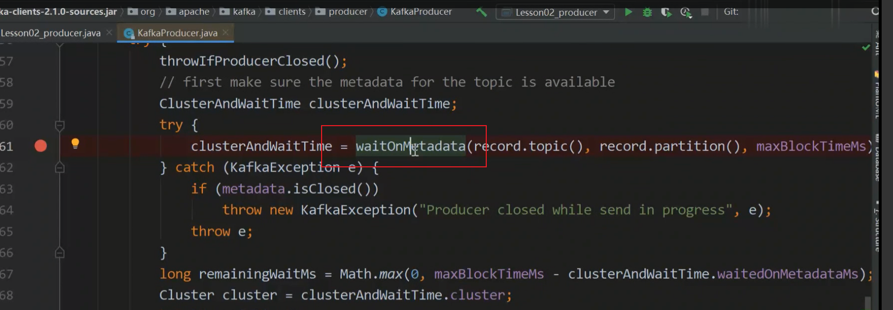


在producer第一次启动的时候会有一次的硬更新，发送数据的时候会更新metadata，这个时候会对着我们的sender这个线程做一次唤醒。wakeup()

 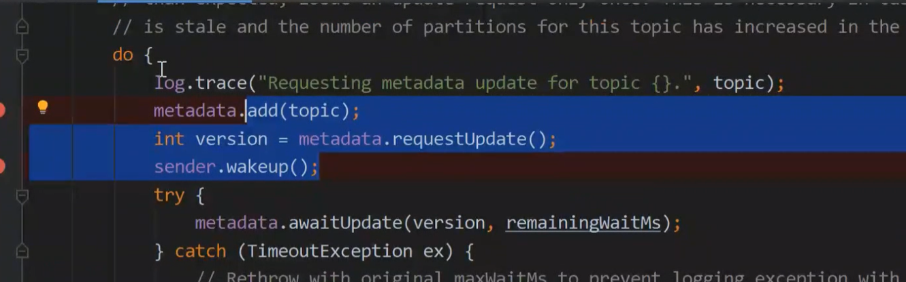


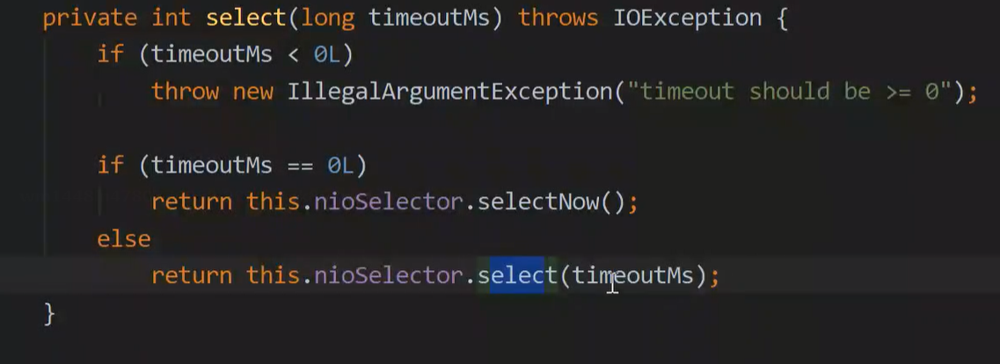 

第一步更新元数据，调用poll，pool里面会调用java自己的NIO里面的select

这些时间会通过对应的handler去处理


 


## 外界如何通信和内部数据写磁盘

1、外界如何通信

提供了一个socketServer模型


KafkaApis匹配kafka消息是哪种数据类型的


RequestChannel

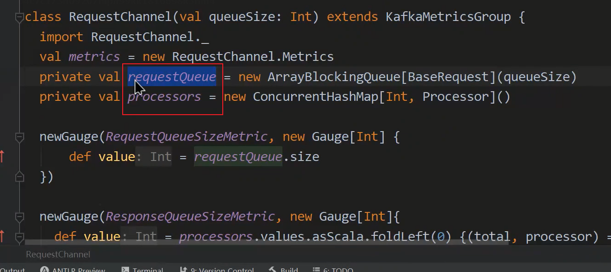 


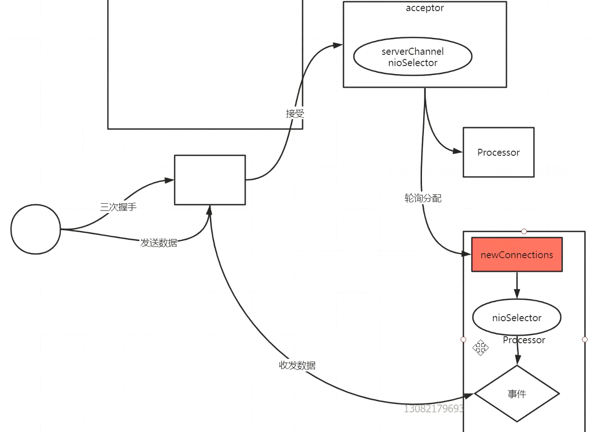 

1、输入read，常注册

2、输出write，有数据在注册


