## 前瞻

常识：

磁盘速度：

1.寻址:ms

2.带宽:G/M

内存:

1.寻址:ns

2.带宽：

秒>毫秒>微秒>纳秒  磁盘比内存在寻址上慢了10W倍

I/O buffer：成本问题

磁盘与磁道，扇区，一扇区：512byte会带来一个成本变大：索引

4K 操作系统无论你读多少，都是最少4K从磁盘拿


关系型数据库建表：必须给出schema

类型：字节宽度

存：更倾向于行级存储（好处：如果有schema和宽度了那么这一行假设有10个字段，每个字段都是4都话那就是40个，如果这10个字段只有一个字段有值，那么剩下的那些都会占空。占位的好处就是 如果下次再向其他字段补充的时候就不用去移动数据，直接拿新数据去浮现）

内存是速度最快的地方，所以在内存中准备了一个B+树

磁盘中存放的都是B+树的叶子数据，内存中只存树干，因为如果都把叶子和索引放到内存中的话内存是放不下的


**数据库中如果表越来越大的话性能一定会变低？查询速度呢？**

如果表有索引增删改变慢

1.一个或少量查询依然很快

2.并发大的时候会受硬盘带宽影响速度(因为索引查询是一条一条的往内存送的，所以会有其他的查询在等待上一个查询)

数据在磁盘和内存体积不一样

#### 缓存的概念被提出

memcached、redis


2个基础设施

1、冯诺依曼体系的硬件

2、以太网、tcp/ip的网络


https://db-engines.com/en

架构师：

技术选型、技术对比


```
Redis 是一个开源（BSD许可）的，内存中的数据结构存储系统，它可以用作数据库、缓存和消息中间件。 它支持多种类型的数据结构，如 字符串（strings）， 散列（hashes）， 列表（lists）， 集合（sets）， 有序集合（sorted sets） 与范围查询， bitmaps， hyperloglogs 和 地理空间（geospatial） 索引半径查询。 Redis 内置了 复制（replication），LUA脚本（Lua scripting）， LRU驱动事件（LRU eviction），事务（transactions） 和不同级别的 磁盘持久化（persistence）， 并通过 Redis哨兵（Sentinel）和自动 分区（Cluster）提供高可用性（high availability）。

redis value支持的类型有，string、hashes、lists、sets、sorted sets  
```


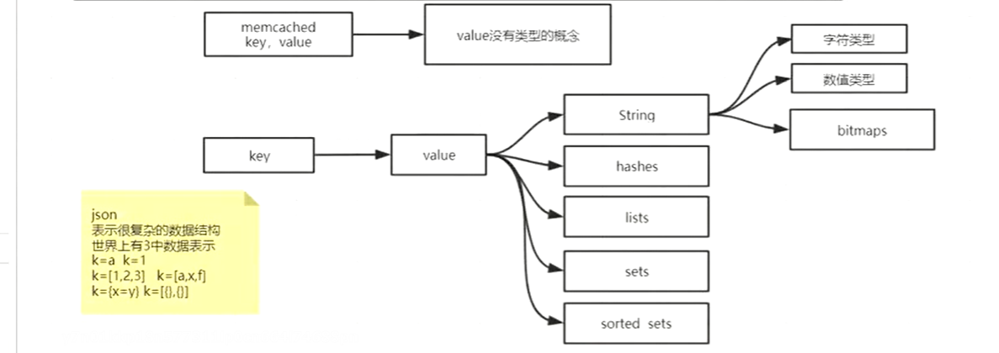 


memcached也是key-value的数据存储系统，但是他渐渐被redis取代了，因为他的value没有类型的概念

```
json可以表示出很多很复杂的数据结构
世界上有3种数据表示
k=a   k=1
k=[1,2,3] k=[z,x,f]
k={x=u} k=[{},{},{}]
```


其实value的类型不是那么重要，但是在业务场景中如果没有value的类型区份，客户端需要什么东西服务端可能需要将所有数据返回给客户端，客户端也要你的实现代码去解码


**计算是向数据移动的**

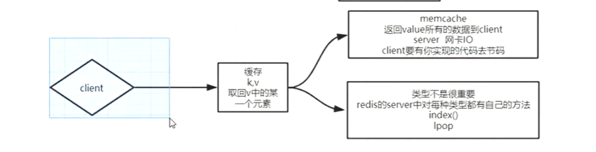 


### redis安装

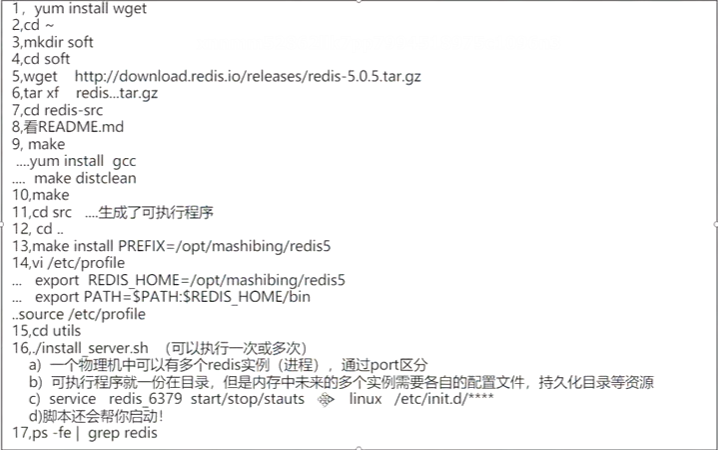 


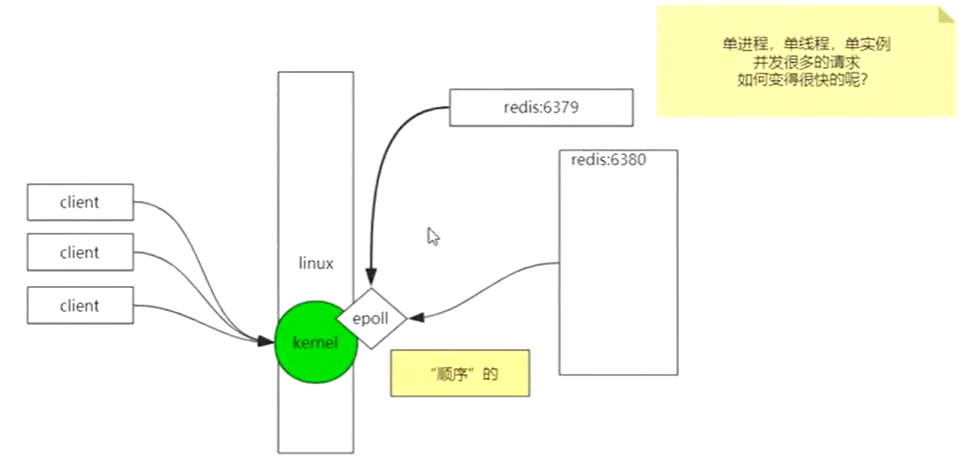 


### *epoll介绍


BIO时期

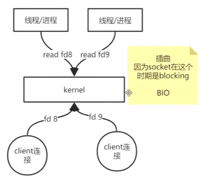 

早期的IO是阻塞的，是一个BIO时期


后续内核就发生了跃迁


同步非阻塞IO

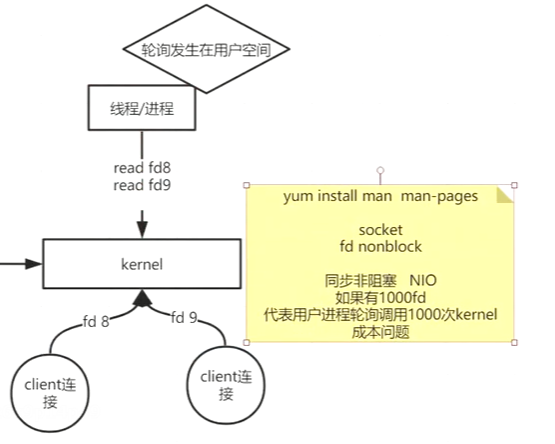 


 


nfds：fd的数量    *readfds：想读的fd结构指针  *writefds：想写的fd结构指针

exceptfds：异常   timeout：轮循时间

 

```
select()和pselect()允许程序监视多个文件描述符，直到其中一个或多个文件描述符“准备好”进行某种I/0操作(例如，可能的输入)。如果一个文件描述符可以在不阻塞的情况下执行相应的I/0操作(例如，读(2))，则该文件描述符被认为是就绪的。
```

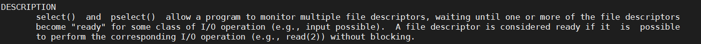 

 **统一把1000个fd传给select，内核再去监控这些东西，文件描述符准备完成之后再返回给进程，线程在拿着返回的fd调用read 传进去**


批量非阻塞（JVM c语言调用）  问题：用户空间和内核空间两个空间拷贝来拷贝去的操作导致文件描述符成为累赘

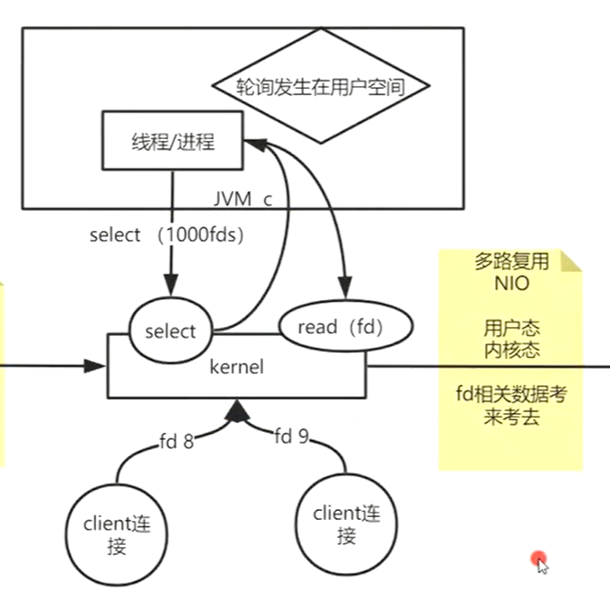 


​	

#### 用到了mmap


用户空间和内核空间合并出了一个空间

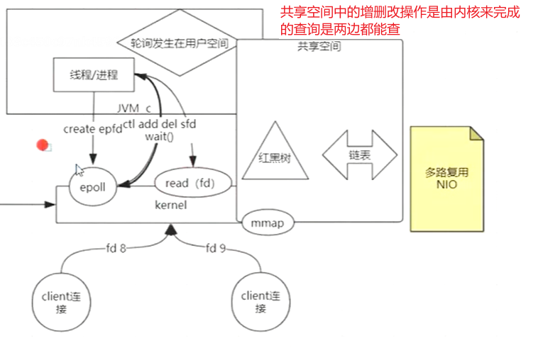 

 有了共享空间之后，进程就不需要再单独维护进程中的文件描述符了，直接放到共享空间。内核拿到文件描述符到达的数据放到链表里面。 


#### 零拷贝

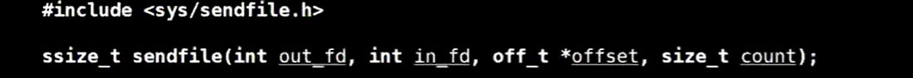


**原来的方式：**

网卡或文件与内核都会形成IO，例：文件数据先到内核缓冲区，再由read调用拷贝到用户空间，再由write拷贝回来，再发出去

下图是一个需要拷贝文件描述符的过程

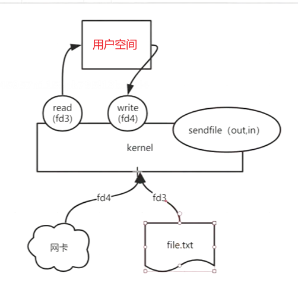 


**原先需要将数据线读到用户空间，用户空间再调用写write到内核空间而，有了sendfile之后直接调用sendfile，由内核拿到file后放到缓冲区，然后直接发出去**

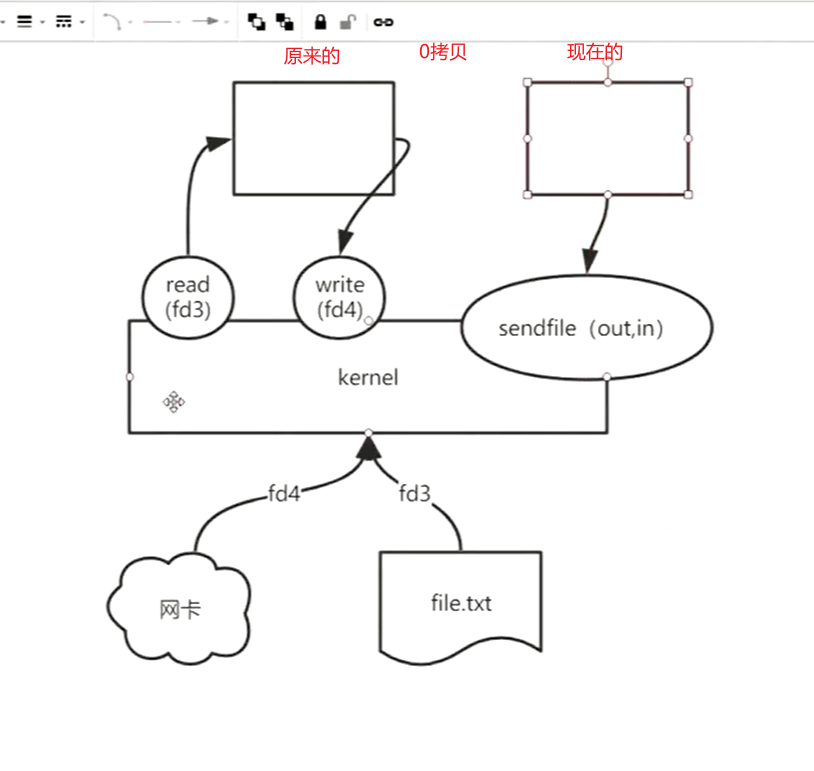 


**sendfile+mmap=kafka**


**kafka会有网卡过来的数据，将数据写到kafka的时候就要读kafka(kafka是基于JVM的)，kafka里面会使用mmap，mmap可以挂载到我们的文件，又因为mmap做的空间和内核是共享的，所以kafka通过mmap看到的内存空间往里写了东西之后其实内核也能看到他，直接触发内核(减少系统调用，减少数据拷贝)也相当于是零拷贝。但是零拷贝不是两个文件名和服务之间的，是用户空间到内存空间减少拷贝的过程， 所直接将文件写入。还需要消费者去读kafka写入的文件，就是走的零拷贝sendfile了，sendfile的输入来自于文件，输出来自于消费者。**

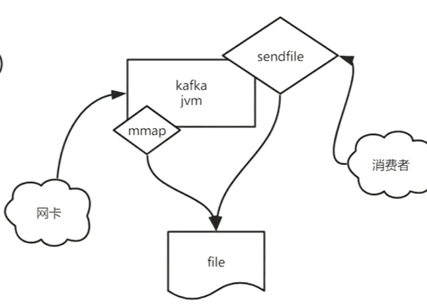 

消费者拿到offset来拿数据也是走的sendfile 零拷贝

 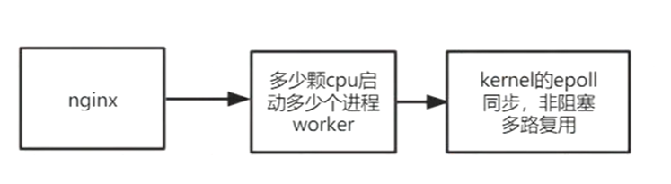 


**BIO：每次连接会抛出一个线程**


JVM一个线程的成本   1MB

1、线程多了调度成本高cpu浪费

2、内存成本


**NIO多路复用，降低用户态和内核态之间的切换**


# epoll和select的区别

当需要读两个以上的IO时候，如果使用阻塞式的IO，那么可能长时间的阻塞在一个描述符上面，另外的描述符虽然有数据但是不能读出来，这样实时性不能满足要求，解决方案有以下几种：

1、使用多进程或者多线程，但是这种方法会造成程序的复杂性，而且对于进程与线程的维护也是要很多的开销（Apache服务器用的是子进程的方式，优点可以隔离用户）

2、用一个进程，但是使用非阻塞的IO读取数据，当一个IO不可读的时候立刻返回，检查下一个是否可读，这种形式的循环为轮询（polling），这种方法比较浪费CPU的时间，因为大多数时间是不可读的，但是仍然会花费时间不断反复执行read系统的调用。

3、异步IO（asynchronous IO），当一个描述符准备好的时候用一个信号告诉进程，但是由于信号个数有限，多个描述符不适用。

4、一种较好的方式为IO多路复用，先构造一张有关描述符的列表，然后调用一个函数，直到这个文件描述符中的一个准备好时才返回，返回时告诉进程哪些IO就绪。select和epoll这两个机制都是基于多路复用IO机制的解决方案。

区别：

1、select的句柄数目受限制，select最多只能同时监听1024个fd。而epoll没有，他的限制是最大的打开文件句柄数目

2、epoll的最大好处是不会随着fd的数据增长而降低效率，在select中采用轮询处理，其中的数据结构类似于一个数组的数据结构，而epoll是维护一个队列，直接看队列是不是空的就可以了。epoll只会对“活跃”的socket进行操作，这是因为在内核实现中epoll是根据每个fd上面的callback函数实现的。

3、使用mmap加速内核与用户空间的消息传递。无论是select、poll、还是epoll都需要内核把fd消息通知给用户控件，为了避免不必要的内存拷贝就很重要，在这点上，epoll是通过内核于用户控件mmap同一块内存实现的。


## Redis运行原理


redis是单进程、单线程来处理用户的请求

DEL ：删除key

EXISTS ：key是否存在

EXPIRE ：key的存活时间

keys：筛选key

MOVE：移动

OBJECT：查询key的定义

PERSIST：关于可以的

TYPE:类型


FLUSHDB：清库命令


value的类型

String(byte)->1、字符串;2、数值;3、bitmap;


NX：在设置值的时候如果加上了NX的话，只有当这个key不存在的时候这个值才能设置成功(只能新建)

XX：只有存在key的时候才设置成功(只能更新)

使用场景

例如：分布式锁的时候，一堆人想操作这个文件


**value有正反向索引的概念：**

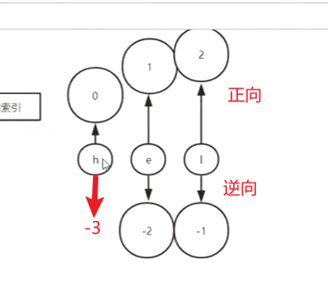 


GETRANGE  key  start  end 通过指定key下标起始结束位获取value

SETBIT key offset value   通过指定key的下标 覆盖数值


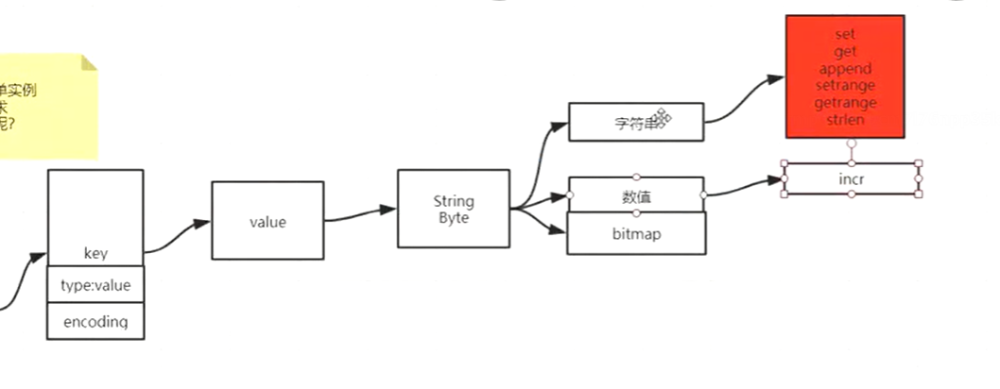 

ENCODING

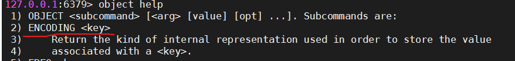 

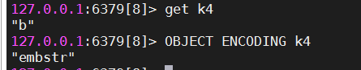 


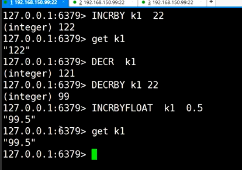 


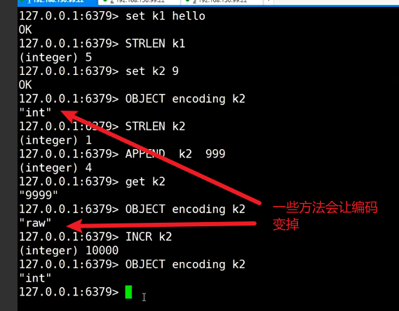 


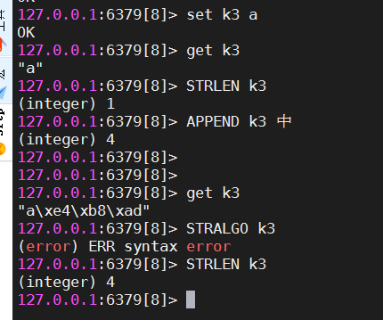 


### 二进制安全(字节流、字符流)

​	在redis进程与外界交互的时候，他从外界的socket中只拿字节流并不拿字符流，因为redis只存字节不从字节取东西，按照某一编码集转换。就是双方的客户端有统一的编解码数据就不会被破坏。

使用redis的时候一定要在用户端沟通好数据的编码和解码，redis里面是没有编码类型的。


GETSET

设置一个新值并把原来的旧值返回(实用性不高，但是可以减少成本，减少了一次IO通信)

summary: Set the string value of a key and return its old value


### bitmap


SETBIT

offset:是二进制位的偏移量，而不是字节数组

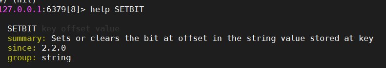 


字符串：ascii

其他一般叫做扩展字符集

扩展：其他字符集不再对ASCII重编码

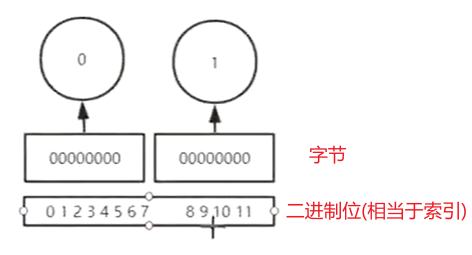 


**BITPOS key bit [start] [end]**

 key值

bit：0或1

start和end指的是字节的索引  (下图中的圆)

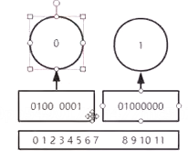 

bitmap的方法

**SETBIT**

**BITPOS**

**BITCOUNT**

**BITOP**


**例子1：统计用户的登录天数，且窗口随机**

一年算400天

​                                              方法      key   天   次

```
127.0.0.1:6379[8]> SETBIT sean 1 1
0
127.0.0.1:6379[8]> get sean
@
127.0.0.1:6379[8]> SETBIT sean 7 1
0
127.0.0.1:6379[8]> SETBIT sean 364 1
0
127.0.0.1:6379[8]> STRLEN sean
46
127.0.0.1:6379[8]> BITCOUNT sean -2 -1
1
127.0.0.1:6379[8]> SETBIT sean 365 1
0
#查他最后两周登录了几次
127.0.0.1:6379[8]> BITCOUNT sean -2 -1
2
```


**例子2：京东，618做活动：凡是登录消费之后就送礼**

**需求：大库备货多少礼物**

**假设京东有2亿用户**

**用户分为：僵尸用户、冷热用户、忠实用户**

**主要是要做活跃用户统计，随机窗口**

比如说   1号-3号     连续登录要去重


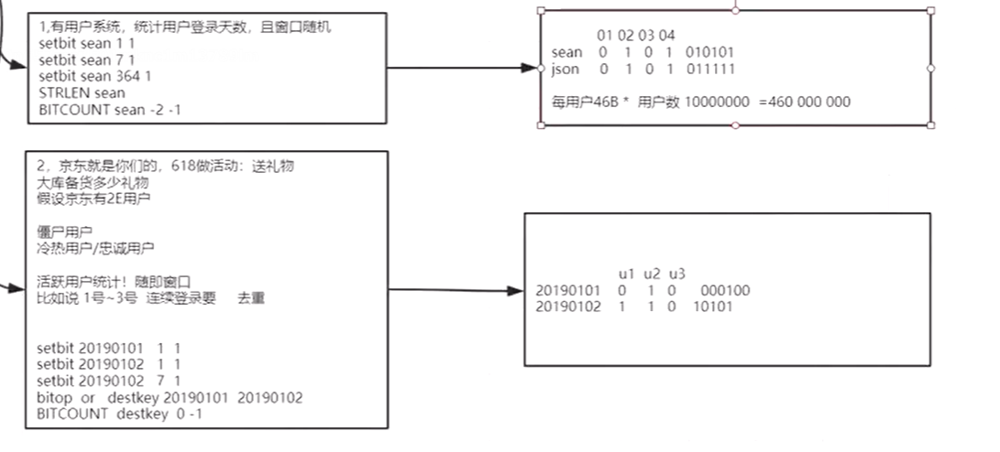


**了解** 

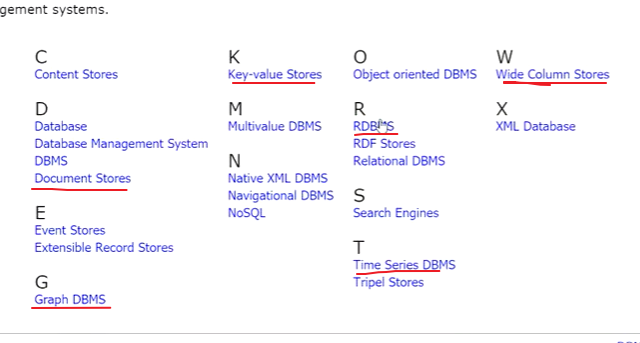 


## redis的list，set，hash，sorted_set，skiplist

redis的key中是有两个元素,分别是head和tail 分别指向value的头尾


**List**

- 栈，同向命令
- 队列，反向命令
- 数组
- 阻塞单播队列：先进先出(FIFO)

```
LREM key count element
#他的count是有正数之分的，如果是正数那就从头开始算，如果负数那就从尾开始算
summary: Remove elements from a list
```

**set**

无序、去重

集合操作用得相当多

产生随机事件

```
SRANDMEMBER key count
正数：取出一个去重的结果集(不能超过已有集合)
负数：有可能取出一个带重复的结果集，一定满足你要的数量
如果为0：不返回

场景：
抽奖
10个奖品
用户：小于10或者大于10
中奖：重复和不重复


解决家庭争斗
```


阻塞队列

BLPOP  key   阻塞时间

**hash**

```
map(k - v)
可以对field数值进行计算
场景：点赞、收藏、详情页......
```


**sorted set**

```
例1:
苹果、香蕉、鸭梨
想让他们按什么排序？
名称
含糖量
大小
价格
喜欢的人数
```

**物理内存左小右大**

**不随命令发生变化**

**zrang**

**zrevang**


**集合操作：**

**并集、交集->权重/聚合指令**


**排序是怎么实现的**

**增删改查的速度？**

**skip list(跳跃表)**

**每个元素插入的时候都会随机造层：牺牲存储空间来换未来的查询速度**

元素如果在第一层找到插入的位置，并且需要造层，则会向左找到上层的连接点 然后放到该连接点上层的右边，如果还需要再造层，就再向左查(需要重新查资料去了解**跳表**)


## Redis消息订阅、pipeline、事务、modules、布隆过滤器、缓存LRU

### 管道

### 订阅

```shell
客户端1
PUBLISH ooxx hello
客户端2
SUBSCRIBE ooxx
Reading messages... (press Ctrl-C to quit)
1) "subscribe"
2) "ooxx"
3) (integer) 1
从上面看我们没有看到客户端1发送的hello消息，得出：消费端建立监听以后别的管道发送的消息才能看得到
```


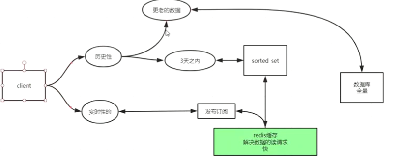 


如果要实现聊天记录的实时更新、能够查看近期的数据、能够查看老的数据，那么客户端发送一次消息需要向三个地方去加消息

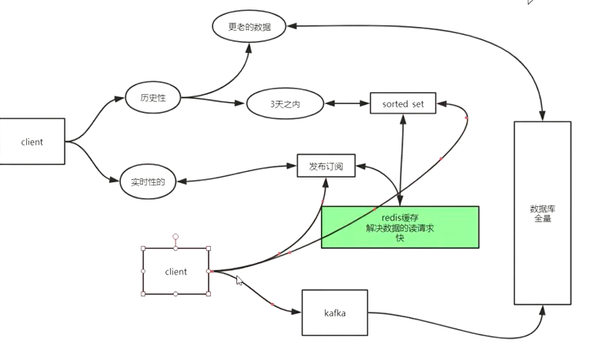 

如果客户端在三个环节中某一个环节断了之后处理方式可以用下图的方法，客户端将消息publish到一个redis中

另外一个近期消息的redis 去读他，再来一个微服务去取，将该数据交给kafka存入持久化存储当中。

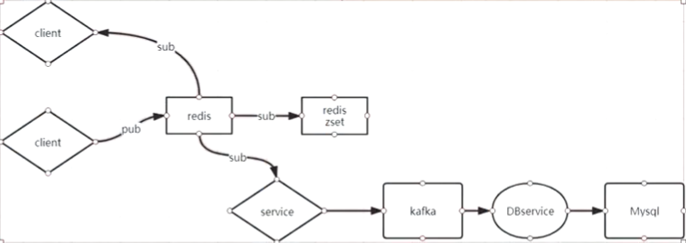 


### 事务

按照EXEC谁先到达的顺序来执行事务和命令

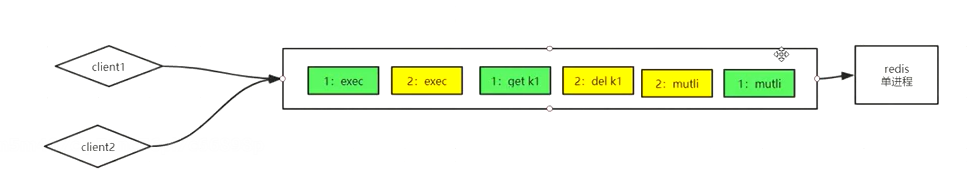 

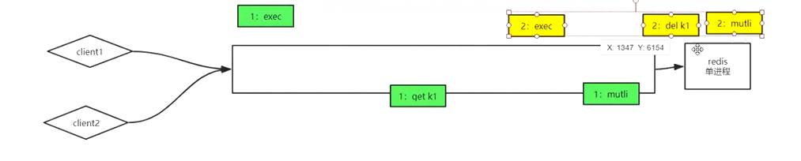 

​	


事务中为了规避报错异常，可以通过watch去监控这个key，如果这个key在他前面被改变了，那么他后续的执行命令将不会被执行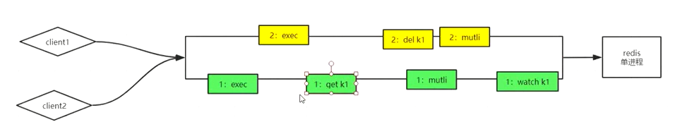


### 	布隆过滤器安装启动

多了个布隆过滤器使我们的redis多了一些操作命令

```
#启动redis指定配置文件，并且挂载到redis布隆库中
redis-server --loadmodule ./redisbloom.so /etc/redis/6379.conf 
```


### 缓存穿透

```
规避一些无用搜索。
例如：淘宝搜索一些东西如果在缓存中没有，那么就会去持久化数据库中查看，这样子就会造出数据库中的无用搜索，所以需要使用缓存穿透来解决这个问题。
```


### 布隆过滤器

**概率解决问题，不可能百分之百阻挡用户的恶意请求。阻挡概率会低于1%**

1. 你有啥
2. 有的向bitmap中标记
3. 请求的可能被误标记
4. 但是，一定概率会大量减少放行：穿透
5. 而且，成本很低

cuckoo布谷鸟过滤器


 


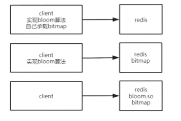 

### 穿透不了怎么办？

1. 穿透了，不存在
2. client,增加redis中的key，value标记他不存在(下次其他client拿着这个key去查的时候就可以直接命中这个key，然后他查出来的value标记为不存在，这样就不需要去走布隆过滤器了，客户端直接就可以处理了)


1. 数据库增加了元素
2. 完成元素对布隆bloom 的添加


### redis作为数据库/缓存的区别

1. 缓存数据其实"不重要"，缓存不是全量数据
2. 缓存应该随着访问变化(热数据)


redis作为缓存里面的数据是随着业务变化的，只保留热数据，因为内存大小是有限的，内存大小就是瓶颈


### 将redis当做使用LRU算法的缓存来使用

```
业务逻辑---->key的有效期
1.时间有效期会随着访问延长？(不会) 
设置key的时候添加过期时间
 SET key value EX seconds
按秒设置
EXPIRE key seconds
按时间设置
EXPIREAT KEY SECONDS
2.如果发生了写，redis就会直接剔除过期时间(没有延续时间这个概念)
3.倒计时，且redis不能延长
4.定时
5.过期的方式其实都需要业务方自己补全
```

1. LRU：多久没碰过
2. LFU：碰了多少次


```
业务运转---->内存是有限的，随着访问的变化，应该淘汰掉冷数据
我们可以通过在配置文件中设置内存大小来给redis多大的内存空间
内存要给多大呢？
maxmemory <bytes>
1.noeviction:返回错误当内存限制达到并且客户端尝试执行会让更多内存被使用的命令（大部分的写入指令，但DEL和几个例外）
2.allkeys-lru: 尝试回收最少使用的键（LRU），使得新添加的数据有空间存放。
3.volatile-lru: 尝试回收最少使用的键（LRU），但仅限于在过期集合的键,使得新添加的数据有空间存放。
4.allkeys-random: 回收随机的键使得新添加的数据有空间存放。
5.volatile-random: 回收随机的键使得新添加的数据有空间存放，但仅限于在过期集合的键。
6.volatile-ttl: 回收在过期集合的键，并且优先回收存活时间（TTL）较短的键,使得新添加的数据有空间存放。

maxmemory-policy noeviction
```


### 过期

```
过期判定原理
1.被动的访问时判定
2.周期轮循判定(增量)
http://www.redis.cn/commands/expire.html
具体就是Redis每秒10次做的事情：
1.测试随机的20个keys进行相关过期检测。
2.删除所有已经过期的keys。
3.如果有多于25%的keys过期，重复步奏1.
```

**目的：稍微牺牲下内存，但是保住了redis的性能**


缓存常见问题：

1. 缓存的**击穿**
2. 缓存的**雪崩**
3. 缓存的**穿透**
4. 缓存**一致性(双写)**


## redis的持久化RDB、fork、copyonwrite、AOF、RDB&AOF混合使用


### 回顾和非阻塞redis实现数据落地

```
缓存：数据可以丢 (缓存追求的是急速)

数据库：数据绝对不能丢 (速度+持久性)
存储层：1、快照/副本(RDB)；2、日志(AOF)；

内存中的东西，掉电易失
```

**RDB：时点性**

1、阻塞：redis服务对外停止服务，开始备份文件(不适用)

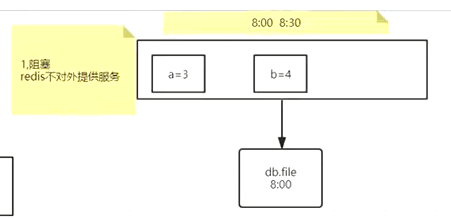 


2、非阻塞：redis进程继续对外提供服务，将数据落地

问题：如果数据在落地的时候前面已经落地的数据突然发生了改变，那么如果后续再把数据恢复到库中的时候，前面的数据就会被覆盖为最原始的数据；

例如：a=3  备份完之后，改为了a=8,把落地文件还原，之后a就变为3了

解决：fork


### 持久化(单机自己)

### 主从复制


## Linux系统知识

### 管道：ls -l /etc | more

1. 衔接前一个命令的输出，作为后一个命令的输入
2. 管道会触发、创建【子进程】

```
echo $$ | more
echo $BASHPID 
$$优先级高于|

例子:
[root@localhost ~]# echo $$
15060
[root@localhost ~]# echo $$ | more
15060
[root@localhost ~]# echo $$
15060
[root@localhost ~]# echo $$ | more
15060
[root@localhost ~]# echo $BASHPID
15060
[root@localhost ~]# echo $BASHPID | more
15266
[root@localhost ~]# echo $BASHPID | more

$$的进程pid一直没变，而$BASHPID一直都在变化
是因为$$的优先级高于|  在此之前先开启了一个$$把他换成了15060了，然后建立管道开启进程。
$取一个普通变量的时候他的优先级是低于管道的

$BASHPID是先开启了管道 然后再建立进程的
```


### 父子进程相关问题


使用linux的时候是有一个父子进程的概念。


父进程的数据子进程可不可以看得到？

常规思想，进程的确是数据隔离的


父进程其实可以让子进程看到数据

子进程修改，父进程偷窥

```
#!/bin/bash

echo $$
echo $num
num=999
echo num:$num

sleep 20

echo $num
```

**在linux当中，环境变量，子进程的修改不会破坏父进程**

**父进程的修改也不会破坏子进程**


创建子进程的速度应该是什么程度？

如果父进程是redis，例如他的内存数据比如10G

1. 速度
2. 内存空间够不够

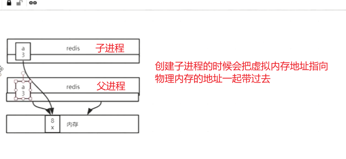 

**fork()**

1. 速度：快
2. 空间：小


**copy on write写实复制(创建子进程并不发生复制),只有当父进程一方发生修改值的时候，才会定向的去复制数据**

好处就是创建进程变快了，根据经验，不可能父子进程把所有数据都改一遍

**主要是操作指针，发生修改后任意一方的指针不是指向新值就是指向老值**


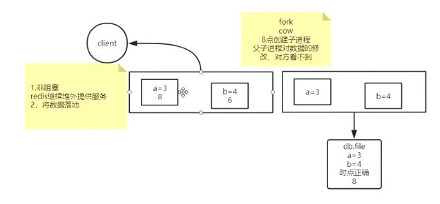  

**复制关系指针要远快过把数据复制一份**


### RDB(时点性)

redis实现RDB的方式

1. 手动触发(命令触发)：
   1. save;用该命令的时候是非常明确的时候，比如：关机维护等方式，要把服务器给停掉；
   2. bgsave会触发fork创建子进程;
2. 配置文件中编写bgsave的规则来触发;**注意：配置文件中是用save这个标识配置，但是他实际上触发的是bgsave**

```linux
#设置save规则
# save 3600 1
# save 300 100
# save 60 10000

#备份文件名
dbfilename   dump.db
#备份文件路径
dir /var/lib/redis/6379
```

**弊端：**

1. 不支持拉链(不覆盖不更新)，只有一个dump.rdb文件

2. 丢失数据相对多一点，时点与时点之间窗口数据容易丢失

   例如：8点得到一个rdb，9点要落一个rdb，挂机

   

**优点：**

类似Java中的序列化，恢复的速度相对快


### AOF(append only file)

**redis写操作记录到文件中**

1. 丢失数据少
2. redis中RDB和AOF中可以同时开启(**如果开启了AOF只会用AOF恢复**)，在4.0以后AOF中包含RDB全量，增加记录新的写操作


假设redis运行了十年，redis开启了AOF，到了10年头，redis挂了

问题：

1.AOF多大，会不会溢出，不会，因为redis增量是在内存中的，他要是溢出了的话早在AOF写的时候就溢出了;

2.恢复要多久，恢复用5年;

**弊端：**1、体量无限变大，恢复很慢

日志，优点如果能保住，还是可以用的

结果：设置一个方案让日志、AOF在不丢失数据的情况下足够小

```
hdfs,fsimage+edits.log
让日志只记录增量
合并的过程
```

```
redis
4.0以前
重写->删除抵消的命令，合并重复的命令
其实最终也是一个纯指令的日志文件
```

```
redis
4.0以后
重写->将老的数据RDB到AOF文件中->将增量的数据以指令的方式append到AOF中
```

**AOF是一个混合体，利用了RDB的快，利用了日志保存的全量**

白话：比如是从8.00开始的，那么就把8.00里面的数据都RDB到AOF文件里面，后面新的记录就开始往里增


```
#开启aof
appendonly yes
appendfilename "appendonly.aof"

它的工作原理是这样的:Redis记得最近一次重写后AOF文件的大小(如果在重启后没有发生重写，则使用启动时AOF文件的大小)
第一次开机定位64M，然后到达64m发生重写，记录最后一次rewrite的大小，增到64m100%之后，记录到128m循此往复
auto-aof-rewrite-percentage 100
#到达多少的时候出发重写
auto-aof-rewrite-min-size 64mb

appendfsync always
appendfsync everysec(默认)
appendfsync no
```


### Redis存储磁盘


**原点redis是内存数据库**

写操作会触发IO有三种级别

1. NIO 不调flush，只有当buffer满了之后才写
2. always  每一笔数据之后调一次flush
3. 每秒 每一秒钟调一次flush


**老版本**

```
#在配置文件中使用AOF打开appendonly功能
127.0.0.1:6379> set k1 hello
```

**appendonly.aof文件的数据**

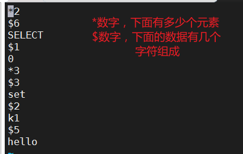 

```
要想生成dump.rdb文件执行bgsave命令
127.0.0.1:6379> bgsave
Background saving started
```

```
#控制台会发生变化
1766:M 04 Jan 2022 21:19:58.598 * Ready to accept connections
1766:M 04 Jan 2022 21:24:35.165 * Background saving started by pid 1838
1838:C 04 Jan 2022 21:24:35.167 * DB saved on disk
1838:C 04 Jan 2022 21:24:35.167 * RDB: 2 MB of memory used by copy-on-write
1766:M 04 Jan 2022 21:24:35.249 * Background saving terminated with success
```


```
#对数据进行修改
127.0.0.1:6379> set k1 1
OK
127.0.0.1:6379> set k1 2
OK
127.0.0.1:6379> set k1 b
OK
127.0.0.1:6379> set k1 a
OK
127.0.0.1:6379> set k1 c
OK
#AOF文件会相应的增长很多对k1的操作


```

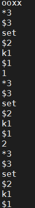 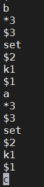 


```
#重写AOF，将没用的指令剔除掉
BGREWRITEAOF
```

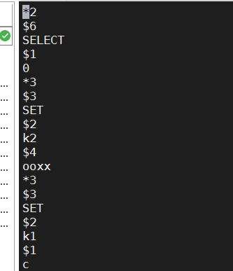 


**新版本**

```
开启rdb和aof混合功能
aof-use-rdb-preamble yes
```


**混合模式相当于，当你一开始写的时候appendonly.aof数据都是以明文的方式来展示，但是当你执行重写命令BGREWRITEAOF的时候，redis会将他以数据集的方式(相当于map,去除重复key值)，把数据弄成rdb格式的二进制数据。后续再追加数据也会先以明文的形式追加，执行重写BGREWRITEAOF操作再转为二进制数据**


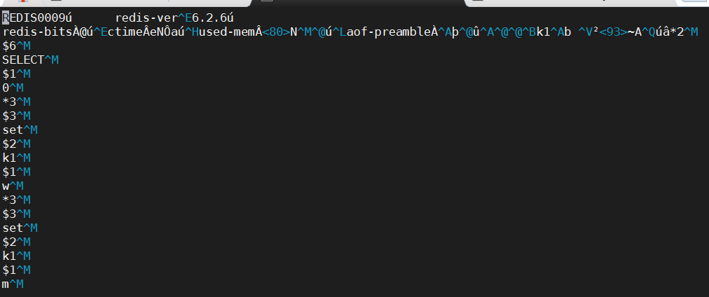 

**增量日志加上全量时点数据**


## redis的集群：主从复制、CAP、PAXOS、cluster分片集群01

**单击、单节点、单实例**

1. 单点故障(会挂)：对redis做多个副本
2. 容量有限
3. 压力

### AKF

**X轴：全量数据，镜像**

**Y轴：业务划分，功能**

**Z轴：优先级，逻辑再拆分**

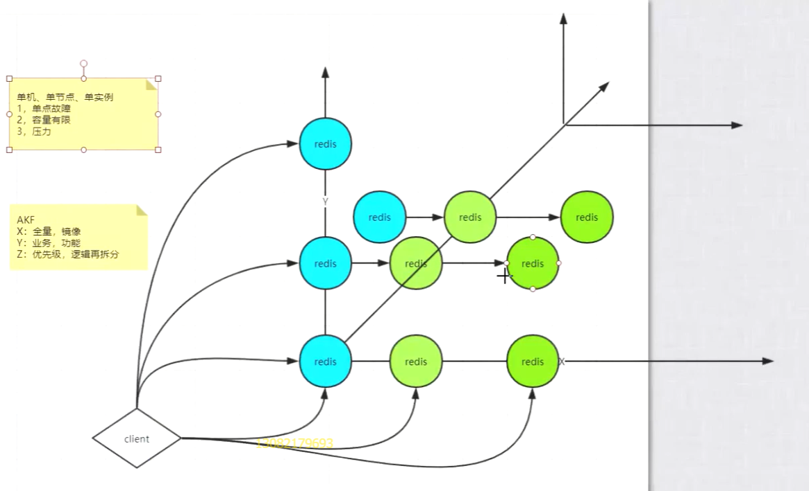 


```
通过AKF一变多
但是要考虑数据一致性的问题
```

```
所有节点阻塞，直到数据全部一致，强一致性！(极易容易破坏可用性)
反问：为什么要一变多，解决单点故障的可用性
1.容忍数据丢失一部分
```

 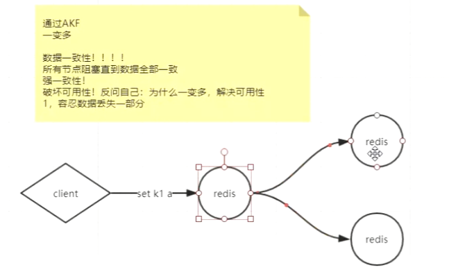 


### 复制和高可用

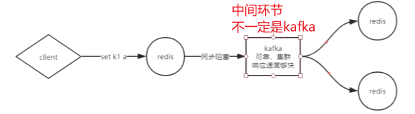 

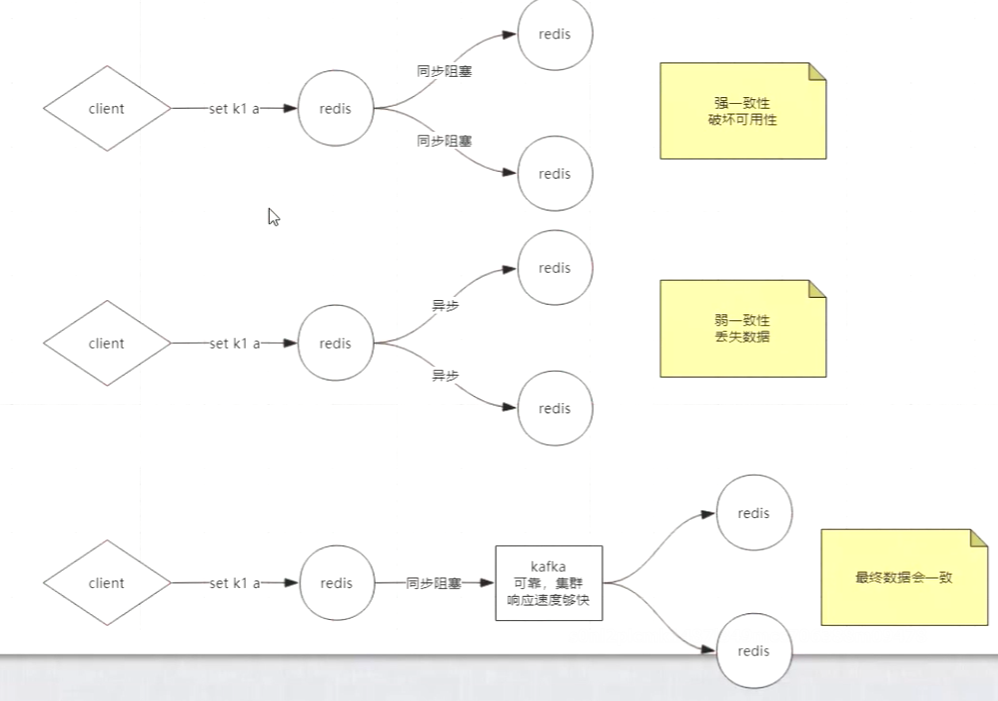 


**最终一致性也有一个问题就是当另外一个客户端去访问redis的时候有可能他还没消费kafka的数据，就会导致取到的数据不一致**

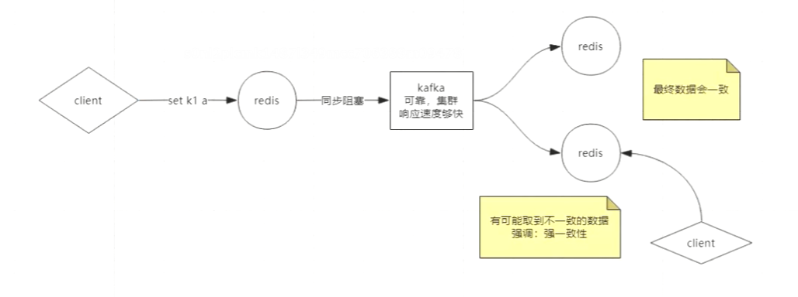 


**主从复制**

**主备**

**主：读写自己又是一个单点(所以需要对主去做HA高可用)**

最好是使用自动的故障转移，目的是代替人，需要由一个技术，程序实现，其实只要是一个程序就会出现单点故障的问题。自身也是一个一变多的集群

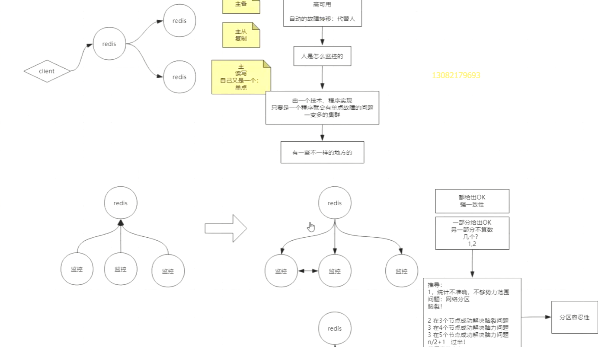 

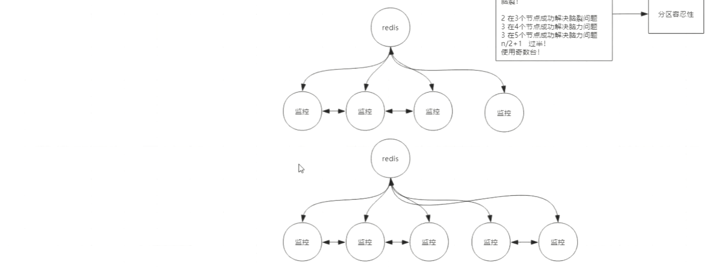 


### CAP原则

**CAP原则又称CAP定理，指的是在一个分布式系统中，一致性(Consistency)、可用性(Availability)、分区容错性(Pattitionn tolerance),这三个要素最多只能同时实现两点，不可能三者兼顾。**


**Redis使用默认的异步复制，其特点是低延迟和高性能**


### 主从复制总结

```
#因为从连接主的时候，从里面的数据会被清空，并且主的数据会write到从中,下面就是配置write的这个空隙还是否可以让其他客户端能查到旧的数据
replica-serve-stale-data yes

#是否开启只读模式
replica-read-only yes
```

```
##配置rdb文件可以通过磁盘IO再到网络IO传输给从，还是通过网络IO直接传输
repl-diskless-sync no
```

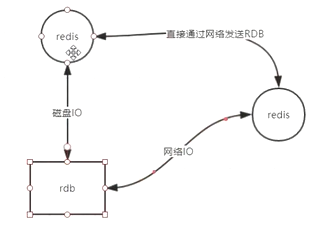

```
#主和从之间的增量复制
repl-backlog-size 1mb
```

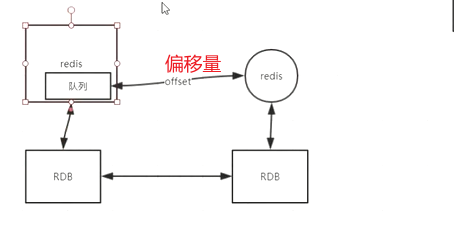


### Sentinel高可用

redis的sentinel系统用于管理多个Redis服务器，该系统执行以下三个任务：

- 监控(Monitoring)：sentinel会不断地检查你的主服务器和从服务器是否运作正常
- 提醒(Notification)：当被监控的某个redis服务器出现问题时，sentinel可以通过API向管理员或者其他应用程序发送通知
- 自动故障迁移：当一个主服务器不能正常工作时，sentinel会开始一次自动故障迁移操作，它会将失效主服务器的其中一个从服务器升级为新的主服务器，并让失效主服务器的其他从服务器改为辅助新的主服务器；当客户端试图连接失效的主服务器时，集群也会向客户端返回新主服务器的地址，是的，集群可以使用新主服务器代替失效服务器


**所有的哨兵都是通过主的发布订阅功能发现其他哨兵**


命令:

```
redis-sentinel

redis-server [配置文件] --sentinel

哨兵配置文件在源码目录

port 26379
sentinel monitor mymaster 127.0.0.1 6379 2
```


## Redis的集群：主从复制、CAP、PAXOS、cluster分片集群02


### Redis遇到的多种情况

1. 数据可以分类，交集不多，client融入一些逻辑代码对业务进行拆分
2. 数据没办法划分拆解(sharding分片)
   1. 对client过来的每笔数据进行一个hash取模。hash取模有一个天生的弊端就是取模的值是必须固定的，会影响分布式下的扩展性。(modula)
   2. 逻辑random，前面的客户端随机将数据LPUSH到不同的redis中，虽然前面的客户端取不出来了，但是后面的客户端可以通过rpop去给他消费出来(相当于消息队列场景) key相当于是topic
   3. 一致性hash算法，没有取模的过程，要求key和设备都要参与hash计算的，会给他抽成一个环形，hash环


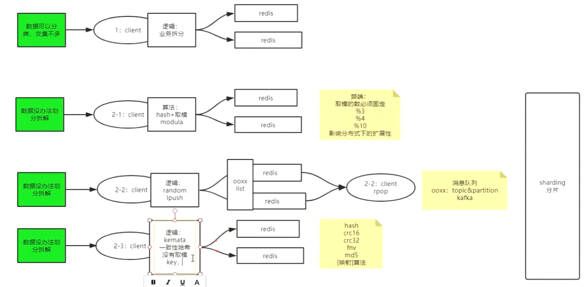 

### 哈希环

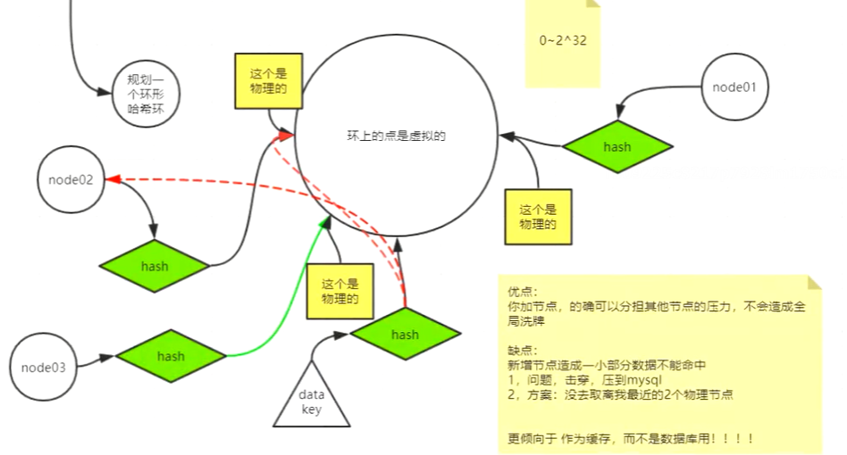 

### 数据倾斜的问题

使用虚拟节点，在node02和node01后面依次拼1~10个数字，这样环上就有20个节点，就可以解决大部分数据都要一个节点上而另一个节点没有数据的问题。


### 引出redis的连接成本很高对server端造成的问题

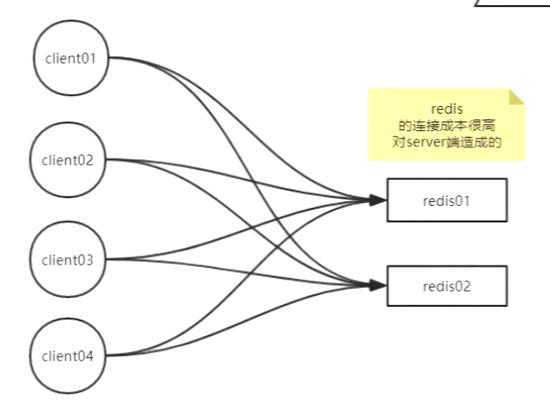 


 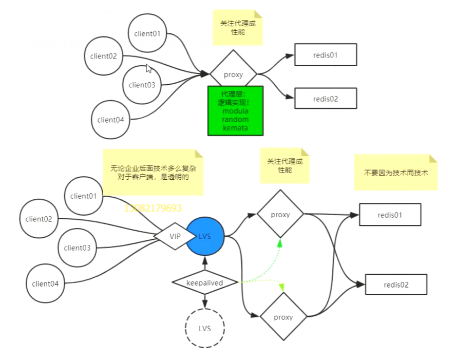 

GitHub搜：

**twemproxy、Predixy**


### 预分区解决的办法

上面三个模式的弊端就是不能做数据库使用


可以用预分区解决

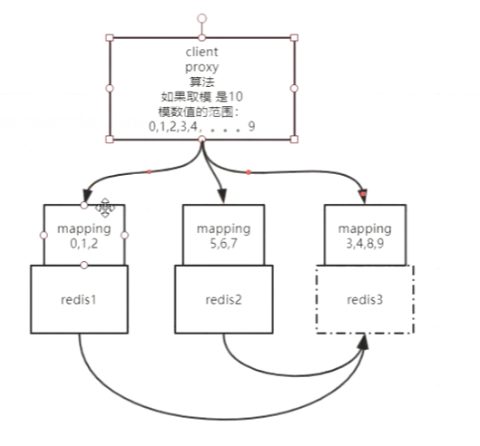 


**redis集群的做法**

**无主模型** 


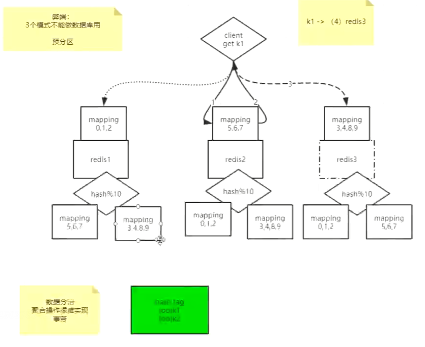 


### 实操-redis弊端和配置


linux小技巧

```
#在操作文件的时候将光标放到想要的位置，然后.(光标位置),$(最后一行)y(复制)
:.,$y

#$s替换(把#号替换成空)
:.,$s/#//
```


### 击穿

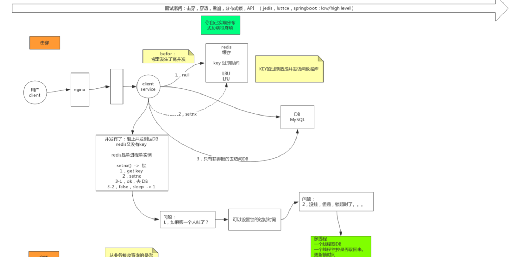 


### 穿透

从业务接收的请求查询是你系统根本不存在的数据

 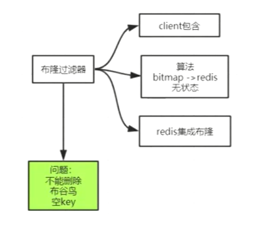 


### 雪崩(大量的key同时失效了，间接造成大量的访问到达数据库)

设置失效的数据过期时间错开

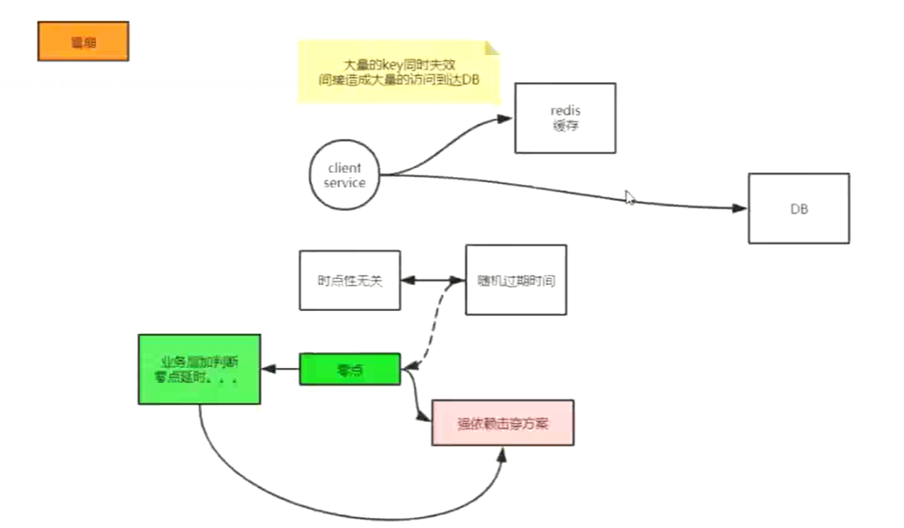 


### redis分布式锁


### 基础API


使用spring高级API的时候，存入到redis的key会是带序列化的key，并且如果使用StringRedisTemplate模板去创建的value只能是字符类型(其他类型运行过程中会报错)，所以需要将他的序列化给重新设置过

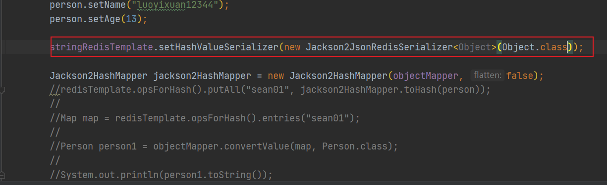 


