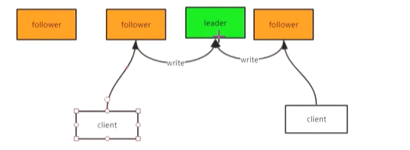
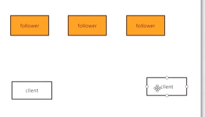
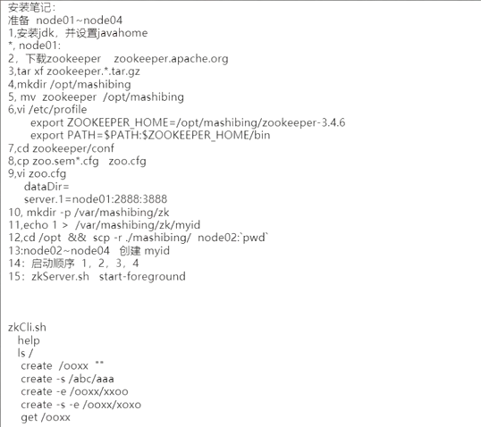
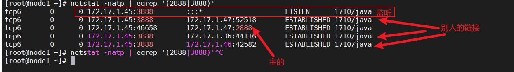
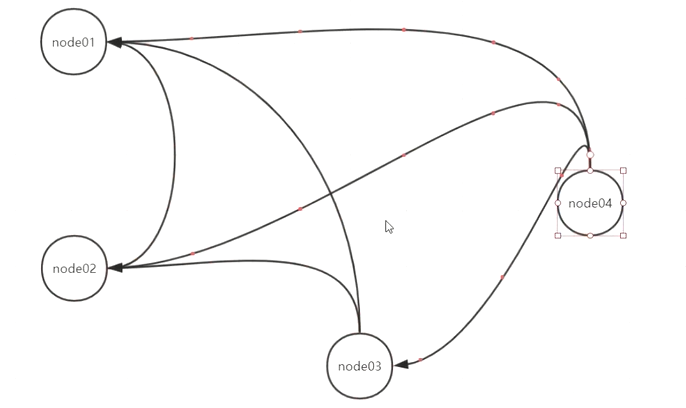
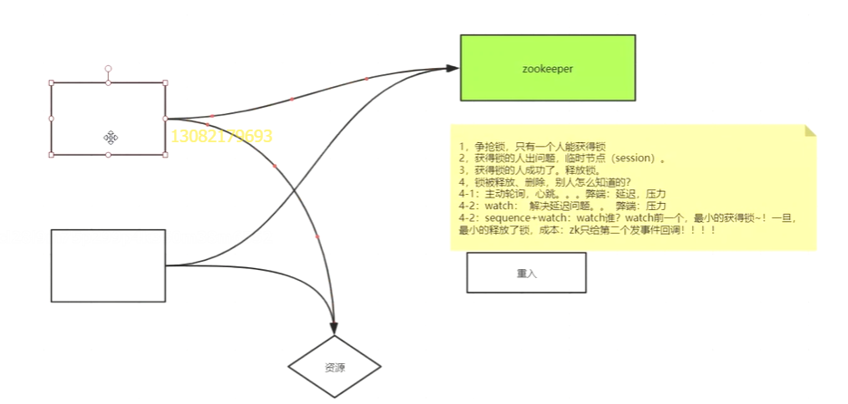

#  Zookeeper-1

```
#永久关闭防火墙
状态
systemctl status firewalld.service
关闭
systemctl stop firewalld.service
#永久关闭
systemctl disable firewalld.service
```


## zookeeper集群概念


**分布式应用程序的分布式协调服务**

 

1. 主从形式的单节点应用的leader肯定会挂
2. 导致服务不可用
3. 不可靠的集群
4. 事实上，zk集群及其的高可用
5. 如果有一种方式可以快速的恢复出一个leader


**Zookeeper有两种运行状态**

1. 可用状态
2. 不可用状态
3. 不可用状态恢复到可用状态应该越快越好


 


## zookeeper概念短暂节点

Zookeeper值提供1M的存储空间，他是为了保证其在做为协调服务的时候的快速。


**Zookeeper是一个目录树结构**

node可以存储数据1MB


**分为持久节点和临时节点**(session)

```
修改临时文件地址
dataDir=/var/mashibing/zk

放一个myid文件里面写自己的id号

Zookeeper配置从节点要在配置文件子集写
				
server.1=node01:2888:3888
server.2=node02:2888:3888
server.3=node03:2888:3888
server.4=node04:2888:3888

#远程拷贝zk文件夹到指定路径下
 scp -r ./mashibing/ root@172.17.1.58:/opt/
 
 
 export PATH=$PATH:${JAVA_PATH}:$ZOOKEEPER_HOME/bin

export ZOOKEEPER_HOME=/opt/mashibing/zookeeper-3.5.9
```


1. 统一配置管理 <- 1M数据

2. 分组管理<- path结构

3. 统一命名 <- sequential(序列)

4. 同步 <- 临时节点

   ​										|

   ​										|

   ​							**分布式锁临时节点**

   ​							**如果锁依托一个父节点，且具备-s(序列)就代表父节点下可以有很多把锁**

   ​						**队列式事务的锁**


**特征/保障**

1. 顺序一致性：客户端的更新将按发送顺序应用。
2. 原子性：更新成功或失败没有部分结果。
3. 统一视图：无论服务器连接到哪个服务器，客户端都将看到相同的服务视图
4. 可靠性：一旦应用了更新，它将从那时起持续到客户端覆盖更新。
5. 及时性：系统的客户视图保证在特定时间范围内是最新的


## Zookeeper安装

 


```
#拿到端口为2888或者3888的链接信息
				正则
netstat -natp | egrep '(2888|3888)'
```

 

```
3888：选主投票用的
2888：leader接收writer请求的时候用的
```

 

# Zookeeper-2

## zookeeper分布式协调,扩展,可靠性,时序性快速（一）

1. **paxos协议**
2. **ZAB协议**
3. **watch**
4. **API开发：不怕写zkClient**
5. **callback ->reactive响应式编程**

**可以更充分的压榨OS、HW资源的性能**


**Zookeeper分布式协调：是一个可扩展，可靠性，时序性**

1、**扩展性**

框架/架构：主要盯角色，因为分布式其实就是分布了很多不同类型的角色，角色和角色之间有自己的职能，可以互相通信。

​	Zookeeper分为Leader和Follower、Observe，主、从，

读写分离

只有Follower才能选举，投票选举的时间取决于Follower的数量

Observe其实只是追随leader并且同步用户的查询，Observe放大查询能力


zoo.cfg

```
server.1=172.17.1.15:2888:3888
server.2=172.17.1.25:2888:3888
server.3=172.17.1.35:2888:3888
server.4=172.17.1.45:2888:3888
#设置observe只要在后面加上配置就可以了比如:server.1=172.17.1.15:2888:3888:observer
```

2、**可靠性**

<div style="color:#F00"><b>攘其外必先安其内</b></div >

**快速恢复Leader**

数据的**可靠  可用  一致性**--->攘其外  一致性？ 最终一致性(最终一致性过程中，节点是否对外提供服务)

### Paxos(是一个基于消息传递的一个一致性算法)

**Zookeeper选主流程（fast paxos）**

 


```
https://lixinkuan.blog.csdn.net/article/details/100753612
```


## ZAB 原子广播协议

ZAB是paxos协议的精简版	


**作用在可用状态(有leader的时候)**

**原子：成功、失败、没有中间状态**

**广播：分布式多节点的。并不代表全部知道(过半，队列+2PC两阶段提交)**


**队列：FIFO(先进先出，顺序性)**


**zk的数据状态在内存，用磁盘保存日志文件**

zookeeper更新一定是走两阶段的 

首先就是把队列中的消息写到磁盘日志中，follower返回给leader一个ok之后，leader再将数据write到内存中，follower再给leader回一个ok

**客户端可以调用sync操作同步数据**


client向Follower发送了一个写操作,写操作转发给leader，leader创建一个zxid8，leader会给他的各个follower发起第一阶段将zxid8的信息写到他们的日志中（在leader中维护了一个发送队列），follower会回送一个ack的确认信息，这个时候leader自己也会 有一个ok，这个时候消息就是(3/2)+1已经过半了，第二阶段就是发送write写到内存中去，虽然第二个follower没有返回ok给leader，但是因为消息过半通过了，所以leader也会给他发write的事情，所以只要数据最终是一致的就行（write写完也会回一个ok），最后leader会返回over-ok。

 


## Zookeeper集群选举过程

**如果leader一旦挂掉了怎么办？**

 

 

当leader4挂了之后，03节点的Zid还是7，但是是03先发现leader挂了的，03将票投出去给01、02，自己票数+1，当01和02收到票的之后就会用这个票进行比较，通过zxid直接淘汰掉03的票

 

收票者否定了对方，并且将自己的票发回去，


**ZK选举过程**

1、3888造成两两通信

2、只要任何人投票，都会触发那个准leader发起自己的投票

3、推选制：先比较zxid，如果zxid相同，再比较myid

​	

## zookeeper的Watch监控、观察

**Zookeeper 统一视图**

目录树结构


## zookeeper的API使用代码实现


```java
package com.mashibing.zookeeper;

import org.apache.zookeeper.*;
import org.apache.zookeeper.data.Stat;

import java.io.IOException;
import java.util.concurrent.CountDownLatch;

/**
 * @author LYX
 * @description
 * @date 2022/1/15 19:24
 */
public class App {
    public static void main(String[] args) throws IOException, InterruptedException, KeeperException {
        //zk是有session概念的。没有连接池的概念

        //watch 观察、回调分为两类
        //watch 的注册只发生在 读类型调用, get、exist


        //第一类 new zk的时候传入的watch，这个watch是session级别的，跟path、node没关系

        final CountDownLatch countDownLatch = new CountDownLatch(1);
        final ZooKeeper zk = new ZooKeeper("192.168.1.10:2181,192.168.1.8:2181,192.168.1.11:2181,192.168.1.12:2181",
                3000,
                //watch的回调方法
                new Watcher() {
                    public void process(WatchedEvent event) {
                        Event.KeeperState state = event.getState();
                        Event.EventType type = event.getType();
                        String path = event.getPath();
                        System.out.println("new zk watch \n" + event.toString());
                        switch (state) {
                            case Unknown:
                                break;
                            case Disconnected:
                                break;
                            case NoSyncConnected:
                                break;
                            case SyncConnected:
                                System.out.println("连接成功!");
                                countDownLatch.countDown();
                                break;
                            case AuthFailed:
                                break;
                            case ConnectedReadOnly:
                                break;
                            case SaslAuthenticated:
                                break;
                            case Expired:
                                break;
                            case Closed:
                                break;
                        }
                        switch (type) {
                            case None:

                                break;
                            case NodeCreated:

                                break;
                            case NodeDeleted:

                                break;
                            case NodeDataChanged:

                                break;
                            case NodeChildrenChanged:

                                break;
                            case DataWatchRemoved:

                                break;
                            case ChildWatchRemoved:

                                break;
                        }
                    }
                });
        System.out.println("等待前夕");
        countDownLatch.await();
        ZooKeeper.States state = zk.getState();
        switch (state) {
            case CONNECTING:
                System.out.println("ing.......");
                break;
            case ASSOCIATING:
                break;
            case CONNECTED:
                System.out.println("ed........");
                break;
            case CONNECTEDREADONLY:
                break;
            case CLOSED:
                break;
            case AUTH_FAILED:
                break;
            case NOT_CONNECTED:
                break;
        }

        String pathName = zk.create("/ooxx", "olddata".getBytes(), ZooDefs.Ids.OPEN_ACL_UNSAFE, CreateMode.EPHEMERAL);
        System.out.println("pathcName" + pathName);
        final Stat stat = new Stat();

        byte[] node = zk.getData("/ooxx", new Watcher() {
            public void process(WatchedEvent event) {
                System.out.println("get Data \n" + event.toString());
                try {
                    //为true的时候是default watch 被重新注册   是new zk的时候的那个watch
                    //zk.getData("/ooxx", true, stat);
                    //使用当前的watch
                    zk.getData("/ooxx", this, stat);
                } catch (KeeperException e) {
                    e.printStackTrace();
                } catch (InterruptedException e) {
                    e.printStackTrace();
                }
            }
        }, stat);

        System.out.println(new String(node));
        //触发回调
        Stat stat1 = zk.setData("/ooxx", "newdata".getBytes(), 0);
        //这行会触发吗
        Stat stat2 = zk.setData("/ooxx", "newdata01".getBytes(), stat1.getVersion());
        
        System.out.println("---------async start-------------");
        zk.getData("/ooxx", false, new AsyncCallback.DataCallback() {
            public void processResult(int rc, String path, Object ctx, byte[] data, Stat stat) {
                System.out.println("---------async call back-------------");
                System.out.println(new String(data));
                System.out.println(ctx);
            }
        }, "abcde");
        System.out.println("---------async over-------------");
        
        Thread.sleep(2222222);
    }
}

```


## zookeeper配置代码实现

**Zookeeper做分布式协调的**

**配置**

**分布式锁**


**其实并不是每种场景都线性的写出一种方法来，而是将这些方法都准备好后，用相应的回调和watch事件来将他们粘连起来**


## zookeeper分布式锁概念

使用Zookeeper实现分布式锁

1、争抢锁，只有一个人能获得锁

2、获得锁的人出问题，临时节点(session)

3、获得锁的人成功了。释放锁。

4、如果锁被，释放，删除了，别人怎么知道的？

​	4-1、主动轮循、心跳。弊端：延迟，多台机子的访问压力

​	4-2、watch：他的回调可以解决延迟问题，弊端：通信上也会有压力

​	4-3、序列节点(sequence) + watch：watch谁？watch前一个，最小的才能获得锁。一旦最小的释放了锁，成本：zk只给第二个发事件回调。


**锁的重入**


 


 


