# 分布式事务精讲


## 分布式事务

**网约车项目时序图(网约车三期第64课时)**

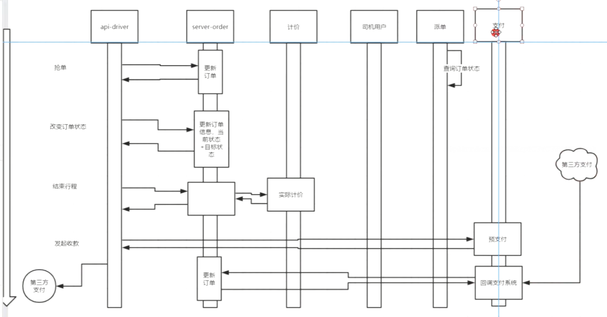 

**如果在每一条调用的链路上都经过两个或两个以上的系统，他就会涉及到分布式事务**


**面试题：db本地事务该如何保证(一台机器)？**

锁、redo、undo

事务的特性


**ACID(原子性、一致性、隔离性、持久性):**

**AD(日志文件) CI(锁)**

**数据库写入之前，先写日志文件，再写数据文件，如果说日志文件写完了没有入库，下次再启动的时候会检查这个日志文件，如果事务提交了数据库中没有，那么他就执行redo(重写)操作，如果事务没有提交那么他就执行undo(回滚)操作(反向的操作:原来insert的话现在就是delete，如果是update 原值为1修改为2的话，将他修改回1)**

**A原子性：要么都做，要么都不做(侧重过程)**

**C一致性：做完事之后数据是一致的(侧重结果)**

**I隔离性：读未提交，读已提交，可重复读，串行化(会导致脏读重复读等问题)**

**D持久性：**

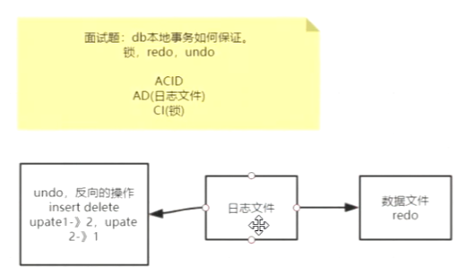 


**分布式事务又分为两个部分**

**刚性事务(ACID)**

例子：我打你一拳你马上就疼(事实一致性)

**柔性事务BASE理论(一般的解决方案)**

例子：我打你一拳，你不是马上就疼，而是经过了别的什么操作(最终一致性)

**XA协议(接口)**

事务管理器，资源管理器

Transaction Manager(TM)，Resource Manager(RM)

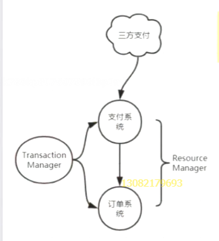 

**大体意思就是如果多个系统要协同干事的话就要多出一个协调的人，不要以某一个系统为主，某一个系统为辅，我们直接再抽象一层去做**

**TM协调RM**


#### 二阶段提交

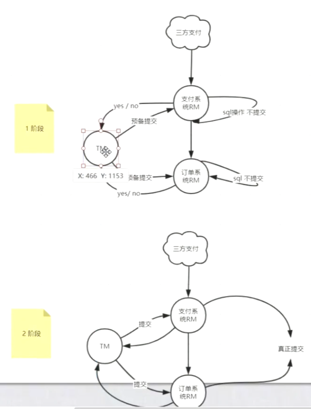 

**缺点：**

**就是如果TM挂了，这件事就做不了了，TM的单点故障**

**会因为网络异常导致资源占用，阻塞资源**

**数据不一致**

数据不一致就是由于协调者和参与者同时出错，或者协调者和参与者之间网络的不同导致的。

**TM有超时机制，RM没有超时机制**

在这种基础上就出现了三阶段的处理方法，不能解决只能降低


#### 三阶段提交

**相对于2PC，3PC主要解决单点故障问题，并减少资源阻塞**

**在二阶段的基础上增加了一个询问(询问能不能干事)的操作(其实只是增大了成功的概率，并不能完全避免)，在阻塞资源方面添加了超时机制，TM和RM都有超时的机制**

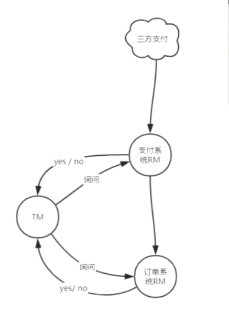 

**3pc不能解决2pc的问题，只是降低灾难发生的概率**

**如果要想彻底解决则需要依靠消息队列和事件表、可靠消息服务、最终一致性方案、最大努力通知方案**


**补偿：**

**服务1提交后，服务2挂了，我们进行补偿(人工补偿、定时任务补偿、脚本补偿)向前sql或者向后sql**


**两阶段是为了降低服务1提交后服务2挂了的概率**


**两阶段提交的资源会一直被锁定的，直到事务完成之后才释放**


**三阶段就是为了降低资源锁定的时间和概率**

- can commit 不锁定资源
- tm(协调者)和rm(资源拥有者)的超时处理机制   

超时机制：

如果tm未收到反馈，给rm发中断事务的命令

rm在第3阶段没有收到tm的命令，会默认提交(因为到了第三阶段，前面的两个步骤肯定是已经没有任何问题的，所以就算是TM挂了，或者RM没有收到TM的提交命令，RM也会自己就提交了)，**因为如果超时之后他不做提交，在第二、三阶段的时候他还是会锁定资源，还是没有解决在第二阶段的时候锁定资源的问题，所以给他设置了一个超时默认提交**

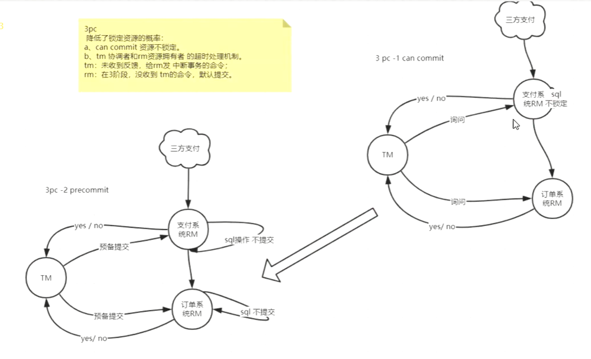 

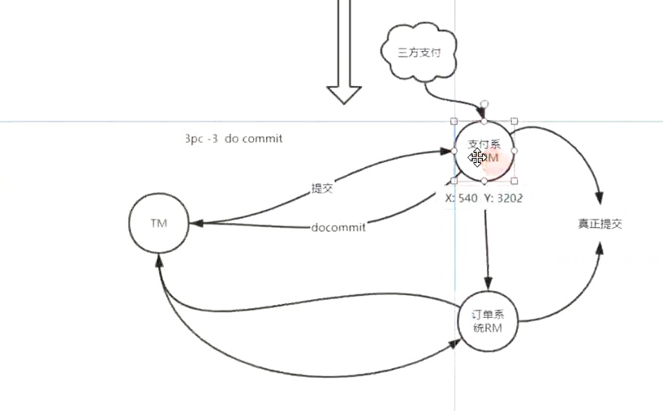  

**分布式事务的解决方案一般都是柔性事务**


### 两阶段

**两阶段为什么要引入协调者，是因为每个服务无法感知其他服务的事务状况，需要协调者**

#### 一：提交事务请求

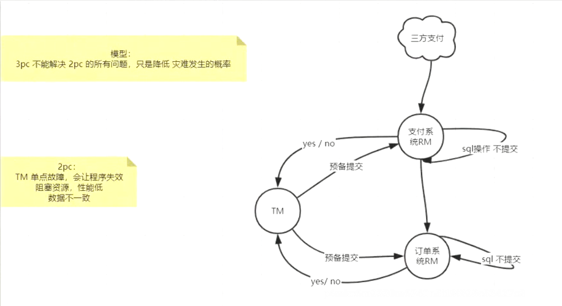 

**事务询问**

协调者节点向所有参与者节点询问是否可以执行提交操作(vote)，并开始等待各参与者节点的影响。

**执行事务**

参与者节点执行询问发起的所有事务操作，并将Undo信息与Redo信息写入日志。(注意：若成功这里其实每个参与者已经执行了事务操作)

**各参与者向协调者反馈事务询问的响应**

各参与者节点响应协调者节点发起的询问，如果参与者节点的事务操作与实际执行成功，则他返回一个”同意”，消息，如果参与者节点的事务操作与实际执行失败，则他返回一个“终止消息”


#### 二：执行事务提交

当协调者节点从所有参与者节点获得的响应消息都为“同意”时：

**发送提交请求**

协调者节点向所有参与者节点发出“正式提交”(commit)的请求。

**事务请求**

参与者节点正式完成操作，并释放在整个事务期间内占用的资源。

**反馈事务提交结果**

参与者节点正式完成操作，并释放在整个事务期间内占用的资源。

**完成事务**

协调者节点收到所有参与者节点反馈的“完成”消息后，完成事务。

如果任一参与者节点在第一阶段返回的响应消息为“中止“，或者协调者节点在第一阶段的询问超时之前无法获取所有参与者节点的响应消息时：

**中断事务**

**发起回滚请求**

协调者节点向所有参与者节点发出“回滚操作(rollback)"的请求

**事务回滚**

参与者节点利用之前写入的Undo信息执行回滚，并释放在整个事务期间内占用的资源。

**反馈事务回滚结果**

参与者节点向协调者节点发送“回滚完成”消息

**中断事务**

协调者节点收到所有参与者节点反馈的“回滚完成”消息后，取消事务，不管最后结果如何，第二阶段都会结束当前事务。


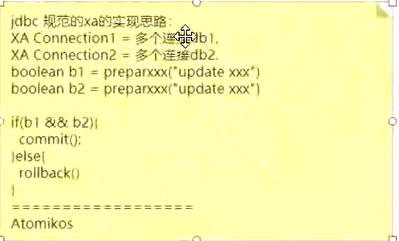 


**主要实现Seata、LCN、可靠消息队列**


#### 两阶段提交和三阶段提交的区别

1. 引入超时机制，同时在协调者(超时，中断事务)和参与者(超时，在pre中断，在do提交)中都引入超时机制。
2. 在第一阶段和第二阶段中插入一个准备阶段。保证了在最后提交阶段之前各参与节点的状态是一致的。

 

 


**必须要先保证P网络可用**


## 网约车的支付系统


### 消息队列+事件表(不适用于数据量特别大的情况)

1、业务操作

2、发消息的操作

3、消费消息的操作+插表

4、业务操作


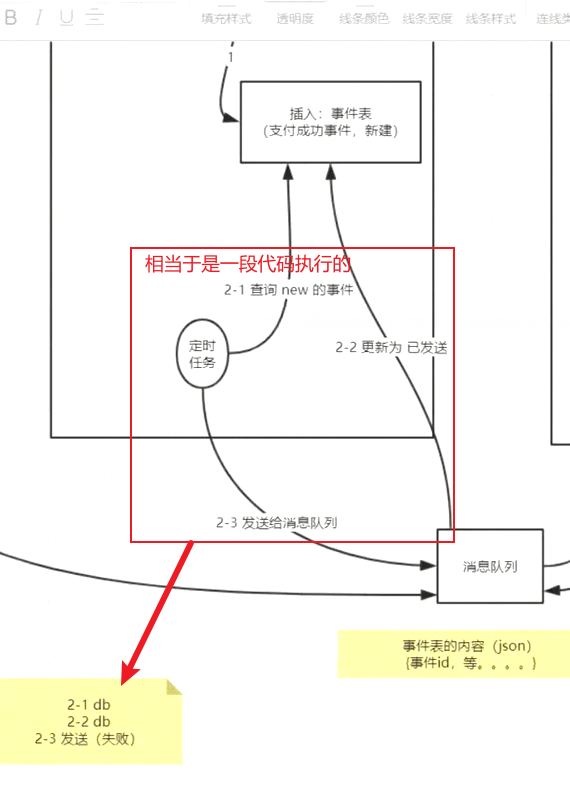 

**不要拿把锤子，就看什么都是钉子**

小技巧：

实际应用的时候可以让本地的数据库操作在先，第三方http调用的系统在后，因为我们没办法让第三方调用http服务回滚，为了防止我们自身的db操作出问题，导致第三方无法挽回，使用这种方式来保证数据的一致性。**可控性排序**

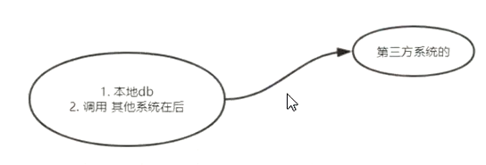 


**通过消息事件的id，主键约束，来保证，消息重复消费的问题**

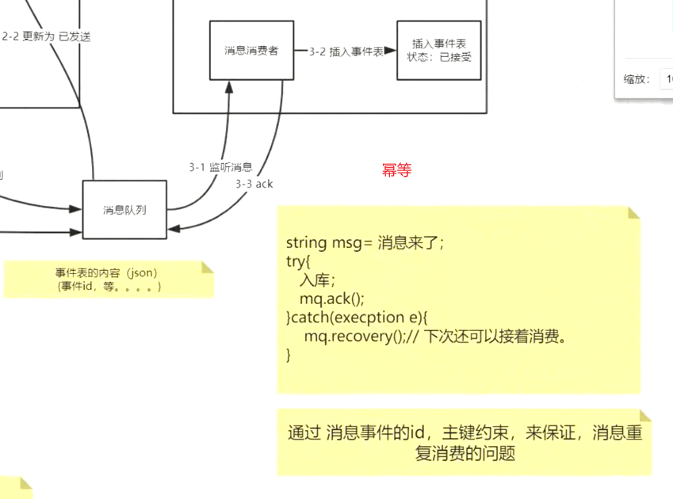 


**如果消息队列挂了**

1、在2-步骤的时候消息没有发送给消息队列的时候就挂了，此时消息在事件表的状态是新建的，此时是没有问题的。

2、消息发送给消息队列了，但是消息队列挂了，就需要消息队列服务做持久化，下次消息队列启动的时候消息也还会有的。

3、消息到了消息队列，在消费者消费完之后消息队列挂了(消息队列没有收到ack的情况)，3-2其实已经完成了事件数据的插入，并且通过了主键id的约束，当下次消息队列重启的时候，再次插入事件表是不会出问题的，保证了他到事件表只有唯一的一次。


事件表中如果数据量太大了怎么办？可以将已发送成功的表保存到另外一个库中

为什么要用定时任务去查数据？不能通过异步系统直接发给消息队列吗？

这样子可以减少排查错误的地方，如果消息队列没有收到消息，我们需要去异步发送的地方查一次，一次得查定时任务的

定时任务是用什么中间件怎么做的？图上有


**这边的复杂正是为了某些地方的简单，能够通过消息队列实现系统的扩展**

**一般消息队列都是由基础架构组来维护的**


**如果ack发送失败，消息一直都在消息队列里面，下一次消费消息的时候，由于主键的冲突，那么这条信息也会作废的。不会影响数据一致性的问题**


## MQ代码实现


使用的是ActiveMQ

**如果安装了rabbitMQ或者rocketMQ的话需要将端口修改为其他端口因为5672都被占用了**

在使用ActiveMQ的时候需要配置**死信队列**(你消费正常队列中的消息默认是消费6次如果都消费不成功的话就被扔到死信队列中了)才能使用。

**死信队列也是个队列，可以接着监听死信队列做补偿处理、告警处理等，需要人工介入**

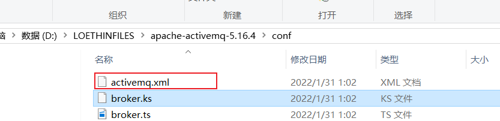

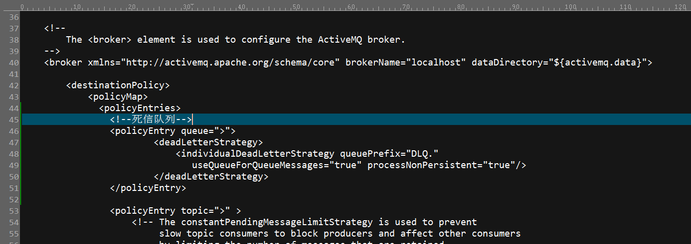

```xml
<policyEntry queue=">">
          <deadLetterStrategy>
              	 <individualDeadLetterStrategy queuePrefix="DLQ." 
              			 useQueueForQueueMessages="true" processNonPersistent="true"/>
              	 </deadLetterStrategy>
</policyEntry>
```

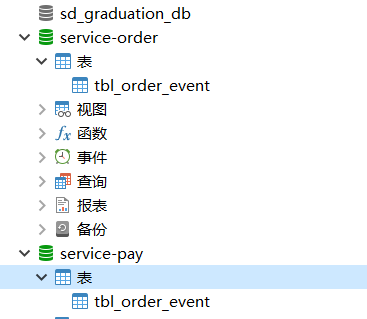 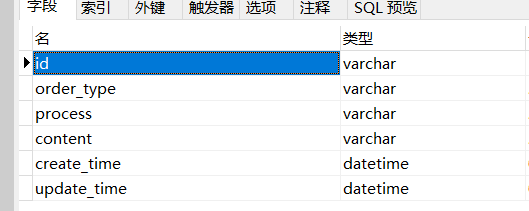 


**service-order**

ActiveMQ

```java
package com.mashibing.serviceorder.config;

import org.apache.activemq.ActiveMQConnectionFactory;
import org.apache.activemq.command.ActiveMQQueue;
import org.springframework.beans.factory.annotation.Value;
import org.springframework.context.annotation.Bean;
import org.springframework.context.annotation.Configuration;

import javax.jms.Queue;


/**
 * @author 马士兵教育:chaopengfei
 * @date 2020/7/30
 */
@Configuration
public class ActiveMQConfig {

    @Value("${spring.activemq.broker-url}")
    private String brokerUrl;

    @Bean
    public Queue queue() {
        return new ActiveMQQueue("ActiveMQQueue");
    }

    @Bean
    public ActiveMQConnectionFactory connectionFactory(){
        return new ActiveMQConnectionFactory(brokerUrl);
    }
}

```

**service-pay**

**ActiveMQ**

```java
package com.mashibing.servicepay.config;

import org.apache.activemq.ActiveMQConnectionFactory;
import org.apache.activemq.RedeliveryPolicy;
import org.springframework.beans.factory.annotation.Value;
import org.springframework.context.annotation.Bean;
import org.springframework.context.annotation.Configuration;
import org.springframework.jms.config.DefaultJmsListenerContainerFactory;
import org.springframework.jms.config.JmsListenerContainerFactory;


/**
 * 消息消费端,的配置
 * @author 我们要手动发送消息，要发ack给队列确认
 * @date 2020/7/30
 */
@Configuration
public class ActiveMQConfig {

    @Value("${spring.activemq.broker-url}")
    private String brokerUrl;

    /**
     * mq连接工厂
     * @param redeliveryPolicy
     * @return
     */
    @Bean
    public ActiveMQConnectionFactory connectionFactory(RedeliveryPolicy redeliveryPolicy) {

        ActiveMQConnectionFactory factory = new ActiveMQConnectionFactory();
        factory.setUserName("admin");
        factory.setPassword("admin");
        factory.setRedeliveryPolicy(redeliveryPolicy);

        return factory;
    }

    /**
     * 重发配置策略
     * @return
     */
    //重新发送策略
    @Bean
    public RedeliveryPolicy redeliveryPolicy() {
        RedeliveryPolicy redeliveryPolicy = new RedeliveryPolicy();
        return redeliveryPolicy;
    }

    /**
     * 设置消息队列 的确认机制
     * @param activeMQConnectionFactory
     * @return
     */
    @Bean
    public JmsListenerContainerFactory jmsListenerContainerFactory (ActiveMQConnectionFactory activeMQConnectionFactory) {
        DefaultJmsListenerContainerFactory bean = new DefaultJmsListenerContainerFactory();
        bean.setConnectionFactory(activeMQConnectionFactory);
        //1.自动确认;2.客户端手动确认;3.自动批量确认;4.事务提交并确认
        bean.setSessionAcknowledgeMode(2);
        return bean;
    }
}
```

**ConsumerQueue**

```java
package com.mashibing.servicepay.component;

import com.mashibing.servicepay.dao.TblOrderEventDao;
import com.mashibing.servicepay.entity.TblOrderEvent;
import net.sf.json.JSONObject;
import org.springframework.beans.factory.annotation.Autowired;
import org.springframework.jms.annotation.JmsListener;
import org.springframework.stereotype.Component;

import javax.jms.JMSException;
import javax.jms.Session;
import javax.jms.TextMessage;

/**
 * @author LYX
 * @description
 * @date 2022/2/21 12:56
 */
@Component
public class ConsumerQueue {

    @Autowired
    private TblOrderEventDao tblOrderEventDao;

    @JmsListener(destination = "ActiveMQQueue", containerFactory = "jmsListenerContainerFactory")
    public void receive(TextMessage textMessage, Session session) throws JMSException {

        try {
            System.out.println("收到的消息>>>>>>>>>>>" + textMessage.getText());

            String content = textMessage.getText();
            TblOrderEvent tblOrderEvent = (TblOrderEvent) JSONObject.toBean(JSONObject.fromObject(content), TblOrderEvent.class);
            tblOrderEventDao.insert(tblOrderEvent);

            //业务完成 确认消息 消息成功 提交ack
            textMessage.acknowledge();
        } catch (Exception e) {
            //消息消费失败
            //异常不要这样打印
            e.printStackTrace();
            session.recover();
        }
    }

}
```

消息队列异常了6次之后会自动给他加到死信队列中(我们需要手动的给死信队列做补偿)，死信队列只会消费一次，直接把他记录到日志。

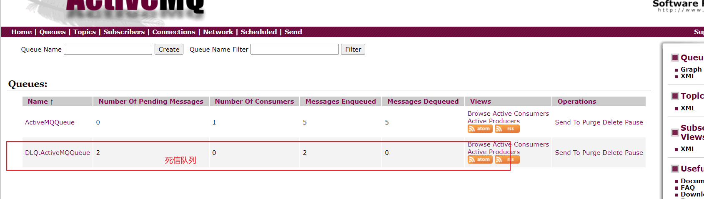 

 

**队列服务收到ACK会从正常队列中移除，如果没有收到ACK消费六次之后移除**


**定时任务需要使用分布式定时任务，如果不用分布式定时任务的话得加分布式锁**


**分布式定时任务**


**分布式锁**


## LCN框架详解


**加其他框架**

- **pom加jar包**
- **yml写配置**
- **程序中写注解**


git地址：https://github.com/codingapi/tx-lcn


**Lock(锁定事务单元)、Confirm(确认事务)、Notify(通知事务) 是两阶段的一个实现**

**XA(XAConnection)协议Oracle定义了应用程序、事务管理器、资源管理器、通信管理器,通过一些中间件来做分布式功能**


### Eureka序列图

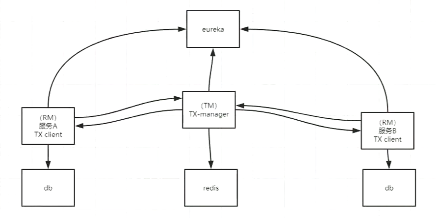 


**时序图**

**在第一个服务发起调用的时候，会在TX中创建一个组生成groupid，直到最后一个服务调用的时候才把他实际添加到这个组中**


**事务原理图**

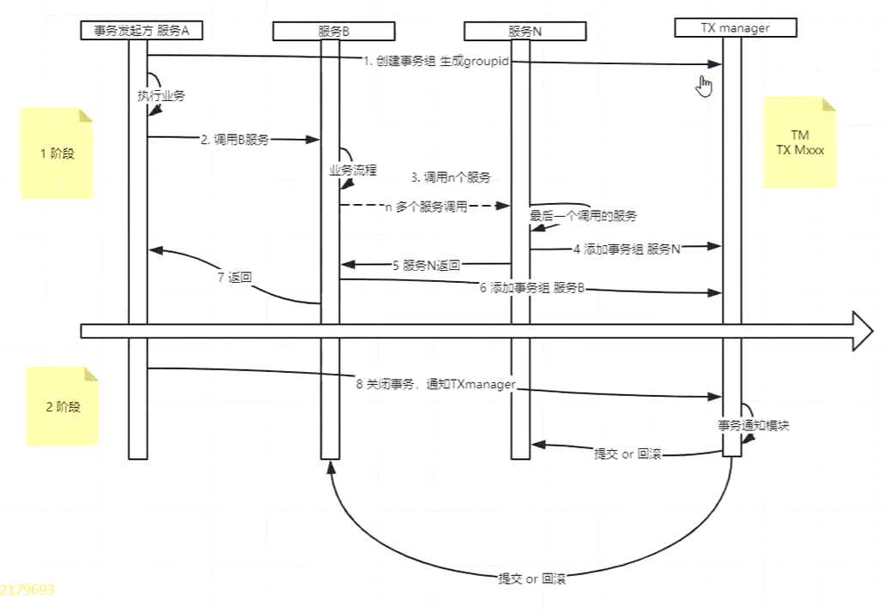

#### **事务的协调机制**

本质：

在自己的服务中嵌入了一个TXclient用来和TXManager进行通信

**关键点：在第一阶段执行完之后多了一些数据库的操作返回了，怎么能让第二阶段接着第一阶段的数据库的操作进行数据库的提交**

- **保留第一阶段操作的连接第一阶段不提交，等第二阶段的信号，让他们用的都是同一个连接进行操作**

**通过什么方式获取不同服务的数据库连接？**

正常来说SQL操作完了之后，提交了，connection就会释放了。**所以lcn把这个释放做成了假释放。(不让他clos()，或者存储到一个Map<traceId(请求id), connection>中)** ，目的是对应调用和连接。

**代理DataSource把连接池的一些操作拦截下来，控制了连接池和请求的对应和事务的提交**

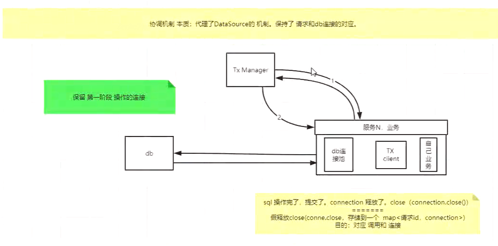


#### **事务的补偿机制**


**如果在第二阶段的时候接业务方收不到TXManager的请求了该怎么办？(挂了、网断了)**

TM会给他做一个标识，做记录(通知的具体事项，或者需要执行的SQL的操作)


**为什么要记录执行SQL的操作？**

因为有可能是服务挂了，如果下次他启动的时候TX得知道第一阶段的时候让服务执行了什么。


**等服务端起来的时候，TX需要知道要拿哪些请求和标识去做这些事务，再把第一阶段要做的是告诉服务端，让他接着做**

**需要补偿的数据存在redis中，里面存事务组和补偿信息**


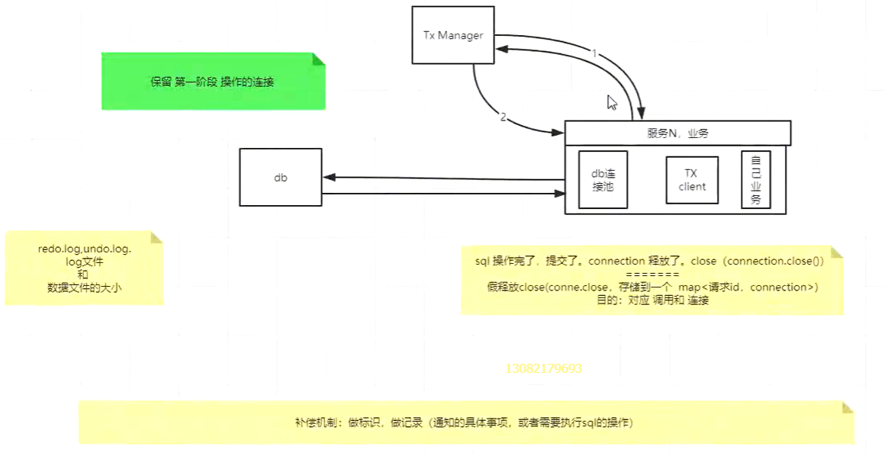 


#### 代码实现LCN

场景：3个库 lcn-order,lcn-pay,lcn-manager;1个缓存：redis；3个项目：txmanager，lcn-order，lcn-pay

省略实体的增删改查

##### lcn-order

```java
##entity
@Data
public class TblOrder implements Serializable {
    private Integer id;

    private String orderName;

    private static final long serialVersionUID = 1L;
}
##controller
@RestController
public class OrderController {

    @Autowired
    private TblOrderDao tblOrderDao;

    @Autowired
    private RestTemplate restTemplate;

    @PostMapping("/add-order")
    @Transactional(rollbackFor = Exception.class)
    @LcnTransaction
    public String add(@RequestBody TblOrder bean){

        JSONObject date = new JSONObject();
        date.put("payName",bean.getOrderName()+"pay");

        restTemplate.postForEntity("http://lcn-pay/add-pay",date,String.class);
        //异常
        int i = 1/0;
        tblOrderDao.insert(bean);
        return "新增订单成功";
    }
}

##LcnOrderApplication
@SpringBootApplication
//事务注解
@EnableDistributedTransaction
public class LcnOrderApplication {

    public static void main(String[] args) {
        SpringApplication.run(LcnOrderApplication.class, args);
    }

    @Bean
    @LoadBalanced
    public RestTemplate getRestTemplate () {
        return new RestTemplate();
    }
}
```

```properties

server:
  port: 1001

#应用名称及验证账号
spring:
  application:
    name: lcn-order


  datasource:
    type: com.alibaba.druid.pool.DruidDataSource
    driver-class-name: com.mysql.cj.jdbc.Driver
    url: jdbc:mysql://localhost:3306/lcn-order?characterEncoding=UTF-8&serverTimezone=Asia/Shanghai
    username: root
    password: hwlhaa
    dbcp2:
      initial-size: 5
      min-idle: 5
      max-total: 5
      max-wait-millis: 200
      validation-query: SELECT 1
      test-while-idle: true
      test-on-borrow: false
      test-on-return: false

mybatis:
  mapper-locations:
    - classpath:mapper/*.xml

eureka:
  client:
    service-url:
      defaultZone: http://euk1.com:7001/eureka/

# tm配置
tx-lcn:
  client:
    manager-address: 127.0.0.1:8070

```

```xml
<?xml version="1.0" encoding="UTF-8"?>
<project xmlns="http://maven.apache.org/POM/4.0.0" xmlns:xsi="http://www.w3.org/2001/XMLSchema-instance"
         xsi:schemaLocation="http://maven.apache.org/POM/4.0.0 https://maven.apache.org/xsd/maven-4.0.0.xsd">
    <modelVersion>4.0.0</modelVersion>
    <parent>
        <groupId>org.springframework.boot</groupId>
        <artifactId>spring-boot-starter-parent</artifactId>
        <version>2.2.5.RELEASE</version>
        <relativePath/> <!-- lookup parent from repository -->
    </parent>
    <groupId>com.mashibing</groupId>
    <artifactId>lcn-order</artifactId>
    <version>0.0.1-SNAPSHOT</version>
    <name>lcn-order</name>
    <description>Demo project for Spring Boot</description>

    <properties>
        <java.version>1.8</java.version>
    </properties>

    <dependencies>
        <!-- lcn -->
        <dependency>
            <groupId>com.codingapi.txlcn</groupId>
            <artifactId>txlcn-tc</artifactId>
            <version>5.0.2.RELEASE</version>
        </dependency>

        <dependency>
            <groupId>com.codingapi.txlcn</groupId>
            <artifactId>txlcn-txmsg-netty</artifactId>
            <version>5.0.2.RELEASE</version>
        </dependency>

        <!-- json-lib -->
        <dependency>
            <groupId>net.sf.json-lib</groupId>
            <artifactId>json-lib</artifactId>
            <version>2.4</version>
            <classifier>jdk15</classifier>
        </dependency>

        <dependency>
            <groupId>org.springframework.cloud</groupId>
            <artifactId>spring-cloud-starter-netflix-eureka-client</artifactId>
            <version>2.2.2.RELEASE</version>
        </dependency>

        <!-- mysql:MyBatis相关依赖 -->
        <dependency>
            <groupId>org.mybatis.spring.boot</groupId>
            <artifactId>mybatis-spring-boot-starter</artifactId>
            <version>2.0.0</version>
        </dependency>

        <!-- mysql:mysql驱动 -->
        <dependency>
            <groupId>mysql</groupId>
            <artifactId>mysql-connector-java</artifactId>
        </dependency>

        <!-- mysql:阿里巴巴数据库连接池 -->
        <dependency>
            <groupId>com.alibaba</groupId>
            <artifactId>druid</artifactId>
            <version>1.1.12</version>
        </dependency>
        <dependency>
            <groupId>org.springframework.boot</groupId>
            <artifactId>spring-boot-starter-web</artifactId>
        </dependency>

        <dependency>
            <groupId>org.projectlombok</groupId>
            <artifactId>lombok</artifactId>
            <optional>true</optional>
        </dependency>

        <dependency>
            <groupId>org.springframework.boot</groupId>
            <artifactId>spring-boot-starter</artifactId>
        </dependency>

        <dependency>
            <groupId>org.springframework.boot</groupId>
            <artifactId>spring-boot-starter-test</artifactId>
            <scope>test</scope>
            <exclusions>
                <exclusion>
                    <groupId>org.junit.vintage</groupId>
                    <artifactId>junit-vintage-engine</artifactId>
                </exclusion>
            </exclusions>
        </dependency>
    </dependencies>

    <build>
        <plugins>
            <plugin>
                <groupId>org.springframework.boot</groupId>
                <artifactId>spring-boot-maven-plugin</artifactId>
            </plugin>
        </plugins>
    </build>

    <dependencyManagement>
        <dependencies>
            <dependency>
                <groupId>org.springframework.boot</groupId>
                <artifactId>spring-boot-dependencies</artifactId>
                <version>2.2.5.RELEASE</version>
                <type>pom</type>
                <scope>import</scope>
            </dependency>

            <dependency>
                <groupId>org.springframework.cloud</groupId>
                <artifactId>spring-cloud-dependencies</artifactId>
                <version>Hoxton.SR4</version>
                <type>pom</type>
                <scope>import</scope>
            </dependency>
        </dependencies>
    </dependencyManagement>

</project>

```


##### lcn-pay

```java
##entity
@Data
public class TblPay implements Serializable {
    private Integer id;

    private String payName;

    private static final long serialVersionUID = 1L;
}
##controller
@RestController
public class PayController {

    @Autowired
    private TblPayDao tblPayDao;

    @PostMapping("/add-pay")
    @Transactional(rollbackFor = Exception.class)
    @LcnTransaction
    public String addPay(@RequestBody TblPay bean){
        tblPayDao.insert(bean);
        return "新增支付成功";

    }
}
##LcnPayApplication
@SpringBootApplication
@EnableDistributedTransaction
public class LcnPayApplication {

    public static void main(String[] args) {
        SpringApplication.run(LcnPayApplication.class, args);
    }

}
```

```properties


server:
  port: 1002

#应用名称及验证账号
spring:
  application:
    name: lcn-pay


  datasource:
    type: com.alibaba.druid.pool.DruidDataSource
    driver-class-name: com.mysql.cj.jdbc.Driver
    url: jdbc:mysql://localhost:3306/lcn-pay?characterEncoding=UTF-8&serverTimezone=Asia/Shanghai
    username: root
    password: hwlhaa
    dbcp2:
      initial-size: 5
      min-idle: 5
      max-total: 5
      max-wait-millis: 200
      validation-query: SELECT 1
      test-while-idle: true
      test-on-borrow: false
      test-on-return: false

mybatis:
  mapper-locations:
    - classpath:mapper/*.xml

eureka:
  client:
    service-url:
      defaultZone: http://euk1.com:7001/eureka/

tx-lcn:
  client:
    manager-address: 127.0.0.1:8070

```

**pom同lcn-order一样**

##### lcn-tm(协调器，没有业务类)

```java
@SpringBootApplication
@EnableTransactionManagerServer
public class LcnTmApplication {

    public static void main(String[] args) {
        SpringApplication.run(LcnTmApplication.class, args);
    }
}
```

```properties
# TM事务管理器的服务端WEB访问端口。提供一个可视化的界面。端口自定义。
server.port=7970

# TM事务管理器，需要访问数据库，实现分布式事务状态记录。
spring.datasource.driver-class-name=com.mysql.cj.jdbc.Driver
spring.datasource.url=jdbc:mysql://localhost:3306/tx-manager?characterEncoding=UTF-8&serverTimezone=Asia/Shanghai
spring.datasource.username=root
spring.datasource.password=hwlhaa

# TM事务管理器，是依赖Redis使用分布式事务协调的。尤其是TCC和TXC两种事务模型。
spring.redis.host=127.0.0.1
spring.redis.port=6379
spring.redis.database=0

# 为spring应用起名。
spring.application.name=tx-lcn-transaction-manager

# TM事务管理器，提供的WEB管理平台的登录密码。无用户名。 默认是codingapi
tx-lcn.manager.admin-key=msb
# 日志。如果需要TM记录日志。则开启，赋值为true，并提供后续的配置。
tx-lcn.logger.enabled=true

# 为日志功能，提供数据库连接。和之前配置的分布式事务管理依赖使用的数据源不同。
tx-lcn.logger.driver-class-name=com.mysql.cj.jdbc.Driver
tx-lcn.logger.jdbc-url=jdbc:mysql://localhost:3306/tx-manager?characterEncoding=UTF-8&serverTimezone=Asia/Shanghai
tx-lcn.logger.username=root
tx-lcn.logger.password=hwlhaa
```

```xml
<?xml version="1.0" encoding="UTF-8"?>
<project xmlns="http://maven.apache.org/POM/4.0.0" xmlns:xsi="http://www.w3.org/2001/XMLSchema-instance"
         xsi:schemaLocation="http://maven.apache.org/POM/4.0.0 https://maven.apache.org/xsd/maven-4.0.0.xsd">
    <modelVersion>4.0.0</modelVersion>
    <parent>
        <groupId>org.springframework.boot</groupId>
        <artifactId>spring-boot-starter-parent</artifactId>
        <version>2.2.7.RELEASE</version>
        <relativePath/> <!-- lookup parent from repository -->
    </parent>
    <groupId>com.mashibing</groupId>
    <artifactId>lcn-tm</artifactId>
    <version>0.0.1-SNAPSHOT</version>
    <name>lcn-tm</name>
    <description>TX manager</description>
    <properties>
        <java.version>1.8</java.version>
    </properties>
    <dependencies>

        <!--tm-->
        <!-- tm  manager -->
        <dependency>
            <groupId>com.codingapi.txlcn</groupId>
            <artifactId>txlcn-tm</artifactId>
            <version>5.0.2.RELEASE</version>
        </dependency>

        <dependency>
            <groupId>com.codingapi.txlcn</groupId>
            <artifactId>txlcn-tc</artifactId>
            <version>5.0.2.RELEASE</version>
        </dependency>
        <dependency>
            <groupId>com.codingapi.txlcn</groupId>
            <artifactId>txlcn-txmsg-netty</artifactId>
            <version>5.0.2.RELEASE</version>
        </dependency>

        <!--tm-->
        <dependency>
            <groupId>org.springframework.boot</groupId>
            <artifactId>spring-boot-starter</artifactId>
        </dependency>
    </dependencies>

    <build>
        <plugins>
            <plugin>
                <groupId>org.springframework.boot</groupId>
                <artifactId>spring-boot-maven-plugin</artifactId>
            </plugin>
        </plugins>
    </build>

</project>

```


**TM管理界面**

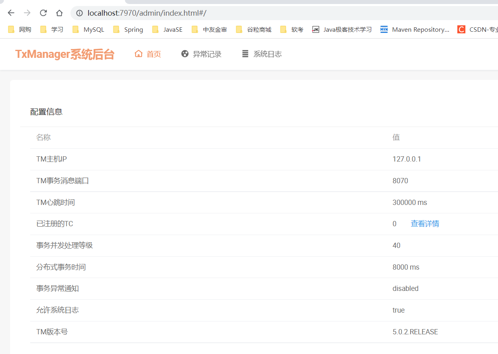 


**坑：eureka使用RestTemplate实现服务间的调用时我们通常都会直接将RestTemplate直接扔到spring容器中，bean方法上只加了个@Bean注解，这样会导致服务间调用会失败，他找不到这个服务。要在上面加上@LoadBalanced**

**网络解释：**原文地址：https://www.thinbug.com/q/38310904

此问题是由于Restrimplate不再在Brixton发布系列（Spring Cloud 1.1.0.RELEASE）中自动创建，因此RestTemplate无法使用服务发现正确解析[http://ACCOUNTS-SERVICE](http://accounts-service/)网址服务器

```java
	@Bean
    @LoadBalanced
    public RestTemplate getRestTemplate () {
        return new RestTemplate();
    }
```


本地方法事务使用@Transactional(rollbackFor = Exception.class)就行，但是服务间的调用回滚，我们使用LCN需要在启动类上加@EnableDistributedTransaction和接口层@LcnTransaction


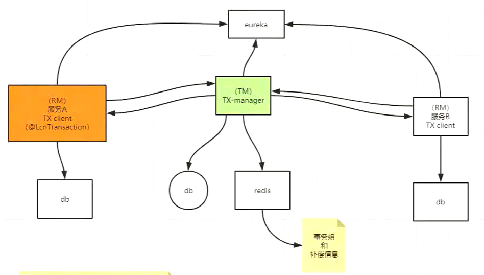 


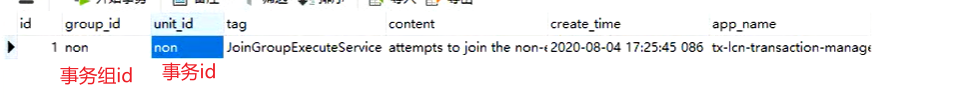 


**软件 架构：没有 银弹(一个办法无敌)**


## 面试货币-坐标系问题


**坐标系问题(基于LBS公司)**

高德：火星坐标(中国国测局GCJ-02)

地球坐标(WGS84,World Geoxx System)

百度坐标：在火星坐标上做了二次加密。偏移。bd09

高德、baidu(AR 导航)

============================

分析司机驾驶行为的时候用到的。

GPS的数据有哪些？

每个点(经纬度、时间、速度、海拔、方向......)

分析司机是否驾驶不平稳

============================

wifi定位。

基站定位。

轨迹纠偏。


## 2TM和TC

**集群TM**

tm启动多个没什么复杂的


client端的时候需要配置多个集群服务地址

``` java
tx-lcn:
  client:
    manager-address: 127.0.0.1:8071,127.0.0.1:8072
```

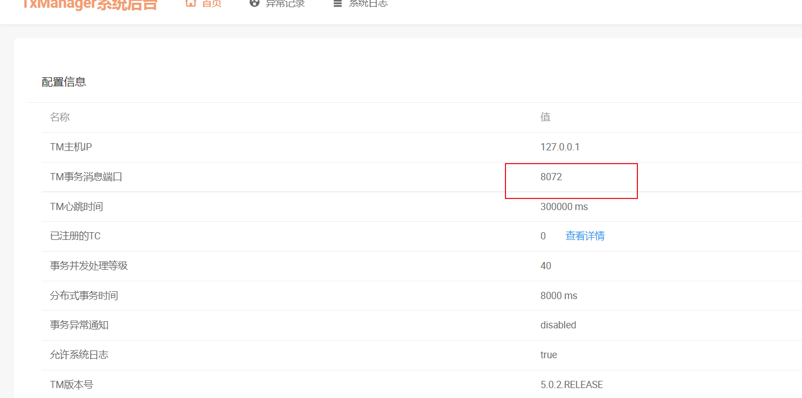 


### LCN配置手册和负载均衡

**文档：**https://www.codingapi.com/

**LCN分布式事务集群原理：当有事务请求客户端时，事务发起端会随机选择一个可用的TxManager作为事务控制方，然后告知其参与模块都与该模块通讯。(目前只提供随机机制)**

- 关于tx-lcn.client.manager-address的注意事项：

1. **客户端在配置上tx-lcn.client.manager-address地址后,启动时必须要全部可访问客户端才能正常启动。**
2. **当tx-lcn.client.manager-address中的服务存在不可用时，客户端会重试链接11次，超过次数以后将不在重试，重试链接的间隔时间为15秒，当所有的TxManager都不可访问则会导致所有的分布式事务请求都失败回滚。**
3. **当增加一个新的TxManager的集群模块时不需要添加到tx-lcn.client.manager-address下，TxManager也会广播到所有的TxManager端再通知所有链接中的TxClient端新的TxManager加入。**

**并没有百分之百解决分布式事务**


## TCC编程模型

TCC(Try Confirm Cancel)

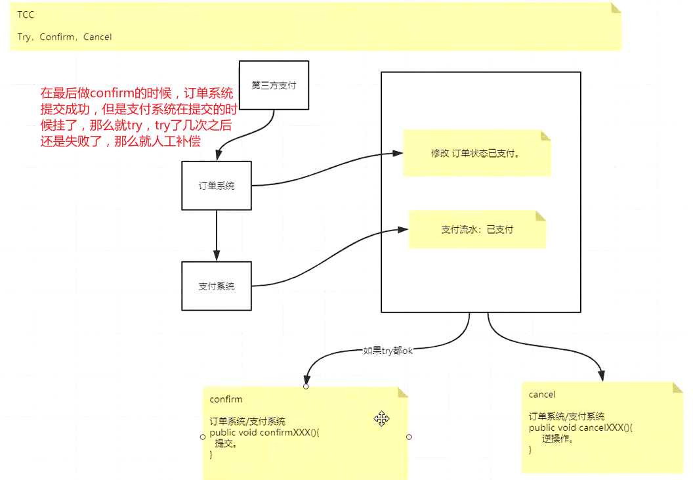

**但是上述可能性几乎不可能，可以忽略，不要因为非常非常低概率的事件提高系统复杂度增加研发成本**


**代码实现**

TM只要一台

OrderTCController

@TccTransaction中的方法的入参需要都相同，他将参数都给到异常方法或者提交方法中也就是confirm开头的和cancel开头的方法

```java
@RestController
public class OrderTccController {

    @Autowired
    private TblOrderDao tblOrderDao;

    @Autowired
    private RestTemplate restTemplate;

    @PostMapping("/add-order-tcc")
    @Transactional(rollbackFor = Exception.class)
    @TccTransaction(confirmMethod = "confirmAdd", cancelMethod = "cancelAdd")
    public String add(@RequestBody TblOrder bean){

        JSONObject date = new JSONObject();
        date.put("payName",bean.getOrderName()+"pay");

        //restTemplate.postForEntity("http://lcn-pay/add-pay-tcc",date,String.class);
        //异常
        tblOrderDao.insert(bean);
        ids.set(bean.getId());
        int i = 1/0;

        return "新增订单成功tcc";
    }

    ThreadLocal<Integer> ids = new ThreadLocal<>();

    /**
    **逆SQL
    **/
    public String confirmAdd(TblOrder bean){

        System.out.println("order tcc confirm");
        return "新增订单成功tcc confirm";
    }
    
    public String cancelAdd(TblOrder bean){
        System.out.println(ids.get());
        tblOrderDao.deleteByPrimaryKey(ids.get());
        System.out.println("order tcc cancel");
        return "新增订单成功tcc cancel";
    }

}
```

PayTCCController

```java
@RestController
public class PayTccController {

    @Autowired
    private TblPayDao tblPayDao;

    @PostMapping("/add-pay-tcc")
    @Transactional(rollbackFor = Exception.class)
    @TccTransaction
    public String addPay(@RequestBody TblPay bean){
        tblPayDao.insert(bean);
        ids.set(bean.getId());
        return "新增支付成功tcc";
    }

    ThreadLocal<Integer> ids = new ThreadLocal<>();

    public String confirmAddPay(TblPay bean){

        System.out.println("pay confirm");
        //tblPayDao.insert(bean);

        return "新增支付成功tcc confirm";
    }

    public String cancelAddPay(TblPay bean){
        System.out.println("pay cancel");
        tblPayDao.deleteByPrimaryKey(ids.get());
        return "新增支付成功tcc cancel";
    }
}
```


**TCC模式下，如果一个是成功一个是异常的话，他会让两个服务都走cancel方法，要两边都成功才会走confirm方法 **


**业务比较简单的场景使用TCC,一般用自带事务特性的中间件不需要用TCC(比如mysql)，因为没必要，还增加了业务的复杂度**

例如：MongoDB，redis，或者要删除文件的业务

总结使用场景：

带事务的中间件比如mysql......用lcn

其他没有事务的中间件，比如redis......用tcc


## 使用TCC操作redis

引入Redis

```xml
<dependency>
     <groupId>org.springframework.boot</groupId>
     <artifactId>spring-boot-starter-data-redis</artifactId>
</dependency>
```


**LCN和TCC可以混合着使用**

**涉及到分布式事务业务简单，少的情况下，可以使用tcc**


## 源码


第一个接受到请求的服务叫starting发起者

 LCN：关键点 **代理数据源连接**，代理connection，

接管connection，代理数据源连接LcnConnectionProxy、DataSourceAspect

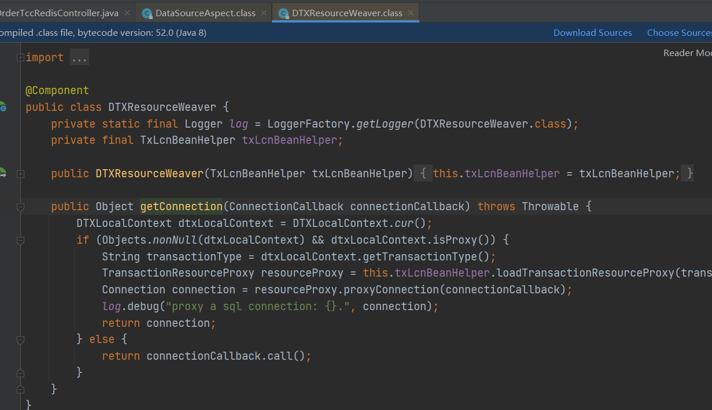

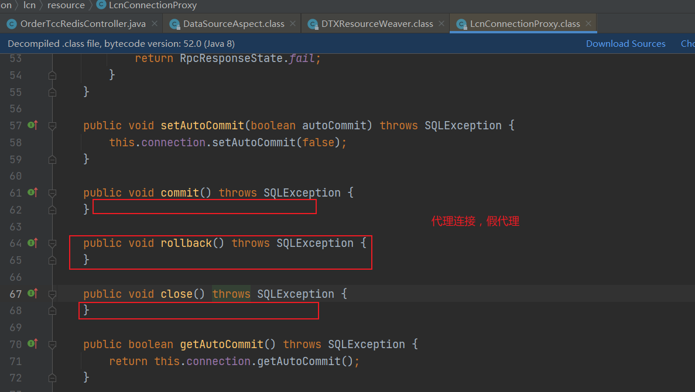

spring中看源码，全局搜索注释：@annotation(com.codingapi.txlcn.tc.annotation.TxTransaction)

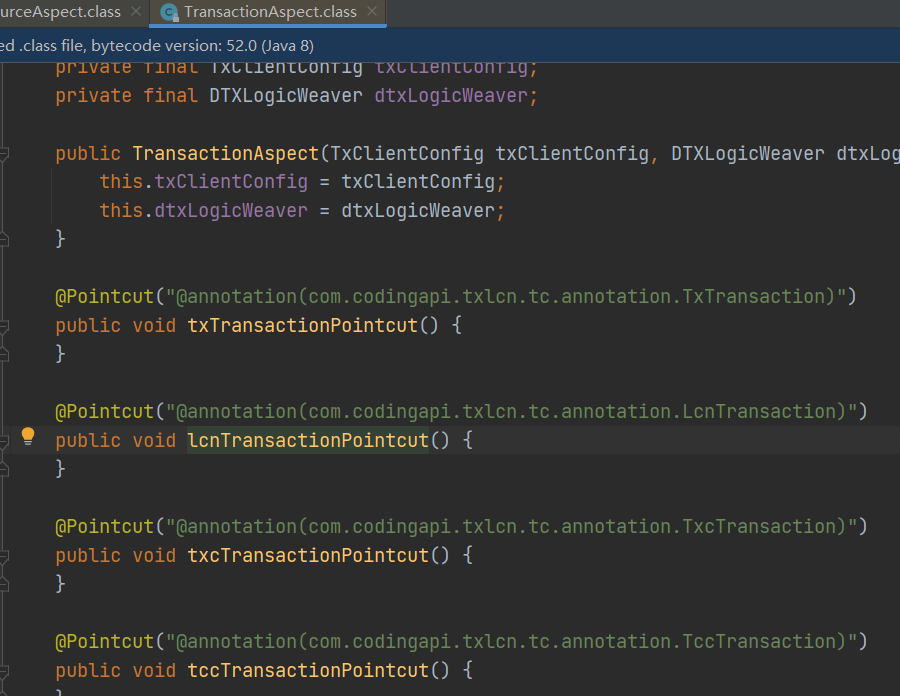

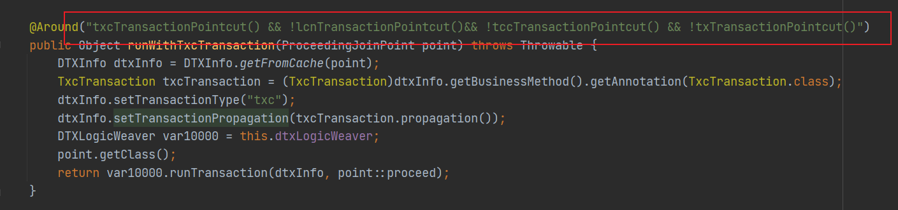


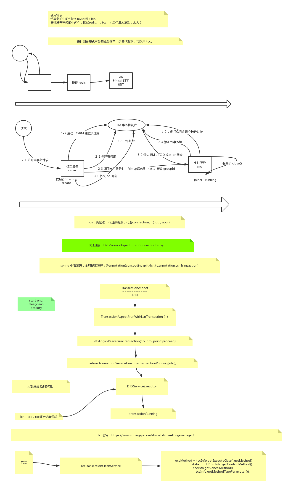

## 分布式事务最终一致性方案一


## 可靠消息最终一致性方案

支付服务和订单服务一条链路上的操作是一个事务

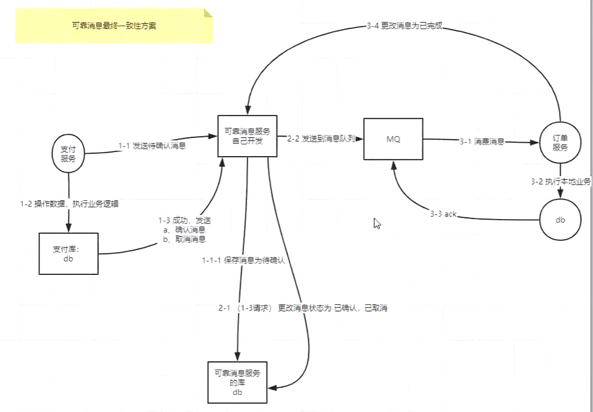 

1-1发送待确认消息，操作本地数据库（消息为待确认消息），执行业务逻辑。如果成功，给可靠消息服务发送确认消息，如果失败（1-2失败）则发送取消消息。

接受到待发送消息的时候把消息存库（1-1-1），保存消息为待确认，1-3发送确认或取消之后2-1会更新可靠消息服务的db。如果消息为确认的话就把消息发送到消息队列。

有消息发送到MQ的时候，订单服务就进行消息消费对消息进行确认，消费完之后执行本地事务（3-2），执行完之后确认（ack）,完成之后再告诉可靠消息服务把原来的消息变成已完成。


2-2发送失败有没有补偿机制？可靠消息服务表里面的数据是不是为待确认？

定时任务，如果长时间都是待确认的，我们就要回查。支付服务提供回查接口，回查消息状态，返回消息状态

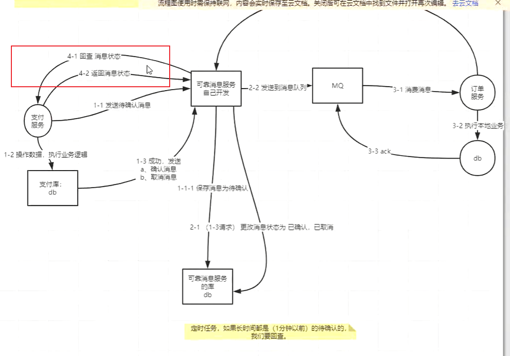

2-2发送失败有没有补偿机制？可靠消息服务表里面的数据是不是为待确认？

**也可以在可靠消息服务中自己维护发送失败的消息，库表中对数据字段分为5中状态，待确认、待发送、已发送、已完成、取消**

**可靠消息服务把消息发送到队列中的时候将消息修改为已发送，定时任务会定时去扫库表，扫到待发送的数据就重新调用回查接口，回查接口调用可靠消息服务，如果长时间都是待发送状态的就调用这边的回查接口，再把它变成待发送，或者是把它变成取消。**

**如果是已发送的长时间没有变成已完成的，我们则需要通过可靠消息服务在发送到队列**

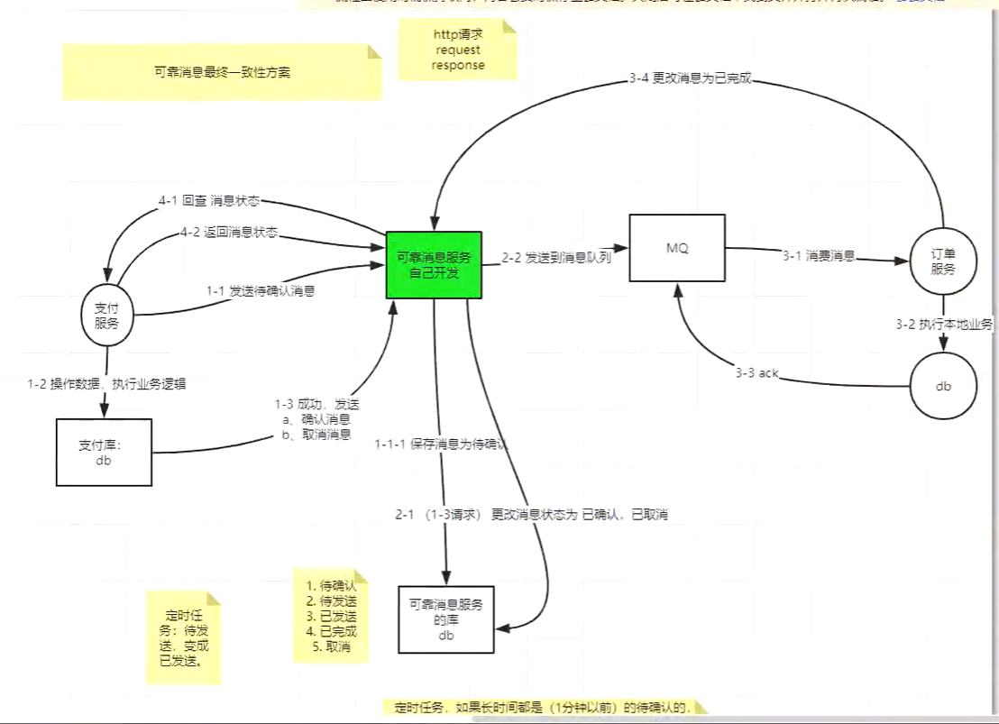

 

**优势：吞吐量大，响应快，可以提高并发量**

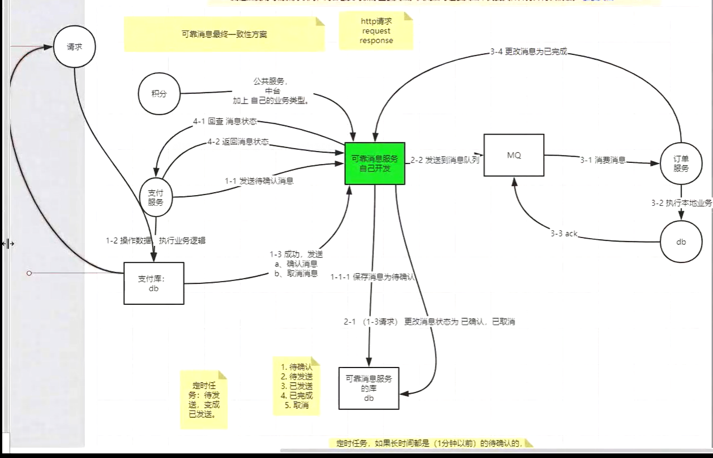

把整条调用链路变成了：调用单体的单个功能。


**扩展：**

怎么才能更大的提高并发量？

**我们可以把主要的服务往前面放，提高响应速率，后面其他行为服务都可以通过消息队列慢慢处理**

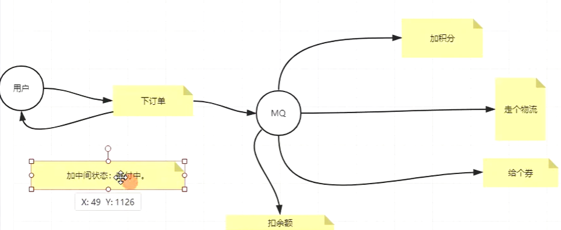


第三方支付查询订单是否成功的接口

**直接支付完马上发起查询，然后就返回结果，这样能解决等待异步返回结果的时间，如果第三方支付还没有结果那么就只能等了**

**用户支付请求到服务端的时候，服务端去调用第三方的支付接口，等待第三方支付接口返回结果或者主动查询，如果第三方返回慢的话，服务端可以先将订单状态修改为支付中后返回给用户，有结果之后再把支付中改成已支付或者支付失败，只要保证数据的最终一致性就行了。**


**高并发分布式事务的：一定有消息队列。**


## Seata 分布式事务框架

高并发分布式事务的解决：消息队列。


**面试之前一定要和面试官把概念先统一了。**

LCN中的TC是Transaction Client 事务参与者


**TC(Transaction Coordinator)事务协调者**


 


**seata支持的事务模式**

**AT、TCC、SAGA、XA**


## AT

**本地锁+全局锁**


AT模式下他将提交业务数据和回滚日志


**RM1和RM2在一阶段提交本地事务的时候要获取一把全局锁**，为什么要获取全局锁？

**因为他要保证RM1和RM2的提交要在一个整体的事务中。**


seata用事务的回滚日志来保证他的回滚，记录了提交前和提交后的数据是什么


如果第一阶段中有一个为no，那么就让他回滚（依据事务日志回滚），


如果回滚失败会怎么做？再滚一次，重试。

如果回滚的过程中数据挂了呢？

**数据库挂掉的情况(有记录日志，可以重试)>SQL出错的情况， 等数据库启动之后有日志可以重试**


**seata的两阶段有一个本地锁和全局锁的概念。**


如果没有获取到全局锁，他就不会去提交本地事务。

RM1要提交本地事务之前，要获取到一把全局锁（RM1和RM2事务中共有的一把锁），获取到全局锁之后再一次提交RM1和RM2。


### 关于seata事务模式的举例


#### 本地锁和全局锁的使用

 分布式事务1和分布式事务2相当于是两个一起发起的同一个controller的方法

针对每一个RM来说的

要先拿到全局锁才提交本地事务（全局事务有一个事务id）

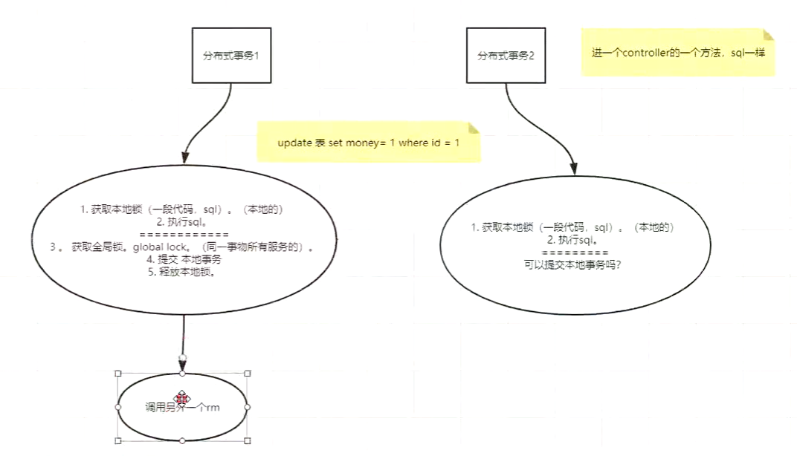

没有获取全局锁，不能提交本地事务。


使用了全局锁相当于锁住了所有当前事务的SQL，分布式事务1还没有将全局锁释放，分布式事务2是无法提交的，分布式事务2重复的获取全局锁(有超时时间，如果超时了他就会把自己回滚)。当全局提交之后，释放全局锁，事务2才能开始做自己的业务

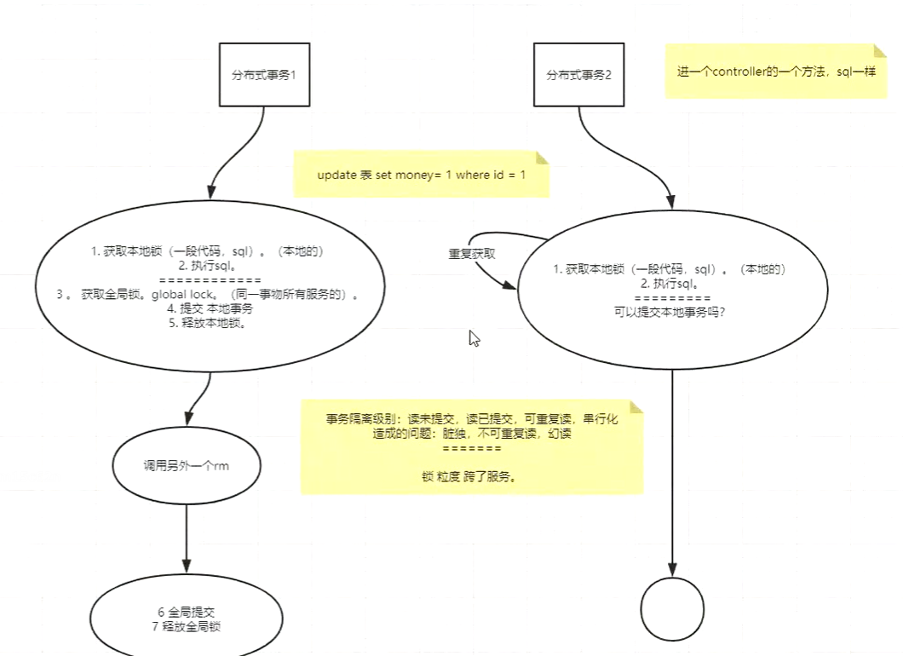


**全局锁锁的是某一条事务**

本地锁其实就相当于是数据库上非常普通的本地锁，**全局锁回滚全局的，本地锁回滚本地的**

同一个事务可以跨多个锁：用一个拦截器拦住，给整个请求方法加锁用的


**如果本地锁是在controller里面，怎么控制controller里面那两个事务发起的提交呢？**

**他有一个全局事务和分支事务，这两个事务都会注册到TC中**


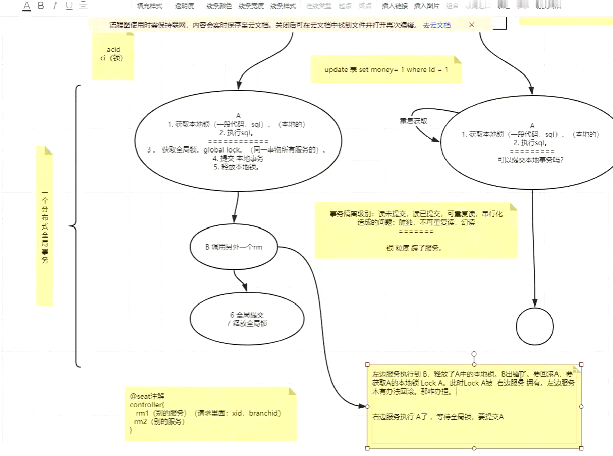


**3和4步骤是保证事务并发的时候的写隔离**

**问题：如果左边的服务提交之后释放了本地锁A，占用了全局锁，右边服务执行完SQL之后拿到本地锁，但是因为全局锁在左边服务中，所以他只能等待 左边服务释放全局锁才能提交，若果左边服务到了B阶段之后报错了，要回滚了，左边的服务要去拿本地锁，但是本地锁被右边的服务占用这没办法拿到。这时候该怎么办呢？等到节点1后，拿到本地锁，开始回滚 **


右边服务尝试获取全局锁失败后放弃，他就自己回滚了，释放本地锁（节点1）

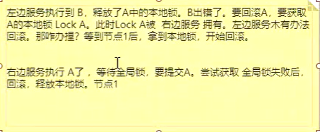 


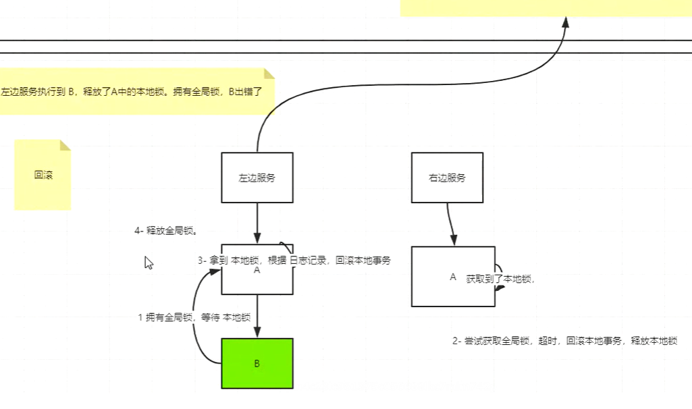


**为什么不直接用全局锁，而要混着用呢？**

可以提高一下并发的效率，右边在没拿到全局锁的时候本地事务的操作就已经能够和左边并行了，当左边服务执行到B的时候，右边服务也执行了，但是如果出现 就是左边服务在等本地锁的时候，右边服务一直在进请求导致本地锁一直不能释放的情况只能鸵鸟算法了(摆烂)。

回滚的时候左边在获取本地锁时，如果迟迟没有获取到，全局锁也会超时，没有响应那么就都回滚


**3和4步骤是保证事务并发时候的写隔离**


**读隔离只代理select for update**

如果左边操作A数据，而右边的服务要读取A数据，让他读吗？

如果是普通的select * from 表名的话就让读，但是如果是select for update就不会让他读，这是由seata控制的。


select for update会降低性能，但是能保持一致性

6

 


**seata中的select for update也要获取全局锁**


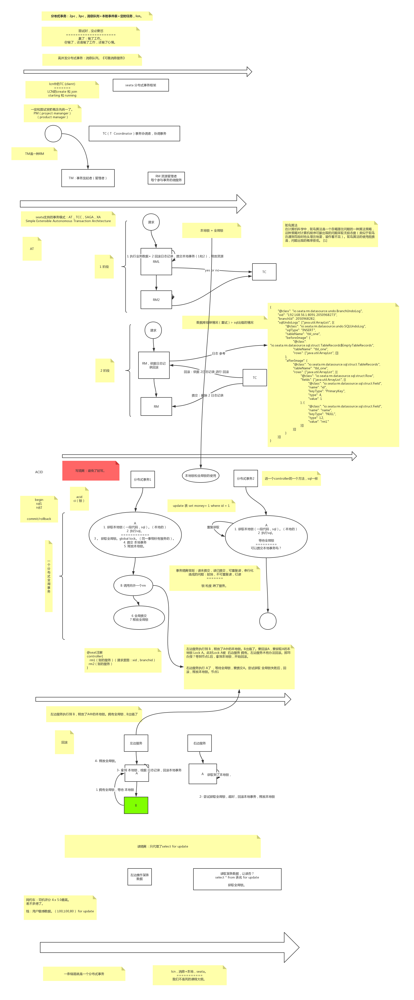


## TCC编程模型


**TCC数据脏读的问题**

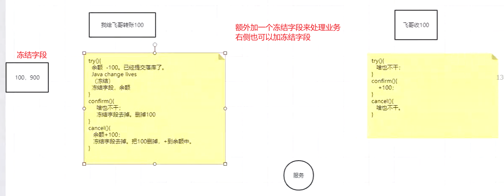


### TCC的三个异常情况


**空回滚、幂等、悬挂**


**空回滚**

**try未执行，Cancel执行**

**一个事务进来先执行了try，当执行try的时候里面有一个非常耗时的业务没有把try执行完。try落库超时，还没执行完try就执行了cancel。try由于某个原因超时了。**

解决方案：**加标记(加事务控制表)。  try没有执行完，cancel执行的时候看事务控制表中数据还是为try，发现他没执行完，就执行空操作**

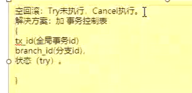 


**幂等**

多次执行cancel，confirm

**confirm没有成功或者cancel没有成功他会重试**

解决方案：**也是加一张事务管理表**

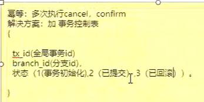 

**悬挂**(Cancel在try之前) 

执行try的时候超时了很长时间没有反馈，然后就把cancel执行了，把cancel执行之后，结果try网络通了继续执行。

**cancel的时候新增一条记录（如果原来没有记录，那么就执行空方法，再插入已回滚记录...try执行的时候发现有记录，空try）**

**等他等超时，而不是他不执行了**

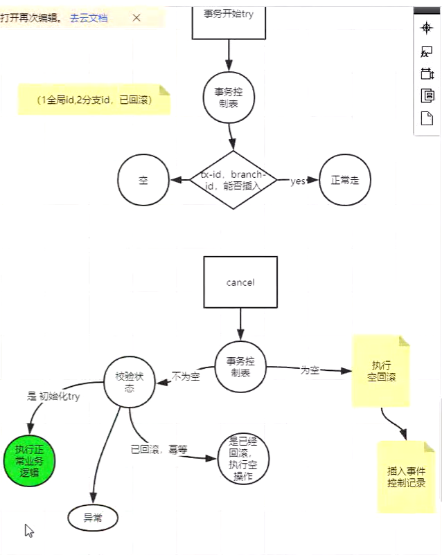 

异常情况是基本上不会发生的

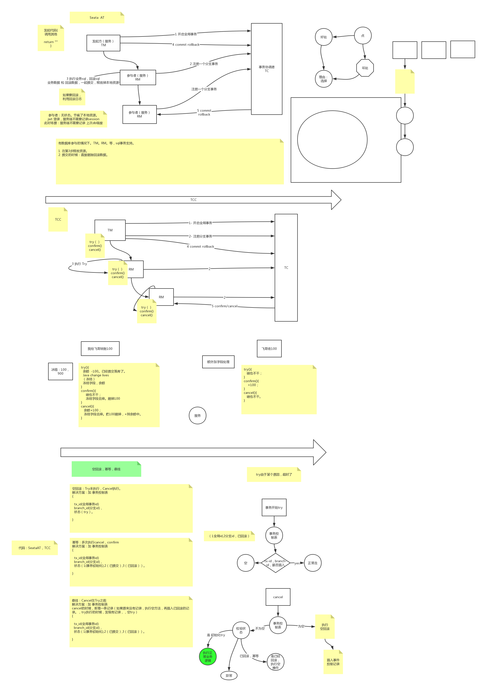

## 搭建Seata

### 搭建TC

1. 下载seata-server

   ```
   https://seata.io/zh-cn/blog/download.html
   ```

2. 修改配置

   **registry.conf**

   ​	注册中心：eureka

   ​	配置中心：file

   **file.conf**

   ​	服务信息：

   ​	存储：注意jdbc驱动。

   

   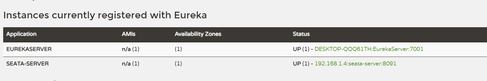

3. 

### TM


### RM


# Seata


# eureka

启动


## 搭建TC

1. 下载 seata-server

   ```html
   http://seata.io/zh-cn/blog/download.html
   ```

   

2. 修改配置。

   registry.conf

   ```yml
   注册中心 eureka
   #写的file就是从本地获取配置参数
   配置中心 file
   ```

    

   file.conf

   ```yml
   服务信息
   存储
   
   注意：jdbc驱动。
   
   jar包：xml里：2，开发不需要知道线上敏感信息。
   
   
   ```


# setat-server-db

自己建库，自己建表。

数据库名和 file.conf中一致。

```sql
分支事务表
CREATE TABLE `branch_table` (
  `branch_id` bigint(20) NOT NULL,
  `xid` varchar(128) NOT NULL,
  `transaction_id` bigint(20) DEFAULT NULL,
  `resource_group_id` varchar(32) DEFAULT NULL,
  `resource_id` varchar(256) DEFAULT NULL,
  `branch_type` varchar(8) DEFAULT NULL,
  `status` tinyint(4) DEFAULT NULL,
  `client_id` varchar(64) DEFAULT NULL,
  `application_data` varchar(2000) DEFAULT NULL,
  `gmt_create` datetime(6) DEFAULT NULL,
  `gmt_modified` datetime(6) DEFAULT NULL,
  PRIMARY KEY (`branch_id`),
  KEY `idx_xid` (`xid`)
) ENGINE=InnoDB DEFAULT CHARSET=utf8;

全局事务表
CREATE TABLE `global_table` (
  `xid` varchar(128) NOT NULL,
  `transaction_id` bigint(20) DEFAULT NULL,
  `status` tinyint(4) NOT NULL,
  `application_id` varchar(32) DEFAULT NULL,
  `transaction_service_group` varchar(32) DEFAULT NULL,
  `transaction_name` varchar(128) DEFAULT NULL,
  `timeout` int(11) DEFAULT NULL,
  `begin_time` bigint(20) DEFAULT NULL,
  `application_data` varchar(2000) DEFAULT NULL,
  `gmt_create` datetime DEFAULT NULL,
  `gmt_modified` datetime DEFAULT NULL,
  PRIMARY KEY (`xid`),
  KEY `idx_gmt_modified_status` (`gmt_modified`,`status`),
  KEY `idx_transaction_id` (`transaction_id`)
) ENGINE=InnoDB DEFAULT CHARSET=utf8;


全局锁
CREATE TABLE `lock_table` (
  `row_key` varchar(128) NOT NULL,
  `xid` varchar(96) DEFAULT NULL,
  `transaction_id` bigint(20) DEFAULT NULL,
  `branch_id` bigint(20) NOT NULL,
  `resource_id` varchar(256) DEFAULT NULL,
  `table_name` varchar(32) DEFAULT NULL,
  `pk` varchar(36) DEFAULT NULL,
  `gmt_create` datetime DEFAULT NULL,
  `gmt_modified` datetime DEFAULT NULL,
  PRIMARY KEY (`row_key`),
  KEY `idx_branch_id` (`branch_id`)
) ENGINE=InnoDB DEFAULT CHARSET=utf8;


```


## TM

one

db：seata-rm-one

业务：插入tbl_one

 


下面两个配置，不配置也行，走默认8091。

registry.conf

file.conf


pom

```xml
<dependency>
            <groupId>com.alibaba.cloud</groupId>
            <artifactId>spring-cloud-alibaba-seata</artifactId>
            <version>2.2.0.RELEASE</version>
        </dependency>
```


注解：

```java
@GlobalTransactional(rollbackFor = Exception.class)
```


undo log

```sql
CREATE TABLE `undo_log` (
  `id` bigint(20) NOT NULL AUTO_INCREMENT,
  `branch_id` bigint(20) NOT NULL,
  `xid` varchar(100) NOT NULL,
  `context` varchar(128) NOT NULL,
  `rollback_info` longblob NOT NULL,
  `log_status` int(11) NOT NULL,
  `log_created` datetime NOT NULL,
  `log_modified` datetime NOT NULL,
  `ext` varchar(100) DEFAULT NULL,
  PRIMARY KEY (`id`),
  UNIQUE KEY `ux_undo_log` (`xid`,`branch_id`)
) ENGINE=InnoDB AUTO_INCREMENT=45 DEFAULT CHARSET=utf8;


```


## RM

two

db：seata-rm-two

业务：插入tbl_two

下面两个配置，不配置也行，走默认8091。

registry.conf

file.conf

pom

```xml
<dependency>
            <groupId>com.alibaba.cloud</groupId>
            <artifactId>spring-cloud-alibaba-seata</artifactId>
            <version>2.2.0.RELEASE</version>
        </dependency>
```


three

db：seata-rm-three

业务：插入tbl_three

下面两个配置，不配置也行，走默认8091。

registry.conf

file.conf

pom

```xml
<dependency>            
    <groupId>com.alibaba.cloud</groupId>            
    <artifactId>spring-cloud-alibaba-seata</artifactId>            
    <version>2.2.0.RELEASE</version>        
</dependency>
```


注解：

```java
@GlobalTransactional(rollbackFor = Exception.class)
```


全局事务表会记录回滚事务吗？

**全局事务表不记录回滚事务，因为他只有一条事务（chow  一个全局事务+3个分支事务）**


undo log

```sql
CREATE TABLE `undo_log` 
(  `id` bigint(20) NOT NULL AUTO_INCREMENT,  `branch_id` bigint(20) NOT NULL,  `xid` varchar(100) NOT NULL,  `context` varchar(128) NOT NULL,  `rollback_info` longblob NOT NULL,  `log_status` int(11) NOT NULL,  `log_created` datetime NOT NULL,  `log_modified` datetime NOT NULL,  `ext` varchar(100) DEFAULT NULL,  PRIMARY KEY (`id`),  UNIQUE KEY `ux_undo_log` (`xid`,`branch_id`)) ENGINE=InnoDB AUTO_INCREMENT=45 DEFAULT CHARSET=utf8;
```


# 脚本

```html
https://github.com/seata/seata/tree/1.2.0/script
```


# setat-server-db

自己建库，自己建表。

数据库名和 file.conf中一致。

```sql
分支事务表
CREATE TABLE `branch_table` (
  `branch_id` bigint(20) NOT NULL,
  `xid` varchar(128) NOT NULL,
  `transaction_id` bigint(20) DEFAULT NULL,
  `resource_group_id` varchar(32) DEFAULT NULL,
  `resource_id` varchar(256) DEFAULT NULL,
  `branch_type` varchar(8) DEFAULT NULL,
  `status` tinyint(4) DEFAULT NULL,
  `client_id` varchar(64) DEFAULT NULL,
  `application_data` varchar(2000) DEFAULT NULL,
  `gmt_create` datetime(6) DEFAULT NULL,
  `gmt_modified` datetime(6) DEFAULT NULL,
  PRIMARY KEY (`branch_id`),
  KEY `idx_xid` (`xid`)
) ENGINE=InnoDB DEFAULT CHARSET=utf8;

全局事务表
CREATE TABLE `global_table` (
  `xid` varchar(128) NOT NULL,
  `transaction_id` bigint(20) DEFAULT NULL,
  `status` tinyint(4) NOT NULL,
  `application_id` varchar(32) DEFAULT NULL,
  `transaction_service_group` varchar(32) DEFAULT NULL,
  `transaction_name` varchar(128) DEFAULT NULL,
  `timeout` int(11) DEFAULT NULL,
  `begin_time` bigint(20) DEFAULT NULL,
  `application_data` varchar(2000) DEFAULT NULL,
  `gmt_create` datetime DEFAULT NULL,
  `gmt_modified` datetime DEFAULT NULL,
  PRIMARY KEY (`xid`),
  KEY `idx_gmt_modified_status` (`gmt_modified`,`status`),
  KEY `idx_transaction_id` (`transaction_id`)
) ENGINE=InnoDB DEFAULT CHARSET=utf8;


全局锁
CREATE TABLE `lock_table` (
  `row_key` varchar(128) NOT NULL,
  `xid` varchar(96) DEFAULT NULL,
  `transaction_id` bigint(20) DEFAULT NULL,
  `branch_id` bigint(20) NOT NULL,
  `resource_id` varchar(256) DEFAULT NULL,
  `table_name` varchar(32) DEFAULT NULL,
  `pk` varchar(36) DEFAULT NULL,
  `gmt_create` datetime DEFAULT NULL,
  `gmt_modified` datetime DEFAULT NULL,
  PRIMARY KEY (`row_key`),
  KEY `idx_branch_id` (`branch_id`)
) ENGINE=InnoDB DEFAULT CHARSET=utf8;
```


## TCC


TCC没有全局锁的概念


1. tcc

   ```java
   @LocalTCCpublic 
   interface RmOneInterface {	
    // 制定  confirm  和 cancel    
       @TwoPhaseBusinessAction(name = "rm1TccAction" , commitMethod = "rm1Commit" ,rollbackMethod = "rm1Rollback")    
       public String rm1(BusinessActionContext businessActionContext);    
       
       public boolean rm1Commit(BusinessActionContext businessActionContext);   
       
       public boolean rm1Rollback(BusinessActionContext businessActionContext);
       
   }
   ```
   


**try，confirm，cancel 中独立事务。通过业务做回滚。**

此时不用undo.log表了。


**tcc场景：（!（支持acid事务的关系型数据库） 和 一切  ）。**

不支持关系型数据库的场景


1.混合场景。2。独立场景。


## 看源码的方法


**seata 源码**：黄师傅 五期源码课里有。


spring boot方法。找spring.factories


**SeataAutoConfiguration**


process、Intercept


从 日志 中 看执行流程。全局去搜 关键字。


---


10年内 | 近两家


---

|        | 2pc  | tcc  | 消息队列 |      |
| ------ | ---- | ---- | -------- | ---- |
| 一致性 | 强   | 最终 | 最终     |      |
| 吞吐量 | 低   | 中等 | 高       |      |
| 复杂度 | 简单 | 复杂 | 中等     |      |


seata锁的是什么？


 

消息队列+本地事件表

业务+事务消息

可靠服务消息


**建表语句在github的官方都有**


## 最大努力通知

一般用在第三方系统调用中。

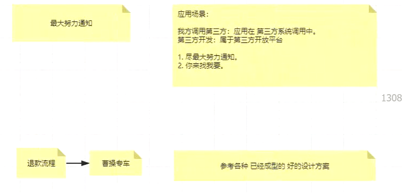 

## 结合事务消息

订单服务


支付服务


## 回顾请求图和rocketmq使用


rocket会定时的去扫描half msg，如果发现有长时间未确认的，他会去服务回查第三步的业务是否是执行成功的，如果回查的结果是yes那么就把他提交了，如果no那么就回滚删掉(6跟4.1、4.2步骤一样)。


rocketmq默认消费十六次后扔到死信队列中

**回查的时候查事务表**

## 编码

启动顺序

namesrv

```sh
 start mqnamesrv.cmd
```

broker

```sh
start mqbroker.cmd -n 127.0.0.1:9876 autoCreateTopicEnable=true
```

externals界面

```sh
java -jar rocketmq-console-ng-1.0.1.jar
```

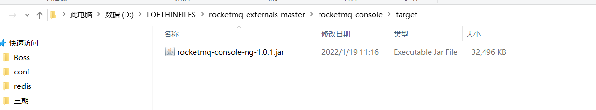


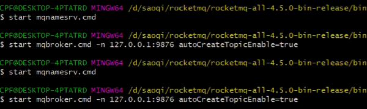 

启动问题的坑

https://www.jb51.net/article/163544.htm

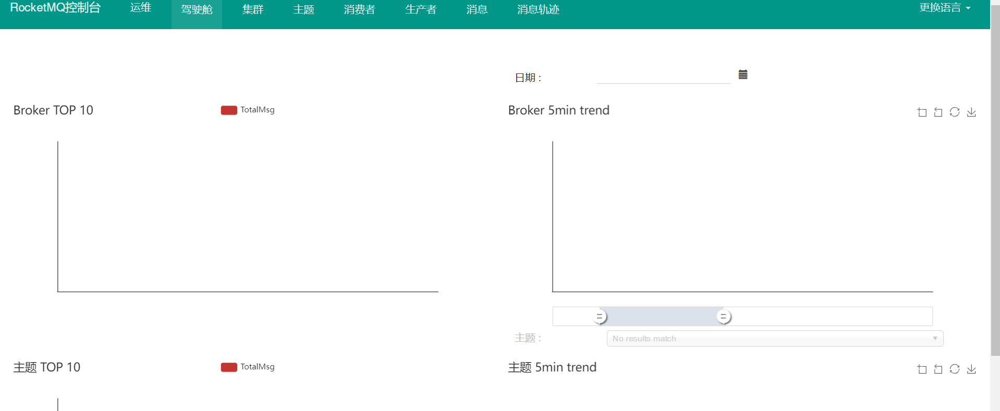


```xml
  <!--    rocketmq的jar包    -->
        <dependency>
            <groupId>org.apache.rocketmq</groupId>
            <artifactId>rocketmq-spring-boot-starter</artifactId>
            <version>2.0.2</version>
        </dependency>

        <!--json lib-->
        <dependency>
            <groupId>net.sf.json-lib</groupId>
            <artifactId>json-lib</artifactId>
            <version>2.4</version>
        </dependency>

        <dependency>
            <groupId>org.springframework.boot</groupId>
            <artifactId>spring-boot-starter-web</artifactId>
        </dependency>


        <!--mysql-->
        <dependency>
            <groupId>mysql</groupId>
            <artifactId>mysql-connector-java</artifactId>
            <version>8.0.19</version>
        </dependency>

        <dependency>
            <groupId>org.mybatis.spring.boot</groupId>
            <artifactId>mybatis-spring-boot-starter</artifactId>
            <version>2.0.0</version>
        </dependency>

        <dependency>
            <groupId>com.alibaba</groupId>
            <artifactId>druid</artifactId>
            <version>1.1.12</version>
        </dependency>

```


**回查多次失败只能人工补偿**


## 总结分布式事务

2pc(协调者超时 回滚，占用连接，)

3pc (2pc的第一阶段 拆成了 2个阶段，协调者和参与者都超时，pre超时是回滚，do 超时是提交)。

tcc（2pc的第二阶段 拆成了2个阶段，不占用连接，性能高，但是麻烦）(简单业务可以tcc)。

lcn(lcn,tcc)(代码)

seata(at,tcc)（代码）

消息队列+本地事件表（代码）

最大努力通知

可靠消息服务

消息事务（代码）


​	