# 分布式锁

JVM是解决不了分布式集群里的锁的

## 分布式锁场景

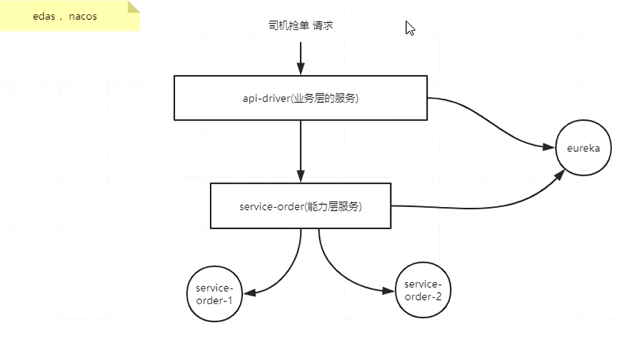

如果不用分布式锁的控制的话就会产生两个司机抢一个订单的情况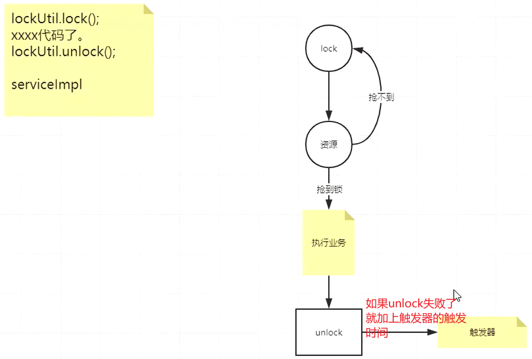

程序的执行是在锁的有效期内的， 如果锁的有效期是10分钟，程序8分钟执行之后会把锁放掉，这个锁就被删除了。如果8分钟的程序执行了12分钟，锁也过期了。如果这时候另外一个程序进来了也是锁同样的订单，他执行了5分钟，这时候12分钟的锁刚刚要去释放的时候，把才执行了5分钟的key给释放掉remove了，两个id为什么一样？因为要抢同一个订单，同一个资源，就有可能发生这个情况

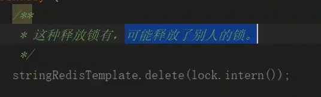 

**谁加的锁谁释放自己的锁**

可以在value中设置自己的值

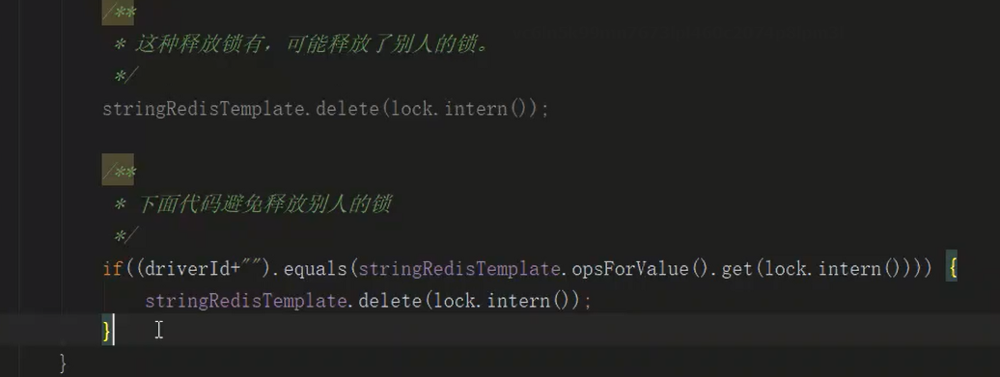

还有一个解决办法就是起一个守护程序去续期，在业务没有执行完的时候不释放锁

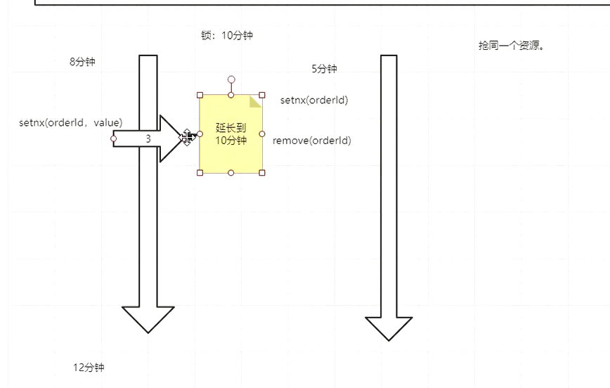

**如果锁的有效期是10分钟**

**一般做法：在程序执行了3分钟的时候去执行，如果key还在，则延时**

**启动了哨兵之后原来的redis就用不了啦**

### 红锁

只有红锁才能解决redis的问题

弄三个独立的redis

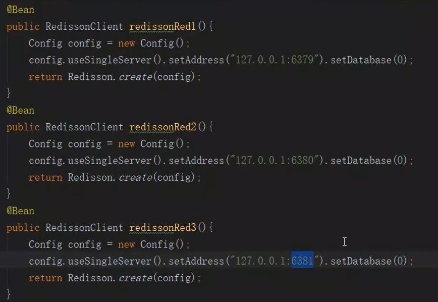 

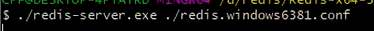 

**RedLock**

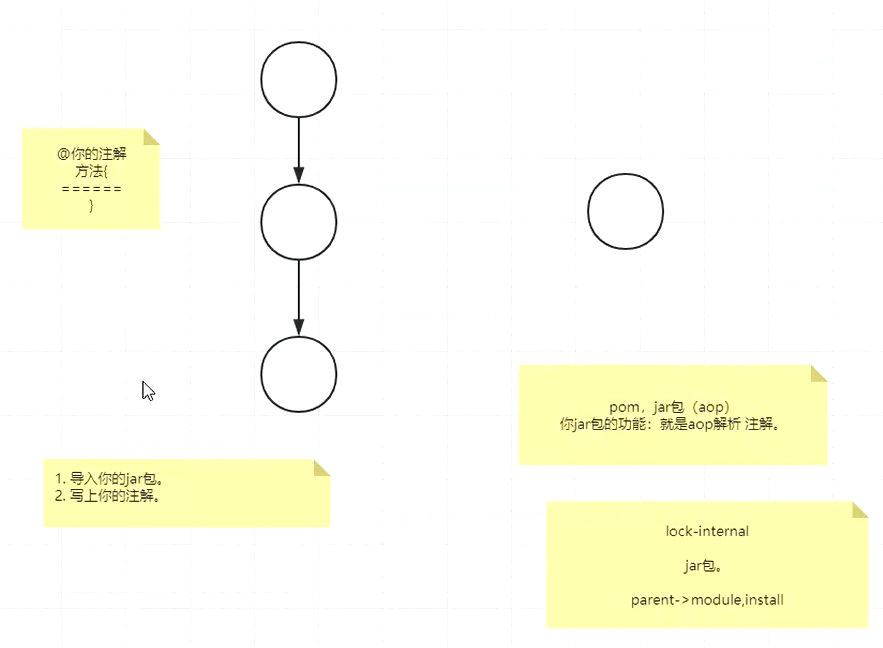

**lua脚本**

分布式锁的几个条件

- 互斥性，在同一时间只有一个能够拿到
- 防死锁
- 自己解自己的锁
- 容错性

### 红锁的流程

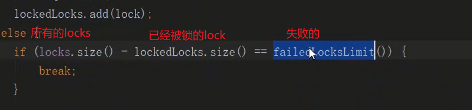

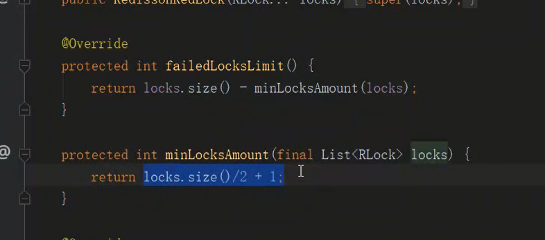

获取当前时间

按照一定的顺序逐个加锁

超时时间要比锁的过期时间短

**加锁失败：**

1、加锁的时间>锁的有效期

2、未过半

如果加锁失败那么就把所有的锁都释放，执行del

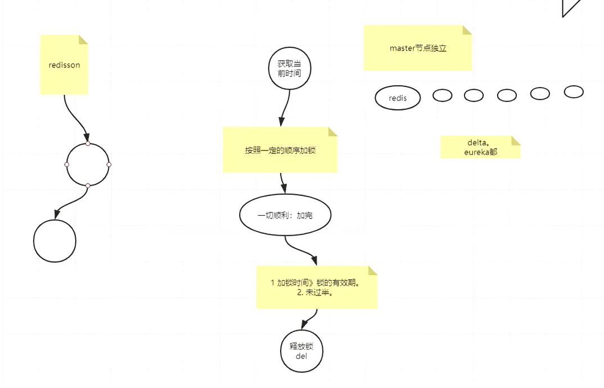

有可能线程1去加锁的时候，给1、2、3加锁的时候恰好3号挂了，然后恰好线程3没有做数据的持久化，那么当线程2进来的时候去给3、4、5加锁的时候会造成两个客户端都持有这个锁的情况，违反了互斥性

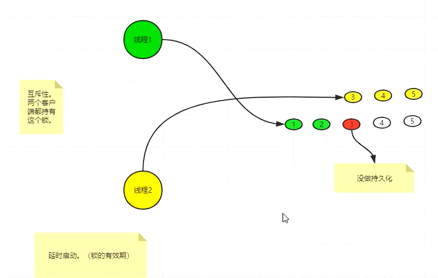

这时候则需要运维延时启动redis，延时的时间为锁的有效期。

新分布式锁精讲

### 单体服务jvm锁解决超卖

使用synchronize重量级锁来解决超卖。

缺点：慢

### 集群以及集群超卖原因分析

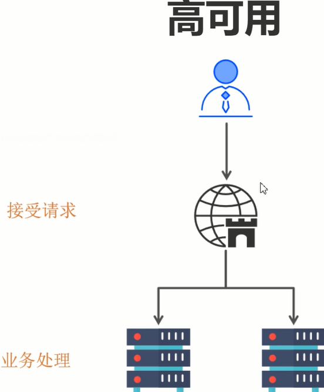 

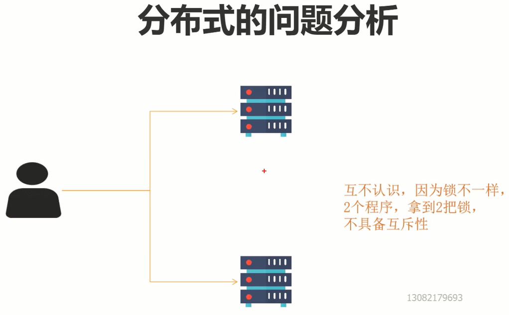 

两把锁 不具备互斥性。

### 分布式锁思路分析

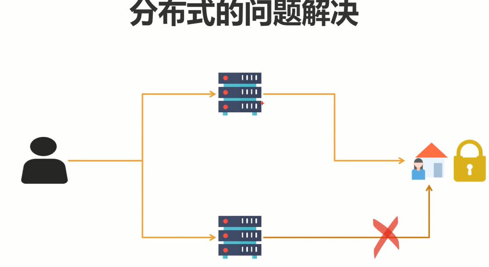

加锁的时候使用第三方中间人的地方加锁，在分布式系统中第三方是非常重要的

1、可以使用mysql

2、redis

3、zookeeper

### mysql分布式锁&性能分析

性能的高低和配置相关。

使用mysql当第三方锁中间件成本太高了

### redis分布式锁原理

应用比较广泛

Redis单节点方案

SETNX （set if not exists）

有加锁的动作一定要有释放锁的动作

### redis中死锁的现象

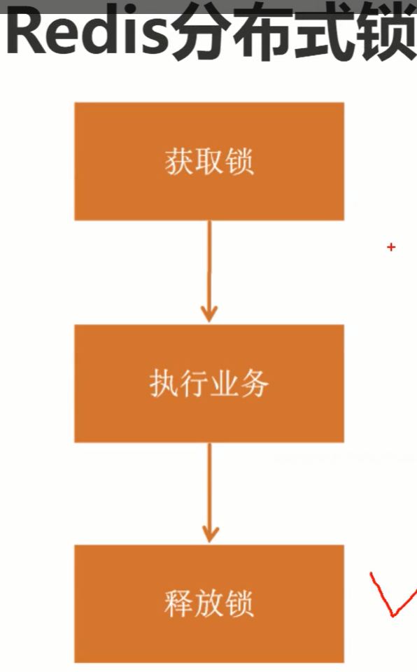

加完锁之后，但是服务在执行业务的时候挂掉了，没办法去释放锁，则会造成死锁的现象

### redis死锁的解决办法

设置超时时间ttl来解决死锁的问题

需要是一个原子操作。

### redis过期时间引发的两个问题

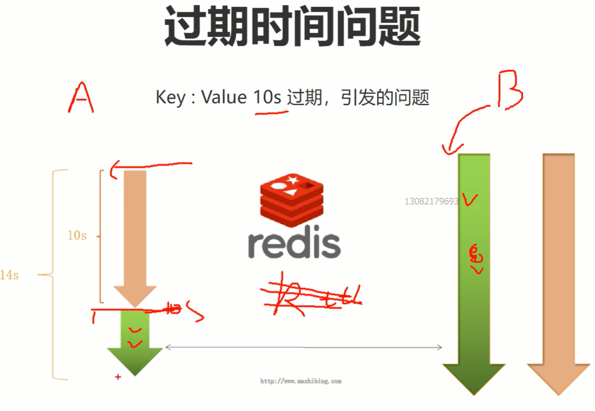 

1、程序还没有执行完，锁过期了

2、删除了别人加的锁

### redis两个问题解决方案

 如果程序没有执行完，锁过期了怎么解决？

加一个“看门狗”，给锁续期。

setnx  k v1

开启另外一个线程去get key = v

如果v1 = v，并且30秒了，则会给他延长续期

watch dog

如何防止释放别人的锁

在value中动手，if(getKey() == 我自己的值) ｛就删除这个key｝ else{不操作}

### 分段锁提升redis锁的性能

使用分段锁来提升，锁不同阶段的库存

### redis集群的问题

单节点故障，使用多个redis节点来支撑这个加锁的业务，例如：一主二从三哨兵

### 红锁

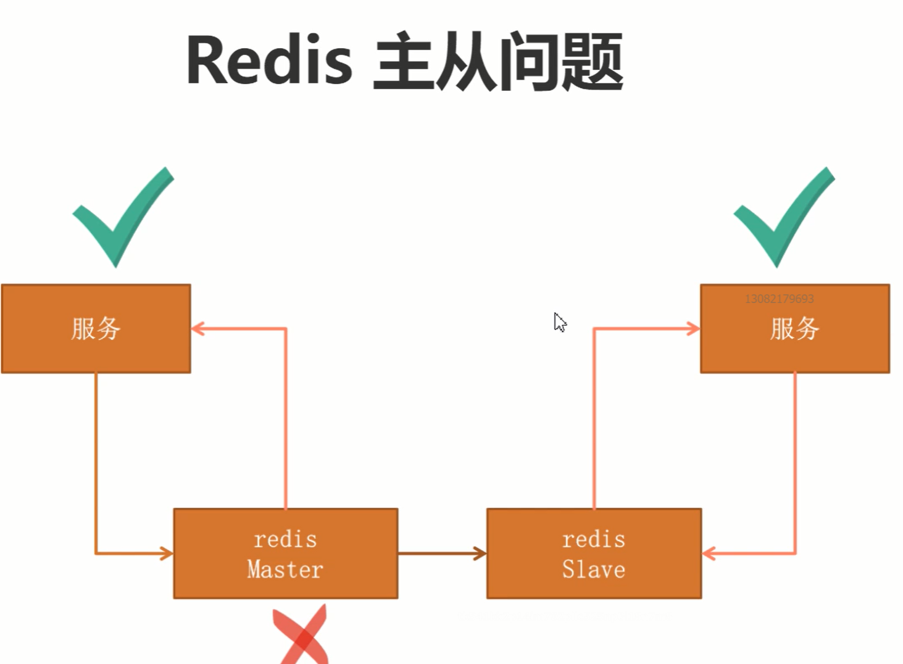 

问题：

redis主从之间数据的同步不是实时的问题。

使用红锁，超过一半的redis加锁成功，我们就认为加锁成功

### 红锁问题

redis挂了之后不要立即重启，应该要过一段时间再重启

### 抛出redis终极问题

当我们在使用锁的业务的时候有一个请求去redis拿到锁，开始执行业务逻辑。这个时候JVM发生了FullGC（服务停止了），“看门狗”就没办法再续期了，这个时候redis中设置的锁过期了，就乱套了。会造成问题

### zk解决redis锁的终极问题

顺序节点

临时节点

