# 抽茧剥丝设计模式精讲


## Singleton设计模式

### 饿汉式

```java
package com.msb.singleton;

/**
 * @author LYX
 * @description 饿汉式  TODO 已经够用了
 * 类加载到内存后，就实例化一个单例， JVM保证线程安全
 * 简单实用，推荐使用
 * 唯一的缺点：不管用到与否，类装载时就已经完成实例化
 * Class.forName("")
 * @date 2022/4/25 21:56
 */
public class Single01 {

    private static final Single01 INSTANCE = new Single01();

    private Single01(){
    }

    public static Single01 getInstance() {
        return INSTANCE;
    }

}
```

### 懒汉式

```java
package com.msb.singleton;

/**
 * @author LYX
 * @description 懒汉式
 *  虽然达到了按需初始化的目的，但却带来线程不安全的问题
 *  可以通过synchronize解决，但也带来效率下降
 * @date 2022/4/26 10:17
 */
public class Single02 {

    private static volatile Single02 INSTANCE; //JIT

    private Single02() {
    }

    public static synchronized Single02 getInstance() {
        //TODO 比较严谨
        if (INSTANCE == null) {
            synchronized (Single02.class) {
                if (INSTANCE == null) {
                    try {
                        Thread.sleep(1000);
                    } catch (InterruptedException e) {
                        e.printStackTrace();
                    }
                    INSTANCE = new Single02();
                }
            }
        }
        return INSTANCE;
    }

    public void m() {
        System.out.println("mm");
    }

    public static void main(String[] args) {
        for (int i = 0; i < 100; i++) {
            new Thread(() -> {

                System.out.println(Single02.getInstance().hashCode());
            }).start();
        }
    }

}
```

### 静态内部类方法

```java
package com.msb.singleton;

/**
 * @author LYX
 * @description 静态内部类方法
 *              JVM保证单例
 *              加载外部类时不会加载内部类，这样可以实现懒加载
 * @date 2022/4/26 10:21
 */
public class Single03 {

    private Single03() {

    }

    private static class Single03Holder {
        private static final Single03 INSTANCE = new Single03();
    }

    public static Single03 getInstance() {
        return Single03Holder.INSTANCE;
    }


}

```

### 枚举单例(最完美的单例)

```java
package com.msb.singleton;

/**
 * @author LYX
 * @description 不仅可以解决线程同步，还可以防止序列化
 *
 * 为什么枚举类能够阻止反序列化的问题？
 * 因为枚举类没有构造方法，所以就算是拿到了class文件，也没办法构造他的对象，他的反序列化返回的只是一个值
 *
 * @date 2022/4/26 10:27
 */
public enum SinglePerfect04 {

    INSTANCE;

    public void m() {
        System.out.println("mm");
    }

    public static void main(String[] args) {
        for (int i = 0; i < 100; i++) {
            new Thread(() -> System.out.println(SinglePerfect04.INSTANCE.hashCode())).start();
        }
    }

}

```


## Strategy策略模式


**策略模式封装的是一个方法的不同的实现方式**

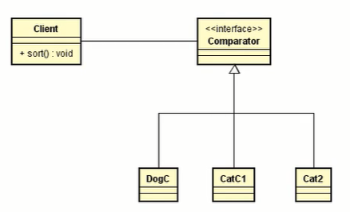 


**CustomerComparable**

```java
package com.msb.strategy;

/**
 * @author LYX
 * @description
 * @date 2022/4/26 11:18
 */
public interface CustomComparable<T> {
    int compareTo(T o);
}
```

**CustomerComparator**

```java
package com.msb.strategy;

/**
 * @author LYX
 * @description 比较器 实现比较策略的
 * @date 2022/4/26 11:31
 */
@FunctionalInterface
public interface CustomComparator<T> {
    /**
     * o1 小于 o2 -1
     * @param o1
     * @param o2
     * @return
     */
    int compare(T o1, T o2);
}

```

**DogComparator**

```java
package com.msb.strategy;

/**
 * @author LYX
 * @description
 * @date 2022/4/26 11:47
 */
public class DogComparator implements CustomComparator<Dog> {
    @Override
    public int compare(Dog o1, Dog o2) {
        if (o1.food > o2.food) return -1;
        else if (o1.food < o2.food) return 1;
        else return 0;
    }
}
```

**后续可以扩展多个实现Comparator接口的方法类**


**Main**

```java
public class Main {
    public static void main(String[] args) {
        //int a[] = {9, 3, 1, 2, 8, 5, 7};
        //Sorter.sort(a);
        //System.out.println(Arrays.toString(a));
        //Dog d[] = {new Dog(3), new Dog(5), new Dog(1)};
        //CompareSorter.sort(d);
        //System.out.println(Arrays.toString(d));

        //Dog d[] = {new Dog(3), new Dog(5), new Dog(1)};
        //DogComparator dogComparator = new DogComparator();
        //ComparatorSorter<Dog> sorter = new ComparatorSorter<Dog>();
        //sorter.sort(d, dogComparator);
        //System.out.println(Arrays.toString(d));

        //TODO lambda表达式
        Dog d[] = {new Dog(3), new Dog(5), new Dog(1)};
        ComparatorSorter<Dog> sorter = new ComparatorSorter<Dog>();
        sorter.sort(d, (o1, o2) -> {
            if (o1.food > o2.food) return -1;
            else if (o1.food < o2.food) return 1;
            else return 0;
        });
        System.out.println(Arrays.toString(d));

    }
}
```


## 工厂模式

任何可以产生对象的方法或类，都可以称之为工厂

单例也是一种工厂


### 简单工厂模式


```java
/**
 * @author LYX
 * @description 简单工厂的可扩展性不好
 * @date 2022/4/26 13:57
 */
public class VehicleFactory {

    public Car createCar() {
        return new Car();
    }

    public Broom createBroom() {
        return new Broom();
    }

}
```


```java
/**
 * @author LYX
 * @description
 * @date 2022/4/26 13:53
 */
public interface Moveable {
    void go();
}
```

```java
/**
 * @author LYX
 * @description 汽车工厂
 * @date 2022/4/26 13:59
 */
public class CarFactory {

    public Car createCar() {
        return new Car();
    }

}
```

......

**简单工厂模式可扩展性不好**


### 静态工厂模式


### 工厂方法

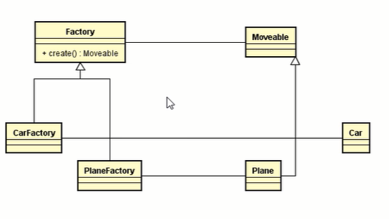  


### 抽象工厂

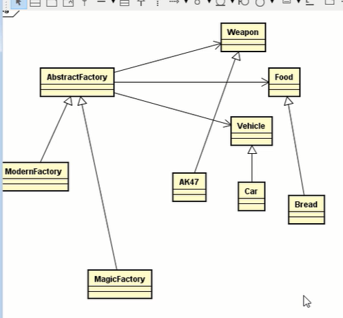 


## 调停者Mediator

 

**专门调节各个服务的，解耦**

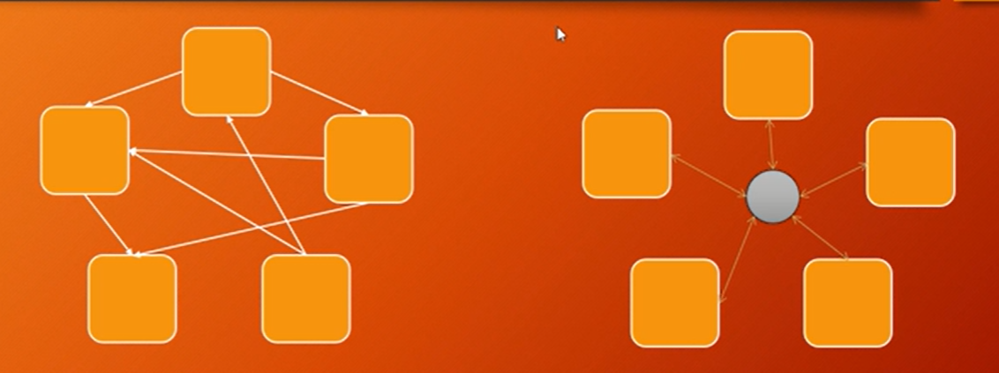 


## Decorator装饰器

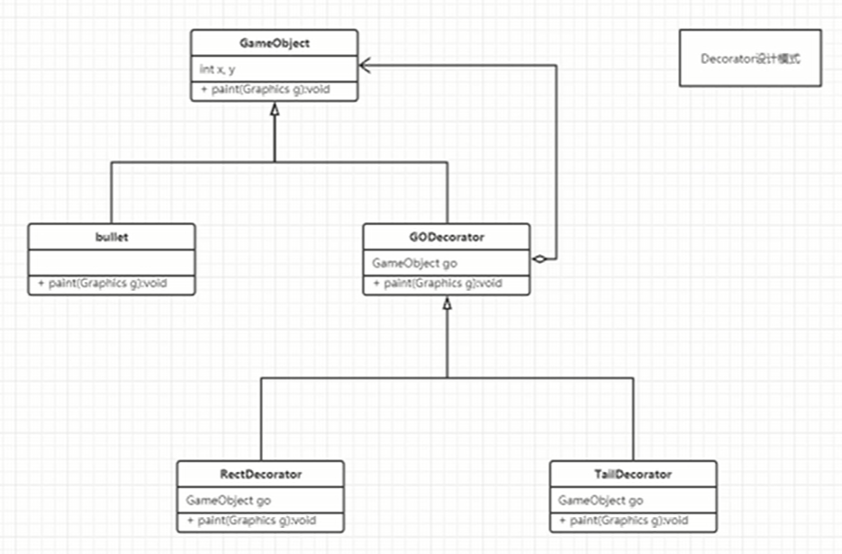 

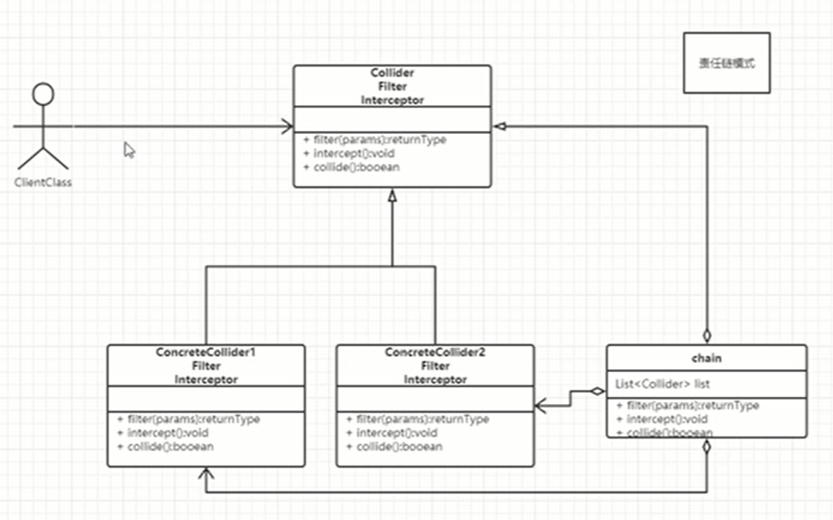 


## ChainOfResponsibility责任链

 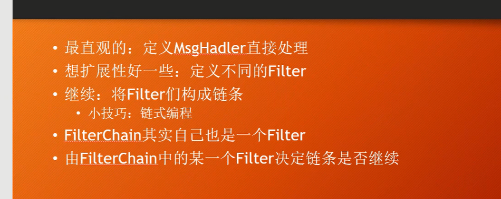

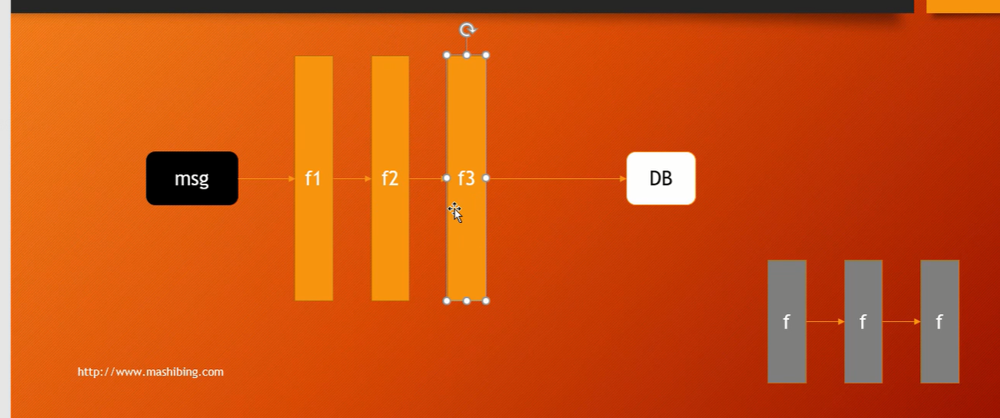

```java
package com.msb.dp.cor;

import java.util.ArrayList;
import java.util.List;

/**
 * @author LYX
 * @description 责任链模式
 * @date 2022/4/26 20:59
 */
public class Main {
    public static void main(String[] args) {
        //Msg m = new Msg();
        //
        //m.setMsg("大家好: <script>,欢迎大家访问msb,代价都是996");
        //
        //new HtmlFilter().doFilter(m);
        //new SensitiveFilter().doFilter(m);
        //System.out.println(m.getMsg());

        //Msg m = new Msg();
        //m.setMsg("大家好: <script>,欢迎大家访问msb,代价都是996");
        //
        //List<Filter> filters = new ArrayList<>();
        //filters.add(new HtmlFilter());
        //filters.add(new SensitiveFilter());
        //for (Filter filter : filters) {
        //    filter.doFilter(m);
        //}
        //System.out.println(m);


        Msg m = new Msg();
        m.setMsg("大家好: <script>,欢迎大家访问msb,代价都是996,:)----");

        //第一个链条
        FilterChain f1 = new FilterChain()
                .add(new HtmlFilter())
                .add(new SensitiveFilter());
        //第二个链条
        FilterChain f2 = new FilterChain().add(new FaceFilter()).add(new UrlFilter());

        //将第二个链条加到第一个链条中
        f1.add(f2);

        f1.doFilter(m);

        System.out.println(m);

    }

}

class Msg {

    String name;
    String msg;

    public String getName() {
        return name;
    }

    public void setName(String name) {
        this.name = name;
    }

    public String getMsg() {
        return msg;
    }

    public void setMsg(String msg) {
        this.msg = msg;
    }

    @Override
    public String toString() {
        return "Msg{" +
                "name='" + name + '\'' +
                ", msg='" + msg + '\'' +
                '}';
    }
}

interface Filter {
    //void doFilter(Msg m);

    //当doFilter返回的是true的时候就往下运行，返回的是false的时候就不执行了，链条到此结束
    boolean doFilter(Msg m);
}

class HtmlFilter implements Filter {

    @Override
    public boolean doFilter(Msg m) {
        String r = m.getMsg();
        r = r.replace('<', '[');
        r = r.replace('>', ']');
        m.setMsg(r);
        return true;
    }
}

class SensitiveFilter implements Filter {

    @Override
    public boolean doFilter(Msg m) {
        String r = m.getMsg();
        r = r.replaceAll("996", "995");
        m.setMsg(r);
        return false;
    }
}


class FaceFilter implements Filter {

    @Override
    public boolean doFilter(Msg m) {
        String r = m.getMsg();
        r = r.replace(":)", "^V^");
        m.setMsg(r);
        return true;
    }
}


class UrlFilter implements Filter {

    @Override
    public boolean doFilter(Msg m) {
        String r = m.getMsg();
        r = r.replace("msb", "http://msb.com");
        m.setMsg(r);
        return true;
    }
}


class FilterChain implements Filter {
    List<Filter> filters = new ArrayList<>();
    public FilterChain add(Filter f) {
        filters.add(f);
        return this;
    }

    public boolean doFilter(Msg m) {
        for (Filter filter : filters) {
            //如果链条中的一环 return  false了那么这个链条就结束
            if (!filter.doFilter(m)) return false;
        }
        return true;
    }
}
```


#### 作业

**要求过滤来自客户端的 request的请求和来自服务端的response的响应，例如：request 以  1、2、3的顺序过滤，那么response要以3、2、1的顺序过滤**

v1

```java
public class ServletMain {

    public static void main(String[] args) {
        Request request = new Request();
        request.str = "大家好: <script>,欢迎大家访问msb,代价都是996,:)----";
        Response response = new Response();
        response.str = "response";

        FilterChain chain = new FilterChain();
        chain.add(new HtmlFilter()).add(new UrlFilter());

        chain.doFilter(request, response);
        System.out.println(request.str);
        System.out.println(response.str);

    }


}

class Request{
    String str;
}

class Response{
    String str;
}


interface Filter{

    boolean doFilter(Request request, Response response);

}

class HtmlFilter implements Filter{
    @Override
    public boolean doFilter(Request request, Response response) {
        request.str = request.str.replace('<', '[');
        request.str = request.str.replace('>', ']');
        response.str += "----------HtmlFilter";
        return true;
    }
}

class UrlFilter implements Filter{
    @Override
    public boolean doFilter(Request request, Response response) {
        request.str = request.str.replace("msb", "http://msb.com");
        response.str += "----------UrlFilter";
        return true;
    }
}

class FilterChain implements Filter {
    List<Filter> filters = new ArrayList<>();
    public FilterChain add(Filter f) {
        filters.add(f);
        return this;
    }

    @Override
    public boolean doFilter(Request request, Response response) {
        for (Filter filter : filters) {
            //如果链条中的一环 return  false了那么这个链条就结束
            filter.doFilter(request, response);
        }
        return true;
    }
}
```

v2

```java
package com.msb.dp.cor.servlet.v2;

import java.util.ArrayList;
import java.util.List;

/**
 * @author LYX
 * @description
 * @date 2022/4/26 21:48
 */
public class ServletMain {

    public static void main(String[] args) {
        Request request = new Request();
        request.str = "大家好: <script>,欢迎大家访问msb,代价都是996,:)----";
        Response response = new Response();
        response.str = "response";

        FilterChain chain = new FilterChain();
        chain.add(new HtmlFilter()).add(new UrlFilter());

        chain.doFilter(request, response, chain);
        System.out.println(request.str);
        System.out.println(response.str);

    }
}

class Request{
    String str;
}

class Response{
    String str;
}


interface Filter{

    boolean doFilter(Request request, Response response, FilterChain filterChain);

}

class HtmlFilter implements Filter{
    @Override
    public boolean doFilter(Request request, Response response, FilterChain filterChain) {
        request.str = request.str.replace('<', '[');
        request.str = request.str.replace('>', ']') + "HTML Filter-----";
        filterChain.doFilter(request, response, filterChain);

        response.str += "----------HtmlFilter";
        return true;
    }
}

class UrlFilter implements Filter{

    @Override
    public boolean doFilter(Request request, Response response, FilterChain filterChain) {
        request.str = request.str.replace("msb", "http://msb.com") + "URL Filter";

        filterChain.doFilter(request, response, filterChain);

        response.str += "----------UrlFilter";
        return true;
    }
}

class FilterChain implements Filter {

    List<Filter> filters = new ArrayList<>();

    int index = 0;

    public FilterChain add(Filter f) {
        filters.add(f);
        return this;
    }

    @Override
    public boolean doFilter(Request request, Response response, FilterChain filterChain) {

        if (index == filters.size()) return false;

        Filter f = filters.get(index);
        index ++;
        return f.doFilter(request, response, filterChain);
    }
}
```

v3

```java
package com.msb.dp.cor.servlet.v3;

import java.util.ArrayList;
import java.util.List;

/**
 * @author LYX
 * @description
 * @date 2022/4/27 9:44
 */
public class ServletMain {

    public static void main(String[] args) {

        Request request = new Request();
        request.str = "大家好: <script>,欢迎大家访问msb,代价都是996,^V^--www.baidu.com--";
        Response response = new Response();
        response.str = "response";

        FilterChain filterChain = new FilterChain();
        filterChain.add(new HTMLFilter()).add(new URLFilter());
        filterChain.doFilter(request, response);

        System.out.println(request.str);
        System.out.println(response.str);

    }

}

interface Filter {
    boolean doFilter(Request request, Response response, FilterChain chain);
}

class HTMLFilter implements Filter {

    @Override
    public boolean doFilter(Request request, Response response, FilterChain chain) {
        request.str = request.str.replaceAll("<", "[");
        request.str = request.str.replaceAll(">", "]") + "HTMLFilter Request ---";
        chain.doFilter(request, response);
        response.str = response.str + "HTMLFilter Response";
        return true;
    }
}

class URLFilter implements Filter {

    @Override
    public boolean doFilter(Request request, Response response, FilterChain chain) {
        request.str = request.str.replace("^V^", ":)");
        request.str = request.str.replace("www.baidu.com", "www.jd.com") + "---URLFilter Request----";
        chain.doFilter(request, response);
        response.str = response.str + "URLFilter Response";
        return true;
    }
}

class Request{
    String str;

    @Override
    public String toString() {
        return "Request{" +
                "str='" + str + '\'' +
                '}';
    }
}

class Response{
    String str;

    @Override
    public String toString() {
        return "Response{" +
                "str='" + str + '\'' +
                '}';
    }
}

class FilterChain{

    List<Filter> filterList = new ArrayList<>();
    int index = 0;

    public FilterChain add(Filter filter) {
        filterList.add(filter);
        return this;
    }

    public boolean doFilter(Request request, Response response) {
        if (index == filterList.size()) return false;
        Filter f = filterList.get(index);
        index ++;
        return  f.doFilter(request, response, this);

    }

}
```


## Observer观察者

通常都是由source 事件源对象，观察者Observer，事件本身，组成的观察者模式。

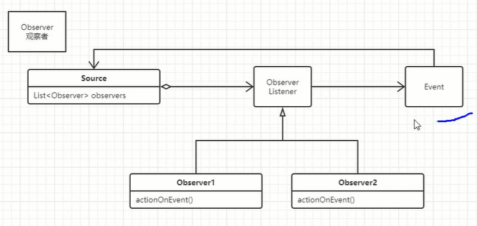 

 


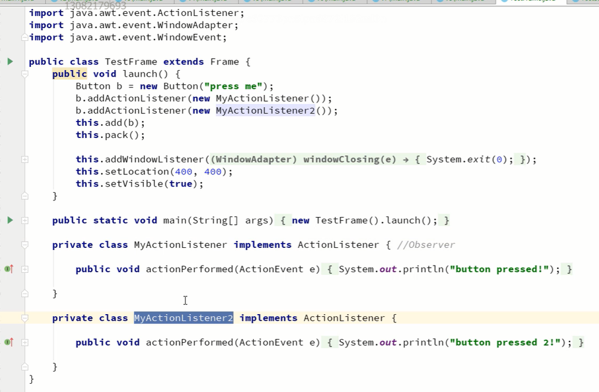 

```java
package com.msb.observer.v3;

import java.util.ArrayList;
import java.util.List;

/**
 * @author LYX
 * @description 有很多时候，观察者需要根据事件具体的情况来进行处理
 * 大多数的时候我们处理时间的时候需要事件源对象
 * 事件也可以形成基础体系。
 * @date 2022/4/27 13:24
 */
class Child {

    private boolean cry = false;
    List<Observer> observers = new ArrayList<>();

    public boolean isCry() {
        return cry;
    }

    public void setCry(boolean cry) {
        this.cry = cry;
    }

    static {
        System.out.println("321321");
    }

    {
        observers.add(new Dad());
        observers.add(new Dog());
        observers.add(new Mom());
        System.out.println("123123");
    }

    public void wakeUp() {
        cry = true;
        WakeUpEvent event = new WakeUpEvent(System.currentTimeMillis(), "bed home", this);
        for (Observer observer : observers) {
            observer.actionOnWakeUp(event);
        }
    }

}

/**
 * 模拟Event为所有时间的父类
 * @param <T>
 */
abstract class Event<T> {
    abstract T getSource();
}

//事件类，fireEvent
class WakeUpEvent extends Event<Child> {
    long timestamp;
    String loc;
    Child source;

    public WakeUpEvent(long timestamp, String loc, Child source) {
        this.timestamp = timestamp;
        this.loc = loc;
    }

    @Override
    Child getSource() {
        return source;
    }

}

interface Observer {
    void actionOnWakeUp(WakeUpEvent wakeUpEvent);
}

class Dad implements Observer {

    public void feed() {
        System.out.println("dad feeding ...");
    }

    @Override
    public void actionOnWakeUp(WakeUpEvent wakeUpEvent) {
        feed();
        System.out.println(wakeUpEvent.timestamp);
    }
}

class Mom implements Observer {

    public void hug() {
        System.out.println("mom hug .......");
    }

    @Override
    public void actionOnWakeUp(WakeUpEvent wakeUpEvent) {
        System.out.println(wakeUpEvent.toString());
        hug();
    }
}
 
class Dog implements Observer {

    public void wang() {
        System.out.println("dog wang......");
    }

    @Override
    public void actionOnWakeUp(WakeUpEvent wakeUpEvent) {
        System.out.println(wakeUpEvent.toString());
        wang();
    }
}

public class Main {

    public static void main(String[] args) {
        Child child = new Child();
        child.wakeUp();
    }

}


```

**为什么要获取事件源对象？**

有许多的Observer他的处理过程是根据你具体的源对象的不同而不同，或者处理过程是需要时间原对象的一些处理过程的


Observer、Listener、Hook、Callback


在很多系统中，Observer模式往往和责任链共同负责对于事件的处理，其中某一个Observer负责是否将事件进一步传递


## Composite组合模式

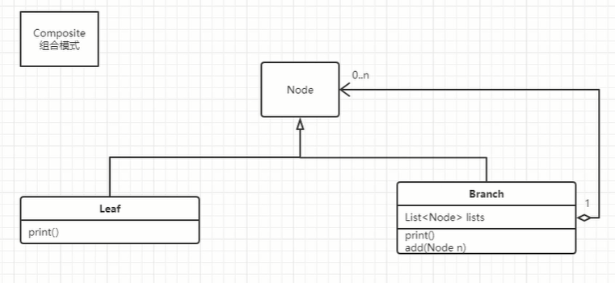

组合模式是专门处理树结构的

递归本身就是一个压栈的过程 

```java
/**
 * @author LYX
 * @description 组合模式s
 * @date 2022/4/27 21:12
 */
abstract class Node{
    abstract public void p();
}

class LeftNode extends Node{

    String content;
    public LeftNode(String content) {
        this.content = content;
    }

    @Override
    public void p() {
        System.out.println(content);
    }
}

class BranchNode extends Node{

    List<Node> nodes = new ArrayList<>();
    String name;

    public BranchNode(String name) {
        this.name = name;
    }

    @Override
    public void p() {
        System.out.println(name);
    }

    public void add(Node node) {
        nodes.add(node);
    }
}

public class Main {


}
```


## Flyweight享元模式

**重复利用对象**

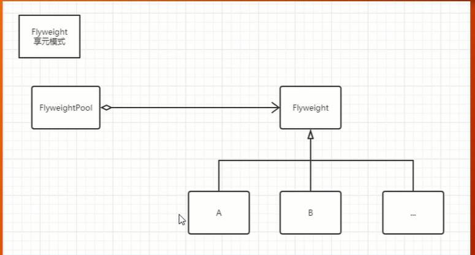 

共享元数据对象

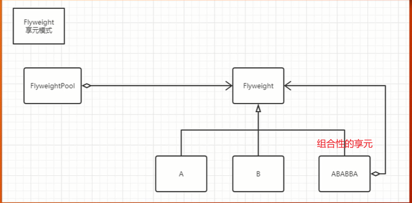 


## Proxy静态代理与动态代理


### 静态代理

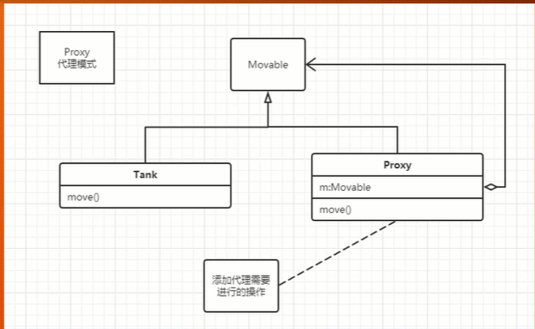 


```java
package com.msb.proxy;


import java.util.Random;

/**
 * @author LYX
 * @description 如何实现代理的各种组合？继承？Decorator？
 * @date 2022/4/27 21:30
 */
public class Tank implements Movable {


    @Override
    public void move() {
        System.out.println("tank move chuachua......");
        try {
            Thread.sleep(new Random().nextInt(1000));
        } catch (InterruptedException e) {
            e.printStackTrace();
        }

    }

    public static void main(String[] args) {
        new ThreadTimeProxy(new Tank()).move();
    }
}

/**
 * tank移动时间的代理
 */
class ThreadTimeProxy implements Movable {

    Tank tank;

    public ThreadTimeProxy(Tank tank) {
        this.tank = tank;
    }

    @Override
    public void move() {
        long start = System.currentTimeMillis();
        this.tank.move();
        long end = System.currentTimeMillis();
        System.out.println(end - start);
    }
}

/**
 * tank日志的代理
 */
class ThreadLogProxy implements Movable {

    Tank tank;

    public ThreadLogProxy(Tank tank) {
        this.tank = tank;
    }

    @Override
    public void move() {
        System.out.println("tank start!!");
        this.tank.move();
        System.out.println("tank end!!");
    }
}


interface Movable {
    void move();
}

```

**下面的代码只能代理tank类，所以扩展性不是很想所以要经过修改**


代理可以进行嵌套

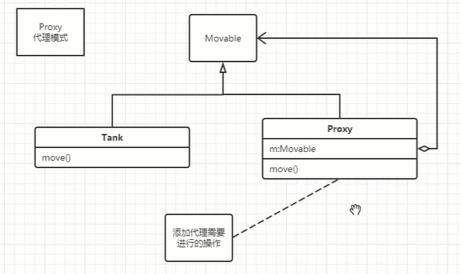 

```java
package com.msb.proxy.v2;

import java.util.Random;

/**
 * @author LYX
 * @description
 * @date 2022/4/27 23:13
 */
public class Tank implements Movable {
    @Override
    public void move() {
        System.out.println("tank claclacalcalca....");
        try {
            Thread.sleep(new Random().nextInt(10000));
        } catch (InterruptedException e) {
            e.printStackTrace();
        }

    }

    public static void main(String[] args) {
        new ThreadLogProxy(new ThreadTimeProxy(new Tank())).move();
    }
}

class ThreadTimeProxy implements Movable {

    Movable movable;

    public ThreadTimeProxy(Movable movable) {
        this.movable = movable;
    }

    @Override
    public void move() {
        long start = System.currentTimeMillis();
        this.movable.move();
        long end = System.currentTimeMillis();
        System.out.println("tank time");
        System.out.println(end - start);
    }
}

class ThreadLogProxy implements Movable {

    Movable movable;

    public ThreadLogProxy(Movable movable) {
        this.movable = movable;
    }

    @Override
    public void move() {
        System.out.println("tank start!!");
        this.movable.move();
        System.out.println("tank end!!");
    }
}

interface Movable {
    void move();
}
```


### 动态代理


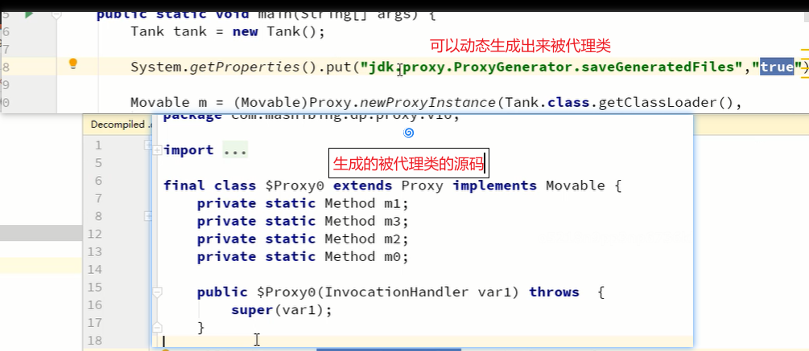 


当我们new出一个代理的时候，将invocation 传到super中，  里面的 h属性就是我们的invocation

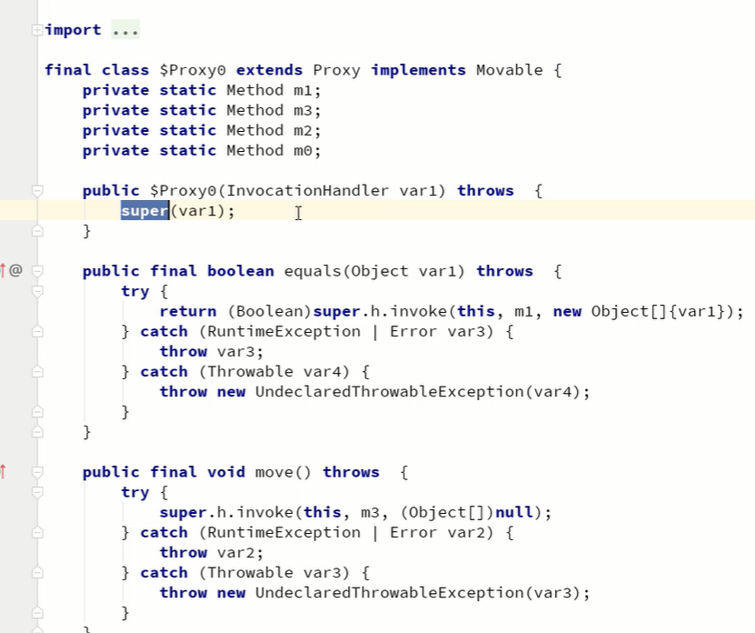 

调用外部我们定义的invoke

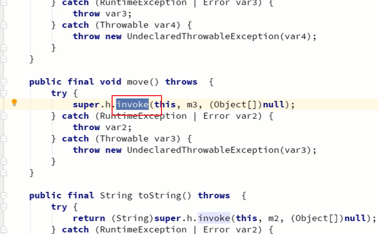 


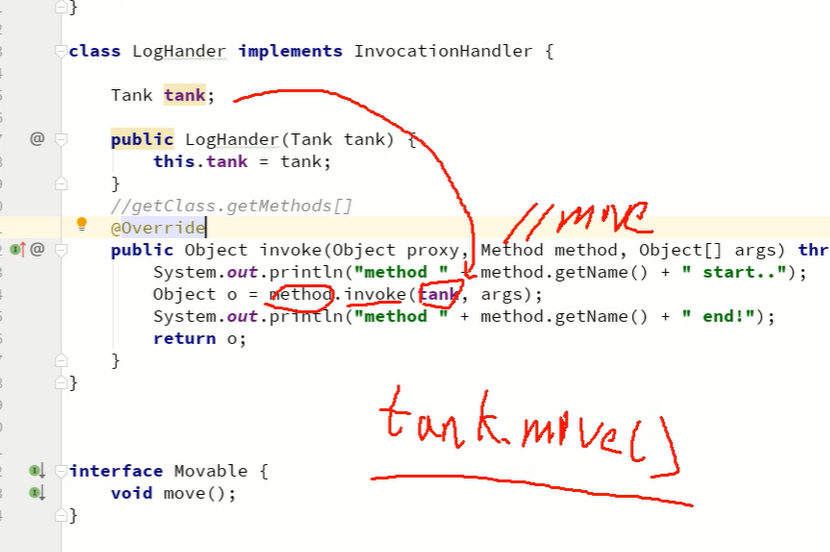 


```java
package com.msb.proxy.v3;

import java.lang.reflect.InvocationHandler;
import java.lang.reflect.Method;
import java.lang.reflect.Proxy;
import java.util.Random;

/**
 * @author LYX
 * @description 如果让logProxy可以重用，不仅可以代理tank，还可以代理任何其他的类型Object
 * 分离代理  使用jdk的动态代理
 * @date 2022/4/28 13:16
 */
public class Tank implements Movable {

    @Override
    public void move() {
        System.out.println("tank claclacalcalca....");
        try {
            Thread.sleep(new Random().nextInt(10000));
        } catch (InterruptedException e) {
            e.printStackTrace();
        }
    }

    public static void main(String[] args) {
        //todo refeciton 通过二级制字节码分析类的属性和方法  1、需要使用哪个loader把我们new出来的对象弄到代理内存中
        //TODO                                         2、这个代理对象应该去实现哪些接口
        //todo                                         3、对象处理器，被代理对象在做被代理之后要调用的时候我们要怎么处理
        //System.getProperties().put("jdk.proxy.ProxyGenerator.saveGeneratedFiles", "true");
        Movable movable = (Movable) Proxy.newProxyInstance(Tank.class.getClassLoader(),
                new Class[]{Movable.class},
                //new InvocationHandler() {
                //    @Override
                //    public Object invoke(Object proxy, Method method, Object[] args) throws Throwable {
                //        System.out.println("method" + method.getName() + "start");
                //        Object o = method.invoke(proxy, args);
                //        System.out.println("method" + method.getName() + "end");
                //        return o;
                //    }
                //}
                new LogHandler(new Tank())
                );
        movable.move();
    }

}

class LogHandler implements InvocationHandler {

    Tank tank;

    public LogHandler(Tank tank) {
        this.tank = tank;
    }

    /**
     *
     * @param proxy    生成的代理对象，其实就是上面的movable
     * @param method  调用的是哪个方法
     * @param args    调用方法传的参数
     *  但是proxy这个参数没有用上啊？
     * @return
     * @throws Throwable
     */
    @Override
    public Object invoke(Object proxy, Method method, Object[] args) throws Throwable {
        System.out.println("method---" + method.getName() + "---start");
        Object o = method.invoke(tank, args);
        System.out.println("method---" + method.getName() + "---end");
        //如果调用的方法是void  那么return null
        return o;
    }
}

interface Movable{
    void move();
}
```


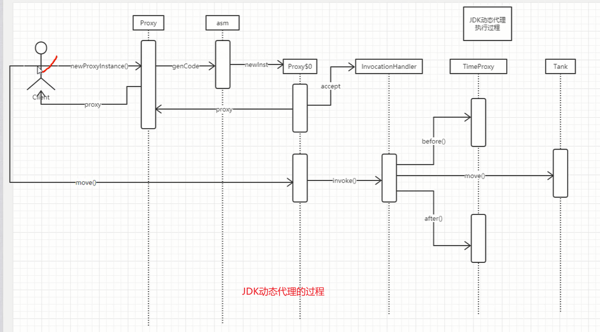

用户使用Proxy的newProxyInstance方法通过asm生成一个Proxy代理类，并且接收他的InvocationHandler


**ASM**

可以直接改class二进制文件的，jdk的动态代理是ASM来实现的。用了ASM之后Java才可以称之为动态语言。(反射只能找到属性和方法，但是改不了)

**====================Visitor访问者6 ASM生成动态dialing讲解==================== 还没看**

JVM生态

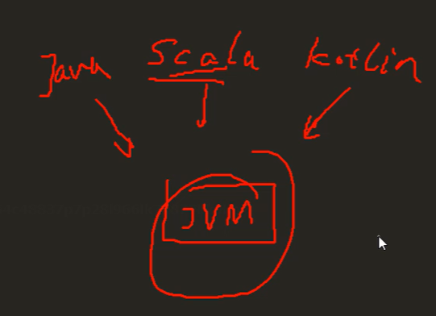 

**Instrument生成动态代理**


### cglib 生成代理


## Iterator迭代器

**容器与容器之间的遍历**


在物理层面中来说所有的存储都分为中存储方式

**连续存储**

**链表存储**


简单实现

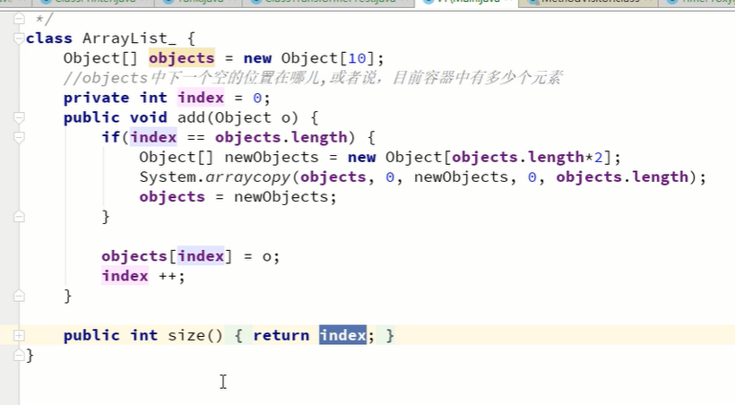 

 数组实现

```java
package com.msb.Iterator;

/**
 * @author LYX
 * @description
 * @date 2022/5/4 22:16
 */
public class Main {

}

class ArrayList_LYX {

    Object[] objects = new Object[10];
    private int index = 0;

    public void add(Object o) {
        if (index == objects.length) {
            //创建一个新的数组来存放数据  数组长度为原来的两倍
            Object[] newObject = new Object[objects.length * 2];
            System.arraycopy(objects, 0, newObject, 0, objects.length);
            objects = newObject;
        }
        objects[index] = o;
        index ++;
    }
    public int size() {
        return index;
    }
}
```

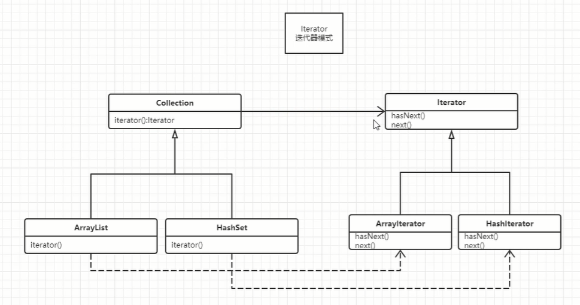 


## Visitor访问者 模式

在结构不变的情况下，动态改变对于内部元素的动作


结构固定，可以动态添加访问的动作。


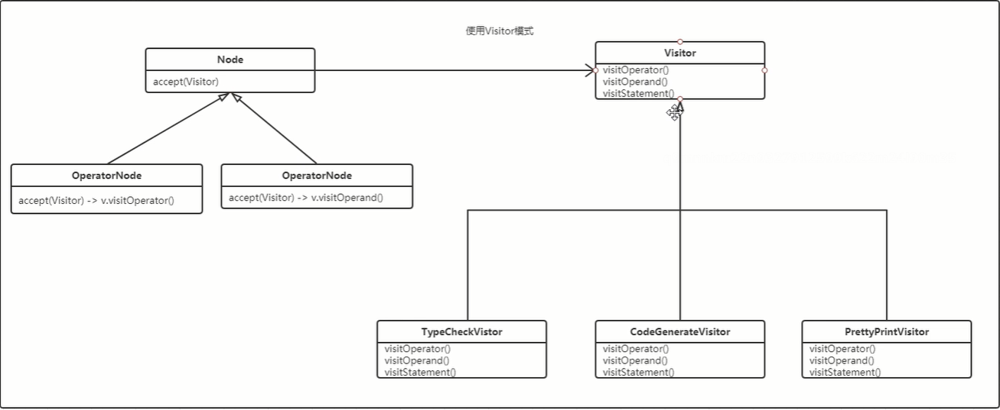 


```java
package com.msb.visitor;

/**
 * @author LYX
 * @description 访问者模式
 * @date 2022/5/5 9:27
 */
public class Computer {

    ComputerPart cpu = new CPU();
    ComputerPart memory = new Memory();
    ComputerPart board = new Board();

    public void accept(Visitor v) {
        cpu.accept(v);
        memory.accept(v);
        board.accept(v);
    }

    public static void main(String[] args) {
        PersonVisitor p = new PersonVisitor();
        new Computer().accept(p);
        System.out.println(p.totalPrice);
    }
}

abstract class ComputerPart {

    abstract void accept(Visitor visitor);

    abstract double getPrice();

}

class CPU extends ComputerPart {

    @Override
    void accept(Visitor visitor) {
        visitor.visitorCpu(this);
    }

    @Override
    double getPrice() {
        return 300;
    }
}


class Memory extends ComputerPart {

    @Override
    void accept(Visitor visitor) {
        visitor.visitorMemory(this);
    }

    @Override
    double getPrice() {
        return 200;
    }
}


class Board extends ComputerPart {

    @Override
    void accept(Visitor visitor) {
        visitor.visitorBoard(this);
    }

    @Override
    double getPrice() {
        return 100;
    }
}

interface Visitor {
    void visitorCpu(CPU cpu);

    void visitorMemory(Memory memory);

    void visitorBoard(Board board);
}


class PersonVisitor implements Visitor {

    double totalPrice = 0.0;

    @Override
    public void visitorCpu(CPU cpu) {
        totalPrice =+ cpu.getPrice() * 0.9;
    }

    @Override
    public void visitorMemory(Memory memory) {
        totalPrice =+ memory.getPrice() * 0.85;
    }

    @Override
    public void visitorBoard(Board board) {
        totalPrice =+ board.getPrice() * 0.95;
    }
}

class CorpVisitor implements Visitor {
    double totalPrice = 0.0;


    @Override
    public void visitorCpu(CPU cpu) {
        totalPrice =+ cpu.getPrice() * 0.6;
    }

    @Override
    public void visitorMemory(Memory memory) {
        totalPrice =+ memory.getPrice() * 0.75;
    }

    @Override
    public void visitorBoard(Board board) {
        totalPrice =+ board.getPrice() * 0.85;
    }
}

```

**抽象语法树**

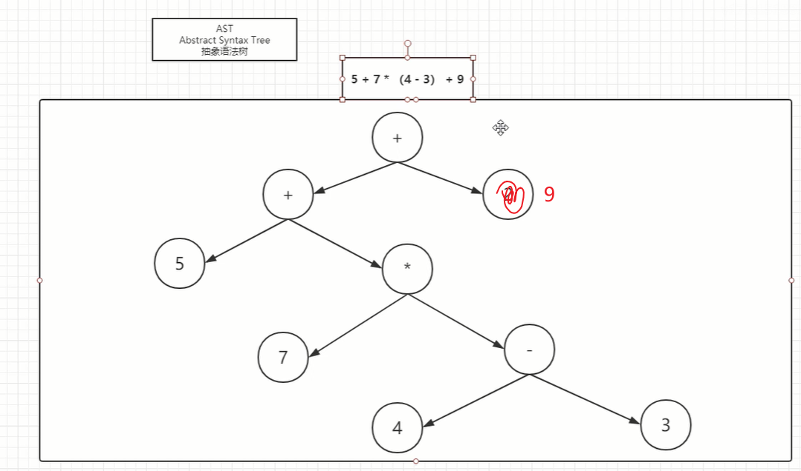 


### ASM

直接对java字节码进行加工的框架

 

ASM其实没有什么特殊的意义，他允许一些方法用汇编语言来实现，**AsSeMbly**

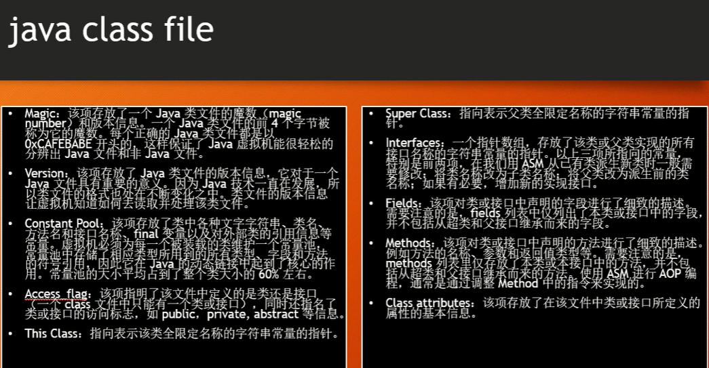 


去oracle官网上看

LYX|||| **Java虚拟机规范 **  **Visitor访问者5  没怎么看懂 先略过**

**====================Visitor访问者6 ASM生成动态dialing讲解==================== 还没看** 


## Builder构建器 模式


**分离复杂对象的构建和表示**

**同样的构建过程可以创建不同的表示**

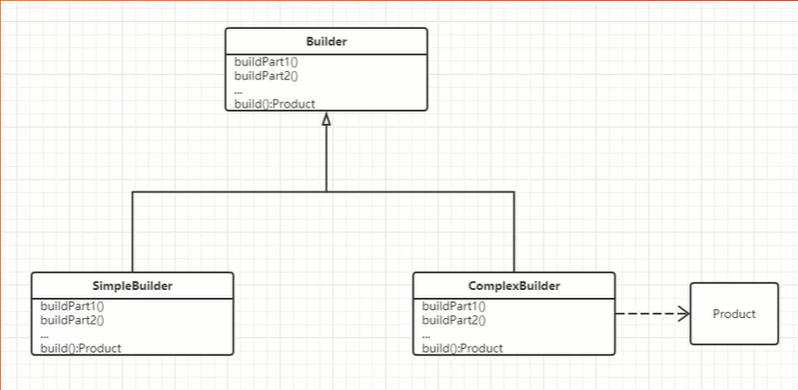 


## Adapter适配器


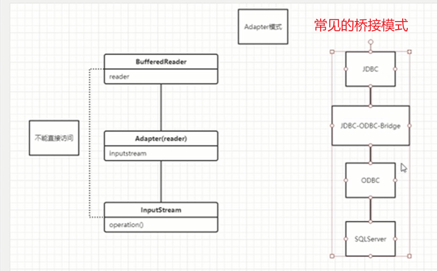 


## Birdge桥接


**分离抽象与具体**

**用聚合方式(桥)连接抽象与具体**

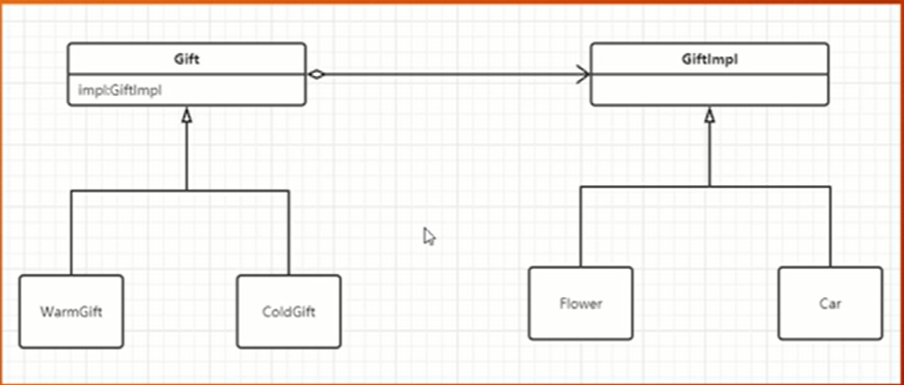 


如果用继承的话礼物的分离就会非常非常的多

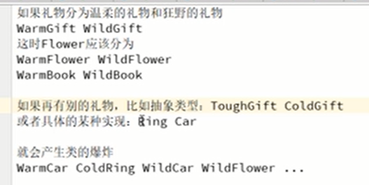 


桥接模式的解决办法

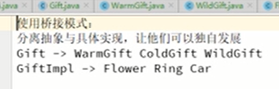 


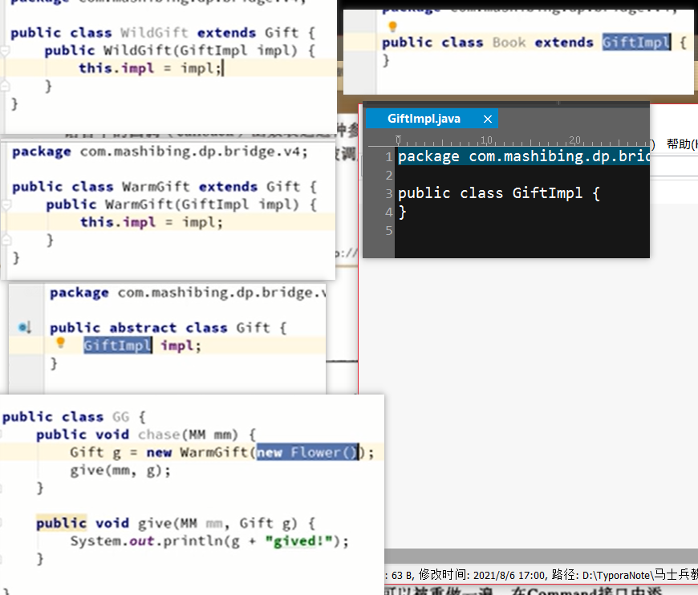 


经典的桥接模式

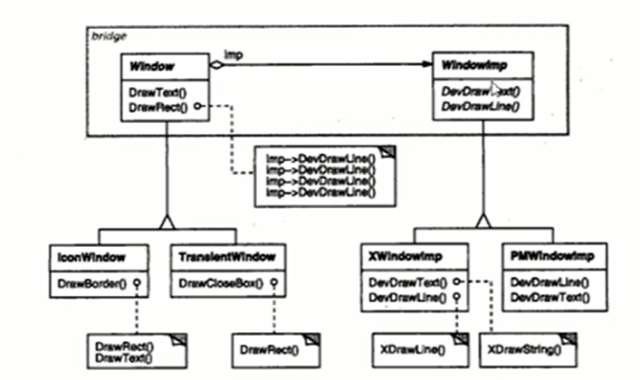 

**他是在具体和抽象两个维度上发展的**


## Command命令

**封装命令**

结合cor时间undo的功能

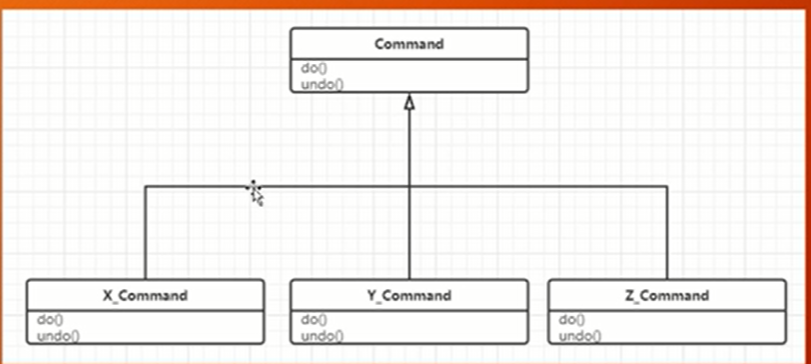 


**用来封装各种各样的命令的模式**


command 模式和链式模式组合使用


## Prototype原型


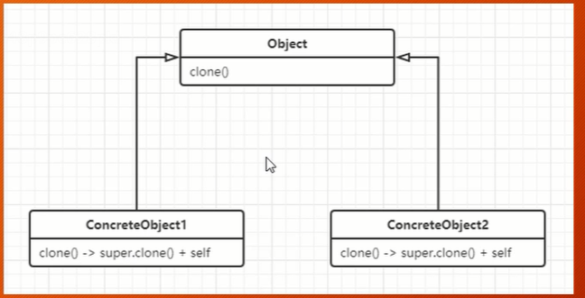 


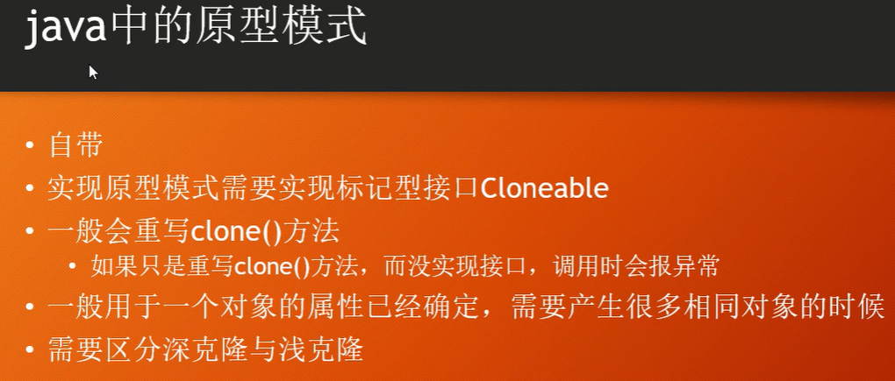 

**浅克隆**

```java
package com.msb.prototype.v1;

/**
 * 浅克隆
 */

public class Test {
    public static void main(String[] args) throws Exception {
        Person p1 = new Person();
        Person p2 = (Person)p1.clone();
        System.out.println(p2.age + " " + p2.score);
        System.out.println(p2.loc);

        System.out.println(p1.loc == p2.loc);
        p1.loc.street = "sh";
        System.out.println(p2.loc);

    }
}

class Person implements Cloneable {
    int age = 8;
    int score = 100;

    Location loc = new Location("bj", 22);
    @Override
    public Object clone() throws CloneNotSupportedException {
        return super.clone();
    }
}

class Location {
    String street;
    int roomNo;

    @Override
    public String toString() {
        return "Location{" +
                "street='" + street + '\'' +
                ", roomNo=" + roomNo +
                '}';
    }

    public Location(String street, int roomNo) {
        this.street = street;
        this.roomNo = roomNo;
    }
}
 
```

**深克隆的处理**

```java
package com.msb.prototype.v2;

/**
 * 深克隆的处理
 */
public class Test {
    public static void main(String[] args) throws Exception {
        Person p1 = new Person();
        Person p2 = (Person)p1.clone();
        System.out.println(p2.age + " " + p2.score);
        System.out.println(p2.loc);

        System.out.println(p1.loc == p2.loc);
        p1.loc.street = "sh";
        System.out.println(p2.loc);


    }
}

class Person implements Cloneable {
    int age = 8;
    int score = 100;

    Location loc = new Location("bj", 22);
    @Override
    public Object clone() throws CloneNotSupportedException {
        Person p = (Person)super.clone();
        p.loc = (Location)loc.clone();
        return p;
    }
}

class Location implements Cloneable {
    String street;
    int roomNo;

    @Override
    public String toString() {
        return "Location{" +
                "street='" + street + '\'' +
                ", roomNo=" + roomNo +
                '}';
    }

    public Location(String street, int roomNo) {
        this.street = street;
        this.roomNo = roomNo;
    }

    @Override
    public Object clone() throws CloneNotSupportedException {
        return super.clone();
    }
}

```

**String类型需不需要进行处理？**

 

```java
package com.msb.prototype.v3;

/**
 * String需要进一步深克隆吗？
 */
public class Test {
    public static void main(String[] args) throws Exception {
        Person p1 = new Person();
        Person p2 = (Person)p1.clone();
        System.out.println(p2.age + " " + p2.score);
        System.out.println(p2.loc);

        System.out.println(p1.loc == p2.loc);
        p1.loc.street = "sh";
        System.out.println(p2.loc);

        p1.loc.street.replace("sh", "sz");
        System.out.println(p2.loc.street);
    }
}

class Person implements Cloneable {
    int age = 8;
    int score = 100;

    Location loc = new Location("bj", 22);
    @Override
    public Object clone() throws CloneNotSupportedException {
        Person p = (Person)super.clone();
        p.loc = (Location)loc.clone();
        return p;
    }
}

class Location implements Cloneable {
    String street;
    int roomNo;

    @Override
    public String toString() {
        return "Location{" +
                "street='" + street + '\'' +
                ", roomNo=" + roomNo +
                '}';
    }

    public Location(String street, int roomNo) {
        this.street = street;
        this.roomNo = roomNo;
    }

    @Override
    public Object clone() throws CloneNotSupportedException {
        return super.clone();
    }
}

```


##  Memento备忘录


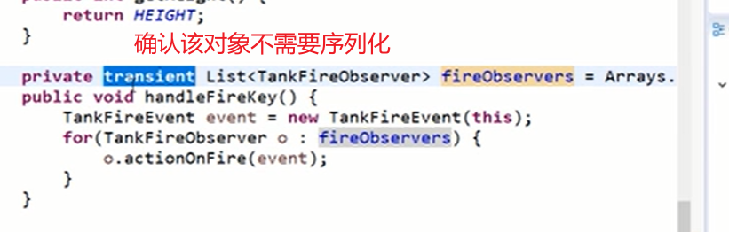 

当一个对象被序列化的时候 他所支持的引用也需要被序列化，不然的话会报错。

 


## TemplateMethod模板方法


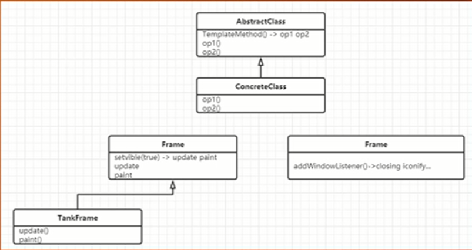 


```java
package com.msb.TemplateMethod;

/**
 * @author LYX
 * @description
 * @date 2022/5/6 21:08
 */
public class Main {
    public static void main(String[] args) {
        F f = new C1();
        f.m();
    }
}

abstract class F {

    void m() {
        op1();
        op2();
    }

    abstract void op1();

    abstract void op2();
}

class C1 extends F {

    @Override
    void op1() {
        System.out.println("op1");
    }

    @Override
    void op2() {
        System.out.println("op2");
    }
}
```


## State状态 模式

**根据状态来决定行为**

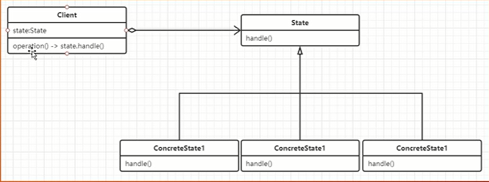 

如果一个类他的很多个动作都是需要不同的state去实现的话，那么这个时候就可以把这个类抽象出来，这个时候在state里面去实现这个方法，在原来的类里面调用operation的时候直接调用Handler方法，


### 有限状态机(FSM)

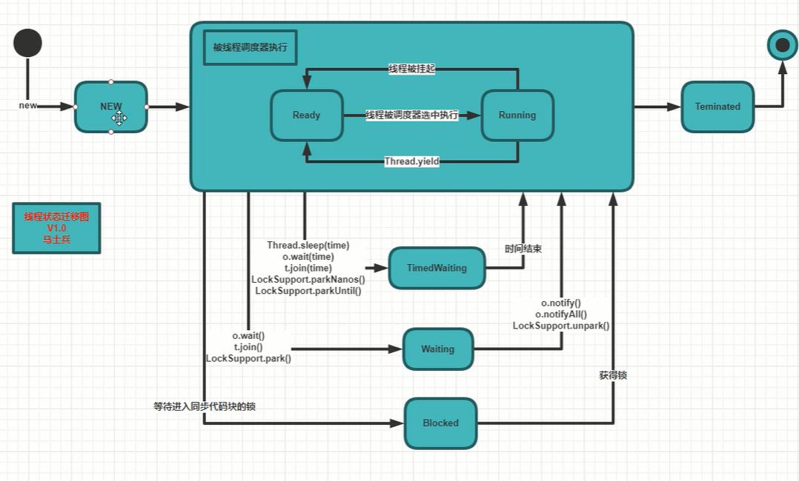 


## Intepreter解释器

**用于解释脚本语言的**

直接略过


## 总结

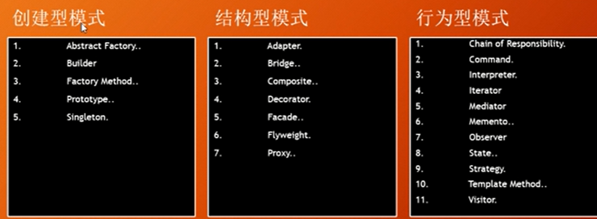


### 设计思想


可维护性Maintainability

​	修改功能，需要改动的地方越少，可维护性就越好。

可复用性Reusability

​	代码可以被以后重复使用

​	写出自己总结的类库

可扩展性Extensibility/Scalability

​	添加功能无需修改原来代码

灵活性flexibility/mobility/adaptability

​	代码接口可以灵活调用


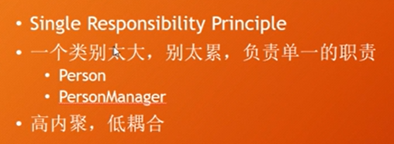 

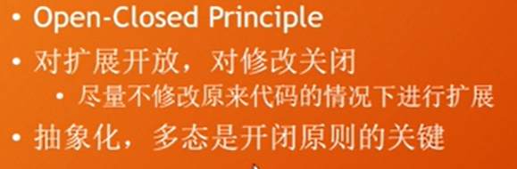 


### 里氏替换原则

**所有使用父类的地方，必须能够透明的使用子类对象**


### 依赖倒置原则(Dependency Inversion Priciple)


**依赖抽象，而不是依赖具体**

**面向抽象编程**


### 接口隔离原则

每一个接口应该承担独立的角色，不干不该自己干的事儿

​	Flyable Runnable 不该合二为一

​	避免子类实现不需要实现的方法

​	需要对客户提供接口的时候，只需要暴露最小的接口


###  迪米特法则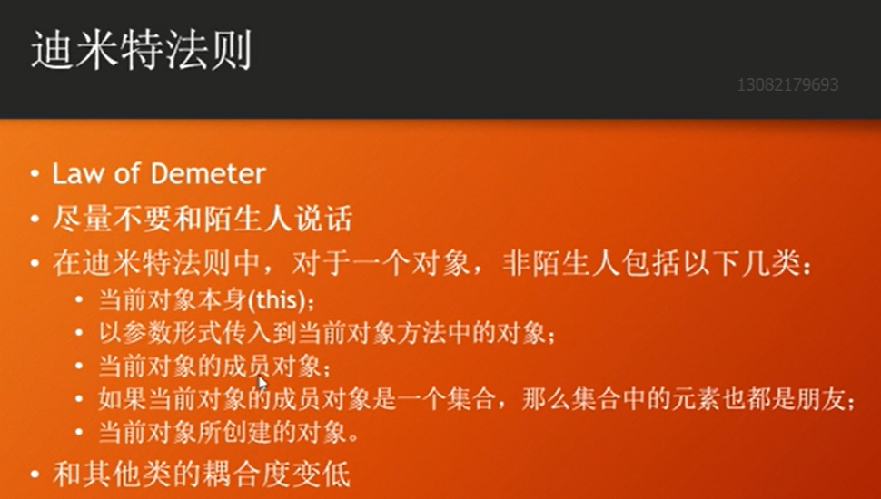 


