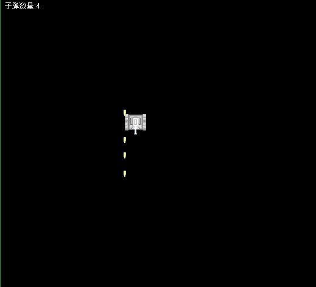

# 坦克大战


## Frame类

就是一个窗口类：可以使用他设置窗口大小、标题等等属性

```java
public class T {
    public static void main(String[] args) {
        Frame f = new Frame();
        f.setSize(800, 600);
        f.setResizable(false);
        f.setTitle("tank war");
        f.setVisible(true);
		//添加window监听器来关闭窗口
        f.addWindowListener(new WindowAdapter() {
            @Override
            public void windowClosing(WindowEvent e) {
                System.exit(0);
            }
        });
    }
}
```


在主线程每隔50ms刷新窗口，调用repaint方法，他会自动调用paint方法刷新窗口

```java
public class TankFrame extends Frame {

    int x = 200, y = 200;

    public TankFrame() {
        this.setSize(800, 600);
        this.setResizable(false);
        this.setTitle("tank war");
        this.setVisible(true);

        this.addKeyListener(new MyKeyListener());

        this.addWindowListener(new WindowAdapter() {
            @Override
            public void windowClosing(WindowEvent e) {
                System.exit(0);
            }

            @Override
            public void windowClosed(WindowEvent e) {
                System.out.println("closed");
            }
        });


    }

    /**
     * 窗口改变状态之后执行该方法
     *
     * @param g
     */
    @Override
    public void paint(Graphics g) {
        System.out.println("paint");
        //填充一个正方形 在计算机中，x轴和y轴都是从左上角开始算的
        g.fillRect(x, y, 50, 50);
        x += 10;
        //y += 10;
    }

    /**
     * 键盘监听处理内部类
     */
    class MyKeyListener extends KeyAdapter {

        /**
         * 该方法会在一个键被按下去的时候调用
         *
         * @param e
         */
        @Override
        public void keyPressed(KeyEvent e) {
            //x += 20;
            //调用repaint重画窗口,他会默认调用paint()
            //repaint();
        }


        /**
         * 一个键被抬起的时候调用
         *
         * @param e
         */
        @Override
        public void keyReleased(KeyEvent e) {

        }
    }
}
```


**通过枚举类以及布尔值来改变坦克的方向**

```java
public class TankFrame extends Frame {

    int x = 200, y = 200;

    Dir dir = Dir.DOWN;

    final int SPEED = 10;

    public TankFrame() {
        this.setSize(800, 600);
        this.setResizable(false);
        this.setTitle("tank war");
        this.setVisible(true);

        this.addKeyListener(new MyKeyListener());

        this.addWindowListener(new WindowAdapter() {
            @Override
            public void windowClosing(WindowEvent e) {
                System.exit(0);
            }

            @Override
            public void windowClosed(WindowEvent e) {
                System.out.println("closed");
            }
        });


    }

    /**
     * 窗口改变状态之后执行该方法
     *
     * @param g
     */
    @Override
    public void paint(Graphics g) {
        System.out.println("paint");
        //填充一个正方形 在计算机中，x轴和y轴都是从左上角开始算的
        g.fillRect(x, y, 50, 50);
        switch (dir) {
            case LEFT:
                x -= SPEED;
                break;
            case RIGHT:
                x += SPEED;
                break;
            case UP:
                y -= SPEED;
                break;
            case DOWN:
                y += SPEED;
                break;
            default:
                break;
        }
        //x += 10;
        //y += 10;
    }

    /**
     * 键盘监听处理内部类
     */
    class MyKeyListener extends KeyAdapter {

        //使用布尔值来代表到底哪个键被按下去了
        //上下左右箭头的按键状态判定坦克的移动方向
        boolean bL = false;
        boolean bU = false;
        boolean bR = false;
        boolean bD = false;

        /**
         * 该方法会在一个键被按下去的时候调用
         *
         * @param e
         */
        @Override
        public void keyPressed(KeyEvent e) {

            //x += 20;
            //调用repaint重画窗口,他会默认调用paint()
            //repaint();
            int key = e.getKeyCode();
            switch (key) {
                case KeyEvent.VK_UP:
                    bU = true;
                    break;
                case KeyEvent.VK_DOWN:
                    bD = true;
                    break;
                case KeyEvent.VK_LEFT:
                    bL = true;
                    break;
                case KeyEvent.VK_RIGHT:
                    bR = true;
                    break;
                default:
                    break;
            }
            setMainTankDir();

        }


        /**
         * 一个键被抬起的时候调用
         *
         * @param e
         */
        @Override
        public void keyReleased(KeyEvent e) {
            int key = e.getKeyCode();
            switch (key) {
                case KeyEvent.VK_UP:
                    bU = false;
                    break;
                case KeyEvent.VK_DOWN:
                    bD = false;
                    break;
                case KeyEvent.VK_LEFT:
                    bL = false;
                    break;
                case KeyEvent.VK_RIGHT:
                    bR = false;
                    break;
                default:
                    break;
            }
            setMainTankDir();
        }

        private void setMainTankDir() {
            if (bL) dir = Dir.LEFT;
            if (bU) dir = Dir.UP;
            if (bR) dir = Dir.RIGHT;
            if (bD) dir = Dir.DOWN;
        }
    }
}
```

枚举类

```java
public enum Dir {
    LEFT, UP, RIGHT, DOWN;
}
```


## 创建坦克类来封装对应的相关代码


tank.class

```java
public class Tank {

    private int x, y;
    private Dir dir = Dir.DOWN;
    final int SPEED = 10;


    public Tank(int x, int y, Dir dir) {
        this.x = x;
        this.y = y;
        this.dir = dir;
    }

    public void paint(Graphics g) {
        //填充一个正方形 在计算机中，x轴和y轴都是从左上角开始算的
        g.fillRect(x, y, 50, 50);
        switch (dir) {
            case LEFT:
                x -= SPEED;
                break;
            case RIGHT:
                x += SPEED;
                break;
            case UP:
                y -= SPEED;
                break;
            case DOWN:
                y += SPEED;
                break;
            default:
                break;
        }

    }

    public int getX() {
        return x;
    }

    public void setX(int x) {
        this.x = x;
    }

    public int getY() {
        return y;
    }

    public void setY(int y) {
        this.y = y;
    }

    public Dir getDir() {
        return dir;
    }

    public void setDir(Dir dir) {
        this.dir = dir;
    }

    public int getSPEED() {
        return SPEED;
    }
}
```

TankFrame

```java
public class TankFrame extends Frame {

    Tank myTank = new Tank(200, 200, Dir.DOWN);

    public TankFrame() {
        this.setSize(800, 600);
        this.setResizable(false);
        this.setTitle("tank war");
        this.setVisible(true);

        this.addKeyListener(new MyKeyListener());

        this.addWindowListener(new WindowAdapter() {
            @Override
            public void windowClosing(WindowEvent e) {
                System.exit(0);
            }

            @Override
            public void windowClosed(WindowEvent e) {
                System.out.println("closed");
            }
        });


    }

    /**
     * 窗口改变状态之后执行该方法
     *
     * @param g
     */
    @Override
    public void paint(Graphics g) {
        System.out.println("paint");
        myTank.paint(g);
    }

    /**
     * 键盘监听处理内部类
     */
    class MyKeyListener extends KeyAdapter {

        //使用布尔值来代表到底哪个键被按下去了
        //上下左右箭头的按键状态判定坦克的移动方向
        boolean bL = false;
        boolean bU = false;
        boolean bR = false;
        boolean bD = false;

        /**
         * 该方法会在一个键被按下去的时候调用
         *
         * @param e
         */
        @Override
        public void keyPressed(KeyEvent e) {

            //x += 20;
            //调用repaint重画窗口,他会默认调用paint()
            //repaint();
            int key = e.getKeyCode();
            switch (key) {
                case KeyEvent.VK_UP:
                    bU = true;
                    break;
                case KeyEvent.VK_DOWN:
                    bD = true;
                    break;
                case KeyEvent.VK_LEFT:
                    bL = true;
                    break;
                case KeyEvent.VK_RIGHT:
                    bR = true;
                    break;
                default:
                    break;
            }
            setMainTankDir();

        }


        /**
         * 一个键被抬起的时候调用
         *
         * @param e
         */
        @Override
        public void keyReleased(KeyEvent e) {
            int key = e.getKeyCode();
            switch (key) {
                case KeyEvent.VK_UP:
                    bU = false;
                    break;
                case KeyEvent.VK_DOWN:
                    bD = false;
                    break;
                case KeyEvent.VK_LEFT:
                    bL = false;
                    break;
                case KeyEvent.VK_RIGHT:
                    bR = false;
                    break;
                default:
                    break;
            }
            setMainTankDir();
        }
        private void setMainTankDir() {
            if (bL) myTank.setDir(Dir.LEFT);
            if (bU) myTank.setDir(Dir.UP);
            if (bR) myTank.setDir(Dir.RIGHT);
            if (bD) myTank.setDir(Dir.DOWN);
        }
    }
}
```


### 处理坦克静止状态

添加moving状态值

```java
public class Tank {

    private int x, y;
    private Dir dir = Dir.DOWN;
    final int SPEED = 10;

    private boolean moving = false;


    public Tank(int x, int y, Dir dir) {
        this.x = x;
        this.y = y;
        this.dir = dir;
    }

    public void paint(Graphics g) {
        //填充一个正方形 在计算机中，x轴和y轴都是从左上角开始算的
        g.fillRect(x, y, 50, 50);
        move();
    }

    private void move() {
        if (!moving) return;
        switch (dir) {
            case LEFT:
                x -= SPEED;
                break;
            case RIGHT:
                x += SPEED;
                break;
            case UP:
                y -= SPEED;
                break;
            case DOWN:
                y += SPEED;
                break;
            default:
                break;
        }
    }
}
```

坦克静止

```java
public class TankFrame extends Frame {

    Tank myTank = new Tank(200, 200, Dir.DOWN);

    public TankFrame() {
        this.setSize(800, 600);
        this.setResizable(false);
        this.setTitle("tank war");
        this.setVisible(true);

        this.addKeyListener(new MyKeyListener());

        this.addWindowListener(new WindowAdapter() {
            @Override
            public void windowClosing(WindowEvent e) {
                System.exit(0);
            }

            @Override
            public void windowClosed(WindowEvent e) {
                System.out.println("closed");
            }
        });


    }

    /**
     * 窗口改变状态之后执行该方法
     *
     * @param g
     */
    @Override
    public void paint(Graphics g) {
        System.out.println("paint");
        myTank.paint(g);
    }

    /**
     * 键盘监听处理内部类
     */
    class MyKeyListener extends KeyAdapter {

        //使用布尔值来代表到底哪个键被按下去了
        //上下左右箭头的按键状态判定坦克的移动方向
        boolean bL = false;
        boolean bU = false;
        boolean bR = false;
        boolean bD = false;

        /**
         * 该方法会在一个键被按下去的时候调用
         *
         * @param e
         */
        @Override
        public void keyPressed(KeyEvent e) {
            //x += 20;
            //调用repaint重画窗口,他会默认调用paint()
            //repaint();
            int key = e.getKeyCode();
            switch (key) {
                case KeyEvent.VK_UP:
                    bU = true;
                    break;
                case KeyEvent.VK_DOWN:
                    bD = true;
                    break;
                case KeyEvent.VK_LEFT:
                    bL = true;
                    break;
                case KeyEvent.VK_RIGHT:
                    bR = true;
                    break;
                default:
                    break;
            }
            setMainTankDir();
        }


        /**
         * 一个键被抬起的时候调用
         *
         * @param e
         */
        @Override
        public void keyReleased(KeyEvent e) {
            int key = e.getKeyCode();
            switch (key) {
                case KeyEvent.VK_UP:
                    bU = false;
                    break;
                case KeyEvent.VK_DOWN:
                    bD = false;
                    break;
                case KeyEvent.VK_LEFT:
                    bL = false;
                    break;
                case KeyEvent.VK_RIGHT:
                    bR = false;
                    break;
                default:
                    break;
            }
            setMainTankDir();
        }
        private void setMainTankDir() {
            if (!bL && !bU && !bR && !bD) {
                myTank.setMoving(false);
            } else {
                myTank.setMoving(true);
                if (bL) myTank.setDir(Dir.LEFT);
                if (bU) myTank.setDir(Dir.UP);
                if (bR) myTank.setDir(Dir.RIGHT);
                if (bD) myTank.setDir(Dir.DOWN);
            }
        }
    }
}
```


### 创建子弹类

```java
/**
 * @author LYX
 * @description 子弹类
 * @date 2022/8/3 13:35
 */
public class Bullet {
    private int x, y;
    private static final int SPEED = 10;
    private static final int WIDTH = 15;
    private static final int HEIGHT = 15;

    private Dir dir;

    public Bullet(int x, int y, Dir dir) {
        this.x = x;
        this.y = y;
        this.dir = dir;
    }

    public void paint(Graphics g) {
        Color color = g.getColor();
        g.setColor(Color.RED);
        g.fillOval(x, y, WIDTH, HEIGHT);
        g.setColor(color);
        move();
    }

    private void move() {
        switch (dir) {
            case LEFT:
                x -= SPEED;
                break;
            case RIGHT:
                x += SPEED;
                break;
            case UP:
                y -= SPEED;
                break;
            case DOWN:
                y += SPEED;
                break;
            default:
                break;
        }
    }
}
```


### 解决游戏中双缓冲的概念（就是移动的时候会一闪一闪的）

屏幕刷新很快，但是计算跟不上，所以在内存中定义跟他一样大小的内存空间

repaint->update->paint

截获update，首先把该画出来的东西先画在图片中，图片大小和游戏画面一致，再把内存中的图片（内存的内容复制到显存中）一次性画到屏幕上

```
    Image offScreenImage = null;

    @Override
    public void update(Graphics g) {
        if (offScreenImage == null) {
            offScreenImage = this.createImage(GAME_WIDTH, GAME_HEIGHT);
        }
        Graphics gOffScreen = offScreenImage.getGraphics();
        Color c = gOffScreen.getColor();
        gOffScreen.setColor(Color.BLACK);
        gOffScreen.fillRect(0, 0, GAME_WIDTH, GAME_HEIGHT);
        gOffScreen.setColor(c);
        paint(gOffScreen);
        g.drawImage(offScreenImage, 0, 0, null);
    }
```


### 按下按键主坦克打出一颗子弹

按下按键new出一颗新子弹，子弹再获取坦克方向和位置


**按下ctrl坦克会fire出一颗子弹**

```java
public class Tank {

    private int x, y;
    private Dir dir = Dir.DOWN;
    final int SPEED = 5;

    private boolean moving = false;

    private TankFrame tf;


    public Tank(int x, int y, Dir dir, TankFrame tf) {
        this.x = x;
        this.y = y;
        this.dir = dir;
        this.tf = tf;
    }

    public void paint(Graphics g) {
        Color color = g.getColor();
        g.setColor(Color.YELLOW);
        //填充一个正方形 在计算机中，x轴和y轴都是从左上角开始算的
        g.fillRect(x, y, 50, 50);
        g.setColor(color);
        move();
    }

    private void move() {
        if (!moving) return;
        switch (dir) {
            case LEFT:
                x -= SPEED;
                break;
            case RIGHT:
                x += SPEED;
                break;
            case UP:
                y -= SPEED;
                break;
            case DOWN:
                y += SPEED;
                break;
            default:
                break;
        }
    }


    public void fire() {
        tf.b = new Bullet(this.x, this.y, this.dir);
    }

    public int getX() {
        return x;
    }

    public void setX(int x) {
        this.x = x;
    }

    public int getY() {
        return y;
    }

    public void setY(int y) {
        this.y = y;
    }

    public Dir getDir() {
        return dir;
    }

    public void setDir(Dir dir) {
        this.dir = dir;
    }

    public int getSPEED() {
        return SPEED;
    }

    public boolean isMoving() {
        return moving;
    }

    public void setMoving(boolean moving) {
        this.moving = moving;
    }
}
```


```java
        public void keyReleased(KeyEvent e) {
            int key = e.getKeyCode();
            switch (key) {
                case KeyEvent.VK_UP:
                    bU = false;
                    break;
                case KeyEvent.VK_DOWN:
                    bD = false;
                    break;
                case KeyEvent.VK_LEFT:
                    bL = false;
                    break;
                case KeyEvent.VK_RIGHT:
                    bR = false;
                    break;
                case KeyEvent.VK_CONTROL:
                    myTank.fire();
                    break;
                default:
                    break;
            }
            setMainTankDir();
        }
```


### 子弹飞出窗口将他删除掉


TankFrame

```java
    @Override
    public void paint(Graphics g) {
        Color c = g.getColor();
        g.setColor(Color.WHITE);
        g.drawString("子弹数量:" + bulletList.size(), 10, 60);
        g.setColor(c);
        myTank.paint(g);
        //b.paint(g);
        //for (Bullet bullet : bulletList) {
        //    bullet.paint(g);
        //}
        //处理java.util.ConcurrentModificationException异常
        for (int i = 0; i < bulletList.size(); i++) {
            bulletList.get(i).paint(g);
        }
    }
```

Bullet

```java
    private TankFrame tf;

    public Bullet(int x, int y, Dir dir, TankFrame tf) {
        this.x = x;
        this.y = y;
        this.dir = dir;
        this.tf = tf;
    }

    public void paint(Graphics g) {

        if (!live) {
            tf.bulletList.remove(this);
        }

        Color color = g.getColor();
        g.setColor(Color.RED);
        g.fillOval(x, y, WIDTH, HEIGHT);
        g.setColor(color);
        move();
    }
```


###  取得具体按键信息


### 根据具体按键调整坦克位置，持有对方引用

 子弹和坦克换成图片

```java
public class ResourceMgr {

    //坦克的图片
    public static BufferedImage tankL, tankU, tankR, tankD;

    //子弹的图片
    public static BufferedImage bulletL, bulletU, bulletR, bulletD;

    static {
        try {
            tankL = ImageIO.read(ResourceMgr.class.getClassLoader().getResourceAsStream("images/tankL.gif"));
            tankU = ImageIO.read(ResourceMgr.class.getClassLoader().getResourceAsStream("images/tankU.gif"));
            tankR = ImageIO.read(ResourceMgr.class.getClassLoader().getResourceAsStream("images/tankR.gif"));
            tankD = ImageIO.read(ResourceMgr.class.getClassLoader().getResourceAsStream("images/tankD.gif"));

            bulletL = ImageIO.read(ResourceMgr.class.getClassLoader().getResourceAsStream("images/bulletL.gif"));
            bulletU = ImageIO.read(ResourceMgr.class.getClassLoader().getResourceAsStream("images/bulletU.gif"));
            bulletR = ImageIO.read(ResourceMgr.class.getClassLoader().getResourceAsStream("images/bulletR.gif"));
            bulletD = ImageIO.read(ResourceMgr.class.getClassLoader().getResourceAsStream("images/bulletD.gif"));

        } catch (IOException e) {
            e.printStackTrace();
        }
    }
}
```

修改paint方法

```java
public void paint(Graphics g) {
        //Color color = g.getColor();
        //g.setColor(Color.YELLOW);
        ////填充一个正方形 在计算机中，x轴和y轴都是从左上角开始算的
        //g.fillRect(x, y, 50, 50);
        //g.setColor(color);
        switch (dir) {
            case UP:
                g.drawImage(ResourceMgr.tankU, x, y, null);
                break;
            case LEFT:
                g.drawImage(ResourceMgr.tankL, x, y, null);
                break;
            case DOWN:
                g.drawImage(ResourceMgr.tankD, x, y, null);
                break;
            case RIGHT:
                g.drawImage(ResourceMgr.tankR, x, y, null);
                break;
            default:
                return;
        }
        move();
    }
```


 


子弹位置不对，对子弹的位置进行调整（取坦克的中间位置）


子弹和坦克图片的长宽

```java
    public static final int WIDTH = ResourceMgr.bulletD.getWidth();
    public static final int HEIGHT = ResourceMgr.bulletD.getHeight();
```

修改坦克的开火方法

```java
    public void fire() {
        int bX = this.x + Tank.WIDTH / 2 - Bullet.WIDTH / 2;
        int bY = this.y + Tank.HEIGHT / 2 - Bullet.HEIGHT / 2;
        tf.bulletList.add(new Bullet(bX, bY, this.dir, this.tf));
    }
```


### 抽象出坦克类，学习使用枚举类型


