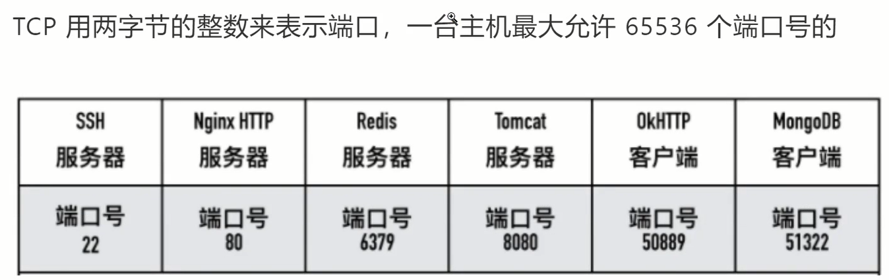

# TCP/IP面试20问

## 1、什么是TCP网络分层

**应用层、传输层、网络互联层、网络访问层、物理层**

 

**分层的好处**

每个层都是独立的，各层不需要知道上下层是如何工作的。

灵活性更好

易于测试和维护

## 2、TCP的三次握⼿中为什么是三次？为什么不是两次、四次？

 

如果只是两次的话，根本没有办法去确认客户端的接收能力，会造成连接资源的浪费

三次已经够了，已经可以确认连接的建立，四次的话没必要

## 3、TCP的四次挥⼿为什么是四次？为什么不能是三次

 

TCP的四次挥手是为了终止连接而建立的  

第一批客户端向服务端发送断开连接的请求（两次）

第二批服务端向客户端发送断开连接的请求（两次）

客户端向服务端发送断开连接请求的时候，服务端只是close_wait的状态，作为服务端可能还有些资源没有释放，还有请求没有处理，所以第二次和第三次之间有延迟或者时差。所以如果把2、3合并的话，服务端发送给客户端的请求会有延迟，而TCP是可靠的，超过30ms会以为网络不可达，所以他会有重发机制，通过报文的方式发送，如果服务端没有回给客户端信息，客户端就会一直发送请求，导致资源的浪费

## 4、为什么SYN/FIN不包含数据却要消耗一个序列号

凡是需要对端的确认，一定要消耗TCP报文的序列号，客户端会人为可能会因为网络的原因要进行重发，而服务端还在处理着，你这里又发送了重复的请求，导致资源的浪费。

**SYN和FIN需要对端的确认，所以需要消耗一个序列号**

## 5、什么是半连接队列？什么是SYN Flood攻击

客户端大量伪造IP发送SYN包，服务端恢复的ACK+SYN去到了一个位置的IP地址，会造成服务端大量的连接处于SYN_RCVD状态，而服务器的半连接队列大小也是有限的，如果半连接队列满，也会出现无法处理正常请求的情况。

 

可以在应用层模拟SO_KEEPALIVE的方式，用心跳包来模拟保活探测分节。由于服务器通常要承担成千上万的并发连接，所以肯定是由客户端在应用层进行心跳来模拟保活探测分节，客户端多次收不到服务器的响应时可终止此TCP连接，而服务端可监测客户端的心跳包，若在一定时间间隔内未收到任何来自客户端的心跳包则可以终止此TCP连接，这样就有效避免了TCP半开连接的情况。

## 6、说说TCP快速打开(TFO)的原理

 

三次握手建立完成之后，服务端已经有客户端的cookies了

 

减少一个往返的RTT，防止SYN-FLOOD

 

## 7、TCP报文中的时间戳有什么作用

 

TCP Timestamps Option由四部分组成

类别、长度、发送方时间戳、回显时间戳

计算重传往返的时延问题

防止序列号的回绕问题

## 8、TCP 的超时重传时间是如何计算的

TCP具有超时重传机制，即间隔一段时间没有等到数据包的恢复时，重传这个数据包

这个重传间隔也叫做**超时重传时间（RTO）**

 

## 9、能不能说⼀说 TCP 的流量控制

主要是通过两个缓冲区，发送的时候会带窗口大小

 

 

 

## 10、如何理解 TCP 的keep-alive的原理

一个TCP连接上，如果通信双方都不向对方发送数据，那么TCP连接就不会有任何数据交换。

假设应用程序是一个web服务器，客户端发出三次握手以后故障宕机或者拔掉网线，对于web服务器而已，下一个数据包将永远无法到来，但是他一无所知

所以设计了keep-alive来防止这种死链接的问题，定时发送心跳包探测连接是否存活。

## 11、聊一聊TCP中的端口号

在传输层中，一般分为两个端口，源端口和目标端口

 

 

## 12、TCP场景问题1

## 13、TCP场景问题2

 

IP报文头中有协议标志位来区分，如果这个协议为1就是ICMP、协议为6就是TCP、协议为17就是UDP

## 14、TCP场景问题3

 

## 15、讲一讲Telnet的用法

检查一个端口是否打开

## 16、讲⼀讲netstat的⽤法

 

## 17、tcpdump的用法

功能非常强大，一般是用来抓TCP的包

## 18、讲⼀讲wireshark的⽤法

## 19、TCP 和 UDP 的区别

TPC是一个面向连接的、可靠的、基于字节流的传输层协议

而UDP是一个面向无连接的传输协议

 

## 20、如果要你来设计⼀个QQ，在⽹络协议上你会考虑 如何设计

 

