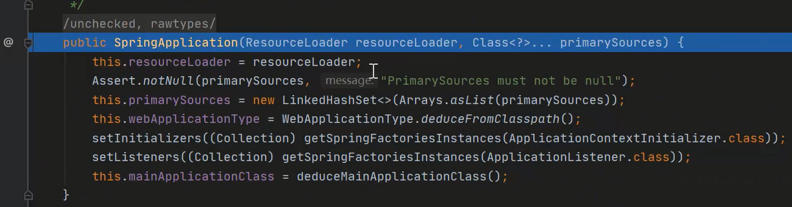
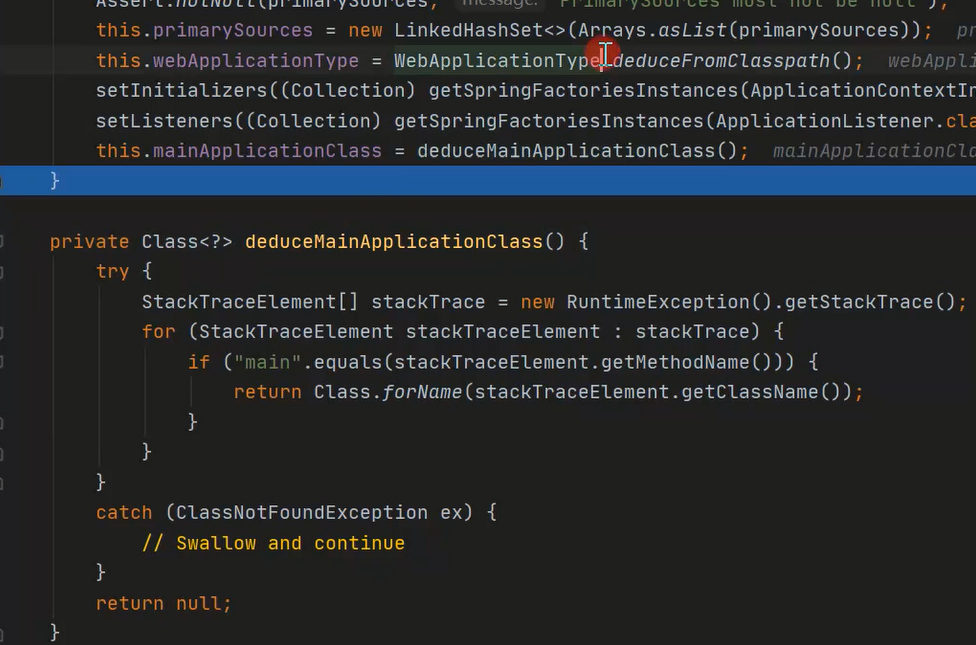
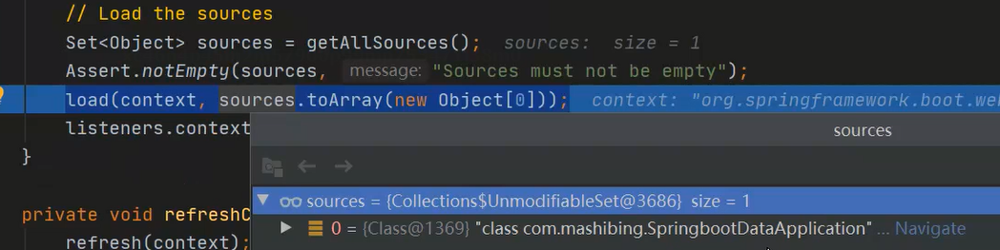
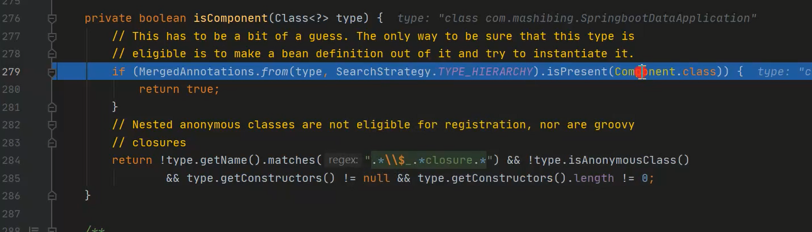
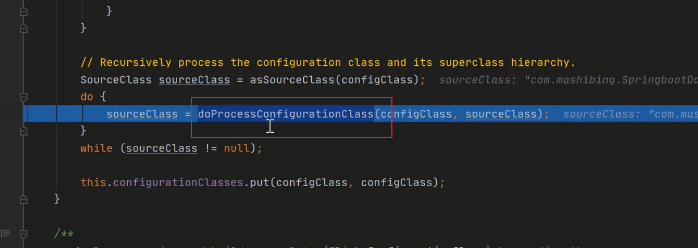
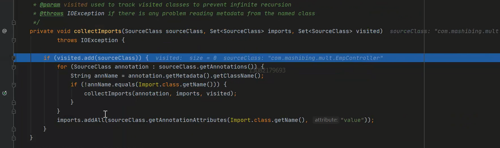

# SpringBoot面试突击

## 谈谈你对springboot自动装配的理解

1、在整个SpringBoot启动类上面会有一个@SpringBootApplication的注解，当容器启动好之后会识别到当前注解，下一步会在这个注解里面进行相关的解析。

2、这个时候就识别到了另外一个注解EnableAutoConfiguration这个注解，再进行这个解析的时候会发现有一个@import注解，里面包含了一个AutoConfigurationImportSelector这个类，当我们检索到这个选择器之后，里面会包含一个方法，getCandidateConfigurations()，这个方法里面会返回EnableAutoConfiguration类。此时就会从Spring.factors里面加载出我们的配置选项，此时自动装配就完成了。

## 谈谈Spring是如何加载配置文件的

SpringApplication

 

primarySources：就是你当前启动类的实例

webApplicationType：当前启动类型（例如：Servlet）

setInitializers：设置初始化器（读取了spring.factories）

setListeners：设置监听器（读取spring.factories）

当我们读取到对应的配置文件时，会把当前的配置文件都读取回来

启动的时候会根据名称去结果集里面进行匹配，匹配到之后返回对应的结果

 

##  谈谈你对SpringBoot中的监听器的设计

run()

**EventPublishingRunListener：之后在发布事件的时候会用到当前的名称**

 

检索当前类上是否有component这个注解

 

## 谈谈你对invokeBeanFactoryPostProcessors的理解

**BeanFactoryPostProcessor在refresh方法里面执行扩展，他是在invokeBeanFactoryPostProcessor()这个方法里面进行完成**

他有个子接口**BeanDefinitionRegisterPostProcessor**，他会做判断，优先执行BeanDefinitionRegisterPostProcessor的类（他的子类）

先对参数进行处理

根据当前类型，来找到符合这个beanFactory的具体名称

一系列的注解解析过程	

**@Import：通过递归的方式来解析**

 

## 谈谈你对springboot配置原理的理解

### SpringBoot自动装配的原理是什么？

总体思路：

1、SpringBoot自动装配是什么，解决了什么问题？

SpringBoot在启动的时候会自动将相关类装载到IOC容器中，启动的时候会扫描外部引用的jar包中的MEATA-INF/spring.factories文件，将文件中配置的类型信息加载到Spring容器中，并执行类中定义的各种操作

**自动装配实现的原理：**

​	1、当启动SpringBoot应用程序的时候，会先创建SpringApplication对象，在对象的构造方法中会进行某些参数的初始化工作，最主要的是判断当前应用程序的类型以及初始化器和监听器，在这个过程中会加载整个应用程序中的spring.factories文件，将文件的内容放到缓存对象中，方便后续的获取。

​	2、SpringApplication对象创建完成之后开始执行run方法来完成整个的启动过程，启动过程中最主要的是有两个方法：第一个叫做prepareContext，第二个叫做refreshContext，在这两个关键步骤中，完成了自动装配的核心功能，前面的处理逻辑包含了Context对象的创建，banner的打印，异常报告器的各个准备工作，方便后续的调用。

​	3、在prepareContext方法中主要完成的是对上下文对象的初始化操作，包括了属性值的设置，比如环境对象，在整个过程中有一个非常重要的方法叫做load()，load主要完成一件事，将当前启动类作为一个BeanDefinition注册到registry中，方便后续在进行BeanPostProcessor调用执行的时候找到对应的主类，来完成@SpringBootApplication，@EnableAutoConfiguration等注解的解析工作。

​	4、在refreshContext方法中会进行整个容器的刷新过程，会调用到Spring中的refresh方法，refresh中有13个关键的方法，来完成整个Spring应用程序的启动，在自动装配过程中，会调用invokeBeanFactoryPostProcessor方法，在此方法中主要是对ConfigurationClassPostProcessor类的处理，此类是BFPP的子类，也是BDRPP的子类，在调用的时候会先调用BDRPP中的PostProcessorBeanDefinitionRegistry方法，然后调用postProcessorFactory方法，在执行postProcessorBeanDefinitionRegistry的时候会解析处理各种注解，包含@PropertySource、@ComponentScan、@ComponentScans、@Bean、@Import等注解，最主要的是@Import注解的解析

​	5、在解析@Import注解的时候，会有一个getImports的方法，从主类开始递归解析注解，把所有包含@import注解都解析到，然后在processorImport方法中对Import类进行分类，此处主要识别的是AutoConfigurationImportSelector，归属于ImportSelector的子类，在后续过程中会调用deferredImportSelectorHandler中的process方法，来完成EnableAutoConfiguration的加载。

​	6、上面是我对SpringBoot自动装配的简单理解，您看下有没有什么地方有问题，可以指点一下

