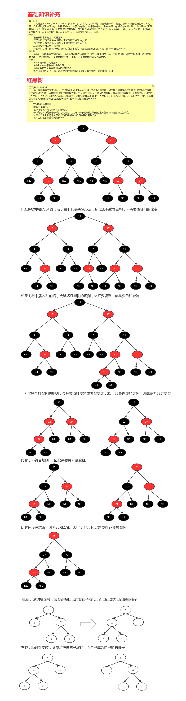
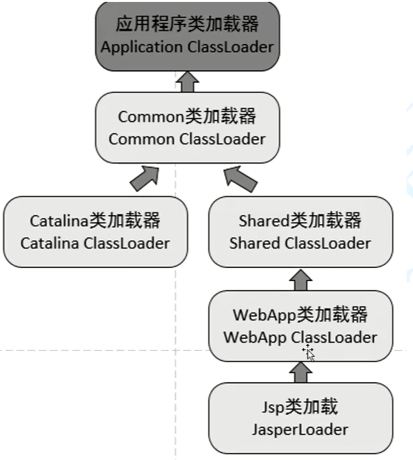

# 八股文


## 一、Java基础


### java是什么类型的语言

及时编译，可以说是**编译型**语言也可以是**解释型**

java 先编译 再由JVM去解释


**每次的class文件都要JVM去解释？**

针对热点数据(常用的代码)，会直接把class文件编程操作系统能够认识的东西。

部分的class内容->变成类似于操作系统能够直接执行的东西

GrallVM：可以去了解===


### java中的对象如何拷贝

#### 深拷贝

#### 浅拷贝

clone()


### 什么是Object，有哪些常用的方法？怎么创建对象？

clone、new、反射、反序列化

notify  notifyall

#### 为什么唤醒线程的方法是在object里面？不是应该在线程Thread里面吗？

因为锁在对象的头里面(markword)，


### 多态，面向接口编程？

1、制定标准(例:jdbc)

2、提高可扩展性

**接口和抽象类的区别**？


### 什么是内部类？说说你对他的理解以及实战场景


下面这道题为什么不行？

 

局部内部类里面他只能使用final的局部变量，test这个方法的生存期间，跟他内部类产生的对象的生存周期是不一样的。


### 说说static 和final在Java中的定义


### java中的基本数据类型占多少字节？不同的操作系统一样吗？

跟操作系统没有关系，大小都是靠JVM去分配的。


### 为什么需要8中包装类型？

因为java是面向对象的语言


### 什么是序列化，什么是反序列化？说说应用场景

dubbo

RPC，

### 数组有length()方法吗？

没有，只有length属性


### 构造器是否可以重写？

不可以


### char是否可以存储一个汉字？

可以存储一个汉字，但是汉字占用的字节码是不同的。不同的字符集里面汉字所占的字节码是不同的


### 集合原理系列

```
ArrayList
LinkedList：Queue、Deque
为什么线程舍弃Victor？
性能不行，加锁的方式太低效了。

HashSet、TreeSet


HashMap、TreeMap、HashTable、LinkedMap
	
queue阻塞队列
add remove element offer poll peek put take
```

### 

### Enumeration接口和Iterator接口的区别有哪些？

Enumeration在迭代的时候不能去改里面的东西，不能删里面的东西


### 异常

异常也是一种代码分支的实现方式


### 什么是事务？为什么需要事务？如何实现事务？事务隔离级别

java事务类型有几种？

jdbc事务、jta事务、容器事务


### java修饰符以及他的作用范围

public protect default private


### javaWeb

什么是Servlet，jsp

Tomact的原理：背一下


禁用cookies，session怎么办？

带参数或者重写url，只要每次把sessionid带上就好了


doget和dopost的区别？


Forward和Redirect的区别？


Http响应的结构是怎么样的？


## 算法突击

### 题目1：前缀和


累加和算法：

求arr[L, R]位置的和


arr[L,R]=arr[R]-arr[L-1]


### 题目2：预处理思想，分糖果问题

 

 分数[5, 4, 6, 2, 4]

​         0, 1, 2, 3, 4

至少分到一颗

相邻的小朋友得分高的一定要比他相邻的小朋友得分低的多拿糖果


分成两个辅助数组

左坡

右坡


 


### 题目3：[经典算法]最长递增子序列问题(LIS)

暂时搁置======


## 中间件的使用

缓存中间件

1、JVM：guava(类似于redis:ex，不需要持久)，ehcache(持久)

2、非JVM：redis、memcached(数据类型单一的情况下可以使用)10K以下

大数据量存储在redis里面是非常不合适的，这种大数据量缓存要把他写成静态的缓存文件，直接走FS系统走文件。

因为redis单线程，我们不能用大的value或者大key去存东西，这样子在网络传输数据的时候会导致线程阻塞。

es(大量坐标位置)


**redis和mysql 的双写一致性如何保证？**

运用mysql 的事务机制，先将数据存到mysql，mysql成功后存到es

文件存储中间件：fastdfs、hdfs、云存储(oss,7牛,s3),es()

数据库中间件：mycat(社区生态不好)，shardingsphere

消息队列中间件：Kafka、RocketMQ、RabbitMQ、activeMQ

定位：half msg

优劣对比：成熟团队选(kafka)，bus（RabbitMQ，kafka），RocketMQ（事务消息）

接入层中间件：nginx(HAproxy，tengine，openrestry)+keepalived，lvs，slb，cdn。**亿级流量多级缓存课中学习====**


## 二、Spring面试题

突出技术名词（核心概念，接口类，某些关键方法）


### SpringIOC的理解，原理与实现

**总：**

控制反转（理论思想）

原来的对象是由使用者来进行控制的，后来有了Spring之后，可以把这个对象交给Spring来帮助我们进行管理

DI:依赖注入，把对应属性的值注入到具体的对象中。注解方式、set方式、构造方法方式注入

​	在Spring中通过@Autowired，populateBean也可以完成属性的注入

容器：

存储对象，使用map结构来存储的， 在Spring中一般存在3级缓存，

singletonObjects存放完整的bean对象、

整个bean的生命周期，从创建到使用到销毁的过程都是由容器来管理的。(bean的生命周期)

**分：**

1、聊ioc容器的时候要牵扯到容器创建的过程（**BeanFactory根接口没有提供对应的子类实现，DefaultListableBeanFactory**）

​	容器有一个最上层的根接口BeanFactory，我们在实际调用过程中最普遍使用的是一个DefaultListableBeanFactory，包括我们在使用的时候也会优先创建当前的bean工厂，创建完bean工厂之后会优先向bean工厂中设置一些参数（例如：BeanPostProcessor，Aware接口的子类）等等属性

2、加载解析bean对象，准备要创建的bean对象的定义对象BeanDefinition(这里面会涉及到xml或者注解解析的过程（会涉及到xml或者注解解析）)

3、BeanFactoryPostProcessor的**处理**，此处是扩展点，PlaceHolderConfigurSupport（处理占位符）、ConfigurationClassPostProcessor（@Configuration）

4、BeanPostProcessor的**注册功能**，方便后续对bean对象完成具体的扩展功能

5、通过反射的方式将BeanDefinition对象实例化成具体的bean对象

6、bean对象的初始化过程（1、填充属性；2、调用aWare子类的方法；3、调用BeanPostProcessor前置处理方法；4、调用init-method方法；5、调用BeanPostProcessor的后置处理方法）

7、生成完整的bean对象，通过getBean方法可以直接获取

8、销毁过程

没看过源码怎么办===


具体的细节不太清楚，但是spring中的bean都是通过反射的方式形成的，同时其中包含了很多的扩展点，比如最常用的对beanFactory的扩展，对bean的扩展(**对占位符的处理**)，我们在公司对这方面的使用是比较多的，除此之外IOC中，最核心的也就是填充具体bean 的属性和生命周期(**背生命周期**)


 

gitlib找这些图（有时间了拿去背）

 

### 谈一下Spring IOC的实现

底层实现：工作原理，过程，数据结构，流程，设计模式

所谓底层实现就是你对他的了解和你了解的实现过程

反射，工厂的价值，设计模式，关键的几个方法

createBeanFactory，getBean，doGetBean，createBean，doCreateBean，createBeanInstance(getDeclaredConstructor(),newInstance)，populateBean，initializingBean

加do的方法都是实际干活的方法

1、先通过createBeanFactory创建出一个bean工厂DefaultListableBeanFactory

2、开始循环创建对象，因为容器中的bean默认都是单例的，所以优先通过getBean或doGetBean从容器中查找，找不到的话

3、通过createBean和doCreateBean方法以反射的方式创建对象，一般情况下使用的是无参构造方法（getDeclaredConstructor，newInstance）来创建对象

4、进行对象的属性填充，populateBean

5、进行其他的初始化操作(initializingBean)


### 描述一下bean的生命周期

背图：

 

记住图中的流程

但是在表述的时候，不要只说图中的关键点，要学会扩展描述

1、实例化Bean对象

2、填充bean的属性：populateBean()，循环依赖的问题（三级缓存）

3、调用Aware接口相关的方法，invokeAwareMethod（完成BeanName，BeanFactory，BeanClassLoader对象的属性设置）

4、调用BeanPostProcessor中的前置方法，使用比较多的是（ApplicationContextPostProcessor，设置ApplicationContext，Environment，ResourceLoader等对象）

5、调用initmethod方法：invokeInitmethod()，判断是否实现了initializingBean接口，如果有调用AfterPropertiesSet方法，没有就不调用

6、调用BeanPostProcessor的后置处理方法：spring的aop就是在此处实现的，AbstractAutoProxyCreator

7、注册Destruction相关的回调接口

8、获取到完整的对象，可以通过getBean的方式来进行对象的获取

9、销毁流程：1.判断是否实现了Dispoablebean接口；2.调用destroyMethod方法


### Spring是如何解决循环依赖问题

三级缓存，提前暴露对象，聊AOP

**总：**

先解释什么是循环依赖的问题，A依赖B，B依赖A，A里面有一个B对象属性，B里面有一个A对象属性形成了一个闭环

**分：**

先说明bean的创建过程：实例化、初始化（填充属性）

1、先创建A对象，实例化A对象，此时A对象中的B属性为null，填充属性B

2、从容器中查找B对象，如果找到了直接赋值，不存在循环依赖问题(但是这样子是不通的)，找不到直接创建B对象

3、实例化B对象，此时B对象中的A属性为null，填充属性A

4、从容器中查找A对象，找不到直接创建，

形成闭环的原因

​	此时如果仔细琢磨的话会发现A对象是存在的，只不过此时的A对象不是一个完整的状态，只完成了实例化，并未完成初始化。

​	如果在程序调用过程中，拥有了某个对象的引用，能否在后期给他完成赋值操作，可以优先把一个非完整状态的对象优先赋值，等待后续操作来完成赋值，相当于提前暴露了某个不完整对象的引用，所以解决问题的方式在于实例化和初始化分开来操作，这也是解决循环依赖问题的关键。

​	当所有的对象都完成实例化和初始化操作之后，还要把完整对象放到容器中，此时在容器中存在对象的几个状态，完成实例化-但未完成初始化，完整状态。因为都在容器中所以要使用不同的map结构来进行存储，此时就有了1级缓存和2级缓存。如果一级缓存中有了，那么二级缓存中就不会存在同名对象，因为他们的查找顺序是1，2，3这样的方式来查找的。一级缓存中放的是完整对象，二级缓存中叫非完整对象

​	为什么需要三级缓存？三级缓存的value是什么类型？是ObjectFactory，是一个函数式接口，存在的意义是保证在整个容器的运行过程中同名的对象只能有另一个

​	如果一个对象需要被代理，或者说需要生成代理对象，那么要不要优先生成一个普通对象？要！不创建出来普通对象用什么代理？

 

​	

​	**普通对象和代理对象是不能同时出现在容器中的，因此当一个需要被代理的时候就要使用代理对象覆盖掉之前的普通对象。**

​	在实际的调用过程中是没有办法确定什么对象被使用，所以就要求当某个对象被调用的时候，优先判断此对象是否需要被代理，类似于一种回调机制的实现，因此传入lambda表达式的时候，可以通过lambda表达式来执行对象的覆盖过程。getEarlyBeanReference()。

​	因此，所有的bean对象在创建的时候，都要优先放到三级缓存中，在后续的使用过程中，如果需要被代理，则返回代理对象，如果不需要被代理则返回普通对象


https://www.jb51.net/article/236898.htm


#### 缓存的放置时间和删除时间

三级缓存：createBeanInstance之后（addSingletonFactory()）

二级缓存：第一次从三级缓存确定对象是代理对象，还是普通对象的时候，同时删除三级缓存：(getSingleton)

一级缓存：生成完整的对象之后放到一级缓存，删除二三级缓存  （addSingleton()）


三级缓存的作用是为了解决spring中Bean依赖注入时发生的循环依赖。如果不需要AOP，那么只需要二级缓存即可实现，如果有AOP，其实二级缓存也能够实现，但是会打破Bean的生命周期，不符合spring的原则，因为需要把AOP对象放入二级缓存中，那么就必须在所有需要AOP处理的Bean对象初始化之前就对Bean对象进行后置处理（生成AOP对象），即使没有发生循环依赖！这并不是spring想看到的，所以spring引入了三级缓存，而且存入的是<beanName, ObjectFactory>结构，ObjectFactory是一个lambda表达式，相当于一个回调函数，当发生循环依赖的时候，会进行lambda表达式的执行，获取到Bean对象或者 AOP代理对象，再将Bean对象或者 AOP代理对象存入二级缓存中，如果之后还有循环依赖指向该对象(类似 A 依赖 B , B 依赖 A和C ， C 依赖 A这种情况)，就直接从二级缓存里面获取，从而解决了循环依赖。（这里解释了为什么不直接在二级缓存里存放lambda表达式，因为同一个lambda表达式每执行一次，就会生成一个新的代理对象，不能保证单例）


### BeanFactory与FactoryBean有什么区别？

相同点：**都是用来创建bean对象的**

不同点：**使用BeanFactory创建对象的时候，必须要遵循严格的生命周期流程，太复杂了，如果想要自定义某个对象的创建，同时创建完成的对象想交给spring来管理，那么就要实现FactoryBean接口了**

​	isSingleton：是否是单例对象

​	getObjectType：获取返回对象的类型

​	getObject：获取自定义对象的过程(new，反射，动态代理)


1. A 调用doCreateBean()创建Bean对象：由于还未创建，从第1级缓存singletonObjects查不到，此时只是一个半成品（提前暴露的对象），放入第3级缓存singletonFactories。
2. A在属性填充时发现自己需要B对象，但是在三级缓存中均未发现B，于是创建B的半成品，放入第3级缓存singletonFactories。
3. B在属性填充时发现自己需要A对象，从第1级缓存singletonObjects和第2级缓存earlySingletonObjects中未发现A，但是在第3级缓存singletonFactories中发现A，将A放入第2级缓存earlySingletonObjects，同时从第3级缓存singletonFactories删除。
5. 将A注入到对象B中。
6. B完成属性填充，执行初始化方法，将自己放入第1级缓存singletonObjects中（此时B是一个完整的对象），同时从第3级缓存singletonFactories和第2级缓存earlySingletonObjects中删除。


A得到“对象B的完整实例”，将B注入到A中。
A完成属性填充，执行初始化方法，并放入到第1级缓存singletonObjects中


### Spring中用到的设计模式

单例模式：spring中bean默认都是单例的

原型模式：指定作用域为prototype

工厂模式：BeanFactory

模板方法模式：postProcessBeanFactory，onRefresh，initPropertyValue

策略模式：XMLBeanDefinitionReader，PropertiesBeanDefinitionReader

观察者模式：listener，event，multicast

适配器模式：Adapter

装饰者模式：BeanWrapper

责任链模式：使用aop的时候会先生成一个拦截器链

代理模式：动态代理

委托者模式：delegate

......

### Spring的AOP底层实现原理？

动态代理

aop是ioc的一个扩展功能，先有的ioc，后有的aop，只是在ioc的整个流程中新增的一个扩展点而已。

BeanPostProcessor后置处理方法

总：aop概念，应用场景，底层实现用的是动态代理

分：在整个bean的创建过程中可以对bean进行扩展，而aop本身就是一个扩展功能，所以在BeanPostProcessor的后置处理中，来进行实现

​	1、代理对象的创建过程(advice通知，切面，切点)

​		基于Bean名称在xml配置规则的自动代理创建器：BeanNameAutoProxyCretor

​		基于Advisor匹配机制的自动代理创建器：对容器所有的Advisor进行扫描，实现类为DefaultAdvisorAutoProxyCreator

​		基于Bean中的Aspect注解的自动代理创建器：AnnotationAwareAspectJAutoProxyCreator

​	2、通过jdk或者cglib的方式来生成代理对象

​	**jdk和cglib动态代理的实现原理**

​	3、在执行方法调用的时候会调用到生成的字节码文件中，直接会找到一个类**DynamicAdvisoredIntercept**类中的intercept方法，从此方法开始执行

​	4、根据之前定义好的通知来生成拦截器链

---

​	5、从拦截器链中依次获取每一个通知开始执行，在执行过程中为了方便找到下一个通知是哪个，会有一个CglibMethodInvocation对象，找的时候是从-1的位置依次开始查找并执行的。


### Spring事务是如何回滚的

spring的事务管理是如何实现的？

总：spring的事务是由AOP来实现的，首先要生成具体的代理对象，然后按照AOP的整套流程来执行具体的操作逻辑，正常情况下要通过通知来完成核心功能，但是事务不是通过通知来实现的，而是通过一个TransactionInterceptor来实现的，然后调用invoke来实现具体的逻辑。

分：

1、先做准备工作，解析各个方法上事务相关的属性，根据具体的属性来判断是否开启新事务

2、当需要开启的时候，获取数据库连接，关闭自动提交功能，开启事务

3、执行具体的sql逻辑操作

4、在操作过程中，如果执行失败了，那么会通过completeTransactionAfterThrowing来完成事务的回滚操作，回滚的具体逻辑是通过doRollback方法来实现的，实现的时候也是要先获取连接对象，通过连接对象来回滚

 

5、如果执行过程中没有任何意外的情况发生，那么通过commitTransactionAfterReturning来完成事务的提交操作，提交的具体逻辑是通过doCommit方法来实现的，实现的时候也是先获取连接，通过连接对象来提交

 

6、当事务执行完毕之后，需要清除相关的事务信息 cleanupTransactionInfo

 


如果想要更细致的话，需要知道TransactionInfo，TransactionStatus


### Spring的事务传播特性

传播特性有几种？7种

Required，Requires_new，nested，support，Not_support，Never，Mandatory

某一个事务嵌套另一个事务的时候怎么办？

A方法调用B方法，A、B方法都有事务并且传播事务不同，那么A如果有异常，B怎么办，B如果有异常，A怎么办？

-----

总：事务的传播特性指的是不同方法的嵌套调用过程中，事务应该如何进行处理，是用同一个事务还是不同的事务，当出现异常的时候是回滚还是提交，他们是两个方法之间的相互影响。在日常共工作中使用比较多的是Required，Requires_new，nested。

分：

1、先说事务的不同分类，可以分为三类

支持当前事务、不支持当前事务、嵌套事务

2、如果外层方法是required，内层方法是，required，requires_new，nested

3、如果外层方法是requires_new，内层方法是，required，requires_new，nested

4、如果外层方法是nested，内层方法是，required，requires_new，nested

-------

核心处理逻辑非常简单：

1、判断内外方法是否是同一个事务：

​	是，异常统一在外层方法处理，如果不是，内层方法有可能影响到外层方法，但是外层方法是不会影响内层方法的。

​	（大致可以这么理解，但是有个别情况不同）

 

 


## 三、Redis面试题


### 1、说一下你在项目中的redis应用场景

```
1、五大value类型：string，set，list，hash，sortset
2、基本上就是拿他当缓存用
3、为的是服务无状态，延伸思考，看项目有哪些数据结构或对象，在单机里需要单机锁，在分布式的时候需要分布式锁
4、无锁化
```


### 2、redis是单线程还是多线程的？

```
1、无论是什么版本，工作线程就是只有一个
2、6.x高版本出现了IO多线程
3、[去学习IO的课]
4、使用上来说是没有变化的
```

#### 6.x以前

redis监听多路复用器中是否产生了事件，再通过对应事件跟内核打交道

工作线程只有一条，client端要先访问内核，内核里面有一个epoll（多路复用器，**不负责数据的读写，只是管理读写的事件**）

 

事务失败就是失败，其他的继续执行

在redis中少使用事务，事务内的指令尽量少，尽量快

**搬运是串行的**

#### 6.x以后（服务器为多核的时候才有意义）

出现了所谓的IO多线程方式，工作线程,IO线程

工作线程一直循环，如果内核有事件发生，那么工作线程就会将这些时间分发给下面各个IO线程，这些IO线程会并行的把这些数据搬运回来。


堆里面一旦有了计算之后，他的计算都是在主线程中串行执行的

**搬运是并行的**


单线程，满足redis的串行原子，只不过IO多线程后，把输入/输出放到更多的线程里去并行

好处如下：

1、执行时间缩短，更快

2、更好的压榨系统及硬件的资源(网卡能够高效的使用)


顺序性：客户端被读取的顺序不能被保障，但是在一个连接socket里面的顺序是可以被保障的

通道与通道，连接与连接之间可能是交叉的，但是一个连接通道里面的顺序肯定是有序的。


**6.x以后多线程IO情况下是如何保证事务的？**

事务有queue的概念，看似IO来的时候事务命令是穿插的，只要事务命令只要到达之后，就并不参与计算中，他就攒到了一个queue中，一旦执行了，这个工作单线程就把刚刚的指令原子的执行，其他的IO他是不会碰的


### 3、redis中存在线程安全问题吗？为什么？

redis可以保障内部串行，外界使用的时候要保障，在业务上要自行保障顺序。


### 4、遇到过缓存穿透吗？

穿透：没有这笔数据

数据库（IO）是架构的瓶颈，有效请求到达数据库

即便放大前置环节的复杂度和成本也是可以接受的


 


key null：用这个key去数据库中查没有，拿回来把这个key的value设为null，放到redis中,set  key null

放大前置环节的复杂度和成本。


使用布隆过滤器


### 5、遇到过击穿吗？

热点key过期或者被淘汰不存在了之后(也有可能是从来没有被缓存的)

1、数据库有；2、突然的大量并发；3、redis没有缓存；


你不知道请求是不是并发的，请求永远是不可预知的，

在并发情况下如何保障DB，或者有效的请求


1.请求redis,肯定没有

2.大家抢锁 O(只有发生redis取不到)

​	2.1.抢上的碰DB O(1)

​	2.2.其他没抢上的做服务治理或者睡眠

3.抢上锁的，去查DB数据，更新redis O(1)

4.sleep的线程醒了之后，回到第一步


### 6、如何避免缓存雪崩的事情？

很多的key瞬间全部都过期了

复用上套模型，深入一点

必须由一个redis提供锁

AKF的分治了，每一个key的锁是不是隔离的


第三方锁可以提供扩展能力，使用分片集群


29个睡眠的话是不是要占用29个线程？如何解决？

如果你的服务器只有四个CPU，请问可以运行多少个线程？非常的多

sleep是blocking阻塞状态，这个线程是不会消耗CPU的，确实是29个blocking的轻量进程，这个时候他们不参与cpu及内核的调度，只要这个时候线程池扩缩容就可以了。


**以上三个问题，核心就是避免DB无效/重复请求，结合图去理解**

涉及架构上的一些思想


 


### 7、Redis是怎么删除过期key的？

### 8、缓存是如何回收的？

```
1、后台在轮询的时候，分段分批的删除那些过期的key
2、请求的时候判断是否已经过期了
尽量的把内存无用空间回收回来
```


### 9、缓存是如何淘汰的

```
0、内存空间不足的情况下
1、淘汰机制里有不允许淘汰
2、lru\lfu\random\ttl
3、全空间
4、尽量在设置过过期的key集合中
```


### 10、如何进行缓存预热？===

```
1、提前把数据塞入redis，(你知道哪些是热数据吗？肯定不知道把，会造成上线很多数据没有缓存命中)
2、开发逻辑上也要规避差集(你没缓存的)，会造成击穿、穿透、雪崩，实施456中的锁方案
缓存预热其实也是复用以上知识点
3、*结合4、5、6点去看，看图理解
```

预备数据上，在开发逻辑上也要规避差集

上线的时候有些数据差距比较大，会造成击穿，穿透，雪崩


### 11、数据库与缓存不一致如何解决？

 

1、我们可以使用分布式事务来解决，但是意义不大，不要因为解决一个问题而引入一个更大的问题，且他的性能其实反而更低了，顶多读多，写稀有的情况下（淘汰）

2、写完redis，再更新数据库的话会造成已有数据的丢失，造成数据不一致，

 

3、先写数据库再写redis的话这个数据就会造成一个时差问题（可以不在C端完成从数据到redis的写入操作），可以使用Canal 监控binlog来写入

 

mysql有主从同步，同步的时候是同步binlog，通俗来说canal将同步的这个过程代码简化一下，可以模拟一个从库来，canal根据自己的业务需求要么更新到redis，要么更新到kafka中


 

1、redis是缓存，对外暴露的时候更倾向于稍微的有时差

2、还是减少DB的操作

3、但是如果真的要落地，那么就使用canal


### 12、简述一下主从不一致的问题？

1、redis的确默认是弱一致性的，他的主从是异步同步的

2、锁不能用主从的集群（单实例/分片集群/redlock）==>redisson

3、在配置中redis中提供了必须有多少个Client连接能同步，你可以配置同步因子，趋向于强一致性

4、wait 2  0

5、从 3 、4 点开始就有点违背redis 的初衷了


### 13、描述一下redis持久化的原理

```
当前线程阻塞服务 不聊  
或者异步后台进程完成持久
fork + copy on write
```


### 14、Redis有哪些持久化的方式

1、RDB、AOF：主从同步也算持久化；

2、高版本：开启AOF，aof是可以通过执行日志，来得到全部内存数据的方式，但是追求性能

​	2.1、体积变大，重复无效的命令      重写，后台用线程把内存的kv生成指令写个新的aof

​	2.2、到了4.x版本之后，新增了更有性能的模型：把重写的方式换成，直接RDB放到AOF文件的头部，比2.1的方法快了，再追加日志


### 15、Redis也扛不住了，万级流量回到DB上，该怎么处理

见3、4、5


### 16、redis实现分布式锁的指令

### 17、为什么使用setnx？

1、他是原子性操作完成，不存在的情况下完成创建

2、如果要用分布式锁，就要用set k v nx  ex （因为既要带上不存在，还要带上过期时间，已避免死锁）


## JVM面试题


### 1、虚拟机栈

JVM的虚拟机栈

1、局部变量表

2、操作数栈

3、指向常量池的指针

在java中调用一个方法首先需要一个栈帧， 

栈帧里面首先需要一个局部变量表，一个操作数栈(先进后出)，还需要一个指向常量池的指针


### 2、PC计数器

传统意义叫pc计数器

bcp:bytecode point


### 3、本地方法栈

在java里面调用虚拟机栈的时候执行的是java的栈帧，而要调用C++语言的时候，就不能用java虚拟机的栈帧了，那么这个时候需要一个新的栈，这个栈就叫做本地方法栈


### 4、方法区和堆

线程公有的，在虚拟机启动时创建，此内存区域的唯一目的就是存放对象实例，几乎所有对象实例都在这里分配内存。存储的数量不是线程安全的，堆和常量池空间不足会引发OOM（OutOfMemoryError）

方法区，相当于是一个模板，字节码，JDK1.8中已经用MetaSpace（元数据区）完全替代了永久代（即方法区），而且元数据区内存不在JVM中，而是使用的本地内存，默认情况下受操作系统内存限制。

话术：java有java虚拟机栈，虚拟机栈中保存的是栈帧（每个方法都对应一个自己的栈帧），有一个本地方法栈是用来执行非java的代码(比如说C和C++)，然后有一个PC计数器来指向当前执行到哪里的字节码，因为当前想知道执行到哪里了，所以给执行引擎给予指示，所以引入了PC计数器。


### 5、java执行引擎

需要有两大块，在jvm的Hotspot里面他有两个解释器，一个是用C++去解释java的字节码，一个是用汇编去解释字节码。

我们还需要一个即时编译器

即时编译器（JIT Compiler）：中间代码生成器、代码优化器、目标代码生成器、探测分析器

java执行引擎还有一个GC垃圾回收期	

主要是用来执行我们的字节码，对字节码进行优化，然后执行GC来清理我们的垃圾


### 6、类加载器

Bootstra加载的是RT.jar里面的class，不是ClassLoader，仅仅只是给java的coder看的，在源码层面上是不存在的。

Extension类加载器，他继承自URLClassLoader，URLClassLoader向上继承SecureClassLoader再向上继承ClassLoader。三层继承关系

ClassLoader是一个抽象类，里面定义了一堆加载的模板，运用的是模板方法模式。核心方法有： loadClass()，defineClass()。他覆盖给子类进行复写的方法是findClass。

有了继承关系了之后，就可以把它加载进来了。


假如我编译成.class文件之后把里面的代码改了怎么办？

会危害到虚拟机，此时此刻加载过来就要对他进行验证，验证准备识别就叫做解析，解析好之后就把它加载进去，生成运行时常量池，ConstantPool，这个时候就把它放到方法区或者MetaSpace里面去。已经初始化了


static final String  另外一个类.这个会不会初始化呢？

不会，因为他在编译的时候他就已经把它扔到常量池里面去了，不需要初始化，是有序的

有序，如果写了static的静态属性，那么他一定存在


**验证：**字节码校验器会检查生成的字节码是否正确，如果验证失败则会验证错误。

**准备：**对于所有静态变量的内存分配和默认值分配

**识别：**解析或识别是从运行时常量池的符号引用中动态具体值的过程


### 7、老年代和新生代

 

为什么要分为老年代、新生代，因为两代的算法是不一样的

老年代由于对象存活比较久，那么这个时候就不需要使用复制算法，使用的是标记清除算法

新生代使用复制算法


### 8、如何解决线上GC的问题

先找点，看看在哪个时间点出的问题，找是fullGC还是YGC，GC的原因，是什么种类的GC

 

### 9、简述一下内存溢出的原因，如果排查线上问题？

 

Direct buffer memory  使用 pmap  看进程里面的映射关系，


### 10、jvm有哪些垃圾回收器，实际如何选择


 

什么是并行？什么是并发？

并行是说同一时间有多个任务可以同时执行，并发就是CPU有两个但是任务有三个那么这个时候就要调度执行。例如100ms切割成两片 A运行50ms，B运行50ms，此时此刻在交替执行的这段时间就叫做并发

 


 


### 11、介绍一下垃圾回收算法

标记-清除，标记-整理

有内存碎片的就是标记清除算法

无内存碎片的就是复制和整理算法，而复制是整理的子集


### 12、happens-before规则

是对jvm的约束

程序顺序规则

锁规则：对一个锁解锁，happens-before在随后对这个锁加锁。

volatile 的规则是 写的时候不会对他进行重排序，读也不会，但是写的时候要对其他线程可见。

store -store

load-store

load-load

store-load

传递性：如果A happens-before B ，且 B happens-before C ，那么A happens-before C

线程启动规则：Thread对象的start() 方法happens-before此线程的每一个操作

线程终止规则：对线程的判断一定不会重排序在start()之前。无论是Thread.join或者Thread.alive()


### 

#### **Java类的加载机制必背========***

 


### 13、阻塞队列有界和无界

他们的继承关系：Queue->ObjectQueue->......

ArrayBlockingQueue和LinkedBlockingQueue的区别

ABQ一个由数组结构组成的，**有界**阻塞队列要是写死了的话他是永远不会扩增，他只有一把锁

LBQ一个由链表结构组成的，**无界**阻塞队列，最大限制是2的23次方-1，再来个负数最大值，两把锁 take(),pu(),

什么时候用ABQ，什么时候用LBQ，缓存行


## Java基础


### 1、HashMap为什么要使用红黑树

在jdk1.8版本后，java对HashMap做了改进，在链表长度大于8的时候，将后面的数据存放在红黑树中，以加快检索速度。

mysql底层用的是B+树

hash表-> 散列算法，hash表其实也有一些问题的，我们要想要把hash表对应的值都加载到内存中，才能加快我们对应的查询效果，他会根据我们的一个下标来直接读取数据的，所以hash表对内存是一个比较严重的消耗。查到hash表数据的时候是有一个等值判断的。

 hash是根据指定的下标来读取数据的，对内存是一个比较严重的消耗


二叉树会造成我们对应的树节点过深，越深以为着IO次数越多

 


AVL二插平衡树树在插入数据的时候会进行一个旋转操作，他要保持最长子树和最短子树高度之差不能超过1，数据越多就会造成1~N次的旋转，旋转非常浪费性能，**查询效率高，插入删除修改效率极低**

### 红黑树

**是AVL树的变种，牺牲了一部分查询性能来满足插入性能的提升**

最长子树只要不超过最短子树的两倍即可。

通过加入变色的行为来减少旋转的次数，任何一条单分支里面不能出现两个红色节点

 



 


### B+树

**特点：**

1. 所有键值分布在整棵树中
2. 搜索有可能在非叶子节点结束，在关键字全集内做一次查找，性能逼近二分查找
3. 每个节点最多拥有m个子树
4. 根节点至少有2个子树
5. 分支节点至少拥有m/2颗子树(除根节点和叶子节点外都是分支节点)
6. 所有叶子节点都在同一层，每一个节点最多可以有m-1个key，并且以升序排列

 

只允许我们的叶子节点中存储数据，而非叶子节点不存储数据只存key

**注意：在B+Tree上有两个指针，一个指向根节点，另一个指向关键字最小的叶子节点，而且所有叶子节点(即数据节点)之间是一种链式环结构。因此可以对B+Tree进行两种查找运算：一种是对于主键的范围查找和分页查找，另一种是从根节点开始，进行随机查找**


为什么不使用B*树？B *树在非叶子节点中也会建立一个连接，但是非叶子节点上面是没有数据在的，所以没有必要使用B * 数


InnoDB数据和索引是放一起的，MyISAM数据和索引是分开来存放的

 

**当使用InnoDB这种存储引擎的时候，他所对应的一个叶子节点中存储的就是实际的一整行数据。**


****

**如果使用MyISAM的时候，因为他们位于两个不同的文件，所以在查找 数据的时候，最后一个叶子节点放的不是一个具体的数据，而是实际的这条数据所在的文件的文件地址。需要先去到当前数据的文件地址，在根据当前地址去对应的myd文件中找到所对应的数据行，才能把数据读出来。(多一次IO)**

8以后就没有查询缓存了


## 集合类是怎么解决高并发中的问题


先说一下哪些是非安全的，再说一下哪些是安全的，性能不高，普通的安全集合类

JUC中高并发的集合类


 


### 2、简述一下自定义异常的场景


### 3、描述一下Object中常用的方法

toString：定义一个对象的字符串表现形式，object类中定义的规则是，类的全路径名+@+对象的hash码，

clone >>> 返回一个对象的副本，比new更快，深克隆、浅克隆 原型模式，重写时要实现Cloneable

finalized：在GC的时候会调用该方法，自救

引用计数法、根可达算法


### 4、JDK1.8的新特性有了解过吗

#### lambda表达式


#### 函数式接口，函数式编程


#### 方法引用和构造器调用


#### Stream API


#### 接口中的默认方法和静态方法


#### 新时间日期API


### 5、简述一下Java面向对象的基本特征,继承,封装与多态以及你自己的应用

继承：基本概念解释，在Java中由已知类产生新类的一种机制，同时可以把java中的所有类都共同具有的属性放到父类中，简化重复代码的编写。

封装：基本概念解释， 隐藏实现细节，公开使用方式

多态：一种事物的多种形态，提接口  打破单继承 可以让我们的参数更加的灵活


### 6、Java中重写和重载的区别

重载是发生在一个类中的

重写 继承中 子类重写父类方法

重载的时候返回的类型可以是不一样的，访问修饰符也可以不一样的，参数列表必须不一样

重写的时候返回类型和参数必须一样，访问修饰符的范围不能小于父类的范围


### 7、怎样声明一个类不会被继承,什么场景下会用

final修饰的类不能有子类

大部分情况下都是出于安全考虑的，


### 8、Java中的自增是线程安全的么,如何实现线程安全的自增

i++  和  ++i是不是线程安全的，不是

增加synchronized进行线程同步

使用lock、unlock处理Reetratent锁进行锁定


AtomicInteger >>>> Unsafe


### 9、Jdk1.8中的stream有用过么,详述一下stream的并行操作原理

**他专注于对容器对象进行各种非常便利、高效的聚合操作或者大批量数据操作**


其实本质上就是在ForkJoin上进行了一层封装，将Stream不断尝试分解成更小的split，然后使用fork/join框架分而治之，parallize使用了默认的ForkJoinPool.common默认的一个静态线程池。


### 10、什么是ForkJoin框架，使用场景

 

fork 分叉

join 合并


**工作窃取算法**


优点：

利用线程进行并行计算，减少了线程间的竞争

缺点：

有任务争夺的问题


### 11、java中的代理有几种实现方式

静态代理：


动态代理：


JDK>>>Proxy

1、面向接口的动态代理，代理一个对象去增强面向某个接口中定义的方法

2、没有接口不可用

3、只能读取到接口上的一些注解


第三方   CGLib

1、面向父类的动态代理

2、有没有接口都可以使用

3、可以读取到类上的注解的


### 12、equals()和==区别，为什么重写equal要重写hashcode

==是运算符，equals来自于Object类定义的一个方法

==可以用于基本数据类型和引用类型，equals只能用于引用类型


### 13、hashmap在1.8中做了那些优化

在1.7中HashMap的数据结构为数组+单向链表。java8中变成了数组+单向链表+红黑树

在JDK1.7的时候链表采用的是头插法，1.8变成了尾插法


### 14、HashMap线程安全的方式？

HashMap不是线程安全的，往往在写程序的时候需要通过一些方法来回避，其实JDK原生提供了2种方法让HashMap支持线程安全


方式一的特点：

 


方式二的特点：

 

 

### 15、为什么HashMap扩容的时候是两倍？


### 16、解决hash冲突的方式有哪些


 

 


### 17、HashMap为什么用红黑树而不同AVL二叉树

**红黑树从根到叶子的最长路径，不会超过最短路径的2倍**


### 18、Tomcat为什么要重写类加载器

**先要解释一下类加载器的双亲委派机制的问题：**安全防止重复加载

Tomcat里面如果跑了两个服务，各个服务都有自己的类库，类库中有重复的类，但是版本号不同，例如：A服务中是Spring2.x，B服务中是Spring3.X，如果不重写类加载器让他们都使用同一个类加载器加载的话，那么服务就乱了

 

 

Tomcat定义了哪些类加载？如下图

 

 

每一个web应用程序对应一个WebappClassLoader，每一个jsp文件对应一个JSPClassLoader，所以这两个类加载器有多个实例


### 19、简述一下java运行时数据区

 


### 20、说一下反射，反射会影响性能吗

先说一下java的反射机制

 

会影响性能


### 21、sleep与wait的区别

方法来源不一样

 


### 22、synchronized 和 ReentrantLock 的区别

1、都是用来协调多线程共享对象、变量的访问

2、都是可重入的锁，同一线程可以多次获得同一个锁

3、都保证了可见性和互斥性


两者的不同点

 

11.Lock可以提高多个线程进行操作的效率，既就是实现读写锁等。多个读取线程使用共享锁，写线程使用独享锁/排它锁。

 


### 23、tryLock和Lock和lockInterruptibly 的区别

 


### 24、单例模式的几种实现方式

饿汉式、懒汉式、双重检测锁、静态内部类


## ElasticSearch

 


### 倒排索引深入骨髓

#### 倒排索引的原理以及他是用来解决哪些问题（谈谈你对倒排索引的理解）

大数据搜索

索引：以文件落地，数据结构为载体。帮助我们快速检索数据


为什么不使用B+树作为倒排索引的数据结构？

B+树的结构支撑的数量级比较小

并且他并不支持/不适用于我们在文本字段上创建索引

并且索引的最左匹配原则，如果使用模糊搜索左边加了%的话索引会失效


倒排索引包含了三种数据结构：

倒排表(posting list)包含某个词项的所有id的集合

词项字典（term dictionary）当前索引域，索引字段所有的词项，是个有序的字典

term index 为了提升term dictionary查询效率的一种结构


### 倒排表的压缩算法（底层算法）


## 微服务


access_token是用来访问系统的，refresh_token是用来刷新access_token的，为了让token平滑的过度


例如：登录之后服务端会返回access_token ref_token(时效比较长一些)

当有请求去服务端的时候，要用access_token请求，如果access_token过期了怎么办？程序里需要有一个接口用ref_token刷新access_token，此时重新获得一个access_token，再用新的access_token去请求对应的业务逻辑。	ref_token也过期了那么就只能重新登录了。主要是为了让token平滑的过度


 随着公司的发展 通用的服务都沉淀到了底层，一些新的业务过来之后可以提高新业务的开发效率。


注册中心挂了服务还能调用吗？

有的可以，有的不可以。可以：当前服务去注册中心查的时候，查到了ip地址和信息缓存到了本地，然后直接去调用，只要服务没挂就是能调用的。不可以：要么是本地的缓存失效了，要么就是去注册中心拉取服务的时候拉不回来注册中心挂了，并且本地的缓存没了，所以就调不通了


配置中心


熔断是在服务的消费端


如果优雅的停机

先停服务，再向注册中心发下线请求。先停机，有熔断和降级机制容忍他，后面再发下线通知就可以了。


## 多线程面试题


### 1、如何预防死锁

首先需要将死锁发生的必要条件讲出来

1、互斥条件  同一时间只能有一个线程获取资源

2、不可剥夺条件  一个线程已经占有的资源，在释放之前不会被其他线程抢占

3、请求和保持条件  线程等待过程中不会释放已占有的资源

4、循环等待条件   多个线程互相等待对方释放资源。


### 2、多线程有哪几种创建方式

 

Feature


### 3、描述一下线程安全活跃态问题，静态条件

线程安全的活跃性问题可以分为死锁、活锁、饥饿

线程饥饿，读写锁

活锁就是：有时候线程虽然没有发生阻塞，但是仍然会存在执行不下去的情况，活锁不会阻塞线程，线程会一直重复执行某个相同的操作，并且一直失败重试


### 4、Java中的wait和sleep的区别与联系？

因为sleep是只针对线程的，所以他不可能在对象的方法，所以他理应在Thread的类里面。

wait他在syn 上的是syn锁，所以以锁相关，以对象头相关，所以他理应属于对象，所以他在Object超类里面。

wait 他和锁相关所以这个时候他会释放锁，而sleep是针对于线程本身，所以不涉及到对象锁相关的东西

两者都会导致线程阻塞，两者均可被中断和唤醒。


### 5、描述一下进程和线程的区别

**进程是操作系统分配资源的基本单位，线程是CPU调度的基本单位。在任何一个操作系统，他执行的时候必须执行程序的指令，java编译完成之后就是CPU执行编译好的指令。**

通俗回答：

进程是操作系统的基本单位，线程是系统调度的基本单位，


### 6、描述一下Java线程的生命周期

线程的生命周期只有三个，运行、阻塞、死亡

这是由于JVM采用了Linux的线程来模拟java的线程，这个时候java创建的线程就是java中的Thread对象，这个时候他就要先创建一个java的对象，再去创建一个原生操作系统的线程执行run方法

 


### 7、程序开多少线程合适？


### 8、描述一下notify 和notifyall的区别


Object他在wait的时候他会放到阻塞队列里面，这个时候调用notify的话，就是在wait列表里面随机唤醒一个，而notifyAll的话就是把等待池里面的所有线程都拿出来，放到竞争队列里面竞争


### 9、描述一下synchronize和lock的区别

因为在jdk1.5之前synchronize的性能极差，所以在还没有优化synchronize的时候引入了lock。ReentrenLock有一个条件变量，他可以切割出多个条件变量，那么这个条件变量就可以有个生产队列


## 网络到IO的面试题

### 1、TCP连接状态==========

http应用层协议

https:httl + ssl/tls

**用户空间**
	应用层

​	表示层

​	会话层

**内核空间**

​	传输控制层	

​	网络层

​	链路层

​	物理层


**一台主机的用户空间可以启动不同的程序，各自程序有各自的应用层协议。但是他们统一有内核提供网络传输之后的事情**

他们之间的桥梁是：Socket或者对应提供的Queue


 

1、服务端启动监听，未来主机收到数据包端口号是9999，就知道这个消息给哪个服务进程

 


问题：

LISTEN状态的服务器，listen socket的接收，发送队列放什么？

Connection refused？

socket队列满了，

1、程序在完成所谓三次握手之后要建立连接，建立完成之后这个连接是内核先帮我们完成的连接，2、连接是否被程序拿走使用

在listen状态的时候他是一个accept队列，等待程序接受的连接，是有大小限制的  backlog允许他在内核后面堆多少，不被程序取走


### 2、TCP三次握手

三次握手其实是完成了内核层次的过程

 

SOCKET放入accept队列，以等待程序通过系统调用将他取走

socket:queue

listener-socket:

listener:send-queue，他的数值backlog

recv-queue:是accept队列

 


如果是listen状态的话，他的send-q只是标识允许被压多少。Recv-q才是程序处理好等着被拿走的队列

### 3、四次分手


 


socket有两种

一种服务端监听的socket：能得到什么？只能得到客户端建立的连接。怎么得到的？通过socket client = server.accept()

一种是连接的socket(1、服务端使用accept()得到的，2、客户端connect得到的socket)，可以得到什么？ 可以得到数据或者发送数据


### Connection refused

内核中的队列满了


### backlog


你可以代码中给出backlog的配置，但是是跟somaxconn这个值去最小min，

每个人顾好自己，每个人处理好对别人的打扰

backlog满了，accept队列满了，新进入的客户端连接直接进入Connection refused


### 长连接和短连接

#### TCP是长连接吗？

可长可短，长短连接和TCP没有关系，因为TCP只是一个连接而已，受应用层协议来决定。

本质区别就是，这个连接是不是一个"复用载体"

例如：

http1.0,1.1没有开启keepalive 保持，所以这个连接只负责一次同步阻塞的请求+响应就是短连接。

http1.0,1.1开启了keepalive保持，同步复用连接：可以多次（请求+响应），但是最好不要http请求、请求、请求，响应响应响应   （以上是无状态通信）

dubbo协议(rpc协议)，打开连接可以同步/异步复用连接：多次（请求+响应）（请求请求）（响应响应），当复用连接的时候，需要一个消息id，而且客户端和服务端同时完成这个约束  有状态通信

**长连接不是在时间维度上面计算的**


### IO模型

IO是程序对着内核的socket-queue的包装

#### BIO

读取一直等queue里面有才返回，阻塞模型，每个连接对应这一个线程

#### NIO

读取的情况下立刻返回：两种结果，读到或者没读到，程序逻辑要自己维护

多路复用器：内核增加select，poll，epoll新增的和数据接收，连接接受实质无关的方法调用，能够得到的是对应socket的事件（listen socket，socket）


### 同步阻塞和同步非阻塞

BIO，NIO，多路复用器在IO模型上都是同步的，都是程序自己accept,R/W


### 沾包、粘包、拆包

有程序，有内核，程序和内核协调工作

有一些是内核做的事情，三次握手，数据发送出去，接收进来是通过内核来完成的，TCP，分包

在我们自己的程序中，即便在一个socket里面，也可能收到多个消息在一个字节数组中，我们需要自己去拆解这些消息


## mysql

连接器、分析器、优化器、执行器

### 描述一下数据库事务的隔离级别？

ACID：

原子性（要么全部成功要么全部失败）

undolog（MVCC）

失败了要进行回滚，所以必须要知道原来的数据或者已经修改的数据是什么，因为一个事务里面可能会包含多条sql

一致性：通过原子性、隔离性、持久性、来保证

隔离性：通过锁+mvcc(多版本并发控制)

持久性：redolog


### mvcc多版本并发控制*

​	MVCC，全称Multi-Version Concurrency Control，即多版本并发控制，MVCC是一种并发控制的方法，一般在数据库管理系统中，实现对数据库的并发访问，在编程语言中实现事务内存。


#### 当前读（读取的是最新版本的数据）

​	像select lock in share mode(共享锁),select for update（排它锁）; update,insert,delete(排它锁)这些操作都是一种当前读，为什么叫当前读？就是他读取的是记录的最新版本，读取时还要保证其他并发事务不能修改当前记录，会对读取的记录进行加锁。


#### 快照读（读取的是历史版本的数据）

​	**他存在的原因是提高数据库的并发，并提高查询能力**

​	像不加锁的select操作就是快照读，即不加锁的非阻塞读；快照读的前提是隔离级别不是串行级别，串行级别下的快照读会退化成当前读；之所以出现快照读的情况，是基于提高并发性能的考虑，快照读的实现是基于多版本的并发控制，即MVCC，可以认为MVCC是行锁的一个变种，但他在很多情况下，避免了加锁操作，降低了开销；既然是基于多版本，即快照读可能读到的并不一定是数据的最新版本，而有可能是之前的历史版本。

当前行的历史数据，这些数据在undolog

当事务需要回滚的时候，就要找到当前行的上一个历史数据。所以可以直接从undolog里面直接取出当前数据行的结果返回。


无论什么样的隔离级别，数据读取的结果只有两种

1、跟原来的数据是一致的（历史数据、快照）

2、读取到了新数据（当前最新版本）


#### 当前读、快照读、MVCC之间的关系

​	MVCC多版本并发控制指的是维持一个数据的多个版本，使得读写操作没有冲突，快照读是MySQL为实现MVCC的一个非阻塞读功能，MVCC模块在mysql中的具体实现是由三个隐式字段，undo日志、read view三个组件来实现的。

 

#### MVCC解决的问题

数据库并发场景有三种，分别为：

 


#### MVCC实现原理

mvcc的实现原理主要是依赖于记录中的三个隐藏字段，undolog，read view来实现的

**DB_TRX_ID**

6个字节，最近修改事务id，记录创建这条记录或者最后一次修改该记

录的事务id

**DB_ROLL_PTR**

7字节，回滚指针，指向这条记录的上一个版本，用于配合undolog,指向上一个旧版本

**DB_ROW_ID**

6字节，隐藏的主键，如果数据表没有主键，那么innodb会自动生成一个6字节的ROW_ID


数据库的行记录在进行删除的时候，不会直接把记录删掉，而是有一个删除标记（也是一个隐藏字段）。


 

 

**undolog**

undolog被称之为回滚日志，表示在进行insert，delete，update操作的时候产生的方便回滚的日志

当进行insert操作的时候，产生的undolog只在事务回滚的时候需要，并且在事务提交之后可以被立刻丢弃

 


#### read view

是事务进行快照读操作的时候产生的读视图，他最大的作用是用来做可见性判断的（之前做的修改能够对现在的读产生影响）。

 

 

#### MVCC的整体处理流程

假设有四个事务同时在执行，如下图所示：

|  事务1   |  事务2   |  事务3   |    事务4     |
| :------: | :------: | :------: | :----------: |
| 事务开始 | 事务开始 | 事务开始 |   事务开始   |
|  ......  |  ......  |  ......  | 修改且已提交 |
|  进行中  |  快照读  |  进行中  |              |
|  ......  |  ......  |  ......  |              |

从上述表格中，我们可以看到，当事务2对某行数据执行了快照读，数据库为该行数据生成一个Read View视图，可以看到事务1和事务3还在活跃状态，事务4在事务2快照读的前一刻提交了更新，所以，在Read View中记录了系统当前活跃事务1，3，维护在一个列表中。同时可以看到up_limit_id的值为1，而low_limit_id为5，如下图所示：


在上述的例子中，只有事务4修改过该行记录，并在事务2进行快照读前，就提交了事务，所以该行当前数据的undolog如下所示：


​		当事务2在快照读该行记录的是，会拿着该行记录的DB_TRX_ID去跟up_limit_id,lower_limit_id和活跃事务列表进行比较，判读事务2能看到该行记录的版本是哪个。

​		具体流程如下：先拿该行记录的事务ID（4）去跟Read View中的up_limit_id相比较，判断是否小于，通过对比发现不小于，所以不符合条件，继续判断4是否大于等于low_limit_id,通过比较发现也不大于，所以不符合条件，判断事务4是否处理trx_list列表中，发现不再次列表中，那么符合可见性条件，所以事务4修改后提交的最新结果对事务2 的快照是可见的，因此，事务2读取到的最新数据记录是事务4所提交的版本，而事务4提交的版本也是全局角度的最新版本。如下图所示：

 


当上述的内容都看明白了的话，那么大家就应该能够搞清楚这几个核心概念之间的关系了，下面我们讲一个不同的隔离级别下的快照读的不同。

#### RC、RR级别下的InnoDB快照读有什么不同

**RC（读已提交）和RR（可重复读）**

​		因为Read View生成时机的不同，从而造成RC、RR级别下快照读的结果的不同

​		1、在RR级别下的某个事务对某条记录的第一次快照读会创建一个快照即Read View,将当前系统活跃的其他事务记录起来，此后在调用快照读的时候，还是使用的是同一个Read View,所以只要当前事务在其他事务提交更新之前使用过快照读，那么之后的快照读使用的都是同一个Read View,所以对之后的修改不可见

​		2、在RR级别下，快照读生成Read View时，Read View会记录此时所有其他活动和事务的快照，这些事务的修改对于当前事务都是不可见的，而早于Read View创建的事务所做的修改均是可见

​		3、在RC级别下，事务中，每次快照读都会新生成一个快照和Read View,这就是我们在RC级别下的事务中可以看到别的事务提交的更新的原因。

​		**总结：在RC隔离级别下，每个快照读都会生成并获取最新的ReadView视图，而在RR隔离级别下，则是同一个事务中的第一个快照读才会创建ReadView，之后的快照读获取的都是同一个ReadView** 


### 描述一下事务的隔离级别

数据库的事务支持四个特性ACID

原子性undolog、一致性、隔离性、持久性

事务的隔离级别有四种：分别是读未提交、读已提交、可重复度、序列化。分别解决了脏读、幻读、不可重复读的问题

 

SQL 标准定义了四个隔离级别：

- READ-UNCOMMITTED(读取未提交)： 事务的修改，即使没有提交，对其他事务也都是可见的。事务能够读取未提交的数据，这种情况称为脏读。
- READ-COMMITTED(读取已提交)： 事务读取已提交的数据，大多数数据库的默认隔离级别。当一个事务在执行过程中，数据被另外一个事务修改，造成本次事务前后读取的信息不一样，这种情况称为不可重复读。
- REPEATABLE-READ(可重复读)： 这个级别是MySQL的默认隔离级别，它解决了脏读的问题，同时也保证了同一个事务多次读取同样的记录是一致的，但这个级别还是会出现幻读的情况。幻读是指当一个事务A读取某一个范围的数据时，另一个事务B在这个范围插入行，A事务再次读取这个范围的数据时，会产生幻读
- SERIALIZABLE(可串行化)： 最高的隔离级别，完全服从ACID的隔离级别。所有的事务依次逐个执行，这样事务之间就完全不可能产生干扰，也就是说，该级别可以防止脏读、不可重复读以及幻读。

事务隔离机制的实现基于锁机制和并发调度。其中并发调度使用的是MVVC（多版本并发控制），通过保存修改的旧版本信息来支持并发一致性读和回滚等特性。

因为隔离级别越低，事务请求的锁越少，所以大部分数据库系统的隔离级别都是READ-COMMITTED(读取提交内容):，但是你要知道的是InnoDB 存储引擎默认使用 **REPEATABLE-READ（可重读）**并不会有任何性能损失。


### mysql的幻读 怎么解决

**读的过程中如果其他事物插入了数据行导致，读到的两个结果是不同的，这就是幻读**

通过锁来避免幻读的问题


 

innodb里面表中如果没有索引的话锁的就是表，有索引的话锁的就是行

**如果只有快照读是不会产生幻读问题的，只有当前读和快照读一起产生的时候才会**


### sql join的原理

**慢，在mysql在支持join的时候是嵌套循环连接的，没有hashjoin**


#### Simple Nested-Loop Join

​	从驱动表中取出R1匹配S表所有列，然后R2,R3直到将R表中的所有数据匹配完，然后合并数据，可以看到这种算法要对S表进行RN次访问，虽然简单，但是相对来说开销还是很大


#### Index Nested-Loop Join

​	 


 


### SQL join原理?

​		MySQL是只支持一种Join算法Nested-Loop Join(嵌套循环连接)，并不支持哈希连接和合并连接，不过在mysql中包含了多种变种，能够帮助MySQL提高join执行的效率。

​		**1、Simple Nested-Loop Join**

​		这个算法相对来说就是很简单了，从驱动表中取出R1匹配S表所有列，然后R2，R3,直到将R表中的所有数据匹配完，然后合并数据，可以看到这种算法要对S表进行RN次访问，虽然简单，但是相对来说开销还是太大了。

​		**2、Index Nested-Loop Join**

​		索引嵌套联系由于非驱动表上有索引，所以比较的时候不再需要一条条记录进行比较，而可以通过索引来减少比较，从而加速查询。这也就是平时我们在做关联查询的时候必须要求关联字段有索引的一个主要原因。

​		这种算法在链接查询的时候，驱动表会根据关联字段的索引进行查找，当在索引上找到了符合的值，再回表进行查询，也就是只有当匹配到索引以后才会进行回表。至于驱动表的选择，MySQL优化器一般情况下是会选择记录数少的作为驱动表，但是当SQL特别复杂的时候不排除会出现错误选择。

​		在索引嵌套链接的方式下，如果非驱动表的关联键是主键的话，这样来说性能就会非常的高，如果不是主键的话，关联起来如果返回的行数很多的话，效率就会特别的低，因为要多次的回表操作。先关联索引，然后根据二级索引的主键ID进行回表的操作。这样来说的话性能相对就会很差。

​		**3、Block Nested-Loop Join**

​		在有索引的情况下，MySQL会尝试去使用Index Nested-Loop Join算法，在有些情况下，可能Join的列就是没有索引，那么这时MySQL的选择绝对不会是最先介绍的Simple Nested-Loop Join算法，而是会优先使用Block Nested-Loop Join的算法。

​		Block Nested-Loop Join对比Simple Nested-Loop Join多了一个中间处理的过程，也就是join buffer，使用join buffer将驱动表的查询JOIN相关列都给缓冲到了JOIN BUFFER当中，然后批量与非驱动表进行比较，这也来实现的话，可以将多次比较合并到一次，降低了非驱动表的访问频率。也就是只需要访问一次S表。这样来说的话，就不会出现多次访问非驱动表的情况了，也只有这种情况下才会访问join buffer。

​		在MySQL当中，我们可以通过参数join_buffer_size来设置join buffer的值，然后再进行操作。默认情况下join_buffer_size=256K，在查找的时候MySQL会将所有的需要的列缓存到join buffer当中，包括select的列，而不是仅仅只缓存关联列。在一个有N个JOIN关联的SQL当中会在执行时候分配N-1个join buffer。


### 数据库索引原理、底层索引数据结构，叶子节点存储是什么，索引失效的情况？

为什么要使用B+树？

可以从二叉树->AVL树->红黑树->B树->B+树

mysql的B+树是mysql索引系统里面最主要的存储结构，因为他除了B+树以外还有hash表，因为他所针对的存储引擎是不同的，所以大部分使用的是B+树，在使用索引的时候，我们为了要尽可能少的减少查询次数和从磁盘里面拿数据，同时还要保证读取的数据保证有效，不可能一口气把全量数据读到内存中，所以要分块读取。

磁盘跟内存进行交互的时候他是以叶为单位的，而我们在进行数据读取的时候一般读的都是页的整数倍，InnoDB存储引擎默认读取的是16k的数据。

因为不管是使用二叉树、AVL、红黑树他们最终都会有一个问题，树的分支有且仅有两个，当我们想往树里面插入跟多的数据时会造成这个树的深度变深，深度变深就会导致查询次数变多，这样子查询效率就慢了

所以需要把二叉树变为多叉树，同时要依托于原先有序的特点，所以就出现了多叉有序树（B树），他的特点是，在进行数据检索的时候他的数据和key值是放在一起的，这就意味这在读取数据的时候每一个块16k就会存着索引数据+实际数据，而实际数据多了的话就会占用大量的存储空间，而存储空间变多了就会造成树的分支范围变小，深度又会增加，因此就考虑把B树中的非叶子节点中的数据放到叶子节点中。也就是说非叶子节点中只存储key的值，而叶子节点中存储实际的数据，所以才有了B+树这个数据结构。


B树和B+树的区别：

B+树叶子节点中包含了全量的数据，而在B树中每个节点里面数据在非叶子节点和非叶子节点中都会存放数据

B+树的叶子节点中有指针，是一个双向链表


**索引失效的情况**

 

optmize table '[table name]' 优化表

REPAIR table '[table name]'  修复表


force index 强制指定索引


### mysql如何做分库分表的


MMM

MHA

MGR

shardingsphere


水平就是拆数据，拆成1000个块，如果要找地998块的数据，原先都是要遍历才能找到，现在就直接查找定位那个快就行了

垂直就是拆表，如果某张表有100个字段，有80个字段不常用，就可以把它拆掉常用字段一张，不常用字段，他们之间用关联管理关联一下。


### 数据库存储引擎有哪些？

innodb、myisam、memory

 

ibd里面既存储了数据，也存储了索引

myisam数据跟索引是分开存储的

 


### 描述一下聚簇索引和非聚簇索引的区别？

数据跟索引绑定存储的索引叫做聚簇索引，而数据 跟索引分开存放的叫非聚簇索引。因为myisam索引跟数据是分开存放的 一个叫myi，一个叫myd，所以myisam只支持非聚簇索引。

 

当一张表有多个索引的时候就意味着他有多颗B+树，不可能在每颗B+树上都存放完整的数据，这样的话会导致数据冗余，因此数据跟索引放到一起的叫聚簇索引，而其他的索引字段放的是聚簇索引的key值，通过回表的方式来查询对应的数据


ibd文件是有自己独特的文件格式的


### 描述一下mysql主从复制的机制原理？主从复制主要有几种模式？

参考mysql主从复制的文档


主从复制

保证master、slave这两个mysql之间的数据必须是一样的


基于binlog实现的，二进制日志文件


master每次在写数据的时候或者在进行DML操作的时候都会生成一个日志文件，他会放到binlog中， 生成好之后Slave会有一个IO线程，去binlog中拉取对应数据，拉取之后会放到Relay log（中继日志），然后再由一个Sql  Thread来进行读，并且重放来执行对应的sql文件来保证master和slave这两台数据是同步的

 

 


**为什么要中继日志**？

顺序IO（例子：1个1T的文件），随机IO（100个10G的文件），要尽可能的减少随机IO来增加顺序IO，要保证顺序读写，而不要保证随机读写。而sqlthread是比较慢的，说白了就是为了保证效率

不管是binlog还是relaylog他们在进行存储的时候都是以append追加的方式存储的，他是一个顺序IO的过程，而执行sql的线程这块会比较慢

 


 

  **mysql5.7之后使用MTS并行复制技术，永久解决复制延时的问题====自学**

### 如何优化sql,查询计划的结果中看哪些些关键数据


### mysql-条数据是如何保存到数据库的


```


    

```


​	